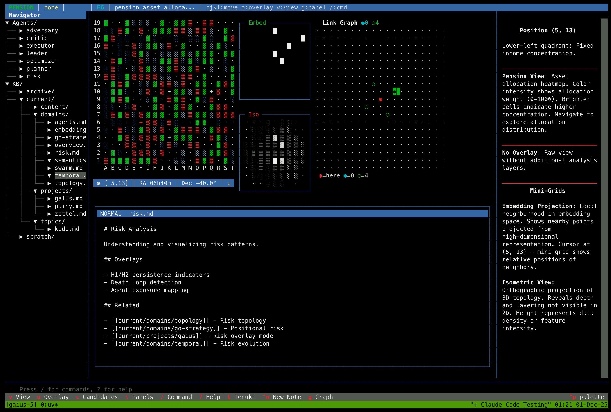

# Gaius

A terminal interface for navigating graph-oriented data domains. Projects high-dimensional embeddings onto a 19×19 grid.



## Overview

Gaius renders knowledge bases and document collections as spatial layouts, using topological data analysis to identify structural patterns. The interface combines a Go board metaphor with orthographic projections and multi-agent analysis.

Named after Gaius Plinius Secundus (Pliny the Elder).

## Prerequisites

- Python 3.12+
- [uv](https://github.com/astral-sh/uv) package manager
- PostgreSQL 16
- Qdrant vector database
- Optional: vLLM + optillm for local inference

## Installation

```bash
git clone https://github.com/zndx/gaius.git
cd gaius

# Using devenv (recommended)
devenv shell

# Or with uv
uv sync --extra search --extra tda --extra inference
```

## Configuration

Uses HOCON configuration with environment variable overrides.

```bash
# Required
export DATABASE_URL="postgres://localhost:5438/zndx_gaius?sslmode=disable"

# Optional inference
export OPTILLM_API_KEY="sk-optillm"
export GAIUS_OFFLINE="false"
```

See `config/base.conf` for full configuration options.

## Usage

```bash
# Run database migrations
dbmate -d db/migrations up

# Start TUI
uv run gaius

# CLI mode
uv run gaius-cli --cmd "/state" --format json
```

## Key Bindings

| Key | Action |
|-----|--------|
| `hjkl` | Navigate grid |
| `v` | Cycle view modes |
| `o` | Cycle overlays |
| `g` | Toggle center panel (Graph/Think) |
| `[` `]` | Toggle side panels |
| `/` | Command input |
| `?` | Help |

## Commands

| Command | Description |
|---------|-------------|
| `/domain <name>` | Set domain focus |
| `/swarm [domain]` | Run multi-agent analysis |
| `/summary` | Generate daily summary |
| `/activity` | View activity log |
| `/tda` | Show topological features |
| `/reindex` | Refresh embeddings |

## Layout

```
<<<<<<< HEAD
┌─────────┬────────────────────────────┬───────────┐
│ Files/  │  19×19 Grid  │  9×9 Views  │ Content   │
│ Agents  │              │             │           │
│         │──────────────┴─────────────│           │
│         │  Think Panel / Graph       │           │
├─────────┴────────────────────────────┴───────────┤
│ / Command                                        │
└──────────────────────────────────────────────────┘
=======
┌─────────┬──────────────┬───────┬─────────┬──────────┐
│ Agents  │              │ Embed │ Graph/  │   Info   │
│ ─────── │  19×19 Grid  │  9×9  │ Think   │          │
│ Files   │              ├───────┤         │          │
│         │              │  Iso  │         │          │
│         │              │  9×9  │         │          │
│         ├──────────────┴───────┴─────────┤          │
│         │         Content / Edit         │          │
├─────────┴────────────────────────────────┴──────────┤
│ / Command                                           │
└─────────────────────────────────────────────────────┘
>>>>>>> 60abb11 (Fix layout diagram in README to match current UI)
```

## Features

**Grid Visualization**
- KB entries projected onto 19×19 board
- View modes: Go, Pension, Swarm
- Overlays: Risk, H1/H2 homology, Agents, Temporal

**Multi-Agent Analysis**
- 7 specialized agents (Leader, Risk, Optimizer, Planner, Critic, Executor, Adversary)
- Parallel execution with consensus synthesis

**Knowledge Base**
- Zettelkasten-style organization
- Wikilink support (`[[links]]`)
- Markdown rendering

**Topological Analysis**
- Persistent homology computation
- H0 (components), H1 (loops), H2 (voids)
- Visual overlay on grid

## Architecture

```
src/gaius/
├── app.py              # TUI application
├── cli.py              # Non-interactive CLI
├── core/               # Config, state, projection, TDA
├── agents/             # Swarm roles and orchestration
├── inference/          # LLM client and synthesis
├── widgets/            # Grid, panels, command input
└── awareness/          # Situational reports
```

## MCP Server

Gaius includes an MCP server for integration with Claude Code and other MCP clients.

```bash
# Run MCP server
uv run python -m gaius.mcp_server
```

See `src/gaius/mcp_server.py` for available tools.

## Development

```bash
uv run gaius              # Run TUI
uv run pytest             # Run tests
mdbook build docs         # Build documentation
```

## License

Apache License 2.0

Copyright 2025 Ryan Hill and Zndx Limited
