# Forward-Deployed Modular Manufacturing (FDMM) + RASE Integration

> **Status**: Design Specification
> **Date**: 2025-12-28
> **Context**: Application of Rapid Agentic Systems Engineering (RASE) to Forward-Deployed Modular Manufacturing

## Overview

This repository contains SysML v2-style specifications for a Forward-Deployed Modular Manufacturing (FDMM) system, grounded in the Basic Formal Ontology (BFO). The design demonstrates how RASE methodology—originally developed for agentic browser automation—can be extended to physical manufacturing systems for autonomous capability development and self-evaluation.

### Thesis

By combining:
1. **BFO-grounded MBSE specifications** (FDMM equipment ontology)
2. **RASE's verifiable closed-loop learning** (Oracle-based V&V)
3. **Magma-8B multimodal methodology** (VLM training on domain-specific data)
4. **Nous Atropos environments** (de novo ontology-based evaluation)

We enable autonomous capability development for manufacturing agents that can:
- Learn manufacturing processes from verifiable examples
- Self-evaluate against formal capability specifications
- Evolve through curriculum-based progression

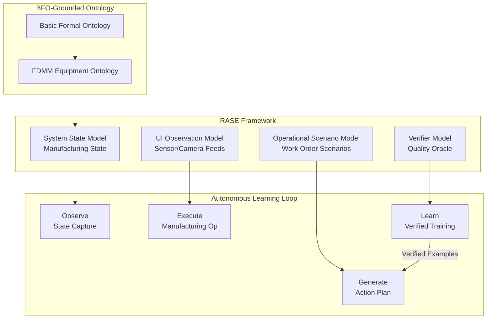

---

## Specification Files

| File | Description |
|------|-------------|
| [`FDMM_BFO.sysml.txt`](FDMM_BFO.sysml.txt) | Core FDMM system specification with BFO grounding |
| [`FDMM_RearEchelon_Augmentation.sysml.txt`](FDMM_RearEchelon_Augmentation.sysml.txt) | Rear-echelon facility augmentation package |

---

## BFO Grounding

The FDMM specifications map manufacturing concepts to BFO's upper ontology, enabling rigorous formal reasoning and interoperability with other BFO-aligned ontologies.

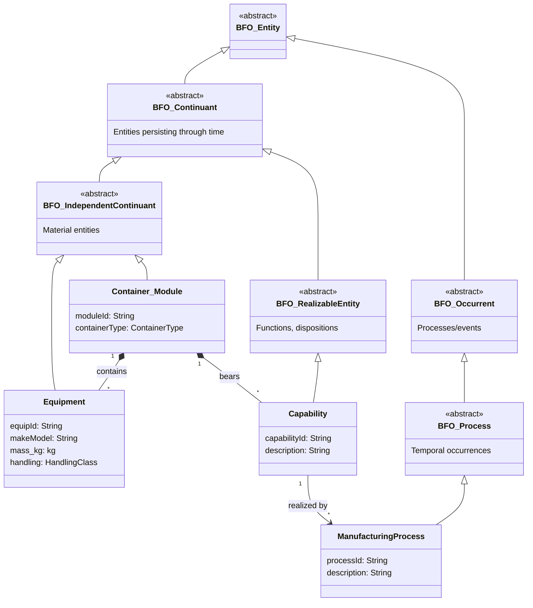

### BFO Mappings

| BFO Concept | FDMM Instantiation | Example |
|-------------|-------------------|---------|
| `BFO:IndependentContinuant` | Equipment, Modules, Sites | Haas VF-2YT VMC, 40ft HC Container |
| `BFO:RealizableEntity` | Capabilities borne by modules | `Cap_MachinePrismatic_CNC` |
| `BFO:Process` | Manufacturing operations | `P_CNC_Mill`, `P_WeldAndFabricate` |
| `BFO:Quality` | Constraints and requirements | Power quality, vibration isolation |

---

## FDMM Physical Architecture

The system consists of modular containerized manufacturing cells, yard operations, and optional rear-echelon augmentation.

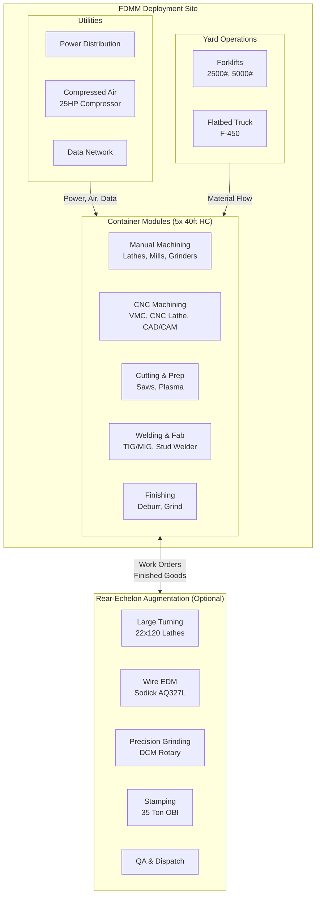

### Container Module Specifications

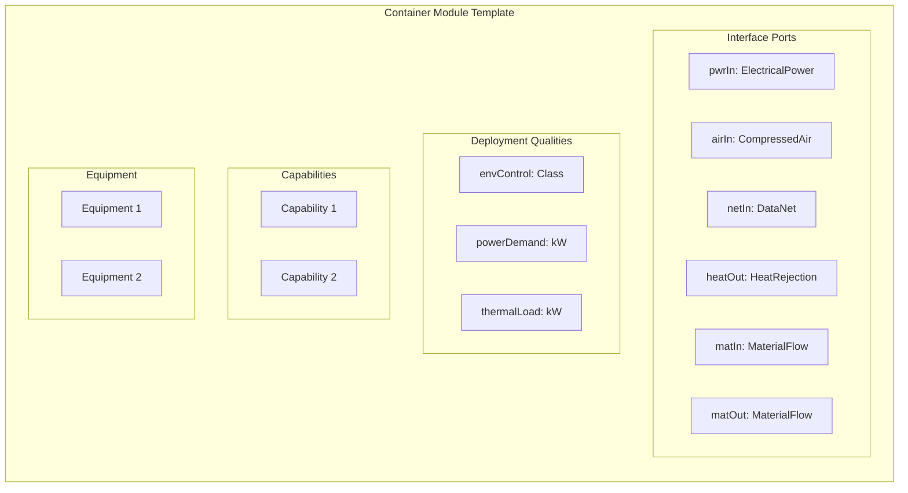

---

## Capability Taxonomy

Manufacturing capabilities are classified by their primary mission contribution.

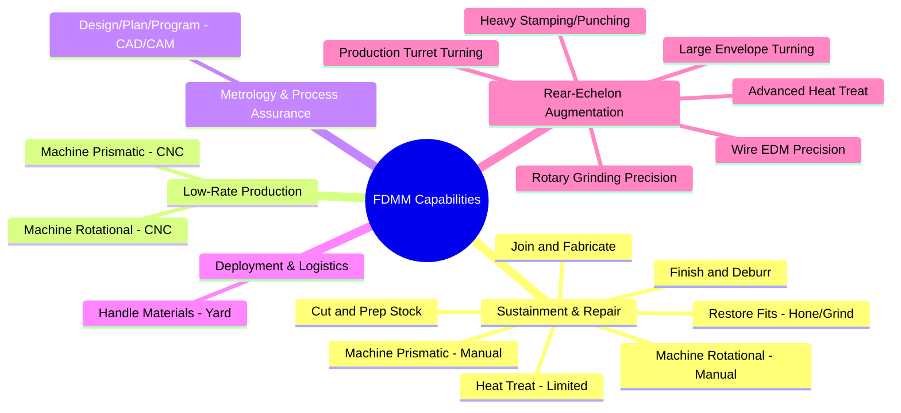

---

## RASE Integration for Manufacturing

### The Four Coupled Models

RASE extends to manufacturing by mapping its four models to manufacturing-specific concerns:

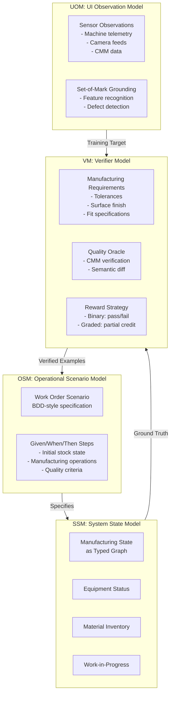

### Manufacturing Scenario Example

```gherkin
Feature: Shaft Repair and Fit Restoration

  Background:
    Given the CNC machining module is operational
    And the honing station is calibrated to ±0.0005"

  Scenario: Restore worn bearing journal
    Given a shaft with journal wear of 0.005" undersize
    When the agent plans the restoration sequence
    And the agent executes:
      | Operation     | Equipment        | Target          |
      | Rough turn    | CNC Lathe        | +0.010" oversize|
      | Finish turn   | CNC Lathe        | +0.002" oversize|
      | Hone          | Sunnen LBB-1660  | Nominal ±0.0001"|
    Then the journal diameter should be within tolerance
    And the surface finish should be ≤ 16 µin Ra
    And the semantic accuracy should be at least 0.95
```

### Verification Flow

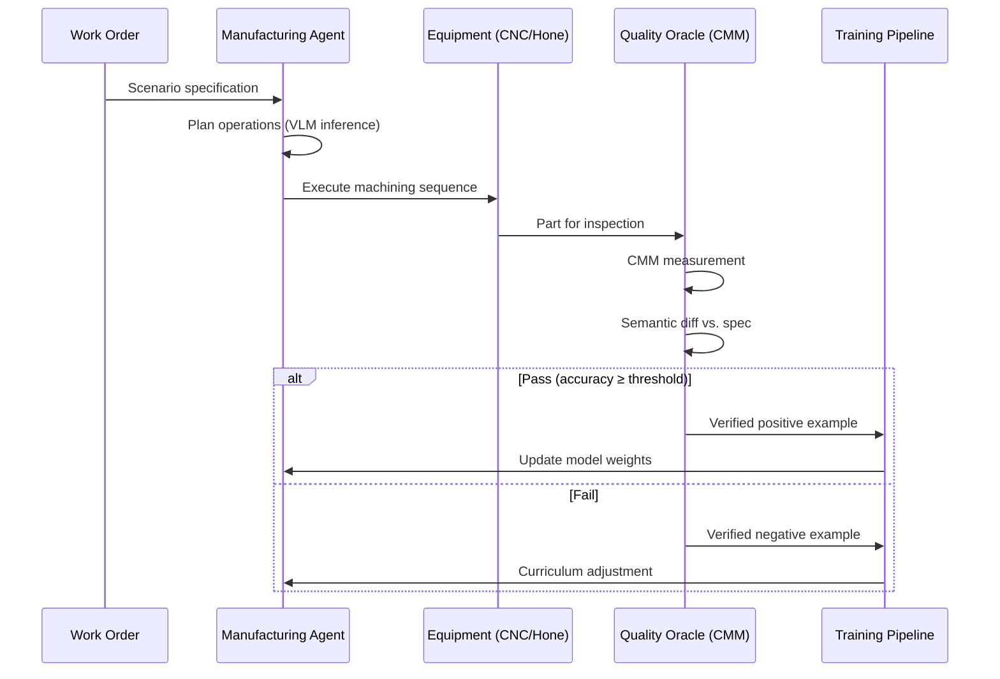

---

## Magma-8B Methodology for Manufacturing

The Magma-8B approach—training VLMs on domain-specific action traces—maps naturally to manufacturing:

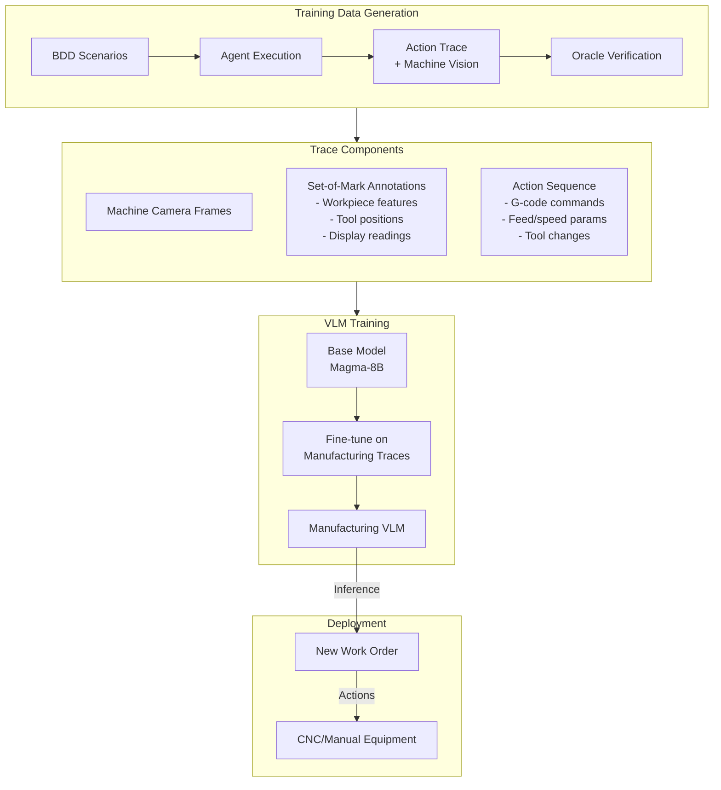

### Set-of-Mark for Manufacturing

Just as RASE uses SoM to ground VLM actions in browser UI elements, manufacturing SoM grounds actions in:

| SoM Category | Browser Domain | Manufacturing Domain |
|--------------|----------------|---------------------|
| **Interactable** | Buttons, inputs | Tool positions, control surfaces |
| **Reference** | Text labels | Display readings, dimension callouts |
| **Region** | Content areas | Workpiece surfaces, feature zones |
| **Status** | Indicators | Machine state LEDs, error codes |

---

## Nous Atropos Integration

Nous Atropos provides RL environments for agent self-evaluation. For FDMM, we create manufacturing-specific environments:

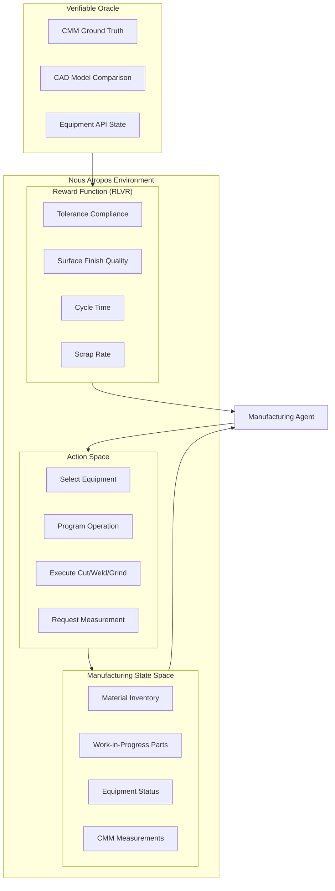

### Ontology-Based Evaluation

The BFO-grounded ontology enables de novo evaluation:

1. **New Part Classes**: Ontology defines capability requirements for novel parts
2. **Compositional Scenarios**: Combine primitive capabilities into complex workflows
3. **Transfer Learning**: BFO alignment enables knowledge transfer from related domains

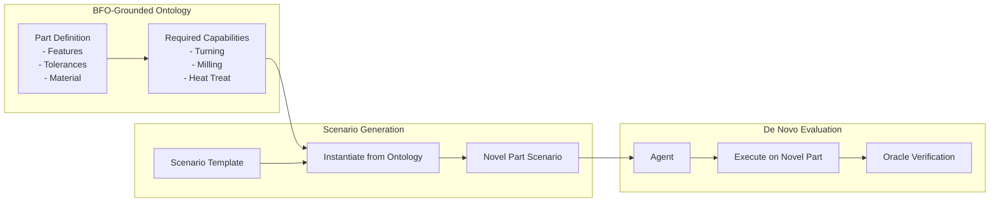

---

## Requirements and V&V Alignment

FDMM requirements map to RASE verification methods following the V-model:

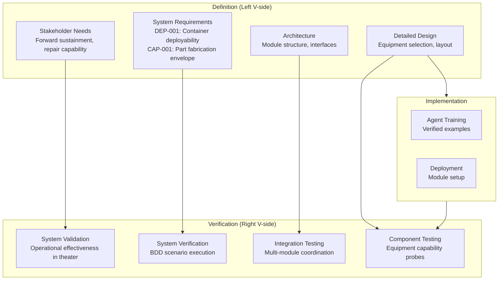

### Verification Cases

| Verification Case | Method | RASE Mapping |
|-------------------|--------|--------------|
| VC-001: Power Budget | Analysis | `Constraint` composition |
| VC-002: Reference Part Set | Demonstration | `BDDScenario` execution |
| VC-003: Container Fit | Inspection | `SSM` state validation |
| VC-004: Capability Coverage | Analysis | `ScenarioRequirement` coverage |

---

## Digital Thread

RASE's `TraceableId` provides full traceability from equipment list to verified training samples:

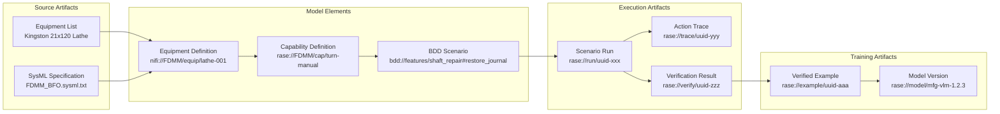

---

## Implementation Roadmap

### Phase 1: Ontology Foundation
- [ ] Formalize BFO mappings in OWL/RDF
- [ ] Create JSON-LD contexts for equipment and capabilities
- [ ] Validate against BFO conformance tests

### Phase 2: SSM for Manufacturing
- [ ] Implement `ManufacturingState` as typed graph
- [ ] Equipment API adapters (CNC controllers, CMM)
- [ ] State capture and comparison primitives

### Phase 3: OSM Scenarios
- [ ] Define step library for manufacturing operations
- [ ] Gherkin templates for common workflows
- [ ] Scenario parameterization from part ontology

### Phase 4: UOM for Shop Floor
- [ ] Machine vision integration (camera feeds)
- [ ] SoM generation for workpiece features
- [ ] Trace recording for action sequences

### Phase 5: VM and Oracle
- [ ] CMM integration for ground truth
- [ ] Semantic diff for part comparison
- [ ] Reward strategy calibration

### Phase 6: Atropos Integration
- [ ] Manufacturing environment definition
- [ ] Curriculum levels based on part complexity
- [ ] Self-evaluation metrics

---

## References

### RASE Framework
- [RASE MBSE Framework](../docs/scratch/2025-12-19/150000_rase_mbse_framework.md) - Core methodology documentation
- [gaius.rase package](../src/gaius/rase/) - Python implementation

### Ontology Standards
- [Basic Formal Ontology (BFO)](https://basic-formal-ontology.org/) - Upper ontology foundation
- [SysML v2](https://www.omg.org/spec/SysML/) - Systems modeling language

### Related Work
- [Magma-8B](https://arxiv.org/abs/2502.XXXXX) - Multimodal VLM methodology
- [Nous Atropos](https://github.com/NousResearch/atropos) - RL environments for agents

---

## License

Apache 2.0 - See repository root for details.
