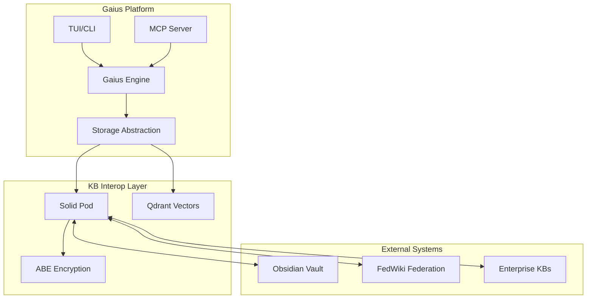
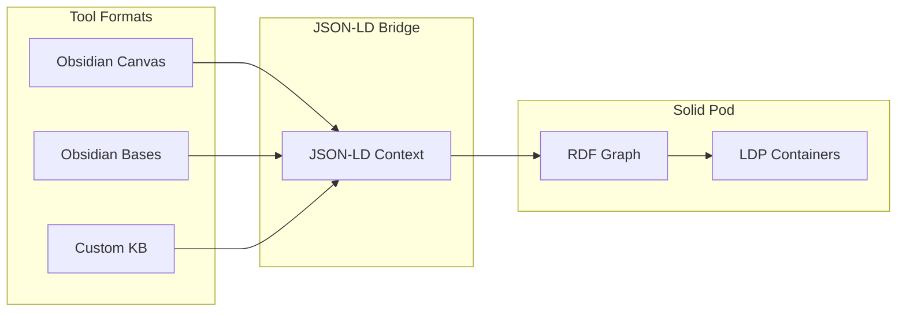
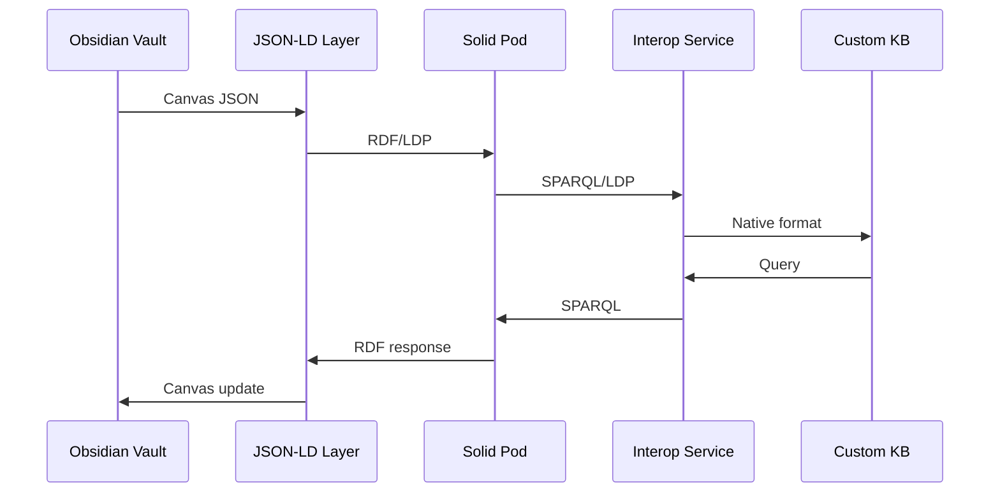
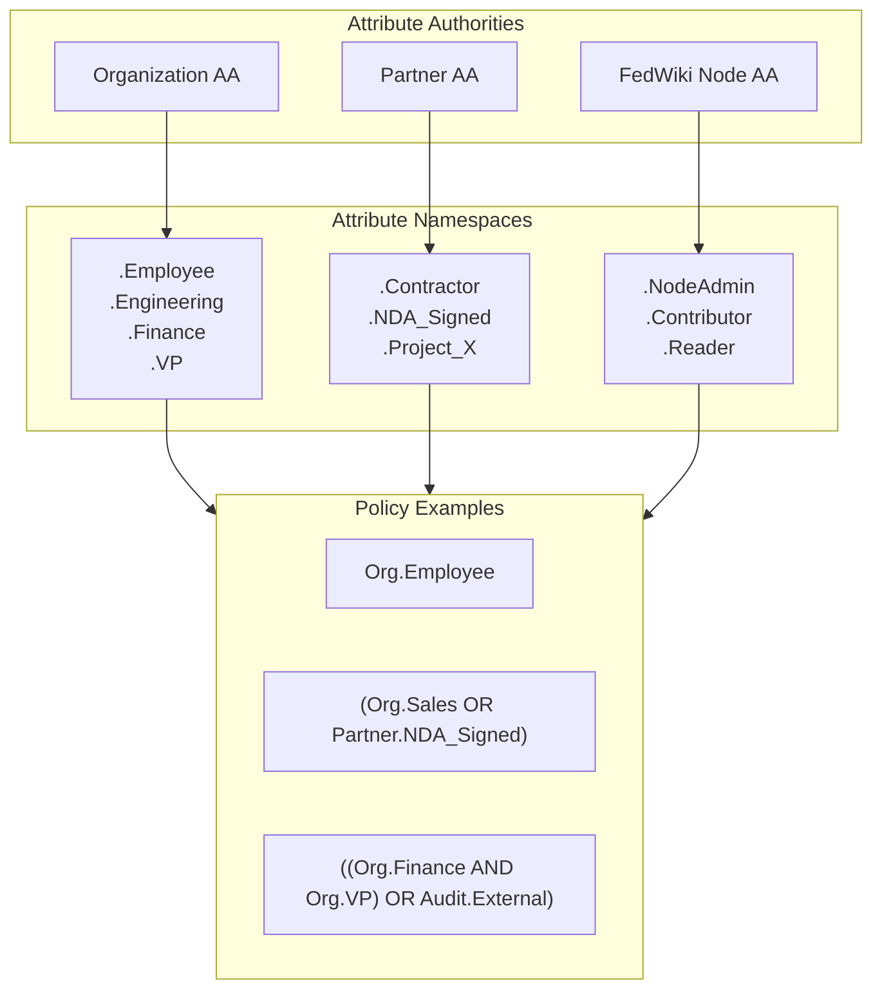
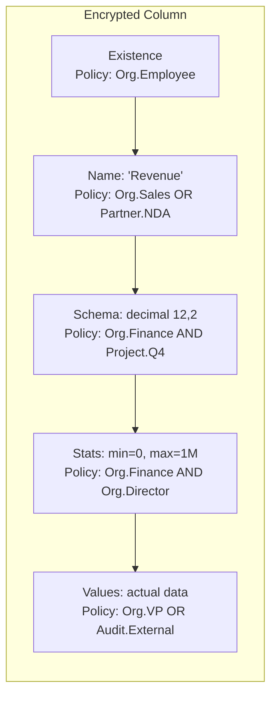
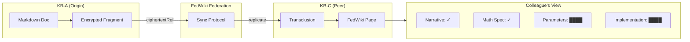
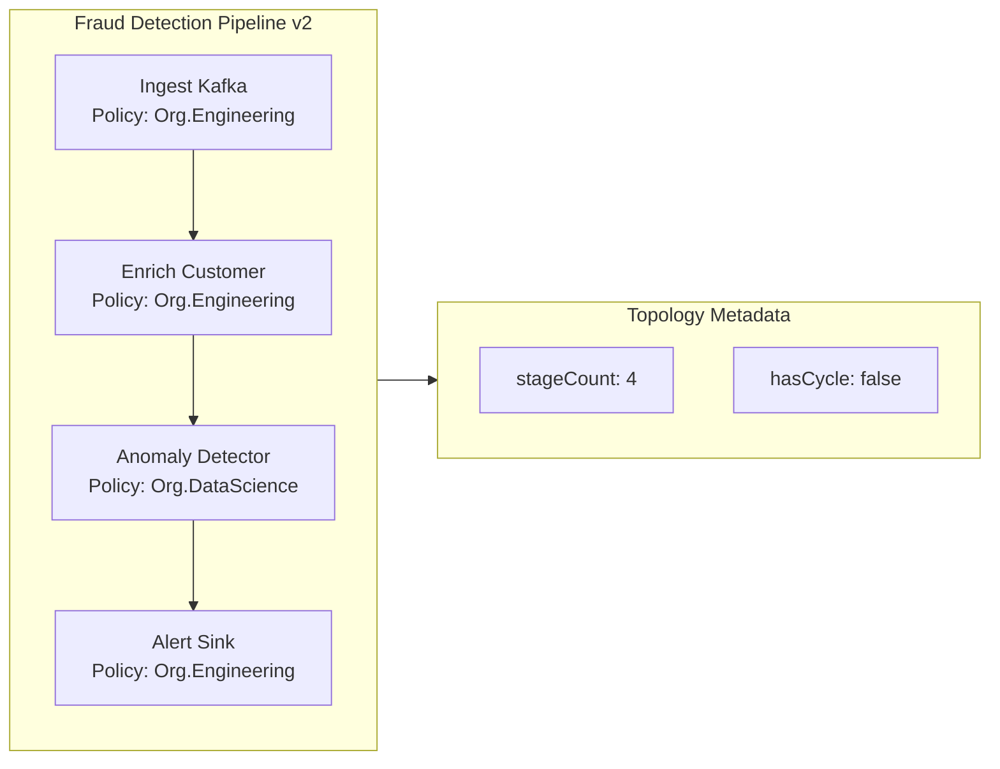

# Knowledge Base Interoperability Specification

> **Status**: Draft
> **Version**: 0.1.0
> **Date**: 2025-12-20

This document specifies a federated knowledge base interoperability protocol built on Solid (Linked Data), multi-authority attribute-based encryption (MA-ABE), and semantic web technologies. The design enables cross-organization knowledge sharing with fine-grained access control, supporting use cases from personal knowledge management to enterprise data governance.

## Table of Contents

1. [Overview](#overview)
2. [Architectural Layers](#architectural-layers)
3. [Ontological Foundation](#ontological-foundation)
4. [Solid Protocol Integration](#solid-protocol-integration)
5. [Attribute-Based Encryption](#attribute-based-encryption)
6. [Metadata Disclosure Lattice](#metadata-disclosure-lattice)
7. [Hypermedia and Cross-KB References](#hypermedia-and-cross-kb-references)
8. [Stream Operators as Knowledge Artifacts](#stream-operators-as-knowledge-artifacts)
9. [Specification Structure](#specification-structure)
10. [Implementation Considerations](#implementation-considerations)

---

## Overview

The KB Interop specification addresses the challenge of sharing structured knowledge across organizational boundaries while maintaining fine-grained access control. The core insight is that **Solid's Linked Data foundation serves as the canonical interchange layer**, while tool-specific formats (Obsidian Canvas, Bases schemas) become domain-specific serializations.

### Design Goals

1. **Federated Identity**: WebID-based authentication across knowledge bases
2. **Granular Access Control**: Per-fragment encryption with attribute-based policies
3. **Semantic Interoperability**: RDF-based knowledge representation
4. **Tool Agnosticism**: Bidirectional mappings to Obsidian, FedWiki, and custom KBs
5. **Collaborative Workflows**: CRDT-compatible sync semantics

### Integration with Gaius

Within the Gaius platform, KB Interop provides:

- **Storage abstraction** for pluggable backends (filesystem, Minio, Solid pods)
- **Semantic search** integration with Qdrant vector indices
- **Agent-accessible knowledge** via MCP server tools
- **Evolution tracking** with cryptographic provenance



---

## Architectural Layers

The specification defines three architectural layers that decouple knowledge semantics from storage and access control.

### Layer 1: Ontological Foundation

Built on BFO (Basic Formal Ontology), a mid-level ontology for knowledge artifacts:

```
BFO:Information Content Entity
  └── KB:KnowledgeFragment
        ├── KB:Assertion (propositional content)
        ├── KB:Reference (pointers/links)
        └── KB:Container (groupings, canvases)
```

This provides ontological commitment independent of any tool's data model.

### Layer 2: Solid as Interop Substrate

Solid provides three critical components:

| Component | Purpose |
|-----------|---------|
| **WebID** | Identity across KBs (who authored what) |
| **LDP Containers** | Canonical graph store |
| **WAC** | Web Access Control for granular sharing |

### Layer 3: Format Bindings

Bidirectional mappings between tool-specific formats and RDF:

| Obsidian Canvas | RDF Predicate | KB Equivalent |
|-----------------|---------------|---------------|
| `node.type: "text"` | `a kb:Assertion` | Assertion type |
| `edge.fromNode` | `kb:relatesTo` | Link relation |
| `node.file` | `kb:references` | Reference type |



---

## Ontological Foundation

### Core Classes

```turtle
@prefix kb: <https://kb-interop.org/ontology/core#> .
@prefix bfo: <http://purl.obolibrary.org/obo/> .

kb:KnowledgeFragment a rdfs:Class ;
    rdfs:subClassOf bfo:BFO_0000031 ;  # Information Content Entity
    rdfs:comment "A discrete unit of knowledge content" .

kb:Assertion a rdfs:Class ;
    rdfs:subClassOf kb:KnowledgeFragment ;
    rdfs:comment "Propositional content that can be true or false" .

kb:Reference a rdfs:Class ;
    rdfs:subClassOf kb:KnowledgeFragment ;
    rdfs:comment "A pointer to another knowledge fragment" .

kb:Container a rdfs:Class ;
    rdfs:subClassOf kb:KnowledgeFragment ;
    rdfs:comment "A grouping of knowledge fragments (canvas, folder)" .
```

### Core Properties

```turtle
kb:content a rdf:Property ;
    rdfs:domain kb:Assertion ;
    rdfs:range xsd:string .

kb:spatialContext a rdf:Property ;
    rdfs:domain kb:KnowledgeFragment ;
    rdfs:range kb:SpatialPosition ;
    rdfs:comment "Canvas positioning metadata" .

kb:relatesTo a rdf:Property ;
    rdfs:domain kb:KnowledgeFragment ;
    rdfs:range kb:KnowledgeFragment .

kb:references a rdf:Property ;
    rdfs:domain kb:Reference ;
    rdfs:range rdfs:Resource .
```

---

## Solid Protocol Integration

### Resource Mapping

Each knowledge fragment maps to a Solid resource:

```turtle
# A canvas node becomes a Solid resource
<https://pod.example/kb/node-123>
    a kb:Assertion ;
    kb:content "Some insight"^^xsd:string ;
    kb:spatialContext [ kb:x 340; kb:y 220 ] ;
    dcterms:creator <https://user.solidcommunity.net/profile#me> .
```

### JSON-LD Context

The key architectural decision is wrapping tool-native JSON in a JSON-LD context, enabling RDF interpretation without structural changes:

```json
{
  "@context": {
    "kb": "https://kb-interop.org/ontology/core#",
    "nodes": { "@container": "@set", "@id": "kb:hasFragment" },
    "edges": { "@container": "@set", "@id": "kb:hasRelation" },
    "text": "kb:content",
    "fromNode": { "@id": "kb:fromFragment", "@type": "@id" }
  },
  "nodes": [...],
  "edges": [...]
}
```

### Interop Flow



---

## Attribute-Based Encryption

### CP-ABE vs KP-ABE

The specification supports both ciphertext-policy (CP-ABE) and key-policy (KP-ABE) attribute-based encryption:

| Aspect | CP-ABE (Author-Controlled) | KP-ABE (Authority-Controlled) |
|--------|---------------------------|-------------------------------|
| **Policy Location** | Embedded in ciphertext | Embedded in user keys |
| **Control** | Encryptor chooses recipients | Authority controls access |
| **Use Case** | Ad-hoc sharing | Compliance, RBAC |
| **Example** | "Only DevOps + NDA can read" | "HR users can decrypt PII" |

For federated knowledge sharing, **both operate in tandem**: CP-ABE handles horizontal sharing (author → peers), while KP-ABE handles vertical governance (authority → content classes).

### Multi-Authority Topology



### ABE Ontology Extension

```turtle
@prefix abe: <https://kb-interop.org/ontology/abe#> .
@prefix ma: <https://kb-interop.org/ontology/ma-abe#> .

abe:EncryptedValue a rdfs:Class ;
    rdfs:comment "A ciphertext with associated ABE policy" .

abe:ciphertext a rdf:Property ;
    rdfs:domain abe:EncryptedValue ;
    rdfs:range xsd:base64Binary .

abe:accessPolicy a rdf:Property ;
    rdfs:domain abe:EncryptedValue ;
    rdfs:range abe:PolicyExpression .

abe:mode a rdf:Property ;
    rdfs:domain abe:EncryptedValue ;
    rdfs:range [ owl:oneOf (abe:CP-ABE abe:KP-ABE) ] .

ma:Authority a rdfs:Class .

ma:issuesAttribute a rdf:Property ;
    rdfs:domain ma:Authority ;
    rdfs:range ma:Attribute .
```

### Encrypted Fragment Example

```json
{
  "@context": {
    "kb": "https://kb-interop.org/ontology/core#",
    "abe": "https://kb-interop.org/ontology/abe#"
  },
  "@id": "https://pod.example/kb/base-customers/col-3",
  "@type": "kb:BaseColumn",

  "kb:columnName": {
    "@type": "abe:EncryptedValue",
    "abe:ciphertext": "c2VjcmV0X3Jldg==",
    "abe:accessPolicy": "(Org.Sales OR Org.Finance)"
  },

  "kb:values": {
    "@type": "abe:EncryptedValue",
    "abe:ciphertext": "W3sicm93IjoxLCJ2...",
    "abe:accessPolicy": "((Org.Finance AND Org.VP) OR Audit.External)"
  }
}
```

---

## Metadata Disclosure Lattice

A key innovation is the **disclosure lattice** where each metadata layer has independent access policies. Lower levels are prerequisites but not entailments.

### Disclosure Levels

| Level | Name | Description |
|-------|------|-------------|
| 5 | **Values** | Actual cell contents |
| 4 | **Statistics** | Min, max, mean, cardinality, distribution |
| 3 | **Schema** | Type, constraints, relationships |
| 2 | **Name** | Column/property identifier |
| 1 | **Existence** | "There is a column here" |
| 0 | **Structure** | "This Base has N columns" |

### Ontology for Disclosure Levels

```turtle
abe:DisclosureLevel a rdfs:Class .

abe:disclosureLevel a rdf:Property ;
    rdfs:range abe:DisclosureLevel .

abe:Existence a abe:DisclosureLevel ; abe:level 1 .
abe:Name a abe:DisclosureLevel ; abe:level 2 .
abe:Schema a abe:DisclosureLevel ; abe:level 3 .
abe:Statistics a abe:DisclosureLevel ; abe:level 4 .
abe:Values a abe:DisclosureLevel ; abe:level 5 .
```

### Layered Encryption Example



### Colleague View Example

When a colleague with attributes `{Partner.NDA_Signed, Org.Sales}` views the data:

```
Column 1: [EXISTS] ✓  Name: "Revenue" ✓  Type: ████████
Column 2: [EXISTS] ✓  Name: ████████     Type: ████████
Column 3: ████████████████████████████████████████████
```

---

## Hypermedia and Cross-KB References

### Inline Encrypted Markdown Syntax

For embedding encrypted content in Markdown documents:

```markdown
## Deployment Configuration

The production API endpoint is `https://api.example.com/v2`.

Authentication requires: <!--abe:cp
  @type: kb:Credential/APIKey
  @policy: "(Org.DevOps AND Env.Production) OR Org.SRE"
  @stats: { entropy: 256, rotation: "90d" }
  @ref: solid://pod.example/kb/secrets/col-api-keys#row-prod
-->████████████████<!--/abe-->
```

### RDF Representation of Encrypted Spans

```turtle
@prefix frag: <https://kb-interop.org/ontology/fragment#> .

<https://pod.example/kb/docs/deployment.md#frag-1>
    a frag:InlineEncryptedSpan ;
    frag:byteOffset 847 ;
    frag:byteLength 32 ;
    abe:mode abe:CP-ABE ;
    abe:semanticType kb:Credential, kb:APIKey ;
    abe:policy "(Org.DevOps AND Env.Production) OR Org.SRE" ;
    abe:ciphertextRef <solid://pod.example/kb/secrets#row-prod> .
```

### Cross-KB Transclusion

For FedWiki-style transclusion across knowledge bases:



### Transclusion RDF

```turtle
@prefix xref: <https://kb-interop.org/ontology/xref#> .

<https://fedwiki.example/page-x#para-3>
    a xref:Transclusion ;
    xref:sourceKB <https://pod.origin.example/kb/> ;
    xref:sourceFragment <https://pod.origin.example/kb/docs/arch.md#frag-7> ;
    xref:transclusionMode xref:EncryptedPassthrough ;

    abe:encryptedContent [
        abe:ciphertextRef <https://pod.origin.example/kb/docs/arch.md#frag-7> ;
        abe:policy "(Org.Engineering AND FedWiki.Contributor)" ;
        abe:mode abe:CP-ABE
    ] .
```

---

## Stream Operators as Knowledge Artifacts

A novel extension treats **stream processing operators** (Flink/Spark jobs, sketch algorithms, signal detectors) as first-class knowledge artifacts with their own disclosure lattice.

### Operator Disclosure Levels

| Level | Component | Example |
|-------|-----------|---------|
| 6 | **Parameters** | Thresholds, window sizes, tuning |
| 5 | **Implementation** | Flink JAR, SQL, Python UDF |
| 4 | **Math Spec** | LaTeX formalization |
| 3 | **Output Schema** | Signal field definitions |
| 2 | **Narrative** | Why this operator exists |
| 1 | **Existence** | "There is an operator here" |

### Ontology Extension

```turtle
@prefix stream: <https://kb-interop.org/ontology/stream#> .

stream:Operator a rdfs:Class ;
    rdfs:subClassOf kb:KnowledgeFragment ;
    rdfs:comment "An executable stream processing component" .

stream:SketchAlgorithm a rdfs:Class ;
    rdfs:subClassOf stream:Operator .

stream:SignalDetector a rdfs:Class ;
    rdfs:subClassOf stream:Operator .

stream:narrative a rdf:Property ;
    rdfs:domain stream:Operator ;
    rdfs:range xsd:string .

stream:mathSpec a rdf:Property ;
    rdfs:domain stream:Operator ;
    rdfs:range stream:LaTeXExpression .

stream:implementation a rdf:Property ;
    rdfs:domain stream:Operator ;
    rdfs:range stream:ExecutableCode .

stream:parameters a rdf:Property ;
    rdfs:domain stream:Operator ;
    rdfs:range stream:ParameterSet .
```

### Inline Encrypted LaTeX

Mathematical specifications can be encrypted inline:

```markdown
## Anomaly Detection Pipeline

The frequency estimate for item $x$ at time $t$ is:

<!--abe:cp
  @type: stream:LaTeXExpression
  @policy: "(Research.Staff AND Partner.NDA) OR Org.DataScience"
-->
$$\hat{f}(x,t) = \min_{j \in [d]} \left( C[j, h_j(x)] \cdot e^{-\lambda(t - t_{last})} \right)$$
<!--/abe-->
```

For GitHub rendering, the decrypted LaTeX uses standard math notation:

$$\hat{f}(x,t) = \min_{j \in [d]} \left( C[j, h_j(x)] \cdot e^{-\lambda(t - t_{last})} \right)$$

### Sketch Algorithm Catalog

```turtle
stream:CountMinSketch a rdfs:Class ;
    rdfs:subClassOf stream:SketchAlgorithm ;
    stream:approximates stream:FrequencyEstimation ;
    stream:errorBound "ε-δ approximation" ;
    stream:spaceComplexity "O(1/ε × log(1/δ))" .

stream:HyperLogLog a rdfs:Class ;
    rdfs:subClassOf stream:SketchAlgorithm ;
    stream:approximates stream:CardinalityEstimation ;
    stream:errorBound "1.04/√m" .

stream:TDigest a rdfs:Class ;
    rdfs:subClassOf stream:SketchAlgorithm ;
    stream:approximates stream:QuantileEstimation .
```

### Pipeline Topology

Entire streaming pipelines become graphs of encrypted operators:



---

## Specification Structure

The complete specification is organized as follows:

```
kb-interop-spec/
├── ontology/
│   ├── kb-core.ttl              # Core classes & properties
│   ├── kb-canvas.ttl            # Canvas-specific extensions
│   ├── kb-solid-binding.ttl     # Solid protocol bindings
│   ├── abe-core.ttl             # ABE primitives
│   ├── abe-cp.ttl               # CP-ABE specific
│   ├── abe-kp.ttl               # KP-ABE specific
│   ├── abe-dual-policy.ttl      # Combined CP+KP semantics
│   ├── stream-operators.ttl     # Stream processing ontology
│   └── xref-encrypted.ttl       # Cross-KB encrypted references
├── contexts/
│   ├── canvas.jsonld            # JSON-LD context for Canvas
│   ├── bases.jsonld             # JSON-LD context for Bases
│   └── stream.jsonld            # JSON-LD context for operators
├── syntax/
│   ├── markdown-abe.md          # Inline encryption syntax
│   ├── markdown-abe.pest        # Formal grammar (PEG)
│   └── rendering.md             # UI rendering rules
├── protocols/
│   ├── sync.md                  # CRDT sync semantics
│   ├── identity.md              # WebID integration
│   ├── solid-abe-binding.md     # Solid + ABE integration
│   └── fedwiki-transclusion.md  # Encrypted xref semantics
├── crypto/
│   ├── disclosure-lattice.md    # Formal metadata levels
│   ├── policy-grammar.ebnf      # ABE policy syntax
│   ├── key-management.md        # Authority bootstrap & revocation
│   ├── cp-abe-instantiation.md  # Recommended CP-ABE scheme
│   ├── kp-abe-instantiation.md  # Recommended KP-ABE scheme
│   └── dual-policy-construction.md
├── federation/
│   ├── fedwiki-binding.md       # FedWiki sync semantics
│   └── authority-discovery.md   # How to find & trust AAs
└── conformance/
    └── test-suite/              # Validation tests
```

---

## Implementation Considerations

### Recommended ABE Schemes

**Practical MA-ABE schemes** for implementation:

- **FAME** (Fast Attribute-based Message Encryption): Reasonable performance for CP-ABE
- **FABEO**: Efficient for multi-authority scenarios

The multi-authority aspect requires a distributed key generation ceremony, mapping well to Solid's WebID-based identity—each authority signs attribute keys bound to WebIDs.

### Ciphertext Size

ABE ciphertexts are larger than symmetric encryption. For large value columns, use **hybrid encryption**:

1. Generate random symmetric key $K$
2. Encrypt data: $C_{data} = \text{AES-GCM}(K, \text{plaintext})$
3. Encrypt key: $C_{key} = \text{ABE}(\text{policy}, K)$
4. Store: $(C_{key}, C_{data})$

### Revocation Strategies

Standard ABE doesn't handle revocation well. Options:

1. **Time-bounded attributes**: `Org.Employee.2025Q1`
2. **Epoch-based re-encryption**: Periodic key rotation
3. **Integration with Solid WAC**: Leverage Solid's access control revocation

### Conflict Resolution

Solid doesn't prescribe CRDT semantics. Recommended approaches:

- **Automerge**: For collaborative text editing
- **JSON-CRDT**: For structured data
- **Last-write-wins**: Simple but lossy

### Cryptographic Metadata Queries

Enable encrypted search over metadata:

```sparql
SELECT ?col ?decryptedName ?decryptedSchema
WHERE {
    ?col a kb:BaseColumn .
    ?col kb:columnName ?encName .
    ?col kb:columnSchema ?encSchema .

    # Implemented by Solid+ABE layer
    FILTER(abe:canDecrypt(?encName, :myAttributes))
    FILTER(abe:canDecrypt(?encSchema, :myAttributes))

    BIND(abe:decrypt(?encName, :myKeys) AS ?decryptedName)
    BIND(abe:decrypt(?encSchema, :myKeys) AS ?decryptedSchema)
}
```

### Policy Grammar (EBNF)

```ebnf
policy          = expression ;
expression      = term { "OR" term } ;
term            = factor { "AND" factor } ;
factor          = attribute | temporal | contextual | "(" expression ")" | "NOT" factor ;

attribute       = authority "." attr_name ;
temporal        = "DURING" date_range | "UNTIL" date | "AFTER" date ;
contextual      = "IN_SESSION" session_id | "FROM_POD" pod_pattern ;

(* Examples *)
(* Org.DataScience AND DURING 2025-Q1 *)
(* Partner.NDA AND FROM_POD *.partner.example *)
```

---

## References

1. Chase, M. (2007). Multi-authority Attribute Based Encryption. *TCC 2007*.
2. Solid Project. https://solidproject.org/
3. Obsidian Canvas Format. https://help.obsidian.md/
4. BFO 2.0. https://basic-formal-ontology.org/
5. JSON-LD 1.1. https://www.w3.org/TR/json-ld11/

---

## Changelog

| Version | Date | Changes |
|---------|------|---------|
| 0.1.0 | 2025-12-20 | Initial draft consolidating design notes |
