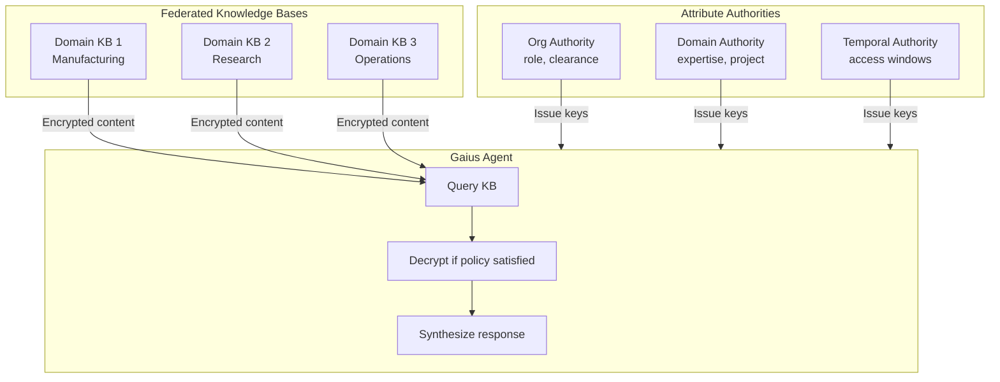
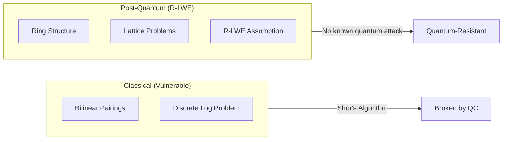
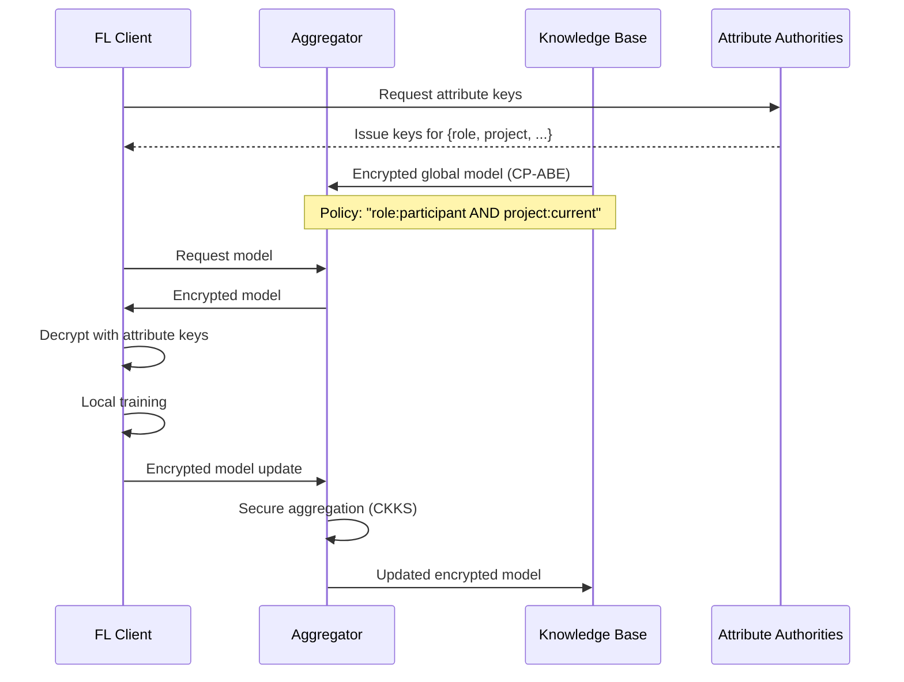
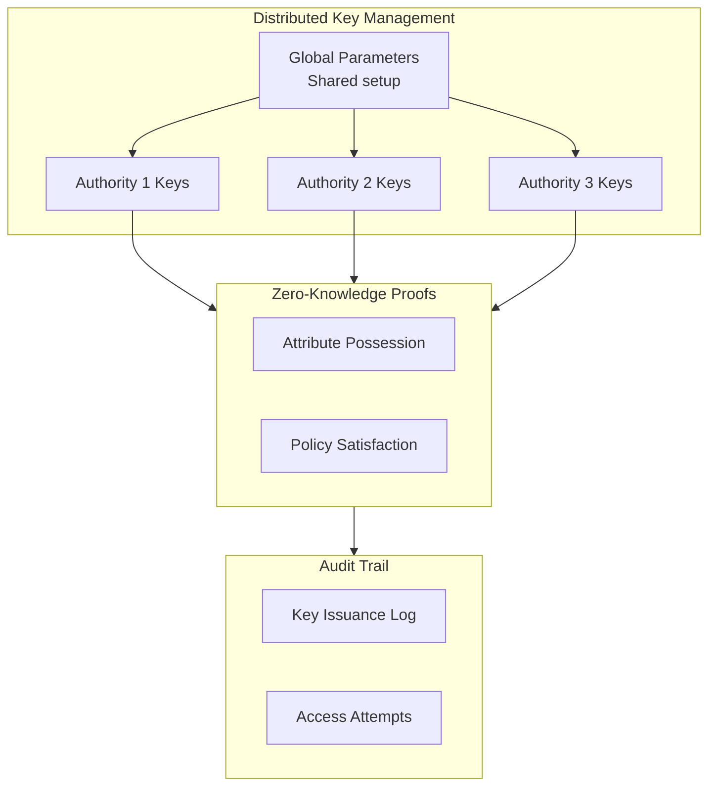

# 2026 Q1 Roadmap

> **Branch**: `design/2026Q1`
> **Last Updated**: 2026-01-17

---

## Multi-Authority CP-ABE + R-LWE

### Overview

Post-quantum cryptographic access control for federated knowledge bases using:
- **MA-CP-ABE**: Multi-Authority Ciphertext-Policy Attribute-Based Encryption
- **R-LWE**: Ring Learning With Errors (lattice-based, quantum-resistant)

This enables fine-grained, decentralized access control where:
1. No single authority controls all attributes
2. Access policies are embedded in ciphertext (not keys)
3. Security guarantees survive quantum computing advances

### Why This Matters for Gaius



### Technical Foundation

#### CP-ABE (Ciphertext-Policy ABE)

In CP-ABE, the data provider specifies the access policy based on attributes. Users with attributes matching the policy can decrypt without direct authorization from the data provider.

```
Encrypt(message, policy="(role:engineer AND clearance:secret) OR project:manhattan")
    → ciphertext that only matching attribute holders can decrypt
```

#### Multi-Authority Extension

Single-authority ABE has a critical weakness: one authority controls all keys. MA-ABE distributes trust:

| Authority | Attributes Managed | Example |
|-----------|-------------------|---------|
| Organization | `role`, `department`, `clearance` | HR system |
| Project | `project`, `team`, `milestone` | PM system |
| Domain | `expertise`, `certification` | Skills DB |
| Temporal | `valid_from`, `valid_until` | Time service |

#### R-LWE for Post-Quantum Security

Traditional ABE relies on pairing-based cryptography vulnerable to quantum attacks. R-LWE provides:

- **Quantum resistance**: Based on hard lattice problems
- **Efficiency**: Ring structure enables faster operations than standard LWE
- **Smaller keys**: Polynomial representation vs. matrix representation



### Research References

Recent advances (2024-2025):

1. **Decentralized MA-CP-ABE from LWE** ([Yao et al., 2024](https://www.sciencedirect.com/science/article/pii/S2214212624000553))
   - Combines global ID model with lattice sampling
   - Static security against arbitrary collusion
   - Shorter ciphertext than prior work

2. **Practical Revocable MA-CP-ABE from RLWE** ([ScienceDirect, 2022](https://www.sciencedirect.com/science/article/abs/pii/S2214212622000011))
   - Revocation support for dynamic systems
   - RLWE-based for efficiency

3. **Multi-Authority CP-ABE on Ideal Lattices** ([IEEE, 2019](https://ieeexplore.ieee.org/document/8672233))
   - Flexible threshold access policies
   - Virtual attributes for authority management

4. **Lattice-based Multi-Authority/Client ABE for Circuits** ([IACR, 2025](https://cic.iacr.org/p/1/4/1))
   - Arbitrary polynomial-size circuit policies
   - Distributed key generation

### Integration with Federated Learning

CP-ABE naturally complements federated learning for privacy-preserving AI:



Research: [Securing Decentralized FL with CP-ABE + CKKS](https://link.springer.com/article/10.1007/s10586-024-04957-8)

### Implementation Considerations

#### Key Management Architecture



Research: [Blockchain-based CP-ABE with Distributed KMS and ZKP](https://www.sciencedirect.com/science/article/pii/S1319157824000582)

#### Performance Trade-offs

| Approach | Key Size | Ciphertext Size | Decrypt Time | Quantum Safe |
|----------|----------|-----------------|--------------|--------------|
| Pairing-based CP-ABE | Small | Small | Fast | No |
| LWE-based MA-ABE | Large | Large | Slow | Yes |
| R-LWE-based MA-ABE | Medium | Medium | Medium | Yes |
| Pairing-free (ECC) | Small | Small | Fast | No |

For IoT/edge deployment: [Efficient Pairing-Free CP-ABE for IoT](https://www.mdpi.com/1424-8220/24/21/6843)

### Gaius Integration Roadmap

#### Phase 1: Cryptographic Foundation
- [ ] Evaluate R-LWE parameter selection (security level vs. performance)
- [ ] Prototype single-authority CP-ABE on lattices
- [ ] Benchmark against NIST PQC standards (ML-KEM, ML-DSA)

#### Phase 2: Multi-Authority Architecture
- [ ] Design authority trust model for Gaius domains
- [ ] Implement distributed key generation protocol
- [ ] Integrate with existing KB sync (MinIO, Postgres)

#### Phase 3: Policy Language
- [ ] Define attribute schema for Gaius use cases
- [ ] Create policy DSL compatible with RASE requirements
- [ ] Implement policy-to-circuit compiler

#### Phase 4: Agent Integration
- [ ] Extend agent credentials with attribute keys
- [ ] Implement transparent decrypt-on-access for KB queries
- [ ] Add policy-aware caching layer

#### Phase 5: Federated Learning Bridge
- [ ] Integrate with evolution engine for secure model sharing
- [ ] Implement secure aggregation with homomorphic properties
- [ ] Connect to existing gRPC infrastructure

### NIST PQC Alignment

NIST finalized post-quantum standards in August 2024:
- **ML-KEM** (FIPS 203): Key encapsulation based on Module-LWE
- **ML-DSA** (FIPS 204): Digital signatures based on Module-LWE
- **SLH-DSA** (FIPS 205): Stateless hash-based signatures

Our R-LWE approach aligns with ML-KEM foundations while extending to attribute-based access control.

Reference: [NIST Post-Quantum Cryptography Standards](https://www.nist.gov/news-events/news/2024/08/nist-releases-first-3-finalized-post-quantum-encryption-standards)

---

## Additional Q1 Priorities

### KB Interoperability
- Continue work from `design/kb-interop` branch
- See: [kb-interop.md](kb-interop.md)

### RASE Framework Evolution
- Extend to manufacturing domain (FDMM)
- See: [README.md](README.md) (FDMM + RASE Integration)

### UI/UX Improvements
- See: [ui-ideas.md](ui-ideas.md), [ui-ideas_02.md](ui-ideas_02.md), [ui-ideas_03.md](ui-ideas_03.md)

---

## References

### Post-Quantum ABE
- [Attribute-Based Encryption in Securing Big Data from Post-Quantum Perspective: A Survey](https://www.mdpi.com/2410-387X/6/3/40)
- [Evaluation of Post-Quantum Lattice-Based ABE (TUM)](https://www.sec.in.tum.de/i20/student-work/evaluation-of-post-quantum-lattice-based-approaches-to-attribute-based-encryption)
- [Post-Quantum ABE Performance Benchmarks](https://ewsn2022.pro2future.at/paper/ws+tut/htesp22-final83.pdf)

### Government Standards
- [DHS Post-Quantum Cryptography](https://www.dhs.gov/quantum)
- [NIST PQC Project](https://www.nist.gov/news-events/news/2024/08/nist-releases-first-3-finalized-post-quantum-encryption-standards)
