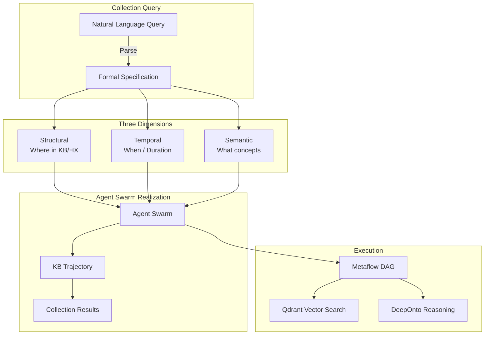
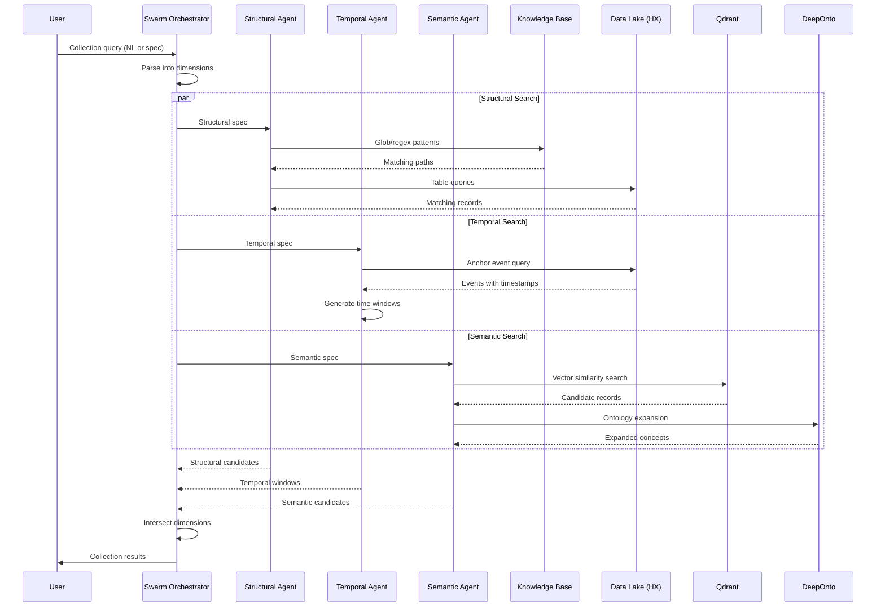
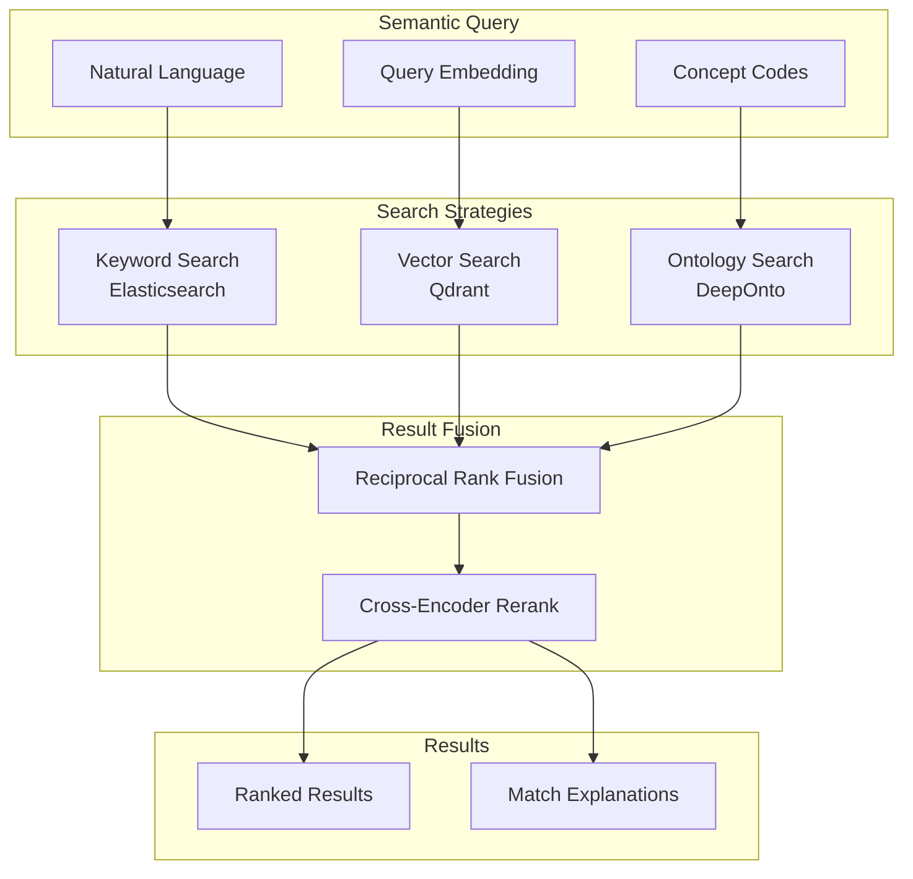

# Collections

> **Status**: Design Draft
> **Last Updated**: 2026-01-17

---

## Overview

A **Collection** is a structural-temporal-semantic slice of KB content, realized by the trajectory of an agent swarm through the knowledge base in response to a composite query specification.



---

## The Three Dimensions

### Structural: Where

The structural dimension defines *location* within the knowledge base hierarchy and data lake.

```hocon
structural {
  # KB directory patterns (glob/regex)
  kb_patterns = [
    "build/dev/current/patients/*/records/**"
    "build/dev/current/labs/pathology/*"
    "build/dev/current/labs/tissue_bank/*"
  ]

  # HX (data lake) table patterns
  hx_patterns = [
    "gaius_hx.patient_encounters"
    "gaius_hx.lab_results"
    "gaius_hx.adverse_events"
  ]

  # Inclusion/exclusion rules
  include = ["*.json", "*.parquet", "*.md"]
  exclude = ["*.tmp", "draft_*"]

  # Depth limits
  max_depth = 5
  follow_symlinks = false
}
```

#### Pattern Types

| Type | Syntax | Example |
|------|--------|---------|
| Glob | Shell wildcards | `patients/*/labs/*.json` |
| Regex | Full regex | `patient_\d{6}/encounter_.*\.parquet` |
| XPath-like | Hierarchical | `/kb/patients[has_sample=true]/encounters` |

### Temporal: When

The temporal dimension defines *time constraints* on the data slice.

```hocon
temporal {
  # Absolute time range
  range {
    start = "2025-01-01T00:00:00Z"
    end = "2025-12-31T23:59:59Z"
  }

  # Relative to reference event
  relative {
    anchor = "adverse_event.timestamp"
    window {
      before = "6d"   # 6 days before
      after = "0d"    # Up to the event
    }
  }

  # Duration constraints
  duration {
    min = "1h"
    max = "30d"
  }

  # Functional timeframe generator
  generator = """
    def timeframes(events):
        for event in events:
            yield TimeWindow(
                start=event.timestamp - timedelta(days=6),
                end=event.timestamp,
                anchor=event
            )
  """
}
```

#### Temporal Operators

| Operator | Description | Example |
|----------|-------------|---------|
| `within` | Inside time window | `within(adverse_event, -6d, 0d)` |
| `before` | Preceding event | `before(adverse_event, 6d)` |
| `after` | Following event | `after(diagnosis, 30d)` |
| `between` | Between two events | `between(admission, discharge)` |
| `overlaps` | Temporal overlap | `overlaps(treatment_period)` |
| `contains` | Fully contains | `contains(lab_result.valid_period)` |

#### Timeframe Generators

For complex temporal logic, use functional-style generators:

```python
from gaius.collections.temporal import TimeframeGenerator, TimeWindow

class AdverseEventWindow(TimeframeGenerator):
    """Generate windows around adverse events with lookback."""

    def __init__(self, lookback_days: int = 6):
        self.lookback = timedelta(days=lookback_days)

    def generate(self, context: QueryContext) -> Iterator[TimeWindow]:
        adverse_events = context.query(
            "SELECT * FROM adverse_events WHERE severity >= 3"
        )

        for event in adverse_events:
            yield TimeWindow(
                start=event.timestamp - self.lookback,
                end=event.timestamp,
                anchor_id=event.id,
                metadata={"event_type": event.type, "severity": event.severity}
            )
```

### Semantic: What

The semantic dimension defines *conceptual constraints* using ontology-aware search.

```hocon
semantic {
  # Natural language intent (parsed by agent)
  intent = "patients with pathology samples who had phlebotomy near adverse events"

  # Qdrant vector search
  vector_search {
    query_embedding = ${intent}  # Embedded at runtime
    collections = ["patient_records", "lab_results", "clinical_notes"]
    top_k = 1000
    score_threshold = 0.75
  }

  # Ontology constraints (DeepOnto)
  ontology {
    # Required concepts (must match)
    required = [
      "snomed:108252007"   # Laboratory procedure
      "snomed:396550006"   # Blood specimen collection (phlebotomy)
    ]

    # Related concepts (expand search)
    expand = [
      "snomed:441742003"   # Evaluation finding
      "snomed:404684003"   # Clinical finding
    ]

    # Excluded concepts
    exclude = [
      "snomed:183932001"   # Procedure declined
    ]

    # Relationship traversal
    relationships = [
      "has_specimen"
      "preceded_by"
      "associated_with"
    ]
  }

  # Concept co-occurrence requirements
  co_occurrence {
    # All must appear in same document/record
    required_together = [
      ["pathology_sample", "tissue_bank_sample"],  # Either
      ["phlebotomy", "blood_draw", "venipuncture"]  # Any synonym
    ]

    # Proximity constraints
    proximity {
      concepts = ["adverse_event", "lab_result"]
      max_distance = 3  # Relationship hops
    }
  }
}
```

#### Semantic Query Levels

| Level | Mechanism | Precision | Recall |
|-------|-----------|-----------|--------|
| Keyword | Text matching | High | Low |
| Embedding | Vector similarity | Medium | High |
| Ontology | Concept reasoning | High | Medium |
| Hybrid | All combined | Highest | Highest |

---

## Example: Clinical Adverse Event Collection

### Natural Language Query

> "Find patients who have pathology lab or tissue bank samples and had a phlebotomy within 6 days of a specific adverse event"

### Formal Specification

```yaml
# collection: adverse_event_phlebotomy_samples.yaml
name: adverse_event_phlebotomy_samples
version: 1.0.0
description: |
  Patients with pathology/tissue samples who had blood draws
  within 6 days preceding an adverse event.

structural:
  kb:
    patterns:
      - "patients/*/encounters/**"
      - "labs/pathology/**"
      - "labs/tissue_bank/**"
    filters:
      has_sample: true

  hx:
    tables:
      - gaius_hx.patient_encounters
      - gaius_hx.lab_results
      - gaius_hx.adverse_events
      - gaius_hx.specimen_inventory
    joins:
      - patient_encounters.patient_id = lab_results.patient_id
      - patient_encounters.patient_id = adverse_events.patient_id

temporal:
  anchor: adverse_events.event_timestamp
  window:
    before: 6d
    after: 0d

  constraints:
    - phlebotomy.timestamp WITHIN window
    - sample.collection_date <= adverse_event.event_timestamp

semantic:
  concepts:
    required:
      - pathology_sample OR tissue_bank_sample
      - phlebotomy OR blood_collection

    context:
      - adverse_event
      - clinical_specimen

  ontology:
    expand_synonyms: true
    include_subtypes: true

    snomed_codes:
      - "108252007"   # Laboratory procedure
      - "396550006"   # Blood specimen collection
      - "119364003"   # Serum specimen
      - "119361006"   # Plasma specimen

output:
  format: parquet
  partition_by: [patient_id, adverse_event_id]
  include:
    - patient_demographics
    - sample_metadata
    - phlebotomy_details
    - adverse_event_summary
```

### Metaflow Implementation

```python
from metaflow import FlowSpec, step, Parameter, kubernetes
from gaius.collections import CollectionSpec, StructuralQuery, TemporalQuery, SemanticQuery
from gaius.collections.temporal import TimeWindow
from gaius.inference.search import QdrantSearch
from gaius.ontology import DeepOntoReasoner

class AdverseEventPhlebotomyFlow(FlowSpec):
    """
    Collection: Patients with samples + phlebotomy near adverse events.

    Generated from: adverse_event_phlebotomy_samples.yaml
    """

    spec_path = Parameter(
        "spec",
        default="collections/adverse_event_phlebotomy_samples.yaml",
        help="Collection specification file"
    )

    @step
    def start(self):
        """Load collection specification."""
        self.spec = CollectionSpec.load(self.spec_path)
        self.next(self.structural_query)

    @kubernetes(cpu=2, memory=4096)
    @step
    def structural_query(self):
        """Execute structural dimension query."""
        structural = StructuralQuery(self.spec.structural)

        # Query KB patterns
        self.kb_matches = structural.glob_kb(
            patterns=self.spec.structural.kb.patterns,
            filters=self.spec.structural.kb.filters
        )

        # Query HX tables
        self.hx_matches = structural.query_hx(
            tables=self.spec.structural.hx.tables,
            joins=self.spec.structural.hx.joins
        )

        self.next(self.temporal_query)

    @kubernetes(cpu=2, memory=4096)
    @step
    def temporal_query(self):
        """Apply temporal constraints."""
        temporal = TemporalQuery(self.spec.temporal)

        # Get adverse events as anchors
        adverse_events = self.hx_matches.filter(
            table="adverse_events"
        )

        # Generate time windows
        self.time_windows = []
        for event in adverse_events:
            window = TimeWindow(
                start=event.timestamp - timedelta(days=6),
                end=event.timestamp,
                anchor_id=event.id
            )
            self.time_windows.append(window)

        # Filter to records within windows
        self.temporal_matches = temporal.filter(
            records=self.kb_matches + self.hx_matches,
            windows=self.time_windows,
            timestamp_field="timestamp"
        )

        self.next(self.semantic_query)

    @kubernetes(cpu=4, memory=8192, gpu=1)
    @step
    def semantic_query(self):
        """Apply semantic constraints via Qdrant + DeepOnto."""

        # Vector search for concept similarity
        qdrant = QdrantSearch()
        vector_matches = qdrant.search(
            query=self.spec.semantic.concepts.required,
            collections=["patient_records", "lab_results"],
            filter={"record_ids": [r.id for r in self.temporal_matches]},
            top_k=len(self.temporal_matches)
        )

        # Ontology reasoning for concept expansion
        reasoner = DeepOntoReasoner()

        # Expand SNOMED codes to include subtypes
        expanded_concepts = reasoner.expand(
            codes=self.spec.semantic.ontology.snomed_codes,
            include_subtypes=True,
            include_synonyms=True
        )

        # Filter by ontology constraints
        self.semantic_matches = reasoner.filter(
            records=vector_matches,
            required_concepts=expanded_concepts,
            relationships=["has_specimen", "preceded_by"]
        )

        self.next(self.assemble_collection)

    @step
    def assemble_collection(self):
        """Assemble final collection with all dimensions satisfied."""
        from gaius.collections import CollectionBuilder

        builder = CollectionBuilder(self.spec)

        self.collection = builder.build(
            structural=self.kb_matches,
            temporal=self.temporal_matches,
            semantic=self.semantic_matches,
            intersect=True  # All three dimensions must match
        )

        self.next(self.end)

    @step
    def end(self):
        """Output collection results."""
        print(f"Collection complete: {len(self.collection)} records")
        print(f"Unique patients: {self.collection.patient_count}")
        print(f"Time windows: {len(self.time_windows)}")

        # Save to HX
        self.collection.to_parquet(
            path=f"gaius_hx.collections.{self.spec.name}",
            partition_by=self.spec.output.partition_by
        )


if __name__ == "__main__":
    AdverseEventPhlebotomyFlow()
```

---

## Agent Swarm Realization

Collections are realized through coordinated agent swarm traversal of the KB.



### Swarm Trajectory

The agent swarm's trajectory through the KB is itself a valuable artifact:

```python
@dataclass
class SwarmTrajectory:
    """Record of agent swarm's path through KB."""

    collection_id: str
    agents: list[AgentTrace]
    kb_nodes_visited: list[str]
    hx_queries_executed: list[SQLQuery]
    vector_searches: list[VectorSearchTrace]
    ontology_expansions: list[OntologyTrace]

    # Provenance
    start_time: datetime
    end_time: datetime
    total_records_scanned: int
    total_records_matched: int

    def to_lineage_graph(self) -> nx.DiGraph:
        """Convert trajectory to provenance graph."""
        ...
```

---

## Semantic Query Deep Dive

### Qdrant Integration

Vector search for semantic similarity:

```python
from gaius.inference.search import QdrantSearch
from gaius.models.embeddings import ColNomicEmbedder

class SemanticSearchAgent:
    def __init__(self):
        self.embedder = ColNomicEmbedder()
        self.qdrant = QdrantSearch()

    async def search(self, semantic_spec: SemanticSpec) -> list[Record]:
        # Embed the query concepts
        query_embedding = self.embedder.embed(
            " ".join(semantic_spec.concepts.required)
        )

        # Multi-collection search
        results = await self.qdrant.search_multi(
            collections=semantic_spec.vector_search.collections,
            query_vector=query_embedding,
            top_k=semantic_spec.vector_search.top_k,
            score_threshold=semantic_spec.vector_search.score_threshold,
            filter=semantic_spec.to_qdrant_filter()
        )

        return results
```

### DeepOnto Integration

Ontology-aware reasoning for concept expansion and validation:

```python
from deeponto.onto import Ontology
from deeponto.align import OntoAlign

class OntologyReasoningAgent:
    def __init__(self, ontology_path: str = "snomed_ct.owl"):
        self.onto = Ontology(ontology_path)

    def expand_concepts(self, codes: list[str]) -> list[str]:
        """Expand concept codes to include subtypes and synonyms."""
        expanded = set(codes)

        for code in codes:
            # Get subtypes (is-a hierarchy)
            subtypes = self.onto.get_descendants(code)
            expanded.update(subtypes)

            # Get synonyms (same-as relationships)
            synonyms = self.onto.get_synonyms(code)
            expanded.update(synonyms)

        return list(expanded)

    def validate_relationships(
        self,
        records: list[Record],
        required_relationships: list[str]
    ) -> list[Record]:
        """Filter records by ontology relationship constraints."""
        valid = []

        for record in records:
            concepts = self.extract_concepts(record)

            # Check required relationships exist
            if self.relationships_satisfied(concepts, required_relationships):
                valid.append(record)

        return valid
```

### Hybrid Search Strategy

Combining all semantic mechanisms:



---

## Collection Operations

### Create Collection

```bash
# From natural language
gaius-cli --cmd "/collection create 'patients with samples near adverse events'"

# From specification file
gaius-cli --cmd "/collection create --spec collections/adverse_event_samples.yaml"

# Interactive builder
gaius-cli --cmd "/collection build"
```

### Query Collection

```bash
# List collections
gaius-cli --cmd "/collection list"

# Describe collection
gaius-cli --cmd "/collection describe adverse_event_phlebotomy_samples"

# Query collection contents
gaius-cli --cmd "/collection query adverse_event_phlebotomy_samples --filter 'severity >= 3'"
```

### Collection Composition

Collections can be composed:

```bash
# Union
gaius-cli --cmd "/collection union coll_a coll_b --output combined"

# Intersection
gaius-cli --cmd "/collection intersect coll_a coll_b --output overlap"

# Difference
gaius-cli --cmd "/collection diff coll_a coll_b --output unique_to_a"

# Temporal join
gaius-cli --cmd "/collection temporal-join samples events --window 6d --output joined"
```

---

## Implementation Roadmap

### Phase 1: Structural Foundation
- [ ] Glob/regex pattern engine for KB traversal
- [ ] HX table query builder with join support
- [ ] Path filter DSL

### Phase 2: Temporal Engine
- [ ] TimeWindow and TimeframeGenerator abstractions
- [ ] Temporal operators (within, before, after, between)
- [ ] Functional timeframe generator support

### Phase 3: Semantic Layer
- [ ] Qdrant multi-collection search integration
- [ ] DeepOnto ontology reasoning integration
- [ ] Hybrid search with reciprocal rank fusion

### Phase 4: Agent Swarm
- [ ] Swarm orchestrator for parallel dimension queries
- [ ] Trajectory recording and lineage
- [ ] Collection assembly with dimension intersection

### Phase 5: Metaflow Integration
- [ ] Collection spec to Metaflow DAG compiler
- [ ] Kubernetes-native execution
- [ ] Incremental/streaming collections

---

## References

### Temporal Reasoning
- [Allen's Interval Algebra](https://en.wikipedia.org/wiki/Allen%27s_interval_algebra)
- [SQL:2011 Temporal Features](https://en.wikipedia.org/wiki/SQL:2011)

### Semantic Search
- [Qdrant Documentation](https://qdrant.tech/documentation/)
- [DeepOnto: Deep Learning for Ontology Engineering](https://github.com/KRR-Oxford/DeepOnto)
- [SNOMED CT Browser](https://browser.ihtsdotools.org/)

### Data Processing
- [Metaflow Documentation](https://docs.metaflow.org/)
- [Apache Iceberg](https://iceberg.apache.org/)
