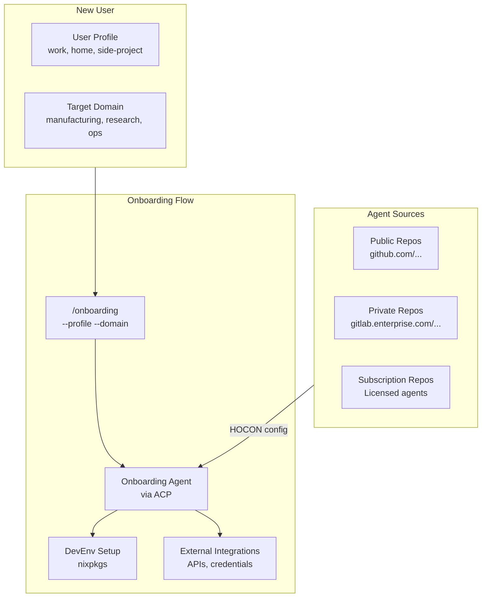
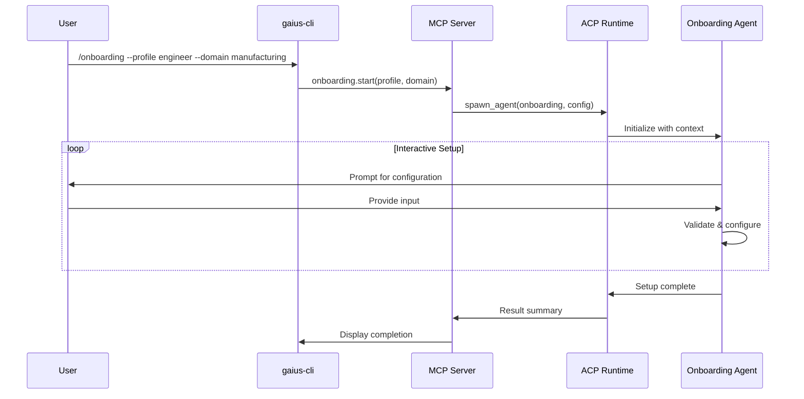
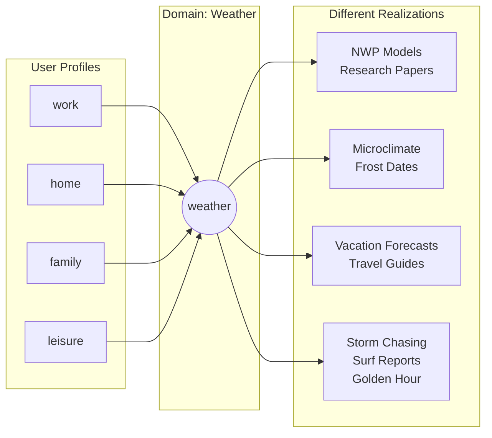
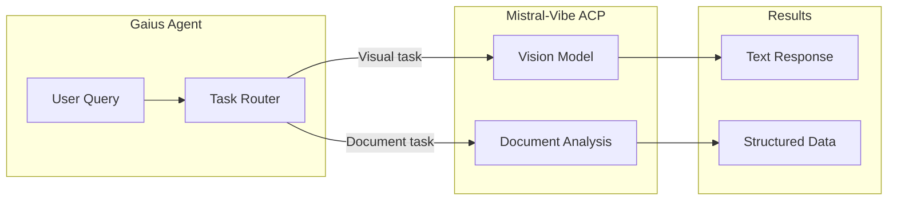
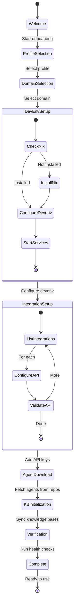

# Onboarding

> **Status**: Design Draft
> **Last Updated**: 2026-01-17

---

## Overview

Gaius onboarding provides a guided, agent-assisted setup experience that:
1. Configures the development environment (devenv + nixpkgs)
2. Connects external inference APIs and integrations
3. Personalizes the experience via domain-specific Onboarding Agents
4. Maintains CLI/MCP/TUI parity for all onboarding commands



---

## Development Environment

### Devenv + Nixpkgs

Gaius uses [devenv](https://devenv.sh/) with nixpkgs for reproducible development environments.

```bash
# Initial setup
curl -fsSL https://install.determinate.systems/nix | sh
nix-env -iA devenv -f https://github.com/NixOS/nixpkgs/tarball/nixpkgs-unstable

# Enter development shell
cd gaius
devenv up
```

#### What devenv provides:

| Component | Purpose |
|-----------|---------|
| Python 3.11+ | Runtime with uv for package management |
| PostgreSQL | Metadata storage, state tracking |
| MinIO | S3-compatible object storage for KB |
| Qdrant | Vector database for embeddings |
| Aeron | Low-latency agent IPC (in progress) |
| Process Compose | Service orchestration |

#### Environment Profiles

```nix
# devenv.nix profiles
{
  profiles = {
    minimal = {
      # Core services only
      services.postgres.enable = true;
      services.minio.enable = true;
    };

    full = {
      # All services including GPU inference
      imports = [ ./profiles/minimal.nix ];
      services.qdrant.enable = true;
      services.vllm.enable = true;
    };

    ci = {
      # CI/CD optimized
      imports = [ ./profiles/minimal.nix ];
      processes.test-runner.enable = true;
    };
  };
}
```

---

## Onboarding Agent

### ACP Integration

The Onboarding Agent runs via [Agent Communication Protocol (ACP)](https://agentcommunicationprotocol.dev/), maintaining parity with other Gaius agents.



### Command Interface

```bash
# CLI
gaius-cli --cmd "/onboarding --profile engineer --domain manufacturing"

# TUI (interactive)
/onboarding --profile engineer --domain manufacturing

# MCP (programmatic)
{
  "method": "tools/call",
  "params": {
    "name": "onboarding",
    "arguments": {
      "profile": "engineer",
      "domain": "manufacturing"
    }
  }
}
```

### Profiles

Profiles represent the user's current *perspective* or *context*—not their role. A single user may switch between profiles throughout the day.

| Profile | Description | Default Integrations |
|---------|-------------|---------------------|
| `work` | Professional/employer context | Corporate SSO, internal KBs, compliance-aware |
| `home` | Personal projects and learning | Personal GitHub, local storage, relaxed policies |
| `side-project` | Independent ventures | Separate credentials, isolated KBs |
| `research` | Academic/exploration mode | arXiv, Semantic Scholar, citation tracking |
| `consulting` | Client-facing work | Per-client credentials, data isolation |

Profiles isolate:
- **Credentials**: Different API keys, OAuth tokens per context
- **Knowledge bases**: Separate KB roots and sync targets
- **Inference routing**: Work may use enterprise endpoints; home uses personal quotas
- **Privacy boundaries**: Prevent cross-contamination between contexts

### The Profile × Domain Matrix

Gaius supports a rich way of relating to the global information landscape. A single domain takes on entirely different meaning depending on the user's current profile.

**Example: `--domain weather`**

| Profile | Context | Weather Domain Manifests As... |
|---------|---------|-------------------------------|
| `work` | Meteorologist | NWP models, GRIB data, forecast verification, research papers |
| `home` | Greenhouse builder | Microclimate data, frost dates, solar angles, irrigation planning |
| `family` | Vacation planner | 10-day forecasts, historical averages, best-time-to-visit guides |
| `leisure` | Storm chaser | Convective outlooks, radar composites, supercell dynamics |
| `leisure` | Photographer | Golden hour times, cloud formations, dramatic light conditions |
| `leisure` | Surfer | Swell models, wind forecasts, tide charts, wave period data |

The same person, the same domain, six completely different relationships to information. Gaius embraces this multiplicity—your professional expertise, personal projects, family life, and hobbies each deserve their own context, their own KB trajectory, their own way of seeing.



This is not just about filtering—it's about *framing*. The agent swarm navigates the KB differently, surfaces different connections, speaks in different registers, all based on who you are *right now*.

### Domains

| Domain | KB Sources | Specialized Agents |
|--------|------------|-------------------|
| `manufacturing` | Process docs, equipment manuals, quality specs | FDMM agents |
| `research` | Papers, patents, technical reports | Literature review agents |
| `operations` | Runbooks, incident reports, SLAs | SRE agents |
| `finance` | Reports, regulations, market data | Compliance agents |
| `custom` | User-specified sources | User-provided agents |

---

## Remote Agent Repositories

### Configuration

Onboarding Agents are loaded from remote git repositories specified in HOCON configuration:

```hocon
# ~/.config/gaius/agents.conf

agents {
  repositories = [
    # Public GitHub repo
    {
      url = "https://github.com/gaius-project/onboarding-agents"
      branch = "main"
      auth = "none"
    }

    # Private GitHub repo (PAT auth)
    {
      url = "https://github.com/acme-corp/gaius-agents"
      branch = "release"
      auth = "github-pat"
      credentials = ${GITHUB_PAT}
    }

    # GitLab enterprise (OAuth)
    {
      url = "https://gitlab.enterprise.com/ai-team/onboarding"
      branch = "stable"
      auth = "gitlab-oauth"
      credentials = ${GITLAB_TOKEN}
    }

    # Subscription-based (API key)
    {
      url = "https://agents.gaius.dev/premium/manufacturing"
      branch = "v2"
      auth = "api-key"
      credentials = ${GAIUS_SUBSCRIPTION_KEY}
      license = "enterprise"
    }
  ]

  # Resolution order (first match wins)
  resolution = "priority"  # or "merge", "override"

  # Cache settings
  cache {
    enabled = true
    ttl = "24h"
    path = ${HOME}/.cache/gaius/agents
  }
}
```

### Repository Structure

```
onboarding-agents/
├── manifest.yaml           # Agent catalog
├── agents/
│   ├── engineer/
│   │   ├── agent.yaml      # Agent definition
│   │   ├── prompts/        # System prompts
│   │   ├── tools/          # Custom tools
│   │   └── workflows/      # Multi-step flows
│   ├── researcher/
│   └── manufacturing/
├── integrations/
│   ├── cerebras.yaml
│   ├── grok.yaml
│   └── bytez.yaml
└── domains/
    ├── manufacturing/
    └── research/
```

### Manifest Format

```yaml
# manifest.yaml
name: gaius-onboarding-agents
version: 2.1.0
license: Apache-2.0  # or "proprietary", "subscription"

agents:
  - id: onboarding-engineer
    name: Engineer Onboarding
    profile: engineer
    domains: [software, infrastructure]
    min_gaius_version: "0.9.0"

  - id: onboarding-manufacturing
    name: Manufacturing Onboarding
    profile: operator
    domains: [manufacturing]
    requires:
      - fdmm-kb
      - equipment-api

integrations:
  - id: cerebras-inference
    type: inference
    provider: cerebras

subscription:
  required: false
  tier: community  # or "professional", "enterprise"
```

### Authentication Methods

| Method | Use Case | Configuration |
|--------|----------|---------------|
| `none` | Public repos | No credentials needed |
| `github-pat` | Private GitHub | Personal Access Token |
| `github-app` | Org GitHub | GitHub App installation |
| `gitlab-oauth` | GitLab repos | OAuth token |
| `ssh` | Any git host | SSH key |
| `api-key` | Subscription services | Vendor API key |

---

## External Integrations

### Inference APIs

#### Cerebras

Ultra-fast inference for interactive use cases.

```hocon
# integrations.conf
inference.cerebras {
  enabled = true
  api_key = ${CEREBRAS_API_KEY}
  model = "llama-3.3-70b"

  # Use for fast responses
  routing {
    latency_sensitive = true
    max_tokens = 4096
  }
}
```

```python
# Usage in agent
from gaius.providers.cerebras import CerebrasClient

client = CerebrasClient()
response = await client.complete(
    prompt="Explain the FDMM capability model",
    model="llama-3.3-70b"
)
```

#### xAI Grok

Advanced reasoning with real-time data access.

```hocon
inference.grok {
  enabled = true
  api_key = ${XAI_API_KEY}

  models {
    text = "grok-2"
    voice = "grok-voice"  # For voice agents
  }

  features {
    web_search = true      # Real-time X data
    tool_calling = true
    voice_agent = true     # WebRTC voice
  }
}
```

#### Bytez

Cost-effective batch processing.

```hocon
inference.bytez {
  enabled = true
  api_key = ${BYTEZ_API_KEY}

  # Use for background tasks
  routing {
    batch_processing = true
    cost_optimized = true
  }
}
```

### FMP API (Financial Modeling Prep)

Financial data integration for business domains.

```hocon
integrations.fmp {
  enabled = true
  api_key = ${FMP_API_KEY}

  endpoints {
    company_profile = true
    financial_statements = true
    stock_quotes = true
    sec_filings = true
  }

  cache {
    enabled = true
    ttl = "1h"
  }
}
```

```python
# Usage
from gaius.integrations.fmp import FMPClient

fmp = FMPClient()
profile = await fmp.company_profile("AAPL")
financials = await fmp.income_statement("AAPL", period="annual", limit=5)
```

### Mistral-Vibe ACP Agent

Multimodal agent for visual understanding tasks.

```hocon
agents.mistral_vibe {
  enabled = true
  acp_endpoint = "https://acp.mistral.ai/v1"
  api_key = ${MISTRAL_API_KEY}

  capabilities {
    image_understanding = true
    document_analysis = true
    chart_interpretation = true
  }

  # Integration with Gaius
  routing {
    visual_queries = true
    document_qa = true
  }
}
```



---

## Onboarding Flow

### Step-by-Step Process



### Interactive Prompts

The Onboarding Agent guides users through setup:

```
┌─────────────────────────────────────────────────────────────┐
│  Welcome to Gaius Onboarding                                │
├─────────────────────────────────────────────────────────────┤
│                                                             │
│  Let's configure your environment.                          │
│                                                             │
│  What's your primary role?                                  │
│                                                             │
│  > [1] Engineer - Software development focus                │
│    [2] Researcher - Academic/R&D focus                      │
│    [3] Operator - Production operations                     │
│    [4] Analyst - Data analysis focus                        │
│    [5] Custom - Define your own profile                     │
│                                                             │
│  Selection: _                                               │
│                                                             │
└─────────────────────────────────────────────────────────────┘
```

### Verification

Post-onboarding health check:

```bash
$ gaius-cli --cmd "/health onboarding"

Onboarding Health Check
═══════════════════════

DevEnv:
  ✓ Nix installed (2.18.1)
  ✓ devenv configured
  ✓ Services running (postgres, minio, qdrant)

Integrations:
  ✓ Cerebras API connected (llama-3.3-70b available)
  ✓ xAI Grok API connected (grok-2 available)
  ○ Bytez API not configured (optional)
  ✓ FMP API connected (rate limit: 250/day)

Agents:
  ✓ 3 agent repositories configured
  ✓ 12 agents available
  ✓ Onboarding agent: engineer-manufacturing

Knowledge Base:
  ✓ Manufacturing KB synced (1,247 documents)
  ✓ Vector index built (Qdrant)

Status: Ready ✓
```

---

## Security Considerations

### Credential Management

```hocon
# Use environment variables or secret managers
credentials {
  # Environment variable reference
  cerebras_key = ${CEREBRAS_API_KEY}

  # HashiCorp Vault
  grok_key = ${vault://secret/gaius/xai#api_key}

  # AWS Secrets Manager
  fmp_key = ${aws-sm://gaius/fmp-api-key}

  # 1Password CLI
  subscription_key = ${op://Private/Gaius/subscription-key}
}
```

### Repository Trust

```hocon
agents {
  # Only allow verified publishers
  trust {
    require_signature = true
    allowed_publishers = [
      "gaius-project",
      "acme-corp"
    ]

    # Block known malicious repos
    blocklist = [
      "https://github.com/malicious/*"
    ]
  }

  # Sandbox untrusted agents
  sandbox {
    enabled = true
    network = "restricted"
    filesystem = "read-only"
  }
}
```

---

## CLI Reference

```bash
# Start onboarding
gaius-cli --cmd "/onboarding --profile <profile> --domain <domain>"

# List available profiles
gaius-cli --cmd "/onboarding profiles"

# List available domains
gaius-cli --cmd "/onboarding domains"

# List configured agent repositories
gaius-cli --cmd "/onboarding repos"

# Add agent repository
gaius-cli --cmd "/onboarding repo add <url> --auth <method>"

# Refresh agent cache
gaius-cli --cmd "/onboarding refresh"

# Check onboarding status
gaius-cli --cmd "/health onboarding"

# Reset onboarding
gaius-cli --cmd "/onboarding reset --confirm"
```
