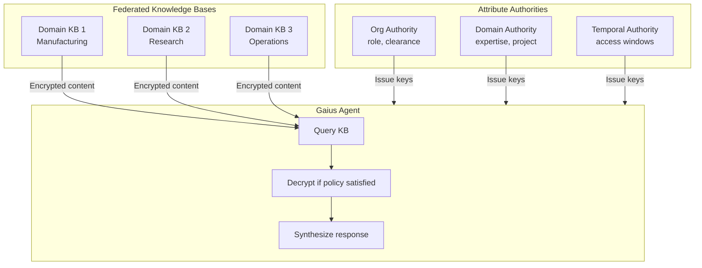
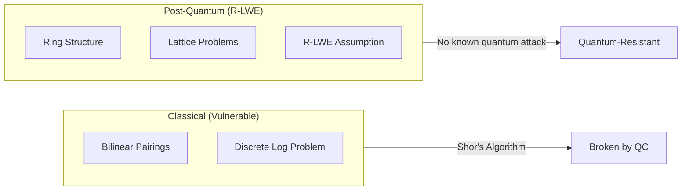
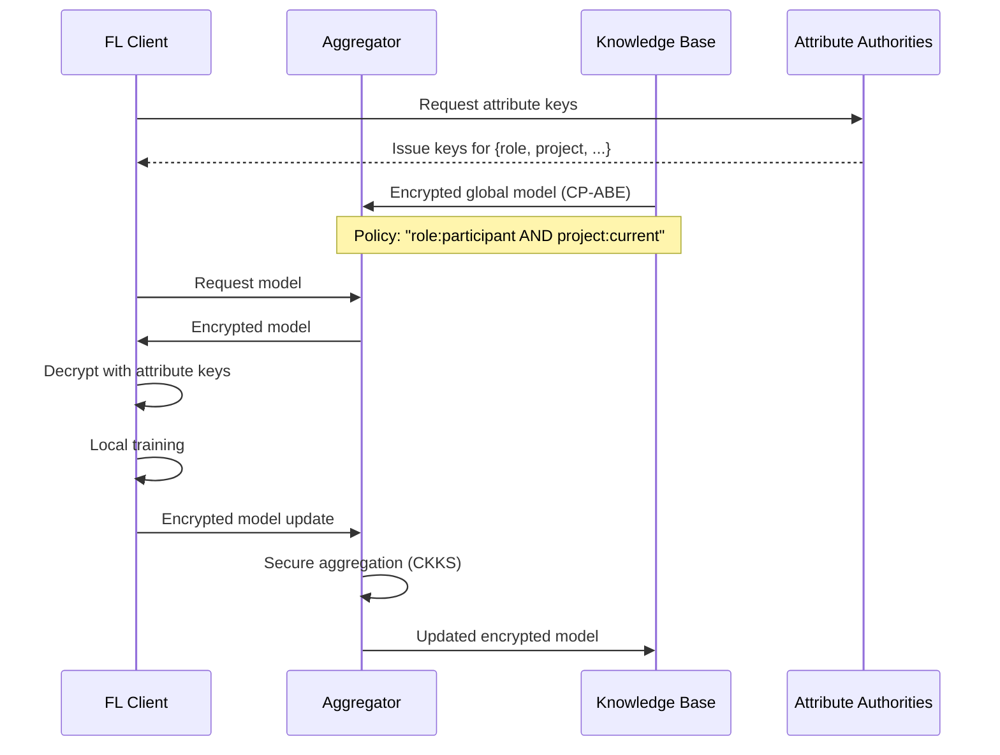
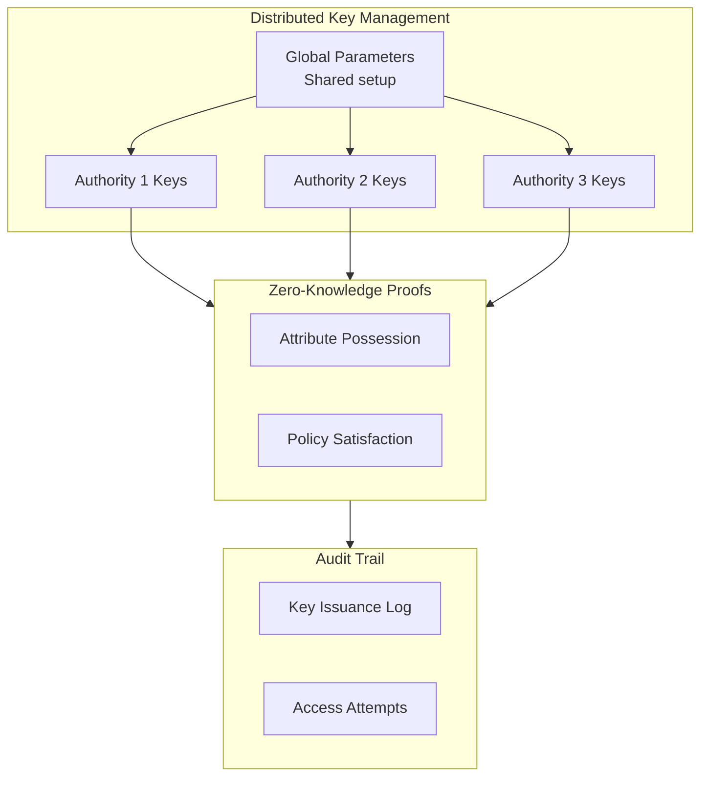
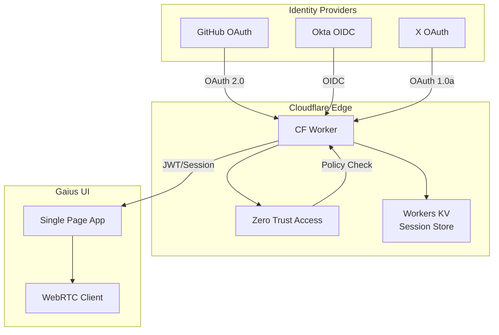
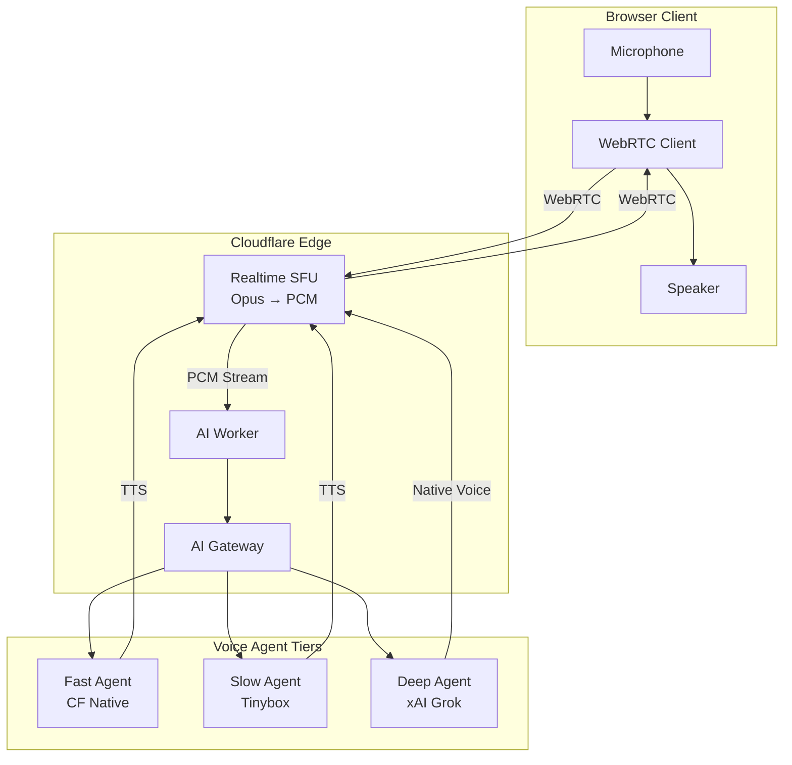
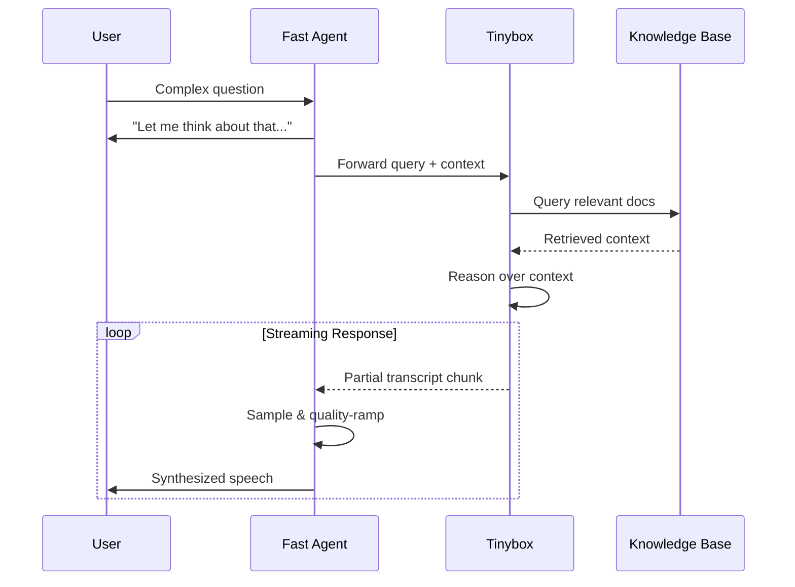
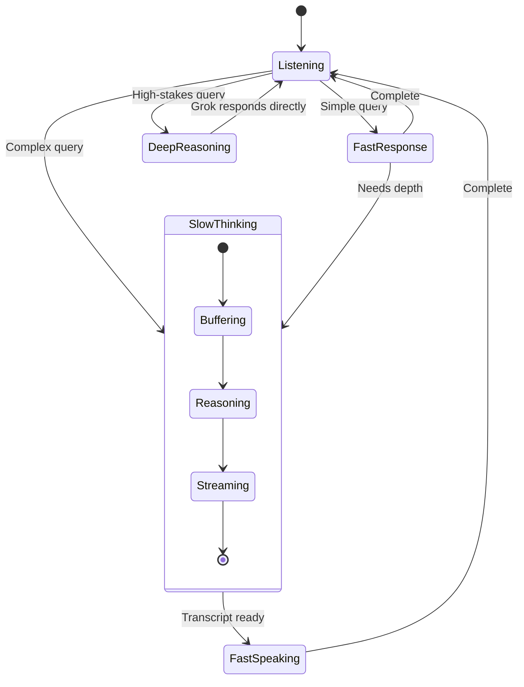
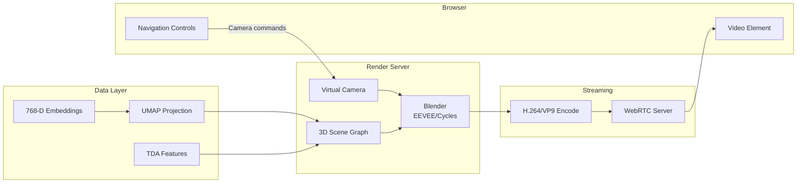

# 2026 Q1 Roadmap

> **Branch**: `design/2026Q1`
> **Last Updated**: 2026-01-17

---

## Multi-Authority CP-ABE + R-LWE

### Overview

Post-quantum cryptographic access control for federated knowledge bases using:
- **MA-CP-ABE**: Multi-Authority Ciphertext-Policy Attribute-Based Encryption
- **R-LWE**: Ring Learning With Errors (lattice-based, quantum-resistant)

This enables fine-grained, decentralized access control where:
1. No single authority controls all attributes
2. Access policies are embedded in ciphertext (not keys)
3. Security guarantees survive quantum computing advances

### Why This Matters for Gaius



### Technical Foundation

#### CP-ABE (Ciphertext-Policy ABE)

In CP-ABE, the data provider specifies the access policy based on attributes. Users with attributes matching the policy can decrypt without direct authorization from the data provider.

```
Encrypt(message, policy="(role:engineer AND clearance:secret) OR project:manhattan")
    → ciphertext that only matching attribute holders can decrypt
```

#### Multi-Authority Extension

Single-authority ABE has a critical weakness: one authority controls all keys. MA-ABE distributes trust:

| Authority | Attributes Managed | Example |
|-----------|-------------------|---------|
| Organization | `role`, `department`, `clearance` | HR system |
| Project | `project`, `team`, `milestone` | PM system |
| Domain | `expertise`, `certification` | Skills DB |
| Temporal | `valid_from`, `valid_until` | Time service |

#### R-LWE for Post-Quantum Security

Traditional ABE relies on pairing-based cryptography vulnerable to quantum attacks. R-LWE provides:

- **Quantum resistance**: Based on hard lattice problems
- **Efficiency**: Ring structure enables faster operations than standard LWE
- **Smaller keys**: Polynomial representation vs. matrix representation



### Research References

Recent advances (2024-2025):

1. **Decentralized MA-CP-ABE from LWE** ([Yao et al., 2024](https://www.sciencedirect.com/science/article/pii/S2214212624000553))
   - Combines global ID model with lattice sampling
   - Static security against arbitrary collusion
   - Shorter ciphertext than prior work

2. **Practical Revocable MA-CP-ABE from RLWE** ([ScienceDirect, 2022](https://www.sciencedirect.com/science/article/abs/pii/S2214212622000011))
   - Revocation support for dynamic systems
   - RLWE-based for efficiency

3. **Multi-Authority CP-ABE on Ideal Lattices** ([IEEE, 2019](https://ieeexplore.ieee.org/document/8672233))
   - Flexible threshold access policies
   - Virtual attributes for authority management

4. **Lattice-based Multi-Authority/Client ABE for Circuits** ([IACR, 2025](https://cic.iacr.org/p/1/4/1))
   - Arbitrary polynomial-size circuit policies
   - Distributed key generation

### Integration with Federated Learning

CP-ABE naturally complements federated learning for privacy-preserving AI:



Research: [Securing Decentralized FL with CP-ABE + CKKS](https://link.springer.com/article/10.1007/s10586-024-04957-8)

### Implementation Considerations

#### Key Management Architecture



Research: [Blockchain-based CP-ABE with Distributed KMS and ZKP](https://www.sciencedirect.com/science/article/pii/S1319157824000582)

#### Performance Trade-offs

| Approach | Key Size | Ciphertext Size | Decrypt Time | Quantum Safe |
|----------|----------|-----------------|--------------|--------------|
| Pairing-based CP-ABE | Small | Small | Fast | No |
| LWE-based MA-ABE | Large | Large | Slow | Yes |
| R-LWE-based MA-ABE | Medium | Medium | Medium | Yes |
| Pairing-free (ECC) | Small | Small | Fast | No |

For IoT/edge deployment: [Efficient Pairing-Free CP-ABE for IoT](https://www.mdpi.com/1424-8220/24/21/6843)

### Gaius Integration Roadmap

#### Phase 1: Cryptographic Foundation
- [ ] Evaluate R-LWE parameter selection (security level vs. performance)
- [ ] Prototype single-authority CP-ABE on lattices
- [ ] Benchmark against NIST PQC standards (ML-KEM, ML-DSA)

#### Phase 2: Multi-Authority Architecture
- [ ] Design authority trust model for Gaius domains
- [ ] Implement distributed key generation protocol
- [ ] Integrate with existing KB sync (MinIO, Postgres)

#### Phase 3: Policy Language
- [ ] Define attribute schema for Gaius use cases
- [ ] Create policy DSL compatible with RASE requirements
- [ ] Implement policy-to-circuit compiler

#### Phase 4: Agent Integration
- [ ] Extend agent credentials with attribute keys
- [ ] Implement transparent decrypt-on-access for KB queries
- [ ] Add policy-aware caching layer

#### Phase 5: Federated Learning Bridge
- [ ] Integrate with evolution engine for secure model sharing
- [ ] Implement secure aggregation with homomorphic properties
- [ ] Connect to existing gRPC infrastructure

### NIST PQC Alignment

NIST finalized post-quantum standards in August 2024:
- **ML-KEM** (FIPS 203): Key encapsulation based on Module-LWE
- **ML-DSA** (FIPS 204): Digital signatures based on Module-LWE
- **SLH-DSA** (FIPS 205): Stateless hash-based signatures

Our R-LWE approach aligns with ML-KEM foundations while extending to attribute-based access control.

Reference: [NIST Post-Quantum Cryptography Standards](https://www.nist.gov/news-events/news/2024/08/nist-releases-first-3-finalized-post-quantum-encryption-standards)

---

## Cloudflare Worker Authentication

### Current State

The Cloudflare Worker UI currently handles only X (Twitter) OAuth callbacks. Need to extend with:
- **GitHub OAuth** - Developer identity
- **Okta OIDC** - Enterprise identity
- **Cloudflare Zero Trust** - Unified access control

### Architecture



### Implementation

#### GitHub OAuth

Using [cloudflare-worker-github-oauth-login](https://github.com/gr2m/cloudflare-worker-github-oauth-login):

```typescript
// Worker handles OAuth flow
// 1. Redirect to GitHub login
// 2. Receive callback with code
// 3. Exchange code for access token
// 4. Store session in Workers KV
```

Secrets required:
- `GITHUB_CLIENT_ID`
- `GITHUB_CLIENT_SECRET`

#### Okta OIDC

Integration via [Cloudflare Zero Trust](https://developers.cloudflare.com/cloudflare-one/identity/idp-integration/okta/):

- Sign-in redirect: `https://<team>.cloudflareaccess.com/cdn-cgi/access/callback`
- SCIM provisioning for group sync
- Risk score sharing for adaptive access

#### Zero Trust Policy

```
Allow IF:
  (identity.provider == "github" AND identity.groups contains "gaius-users")
  OR
  (identity.provider == "okta" AND identity.groups contains "engineering")
```

---

## WebRTC Voice Chat

### Overview

Real-time voice interaction with authenticated users via Cloudflare's [Realtime Voice AI platform](https://blog.cloudflare.com/cloudflare-realtime-voice-ai/).



### Multi-Level Voice Agents

#### Tier 1: Fast (Cloudflare Native)

**Latency**: < 200ms | **Use**: Immediate responses, conversation management

- [Deepgram Flux](https://developers.cloudflare.com/workers-ai/models/whisper-large-v3-turbo/) for STT (first conversational speech recognition model for voice agents)
- [MeloTTS](https://developers.cloudflare.com/workers-ai/models/) for TTS
- [PipeCat smart-turn-v2](https://blog.cloudflare.com/cloudflare-realtime-voice-ai/) for turn detection
- Runs in 330+ Cloudflare cities worldwide

Responsibilities:
- Acknowledge user input immediately
- Handle simple queries directly
- Orchestrate slower agents
- Manage conversation flow and interruptions

#### Tier 2: Slow (Tinybox)

**Latency**: 1-5s | **Use**: Deep reasoning, KB synthesis



Architecture:
- **Listening mode**: Subscribes to conversation transcript
- **Continuous buffer**: Updates with conversation context
- **Reply interpretation**: Fast agent interprets Slow's text output
- **Quality ramping**: Fast agent samples streaming text, naturally increases quality as more context arrives

#### Tier 3: Deep (xAI Grok Voice)

**Latency**: < 700ms | **Use**: High-quality reasoning with native voice

Using [Grok Voice Agent API](https://x.ai/news/grok-voice-agent-api):

- **Performance**: #1 on Big Bench Audio (92.3%), 5x faster than competitors
- **Pricing**: $0.05/minute (half of OpenAI Realtime)
- **Languages**: 100+ with automatic detection
- **Voices**: Ara, Eve, Leo - expressive with domain terminology

```typescript
// xAI Grok as WebRTC participant
const grokAgent = new GrokVoiceAgent({
  voice: "leo",
  personality: "professional, technical, helpful",
  tools: [kbSearch, codeExecution, webSearch],
  expressiveness: ["[thoughtful pause]", "[emphasis]"]
});

// Add as participant in WebRTC room
webrtcRoom.addParticipant(grokAgent);
```

Capabilities:
- Native audio processing (no STT→LLM→TTS pipeline)
- Tool calling (CRM, calendar, KB search)
- Real-time web search via X platform
- Compatible with OpenAI Realtime API spec
- [LiveKit plugin available](https://blog.livekit.io/xai-livekit-partnership-grok-voice-agent-api/)

### Agent Orchestration



---

## Server-Side 3D Visualization

### Concept

Render UMAP projections as navigable 3D environments using Blender, stream as video over WebRTC.



### Why Server-Side Rendering?

| Approach | Pros | Cons |
|----------|------|------|
| Client WebGL | Low latency, interactive | Limited by device GPU |
| Server Blender | Photorealistic, complex scenes | Latency, server cost |
| Hybrid | Best of both | Complexity |

For Gaius:
- Complex topology visualizations exceed client GPU
- Consistent rendering across devices
- Can leverage CUDA/OptiX on render server

### Architecture

#### Scene Generation

```python
# Blender Python API
import bpy
from gaius.core.projection import UMAPProjector

def generate_scene(embeddings, metadata):
    # Project to 3D
    coords_3d = UMAPProjector(n_components=3).fit_transform(embeddings)

    # Create point cloud
    for i, (coord, meta) in enumerate(zip(coords_3d, metadata)):
        sphere = bpy.ops.mesh.primitive_uv_sphere_add(
            radius=meta['importance'] * 0.1,
            location=coord
        )
        # Color by cluster
        material = create_material(meta['cluster'])
        sphere.data.materials.append(material)

    # Add topology features (persistent homology)
    for cycle in topology.cycles:
        draw_cycle(cycle)
```

#### Streaming Pipeline

Using concepts from [3D Streaming Toolkit](https://3dstreamingtoolkit.github.io/docs-3dstk/):

1. **Render**: Blender EEVEE (realtime) or Cycles (quality)
2. **Encode**: NVENC hardware encoding (zero-latency)
3. **Transport**: WebRTC with adaptive bitrate
4. **Interact**: DataChannel for camera controls

#### Camera Control Protocol

```typescript
interface CameraCommand {
  type: 'orbit' | 'pan' | 'zoom' | 'focus';
  params: {
    target?: [number, number, number];  // Focus point
    delta?: [number, number, number];   // Movement
    duration?: number;                   // Animation time
  };
}

// Client sends commands via WebRTC DataChannel
dataChannel.send(JSON.stringify({
  type: 'focus',
  params: { target: selectedNode.position, duration: 0.5 }
}));
```

### Integration with Voice

Voice agents can control the 3D view:

```
User: "Show me the cluster of manufacturing documents"
Fast Agent: "Focusing on the manufacturing cluster..."
[Camera animates to manufacturing cluster centroid]
Deep Agent: "I can see 47 documents here, primarily covering CNC operations
             and quality control. The central node is your process manual..."
```

---

## Onboarding System

Agent-assisted setup experience with CLI/MCP/TUI parity.

### Key Components

- **DevEnv + Nixpkgs**: Reproducible development environment
- **Onboarding Agent**: ACP-based guided setup via `/onboarding --profile <profile> --domain <domain>`
- **Remote Agent Repos**: Load agents from public/private git repos (GitHub, GitLab, enterprise)
- **External Integrations**: Cerebras, xAI Grok, Bytez inference APIs + FMP financial data
- **Mistral-Vibe ACP Agent**: Multimodal document/visual understanding

### Agent Repository Configuration

```hocon
agents.repositories = [
  { url = "https://github.com/gaius-project/onboarding-agents", auth = "none" }
  { url = "https://gitlab.enterprise.com/ai/agents", auth = "gitlab-oauth" }
  { url = "https://agents.gaius.dev/premium", auth = "api-key", license = "enterprise" }
]
```

**Full specification**: [Onboarding](./onboarding.md)

---

## Collections

Structural-temporal-semantic slices of KB content, realized by agent swarm trajectory.

### The Three Dimensions

| Dimension | Definition | Mechanism |
|-----------|------------|-----------|
| **Structural** | Where in KB/HX | Glob, regex, XPath-like patterns |
| **Temporal** | When / duration | Time windows, anchors, generators |
| **Semantic** | What concepts | Qdrant vectors + DeepOnto ontology |

### Example Query

> "Find patients who have pathology lab or tissue bank samples and had a phlebotomy within 6 days of a specific adverse event"

Converted to:

```yaml
structural:
  kb_patterns: ["patients/*/encounters/**", "labs/pathology/**"]
  hx_tables: [patient_encounters, lab_results, adverse_events]

temporal:
  anchor: adverse_events.event_timestamp
  window: { before: 6d, after: 0d }

semantic:
  required: [pathology_sample OR tissue_bank_sample, phlebotomy]
  snomed_codes: ["108252007", "396550006"]
```

### Agent Swarm Realization

Collections are realized through coordinated agent swarm traversal:
- **Structural Agent**: Glob/regex KB paths, HX table queries
- **Temporal Agent**: Time window generation, constraint filtering
- **Semantic Agent**: Qdrant similarity + DeepOnto ontology reasoning
- **Orchestrator**: Dimension intersection, trajectory recording

Output: Parameterized Metaflow DAG + formal specification.

**Full specification**: [Collections](./collections.md)

---

## SoM Dataset Curation

Expanding Magma-8B-style Set-of-Mark dataset generation beyond NiFi to include Metabase and Marquez.

### Platform Coverage

| Platform | UI Domain | SoM Focus |
|----------|-----------|-----------|
| **NiFi** | Flow orchestration | Processors, connections, configuration |
| **Metabase** | BI & visualization | Query building, charts, dashboards |
| **Marquez** | OpenLineage UI | Lineage graphs, impact analysis, run history |

### Key Innovation: Lineage-Aware SoM

Marks include **OpenLineage context**—upstream/downstream datasets, job dependencies, schema information. This enables:

- **Cross-platform trajectories**: Trace from Metabase question → Marquez lineage → NiFi flow
- **Impact analysis training**: Agent learns to navigate lineage for root cause / blast radius
- **Lineage-connected verification**: RASE oracle validates against OpenLineage API

```python
@dataclass
class LineageAwareMark(Mark):
    bbox: BoundingBox
    label: str
    openlineage_ref: Optional[OpenLineageRef]
    upstream_datasets: list[str]
    downstream_datasets: list[str]
```

**Full specification**: [SoM Dataset Curation](./som-dataset-curation.md)

---

## Additional Q1 Priorities

### KB Interoperability
- Continue work from `design/kb-interop` branch
- See: [kb-interop.md](kb-interop.md)

### RASE Framework Evolution
- Extend to manufacturing domain (FDMM)
- See: [README.md](README.md) (FDMM + RASE Integration)

### UI/UX Improvements
- See: [ui-ideas.md](ui-ideas.md), [ui-ideas_02.md](ui-ideas_02.md), [ui-ideas_03.md](ui-ideas_03.md)

---

## References

### Post-Quantum ABE
- [Attribute-Based Encryption in Securing Big Data from Post-Quantum Perspective: A Survey](https://www.mdpi.com/2410-387X/6/3/40)
- [Evaluation of Post-Quantum Lattice-Based ABE (TUM)](https://www.sec.in.tum.de/i20/student-work/evaluation-of-post-quantum-lattice-based-approaches-to-attribute-based-encryption)
- [Post-Quantum ABE Performance Benchmarks](https://ewsn2022.pro2future.at/paper/ws+tut/htesp22-final83.pdf)

### Government Standards
- [DHS Post-Quantum Cryptography](https://www.dhs.gov/quantum)
- [NIST PQC Project](https://www.nist.gov/news-events/news/2024/08/nist-releases-first-3-finalized-post-quantum-encryption-standards)

### Cloudflare Voice AI
- [Cloudflare Realtime Voice AI Platform](https://blog.cloudflare.com/cloudflare-realtime-voice-ai/)
- [Deepgram Models on Workers AI](https://developers.cloudflare.com/workers-ai/models/)
- [ElevenLabs + Cloudflare Integration](https://elevenlabs.io/agents/integrations/cloudflare-workers)

### xAI Grok Voice
- [Grok Voice Agent API](https://x.ai/news/grok-voice-agent-api)
- [Grok Voice API Documentation](https://docs.x.ai/docs/guides/voice)
- [LiveKit + xAI Partnership](https://blog.livekit.io/xai-livekit-partnership-grok-voice-agent-api/)

### Authentication
- [Cloudflare Zero Trust + Okta](https://developers.cloudflare.com/cloudflare-one/identity/idp-integration/okta/)
- [GitHub OAuth for Cloudflare Workers](https://github.com/gr2m/cloudflare-worker-github-oauth-login)
- [Cloudflare OAuth Provider Library](https://github.com/cloudflare/workers-oauth-provider)

### 3D Streaming
- [3D Streaming Toolkit](https://3dstreamingtoolkit.github.io/docs-3dstk/)
- [Unity Render Streaming](https://docs.unity3d.com/Packages/com.unity.webrtc@2.4/manual/videostreaming.html)
- [NVIDIA Omniverse WebRTC Streaming](https://medium.com/@BeingOttoman/scalable-streaming-nvidia-omniverse-applications-over-the-internet-using-webrtc-8946a574fef2)
