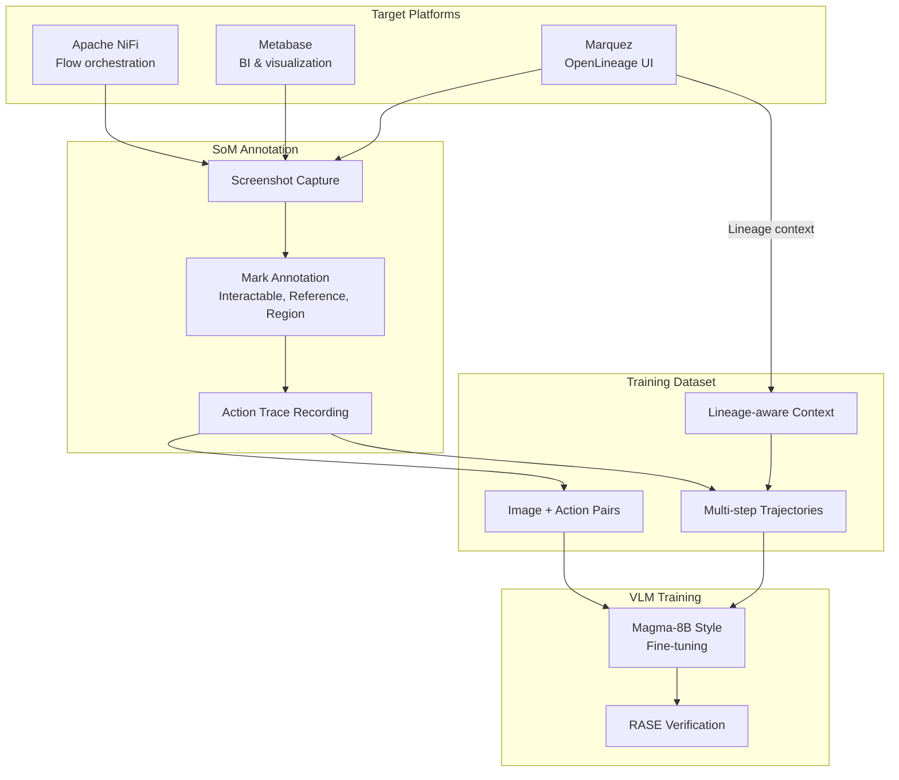
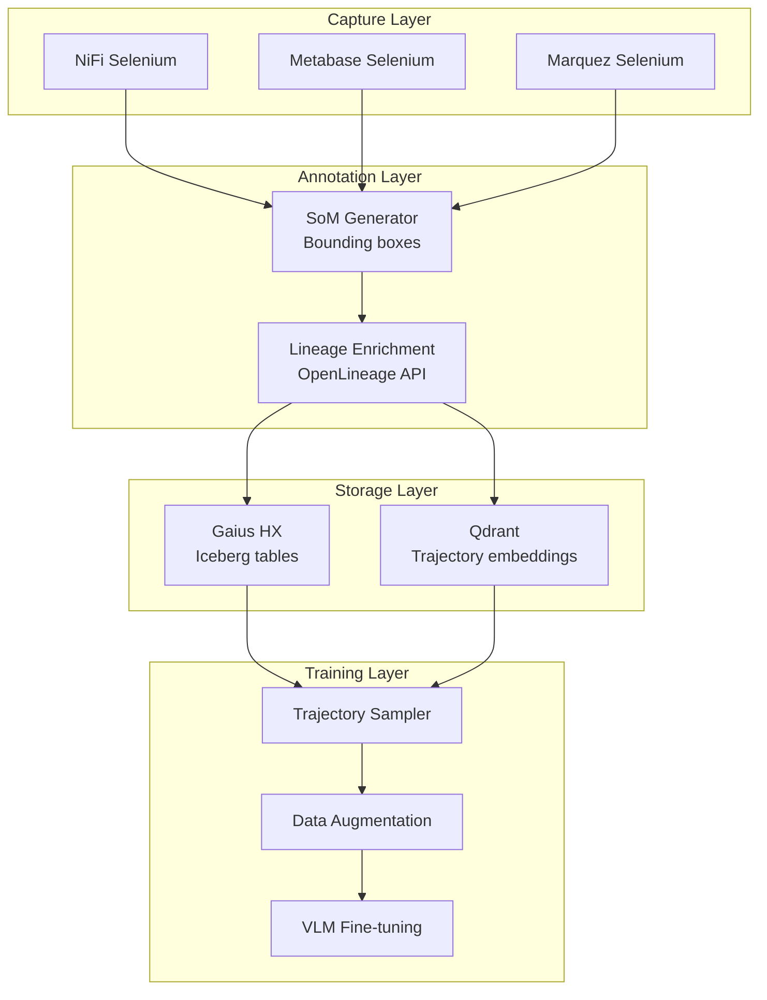
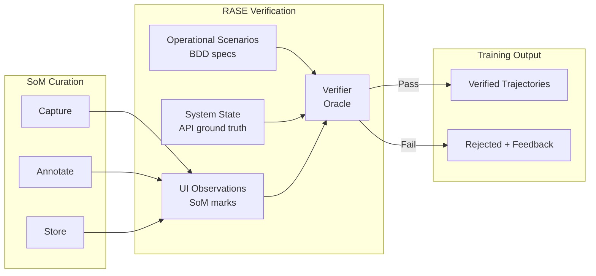

# SoM Dataset Curation

> **Status**: Design Draft
> **Last Updated**: 2026-01-17

---

## Overview

Expanding Magma-8B-style Set-of-Mark (SoM) dataset curation beyond NiFi to include Metabase and Marquez for comprehensive UI automation training across the data platform.



---

## Current State: NiFi SoM

The existing NiFi SoM pipeline (see [RASE Framework](./README.md)) captures:

- **Screenshots**: NiFi canvas at various states
- **Marks**: Processors, connections, controller services annotated with bounding boxes
- **Actions**: Create processor, configure property, start/stop, create connection
- **Traces**: Multi-step flow creation trajectories

```python
# Existing NiFi SoM structure
@dataclass
class NiFiScreenshotWithSoM:
    image: bytes
    marks: list[Mark]  # Bounding boxes with labels
    nifi_state: NiFiInstance  # Ground truth from API
    action: Optional[Action]  # What action was taken
```

---

## Expansion: Metabase

### Why Metabase?

Metabase represents a different UI paradigm from NiFi:
- **Query building**: SQL construction via visual interface
- **Visualization**: Chart type selection, formatting, drill-down
- **Dashboard composition**: Layout, filters, interactivity
- **Data exploration**: Schema browsing, sample data, relationships

### SoM Categories for Metabase

| Category | Elements | Example Marks |
|----------|----------|---------------|
| **Query** | Tables, columns, joins, filters | `table:orders`, `column:created_at`, `join:users` |
| **Visualization** | Chart types, axes, legends | `chart:bar`, `axis:x`, `legend:category` |
| **Dashboard** | Cards, filters, layout zones | `card:revenue`, `filter:date_range`, `zone:header` |
| **Navigation** | Collections, saved questions, models | `collection:sales`, `question:monthly_revenue` |

### Metabase Action Space

```python
class MetabaseAction(Enum):
    # Query building
    SELECT_TABLE = "select_table"
    ADD_COLUMN = "add_column"
    ADD_FILTER = "add_filter"
    ADD_JOIN = "add_join"
    ADD_AGGREGATION = "add_aggregation"
    ADD_GROUPING = "add_grouping"

    # Visualization
    CHANGE_CHART_TYPE = "change_chart_type"
    CONFIGURE_AXIS = "configure_axis"
    SET_COLOR = "set_color"
    ADD_TREND_LINE = "add_trend_line"

    # Dashboard
    ADD_CARD = "add_card"
    RESIZE_CARD = "resize_card"
    ADD_FILTER_WIDGET = "add_filter_widget"
    LINK_FILTER = "link_filter"

    # Navigation
    OPEN_COLLECTION = "open_collection"
    SAVE_QUESTION = "save_question"
    CREATE_MODEL = "create_model"
```

### Metabase Scenarios

```gherkin
Feature: Metabase SoM dataset generation

  Scenario: Capture query building trajectory
    Given a Metabase instance with sample database
    When the agent builds a query:
      | Step | Action         | Target              |
      | 1    | SELECT_TABLE   | orders              |
      | 2    | ADD_COLUMN     | created_at          |
      | 3    | ADD_COLUMN     | total               |
      | 4    | ADD_FILTER     | created_at > 30days |
      | 5    | ADD_AGGREGATION| SUM(total)          |
      | 6    | ADD_GROUPING   | DATE(created_at)    |
    Then each step should capture:
      | Artifact       | Content                          |
      | screenshot     | Current Metabase UI state        |
      | marks          | All interactive elements         |
      | action         | The action taken                 |
      | query_state    | Current query JSON from API      |

  Scenario: Capture visualization configuration
    Given a query result is displayed
    When the agent configures visualization:
      | Step | Action            | Parameters           |
      | 1    | CHANGE_CHART_TYPE | bar                  |
      | 2    | CONFIGURE_AXIS    | x=date, y=sum_total  |
      | 3    | SET_COLOR         | palette=categorical  |
    Then the trajectory should link to the source query
    And include before/after visualization states
```

---

## Expansion: Marquez (OpenLineage)

### Why Marquez?

Marquez provides the **lineage dimension** that connects NiFi flows, Metabase queries, and all data transformations:

- **Job lineage**: Which jobs produce/consume which datasets
- **Dataset versioning**: Schema evolution over time
- **Run history**: Execution details, durations, failures
- **Impact analysis**: What downstream depends on this dataset?

### Lineage-Aware SoM

The key innovation: **SoM annotations include lineage context**.

```python
@dataclass
class LineageAwareMark(Mark):
    """Mark with OpenLineage context."""

    # Standard SoM fields
    bbox: BoundingBox
    label: str
    element_type: str

    # Lineage context
    openlineage_ref: Optional[OpenLineageRef]
    upstream_datasets: list[str]
    downstream_datasets: list[str]
    last_run_status: Optional[RunStatus]
```

### Marquez SoM Categories

| Category | Elements | Lineage Context |
|----------|----------|-----------------|
| **Jobs** | Spark, Airflow, NiFi jobs | Input/output datasets, run history |
| **Datasets** | Tables, files, streams | Producing jobs, consuming jobs, schema |
| **Runs** | Execution instances | Duration, status, parent run |
| **Lineage Graph** | DAG visualization | Upstream/downstream paths |

### Marquez Action Space

```python
class MarquezAction(Enum):
    # Navigation
    SEARCH_JOB = "search_job"
    SEARCH_DATASET = "search_dataset"
    OPEN_JOB_DETAIL = "open_job_detail"
    OPEN_DATASET_DETAIL = "open_dataset_detail"

    # Lineage exploration
    EXPAND_UPSTREAM = "expand_upstream"
    EXPAND_DOWNSTREAM = "expand_downstream"
    FILTER_BY_NAMESPACE = "filter_by_namespace"
    FILTER_BY_TIME = "filter_by_time"

    # Analysis
    VIEW_RUN_HISTORY = "view_run_history"
    VIEW_SCHEMA_EVOLUTION = "view_schema_evolution"
    COMPARE_RUNS = "compare_runs"

    # Impact analysis
    TRACE_IMPACT = "trace_impact"
    FIND_ROOT_CAUSE = "find_root_cause"
```

### Cross-Platform Lineage Scenarios

```gherkin
Feature: Lineage-aware SoM across platforms

  Background:
    Given NiFi flow "ingest_orders" produces dataset "raw_orders"
    And Spark job "transform_orders" consumes "raw_orders" and produces "clean_orders"
    And Metabase question "Monthly Revenue" queries "clean_orders"

  Scenario: Capture lineage-connected trajectory
    Given the agent is investigating data freshness
    When the agent traces from Metabase to source:
      | Platform | Action              | Target                    |
      | Metabase | OPEN_QUESTION       | Monthly Revenue           |
      | Metabase | VIEW_QUERY          | (shows clean_orders)      |
      | Marquez  | SEARCH_DATASET      | clean_orders              |
      | Marquez  | EXPAND_UPSTREAM     | (shows transform_orders)  |
      | Marquez  | OPEN_JOB_DETAIL     | transform_orders          |
      | Marquez  | EXPAND_UPSTREAM     | (shows raw_orders)        |
      | Marquez  | OPEN_DATASET_DETAIL | raw_orders                |
      | Marquez  | VIEW_PRODUCING_JOB  | ingest_orders             |
      | NiFi     | OPEN_FLOW           | ingest_orders             |
    Then each step should include:
      | Context              | Value                              |
      | current_platform     | The platform being operated        |
      | lineage_position     | Where in the DAG we are            |
      | upstream_datasets    | What feeds this point              |
      | downstream_datasets  | What depends on this point         |

  Scenario: Impact analysis trajectory
    Given a schema change is proposed for "raw_orders"
    When the agent performs impact analysis:
      | Step | Platform | Action           | Finding                    |
      | 1    | Marquez  | SEARCH_DATASET   | raw_orders                 |
      | 2    | Marquez  | TRACE_IMPACT     | 3 downstream jobs affected |
      | 3    | Marquez  | EXPAND_DOWNSTREAM| transform_orders           |
      | 4    | Marquez  | EXPAND_DOWNSTREAM| clean_orders               |
      | 5    | Metabase | FIND_DEPENDENTS  | 7 questions affected       |
    Then the trajectory should capture the full impact graph
    And marks should include affected status indicators
```

---

## Unified Dataset Schema

### Multi-Platform Trajectory

```python
@dataclass
class MultiPlatformTrajectory:
    """Training trajectory spanning multiple platforms."""

    trajectory_id: str
    intent: str  # Natural language goal

    steps: list[TrajectoryStep]

    # Lineage context for entire trajectory
    datasets_touched: list[OpenLineageDataset]
    jobs_involved: list[OpenLineageJob]
    lineage_subgraph: LineageGraph

    # Verification
    outcome: TrajectoryOutcome
    verification_result: VerificationResult


@dataclass
class TrajectoryStep:
    """Single step in multi-platform trajectory."""

    step_index: int
    platform: Platform  # NIFI, METABASE, MARQUEZ

    # Screenshot with SoM
    screenshot: bytes
    marks: list[Mark]

    # Action taken
    action: Action
    action_params: dict

    # Platform-specific state (API ground truth)
    platform_state: Union[NiFiInstance, MetabaseState, MarquezState]

    # Lineage context at this step
    lineage_context: LineageContext

    # Timing
    timestamp: datetime
    duration_ms: int
```

### Lineage Context

```python
@dataclass
class LineageContext:
    """OpenLineage context for a trajectory step."""

    # Current position in lineage graph
    current_node: Optional[str]  # Job or dataset ID
    node_type: Literal["job", "dataset", "run"]

    # Local neighborhood
    upstream: list[LineageNode]
    downstream: list[LineageNode]

    # Metadata
    namespace: str
    last_updated: datetime

    # For datasets
    schema: Optional[list[SchemaField]]

    # For jobs
    latest_run: Optional[RunSummary]


@dataclass
class LineageNode:
    """Node in lineage graph."""

    id: str
    name: str
    node_type: Literal["job", "dataset"]
    namespace: str

    # OpenLineage facets
    facets: dict
```

---

## Training Pipeline

### Dataset Generation Flow



### Metaflow Pipeline

```python
from metaflow import FlowSpec, step, Parameter, kubernetes

class SoMDatasetCurationFlow(FlowSpec):
    """
    Multi-platform SoM dataset curation with lineage enrichment.
    """

    platforms = Parameter(
        "platforms",
        default="nifi,metabase,marquez",
        help="Comma-separated platforms to capture"
    )

    @step
    def start(self):
        """Initialize capture sessions."""
        self.platform_list = self.platforms.split(",")
        self.next(self.capture_trajectories, foreach="platform_list")

    @kubernetes(cpu=2, memory=4096)
    @step
    def capture_trajectories(self):
        """Capture SoM trajectories for one platform."""
        from gaius.som import PlatformCapture

        platform = self.input
        capture = PlatformCapture(platform)

        self.trajectories = capture.run_scenarios(
            scenario_dir=f"features/som/{platform}"
        )

        self.next(self.enrich_lineage)

    @kubernetes(cpu=2, memory=4096)
    @step
    def enrich_lineage(self):
        """Add OpenLineage context to trajectories."""
        from gaius.som.lineage import LineageEnricher

        enricher = LineageEnricher(marquez_url=os.environ["MARQUEZ_URL"])

        self.enriched = []
        for traj in self.trajectories:
            enriched = enricher.enrich(traj)
            self.enriched.append(enriched)

        self.next(self.join_platforms)

    @step
    def join_platforms(self, inputs):
        """Combine trajectories from all platforms."""
        self.all_trajectories = []
        for inp in inputs:
            self.all_trajectories.extend(inp.enriched)

        self.next(self.store_dataset)

    @kubernetes(cpu=4, memory=8192)
    @step
    def store_dataset(self):
        """Store in HX and index in Qdrant."""
        from gaius.hx import IcebergWriter
        from gaius.inference.search import QdrantIndexer

        # Store trajectories
        writer = IcebergWriter("gaius_hx.som_trajectories")
        writer.write(self.all_trajectories)

        # Index for similarity search
        indexer = QdrantIndexer("som_trajectories")
        indexer.index(self.all_trajectories)

        self.next(self.end)

    @step
    def end(self):
        """Report statistics."""
        print(f"Captured {len(self.all_trajectories)} trajectories")

        by_platform = {}
        for t in self.all_trajectories:
            p = t.steps[0].platform
            by_platform[p] = by_platform.get(p, 0) + 1

        for p, count in by_platform.items():
            print(f"  {p}: {count}")


if __name__ == "__main__":
    SoMDatasetCurationFlow()
```

---

## RASE Integration

SoM dataset curation connects to the [RASE Framework](./README.md) for verification:



### Verification Scenarios

```gherkin
Feature: SoM trajectory verification

  Scenario: Verify NiFi trajectory against API state
    Given a captured NiFi trajectory
    When the verifier compares UI marks to NiFi API state
    Then all processor marks should match API processor list
    And all connection marks should match API connections
    And the action sequence should be reproducible

  Scenario: Verify Metabase trajectory against query API
    Given a captured Metabase query-building trajectory
    When the verifier compares final UI state to Metabase API
    Then the displayed query should match API query definition
    And the visualization config should match API settings

  Scenario: Verify lineage context accuracy
    Given a trajectory with lineage enrichment
    When the verifier queries Marquez API
    Then upstream datasets should match API response
    And downstream datasets should match API response
    And schema information should be current
```

---

## Implementation Roadmap

### Phase 1: Metabase Capture
- [ ] Selenium automation for Metabase UI
- [ ] SoM generator for query builder elements
- [ ] Action space definition and recording
- [ ] BDD scenarios for common query patterns

### Phase 2: Marquez Capture
- [ ] Selenium automation for Marquez UI
- [ ] Lineage graph navigation actions
- [ ] OpenLineage API integration for enrichment
- [ ] Impact analysis trajectory scenarios

### Phase 3: Cross-Platform Trajectories
- [ ] Multi-platform trajectory schema
- [ ] Lineage-connected scenario generation
- [ ] Unified storage in HX (Iceberg)
- [ ] Qdrant indexing for trajectory similarity

### Phase 4: Training Integration
- [ ] Trajectory sampler with lineage awareness
- [ ] Data augmentation strategies
- [ ] VLM fine-tuning pipeline
- [ ] RASE verification integration

---

## References

### Magma-8B Methodology
- Original Magma-8B paper on action-grounded VLM training
- [RASE MBSE Framework](./README.md) - Verification methodology

### OpenLineage
- [OpenLineage Specification](https://openlineage.io/)
- [Marquez Documentation](https://marquezproject.ai/)

### Platforms
- [Apache NiFi](https://nifi.apache.org/)
- [Metabase](https://www.metabase.com/)
