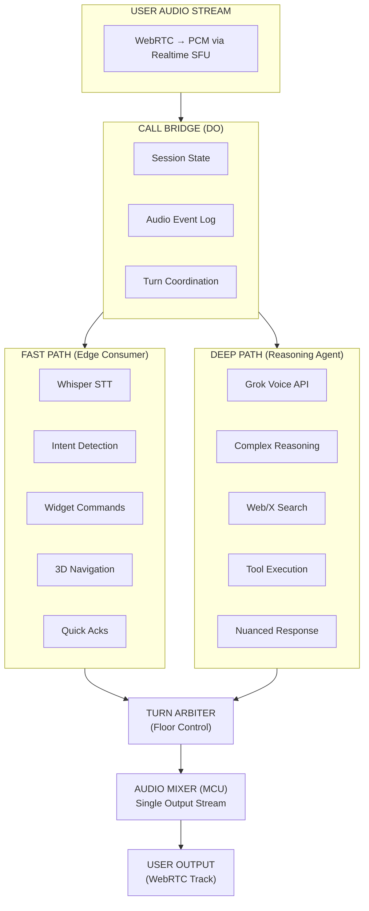
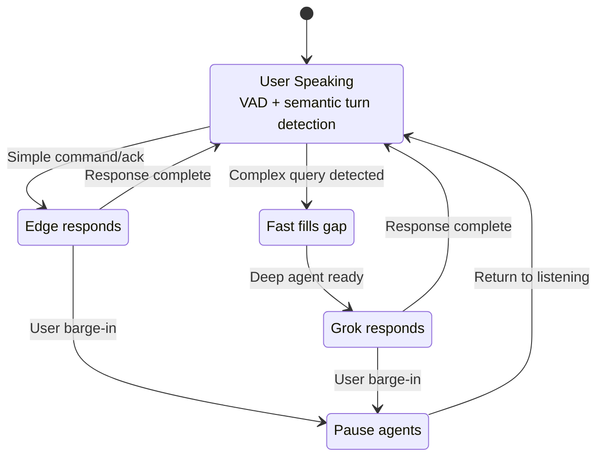
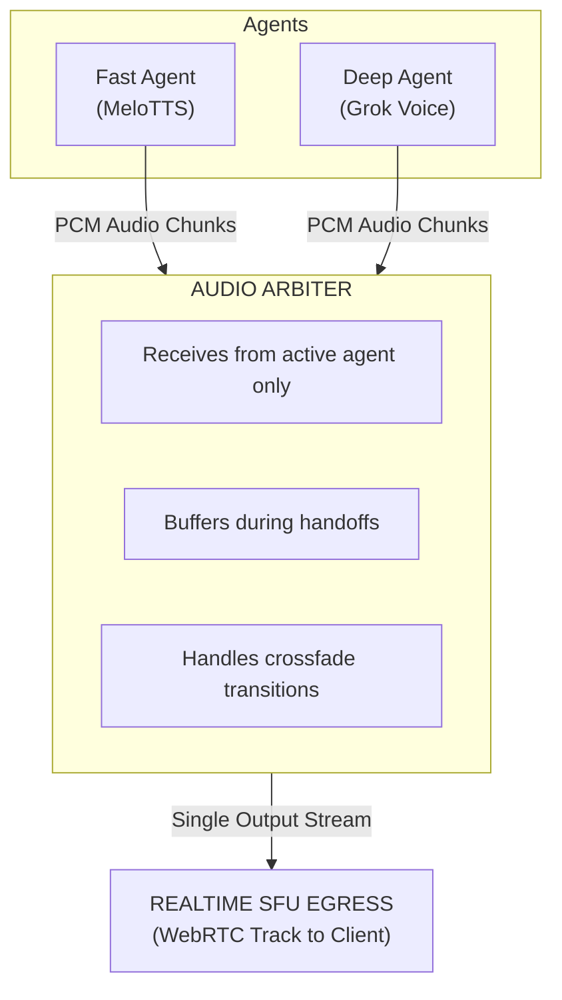
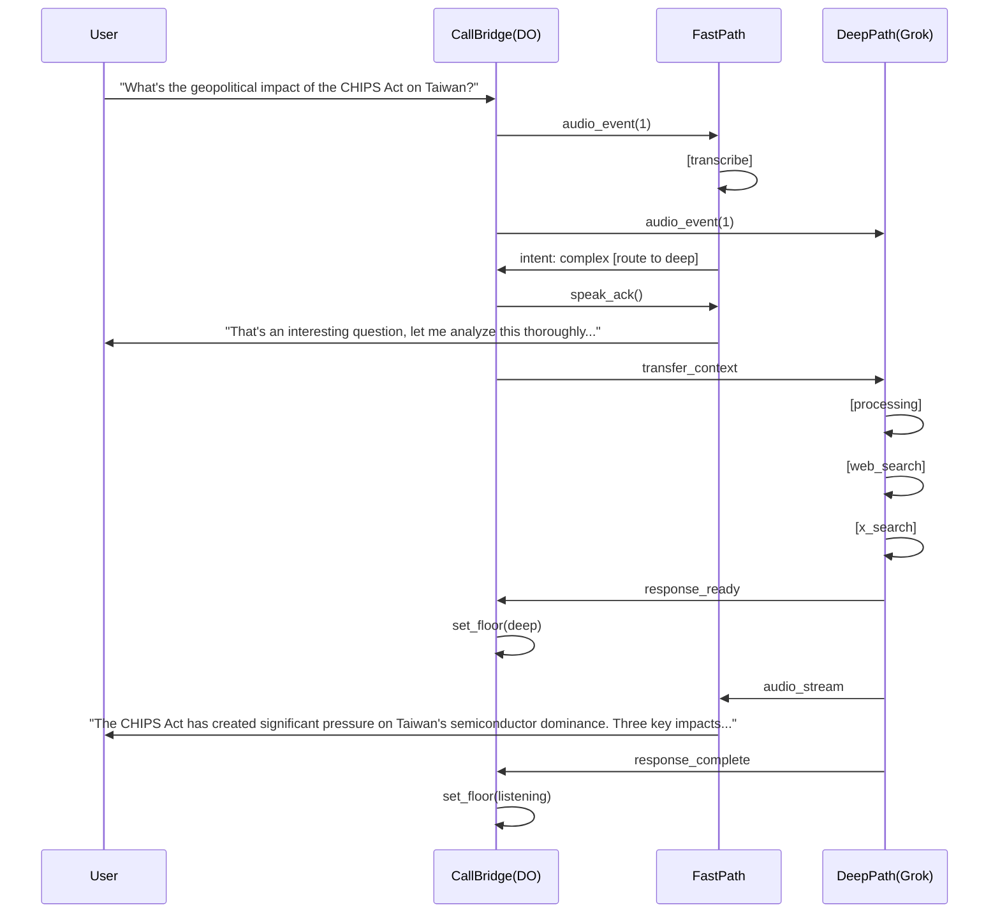

# Gaius-UI Call Bridge: Dual-Agent Voice Architecture

**A kappa-style streaming architecture enables parallel voice processing where a fast edge agent and deep reasoning agent collaborate through a unified call bridge—delivering both instant responsiveness and sophisticated understanding in real-time voice interactions.**

This architectural extension transforms the Gaius-UI voice system from single-agent to dual-agent processing. The core insight: by treating the audio stream as an immutable event log feeding multiple consumers in parallel (kappa pattern), users get immediate feedback from edge inference while simultaneously receiving deeper, more nuanced responses from a reasoning-focused agent.  The call bridge pattern from telephony provides the coordination model for preventing audio collisions and maintaining conversational coherence.

## Architectural overview and kappa foundation

The architecture implements a **single-stream, dual-consumer** pattern borrowed from kappa event sourcing. Unlike lambda architectures with separate batch and speed layers, kappa treats all data as a continuous stream with multiple independent consumers— perfect for voice where the same audio must feed both immediate response and deep analysis paths simultaneously.



**Why kappa over lambda for voice**: Lambda architecture's batch layer introduces inherent delays—unacceptable for conversational voice requiring sub-500ms response times. Kappa's single processing path with multiple consumers achieves both low latency (edge path) and deep analysis (reasoning path) without architectural complexity of merging speed and batch views.

## Component responsibilities

### The Call Bridge Coordinator (Durable Object)

The call bridge serves as the central orchestration layer—a concept borrowed from telephony conference bridges where a server manages multi-party audio mixing and routing.  Implemented as a **Cloudflare Durable Object**, it provides:

**Session Management**: Each voice session gets a dedicated DO instance, ensuring single-threaded coordination without distributed locking. The DO maintains conversation state, participant metadata, and the canonical audio event log.

**Audio Event Log**: All incoming audio chunks are appended to an immutable log with sequence numbers and timestamps. This enables replay, recovery, and ensures both consumers process the same ordered stream.

**Turn Arbitration**: Implements token-based floor control preventing agents from talking over each other. Only one agent holds "speaking rights" at any moment, with explicit handoff mechanisms.

```javascript
class CallBridgeDO extends DurableObject {
  state = {
    sessionId: null,
    conversationHistory: [],
    activeAgent: 'fast',  // 'fast' | 'deep' | 'user'
    pendingDeepResponse: null,
    audioEventLog: [],
    sequenceNumber: 0,
    turnState: 'listening'  // 'listening' | 'fast_speaking' | 'deep_speaking'
  };

  async handleAudioChunk(chunk) {
    const event = {
      seq: this.state.sequenceNumber++,
      timestamp: Date.now(),
      audio: chunk,
      processed: { fast: false, deep: false }
    };
    this.state.audioEventLog.push(event);

    // Fan out to both consumers (non-blocking)
    await Promise.all([
      this.routeToFastPath(event),
      this.routeToDeepPath(event)
    ]);
  }
}
```

### Fast Path: Edge-Native Immediate Response

The fast path delivers **sub-300ms perceived responsiveness** using Cloudflare's edge infrastructure. Its role: handle commands, provide acknowledgments, and maintain conversational flow while the deep agent reasons.

**Components**:

- **Whisper STT** (`@cf/openai/whisper-large-v3-turbo`): Transcription at edge, ~$0.0005/minute
- **Smart Turn Detection** (`@cf/pipecat-ai/smart-turn-v2`): Detects utterance completion vs natural pauses
- **Intent Classification**: Lightweight LLM (`@cf/meta/llama-3.1-8b-instruct`) for routing decisions
- **MeloTTS** (`@cf/myshell-ai/melotts`): Quick acknowledgment synthesis

**Handles without deep path**:

- UI widget commands ("show the weather panel")
- 3D projection navigation ("rotate left", "zoom in")
- Simple acknowledgments ("got it", "one moment")
- Clarifying questions ("did you mean X or Y?")
- Turn-taking cues ("mm-hmm", "I see")

**Latency Budget**:

| Stage                 | Target    | Actual        |
|-----------------------|-----------|---------------|
| Audio ingestion       | 40ms      | 30-50ms       |
| Whisper transcription | 300ms     | 200-400ms     |
| Intent classification | 100ms     | 50-150ms      |
| TTS synthesis         | 150ms     | 100-200ms     |
| **Total**             | **590ms** | **380-800ms** |

### Deep Path: Grok Voice Agent for Sophisticated Reasoning

The deep path leverages **xAI's Grok Voice Agent API** (launched December 2025) as a parallel reasoning engine. Grok's architecture is uniquely suited for this role: it's a native speech-to-speech model (#1 on Big Bench Audio) rather than a chained STT→LLM→TTS pipeline, preserving paralinguistic context like tone and emotion.

**Connection**: WebSocket at `wss://api.x.ai/v1/realtime` with base64-encoded PCM audio.  OpenAI Realtime API-compatible for easier integration.

**Capabilities**:

- Native audio understanding (not transcription-first)
- Real-time web and X (Twitter) search during conversation
- Tool calling for database queries, API integrations
- Function execution mid-conversation
- **Sub-1-second time-to-first-audio** (~780ms average, 5x faster than GPT-4o Realtime)

**Pricing**: Flat $0.05/minute of connection time (significantly simpler than token-based pricing).

**Configuration for Deep Agent**:

```json
{
  "type": "session.update",
  "session": {
    "voice": "Rex",
    "instructions": "You are the deep reasoning agent in a dual-agent system. The fast agent handles quick commands; you handle complex analysis, research, and nuanced responses. When you speak, provide substantive insights the fast agent cannot. You have access to web search and X search for current information.",
    "audio": {
      "input": { "format": { "type": "audio/pcm", "rate": 16000 } },
      "output": { "format": { "type": "audio/pcm", "rate": 16000 } }
    },
    "tools": [
      { "type": "web_search" },
      { "type": "x_search" },
      { "type": "function", "name": "search_knowledge_base" }
    ]
  }
}
```

## Turn management and agent coordination

The most critical design challenge: **preventing agents from talking over each other** while maintaining natural conversation flow. The architecture implements a state machine with explicit turn ownership.

### Turn State Machine



### Handoff Protocol

When the fast agent determines a query requires deep reasoning, it executes a **warm handoff**:

1. **Fast agent acknowledges**: "Let me think about that more carefully…"
1. **Floor transfers to deep agent**: `activeAgent: 'deep'`
1. **Context packet sent to deep path**: Conversation history, detected intent, relevant entities
1. **Deep agent responds** with synthesized audio
1. **Floor returns to listening state**

```javascript
async handleDeepHandoff(context) {
  // Fast agent speaks handoff phrase
  await this.speakFast("Let me look into that for you...");

  // Transfer context to deep agent
  const contextPacket = {
    conversationHistory: this.state.conversationHistory.slice(-10),
    currentIntent: context.intent,
    entities: context.entities,
    userSentiment: context.sentiment
  };

  // Update floor control
  this.state.activeAgent = 'deep';
  this.state.turnState = 'deep_thinking';

  // Deep agent processes in background
  // WebSocket message triggers when response ready
}
```

### Barge-In Handling

Both agents support **user interruption**. When VAD detects user speech during agent output:

1. Active agent receives `interrupt` event
1. Audio output immediately stops
1. Floor control returns to `listening`
1. Partial agent response logged to history
1. New user utterance processed from beginning

## Audio routing and mixing

The architecture uses an **MCU (Multipoint Control Unit) pattern** for audio output. Unlike SFU where clients receive multiple streams, MCU mixes all outputs into a single stream—  ensuring only one voice reaches the user at any moment.

### Audio Flow



**Key principle**: Only the agent with floor control has its audio routed to the mixer. The arbiter maintains a small buffer (50-100ms) to enable smooth crossfades during handoffs.

### Client-Side Indication

The A2UI (Agent-to-User Interface) surface indicates agent state through visual and audio cues:

| Agent State   | Visual Indicator       | Audio Cue                  |
|---------------|------------------------|----------------------------|
| Fast thinking | Quick pulse animation  | (none)                     |
| Fast speaking | Blue waveform          | Agent voice (higher pitch) |
| Deep thinking | Slow orbital animation | Subtle ambient tone        |
| Deep speaking | Purple waveform        | Agent voice (lower pitch)  |
| Handoff       | Transition animation   | Brief chime                |

## Sequence diagram: Complex query flow



## Implementation patterns

### Durable Object with WebSocket Hibernation

For cost efficiency, the Call Bridge DO uses **WebSocket hibernation**—connections stay open at Cloudflare's edge while the DO sleeps, waking only on messages.

```javascript
export class CallBridgeDO extends DurableObject {
  constructor(ctx, env) {
    super(ctx, env);
    this.env = env;
  }

  async fetch(request) {
    const url = new URL(request.url);

    if (url.pathname === '/websocket') {
      const [client, server] = Object.values(new WebSocketPair());

      // Accept with hibernation enabled
      this.ctx.acceptWebSocket(server, ['session-' + crypto.randomUUID()]);

      // Initialize session state
      server.serializeAttachment({
        sessionId: url.searchParams.get('session'),
        connectedAt: Date.now(),
        activeAgent: 'fast'
      });

      return new Response(null, { status: 101, webSocket: client });
    }
  }

  async webSocketMessage(ws, message) {
    const state = ws.deserializeAttachment();

    if (typeof message === 'string') {
      const event = JSON.parse(message);
      await this.handleControlMessage(ws, event, state);
    } else {
      // Binary audio data
      await this.handleAudioChunk(ws, message, state);
    }
  }

  async handleAudioChunk(ws, audioData, state) {
    const chunk = {
      seq: (await this.ctx.storage.get('seq') || 0) + 1,
      timestamp: Date.now(),
      audio: audioData
    };
    await this.ctx.storage.put('seq', chunk.seq);

    // Fan out to both paths (non-blocking)
    const fastPromise = this.routeToFastPath(chunk, state);
    const deepPromise = this.routeToDeepPath(chunk, state);

    await Promise.all([fastPromise, deepPromise]);
  }
}
```

### Grok Integration via LiveKit Bridge

For production deployments, **LiveKit** provides the cleanest integration path—it handles WebRTC-to-WebSocket bridging and includes native Grok plugin support.

```python
from livekit.agents import AgentSession, Agent
from livekit.plugins import xai, openai, silero

class DeepReasoningAgent(Agent):
    def __init__(self):
        super().__init__(
            instructions="""You are the deep reasoning agent in a dual-agent
            voice system. Provide substantive analysis and insights. You have
            access to web search and X search for current information."""
        )

async def entrypoint(ctx):
    # Deep agent using Grok
    deep_session = AgentSession(
        llm=xai.realtime.RealtimeModel(
            voice="Rex",
            model="grok-2-voice-preview"
        )
    )

    # Start with turn detection
    await deep_session.start(
        room=ctx.room,
        agent=DeepReasoningAgent()
    )
```

### Event Bus for Fast-Deep Coordination

The Call Bridge DO maintains an internal event bus for coordinating between paths:

```javascript
// Event types for coordination
const Events = {
  TRANSCRIPT_READY: 'transcript_ready',
  INTENT_CLASSIFIED: 'intent_classified',
  FAST_RESPONSE_READY: 'fast_response_ready',
  DEEP_RESPONSE_READY: 'deep_response_ready',
  HANDOFF_REQUESTED: 'handoff_requested',
  FLOOR_TRANSFERRED: 'floor_transferred',
  USER_INTERRUPTED: 'user_interrupted'
};

async emit(event, payload) {
  const handlers = this.eventHandlers.get(event) || [];
  await Promise.all(handlers.map(h => h(payload)));

  // Log to event store for replay/debugging
  await this.ctx.storage.put(`event:${Date.now()}`, { event, payload });
}
```

## Key design decisions

### Decision 1: MCU over SFU for agent output

**Choice**: Server-side audio mixing (MCU pattern) rather than client-managed multi-stream (SFU).

**Rationale**: With only two agent outputs (never simultaneous), MCU simplifies client implementation. The Call Bridge already has floor control logic—extending it to audio routing is natural. SFU's bandwidth efficiency gains are irrelevant for single-output scenarios.

**Trade-off**: Slightly higher server-side processing, but enables perfect turn coordination.

### Decision 2: Grok for deep path over alternatives

**Choice**: xAI Grok Voice Agent API as deep reasoning engine.

**Rationale**:

- **Best audio reasoning** (#1 Big Bench Audio)
- **Lowest latency** (~780ms TTFA vs 1.49s GPT-4o)
- **Native speech-to-speech** (preserves paralinguistic context)
- **Built-in tools** (web search, X search)
- **OpenAI API-compatible** (easy migration path)

**Trade-off**: Higher cost ($0.05/min) than Gemini Flash, but justified by quality and latency for reasoning-heavy path.

### Decision 3: Explicit handoff over automatic routing

**Choice**: Fast agent explicitly acknowledges before handoff rather than silently routing to deep agent.

**Rationale**: User research on multi-agent voice systems shows users build mental models of agent capabilities. Explicit handoff ("Let me think about that more carefully…") sets expectations and makes the dual-agent nature coherent rather than confusing.

**Trade-off**: Adds ~500ms to complex query responses, but significantly improves perceived coherence.

### Decision 4: Durable Object as coordination primitive

**Choice**: Single Durable Object per session rather than distributed coordination.

**Rationale**: Voice sessions require strong consistency—turn state, floor control, and sequence ordering cannot tolerate eventual consistency. DO's single-threaded model eliminates distributed locking complexity.  Hibernation API keeps costs manageable for long sessions.

**Trade-off**: Geographic pinning means slightly higher latency if user moves during session, but voice sessions are typically short.

## Latency budget and target metrics

| Metric             | Target | Acceptable | Strategy            |
|--------------------|--------|------------|---------------------|
| Fast path E2E      | 300ms  | 500ms      | Edge inference only |
| Deep path TTFA     | 800ms  | 1200ms     | Grok streaming      |
| Handoff transition | 400ms  | 700ms      | Pre-buffered ack    |
| Barge-in response  | 100ms  | 200ms      | VAD at edge         |
| Floor transfer     | 50ms   | 100ms      | DO state update     |

**End-to-end targets**:

- Simple command: **< 500ms** (fast path only)
- Complex query with handoff: **< 2000ms** to first substantive audio
- User perception: **Immediate acknowledgment, then thoughtful response**

## Future extensions

**Persona differentiation**: Assign distinct voices and personalities to fast vs deep agents. Fast agent: quick, supportive, task-oriented (higher pitch, faster pace). Deep agent: thoughtful, analytical, comprehensive (lower pitch, measured pace).

**Proactive deep agent**: Deep path monitors conversation in background, can "interject" when it has relevant insight—implementing polite interruption protocols.

**Multi-user call bridge**: Extend architecture to 2+ humans + 2 agents, implementing full conference bridge semantics with speaker identification.

**Transcript-based context compression**: For long sessions, implement sliding window + summarization to manage context size for both agents.

-----

This architecture transforms Gaius-UI from single-agent voice interaction to a coherent dual-agent system. The kappa-style streaming foundation ensures both agents process identical audio streams  while the call bridge pattern from telephony provides proven coordination semantics. Users experience the best of both worlds: instant edge responsiveness and deep reasoning capability, unified through explicit turn management and consistent handoff protocols.
