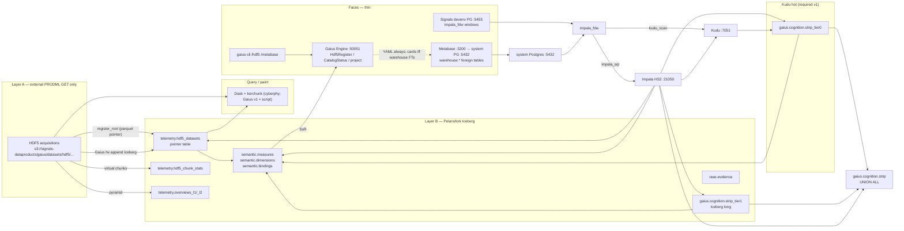
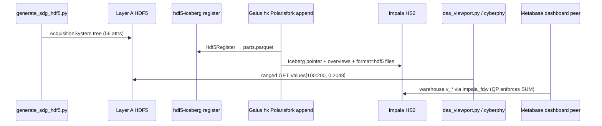

# Semantic Layer for Scientific and Engineering Data (Iceberg + Impala)

| Field | Value |
|-------|--------|
| **Title** | Semantic layer: Iceberg catalog, Impala SQL, impala_fdw, Metabase projection, HDF5 FormatModel |
| **Author** | design-doc-writer (Gaius) |
| **Date** | 2026-08-23 |
| **Status** | Draft (Q4/Q5/Q6 decided; **K2 File Format API in this program** 2026-08-23) |
| **Audience** | Senior engineers on Gaius Engine, Signals warehouse, hdf5_iceberg, cyberphy Navigator, Metabase fork |

---

## Overview

Gaius and Signals already store two very different scientific grains: (1) dense HDF5 acquisitions whose native layout is a 2-D `Values[series × time]` hyperslab (PRODML DAS-shaped; cyberphy's OTel analog is the structural stand-in), and (2) a 10 Hz named-channel strip (`gpu-0..5`, `util-0..5`, `kv`, `run`, `gen-tps`, `prefill`, `clt`, `sae`, `ricci`, `ricci-d`) that is a 200-scalar/s time series, not an HDF5 cube. Neither grain is a Metabase "Number" column. HDF5 is not a drop-in Iceberg format **until this program ships a JVM `FormatModel`** (K2).

This design introduces a **Gaius-owned semantic catalog** (Iceberg tables in Polarisfork) that binds every measure to an SDG OWL / SysML v2 annotation: unit, quantity kind, grain, join keys, and **legal aggregations** (rows in `semantic.aggregations`, not a list column). **Gaius is a Signals project and operates directly on the SDG namespace** (`https://signals.zndx.org/sdg#…`). There is **no special `gaius` IRI prefix**. **Warehouse SQL engine is Impala HS2 `:21050`.** Polarisfork is Iceberg REST catalog only. **`impala_fdw` is enhanced to reach both Kudu and Iceberg** (this initiative **lifts** SPEC G6/N2) and is installed on **three Postgres fronts**: (1) **Signals devenv Postgres `:5455`** (local lab, implement-now); (2) **system Postgres `:5432`** (Metabase); (3) **ElectricSQL PGlite** as an AMP/CAI **SQL-contract** target (Atelier `scripts/pglite-server.mjs` on **`:5440`**; Atelier local devenv PG is **`:5533`** — ports are not interchangeable). **Do not call Signals `:5455` “pglite”** (older Signals docs nickname it that; that identity is wrong here). Metabase uses the **native Postgres driver** over foreign tables — **no v1 Impala JDBC, no v1 Flight SQL**. **Semantic layer = Iceberg catalog + Impala SQL + `impala_fdw` + Metabase projection + HDF5 FormatModel.** DataFusion (`signals-df`) is **logical backup/restore only** — **not** the warehouse engine, **not** Metabase, **not** Engine `/sci`. Do **not** COPY product SoR into any Postgres. **AMP packaging is out of scope.** Because Metabase/Postgres may push `SUM` to Impala, **Metabase QP rejection is mandatory**.

The 10 Hz strip is a Signals-shaped warehouse product: **write hot ticks to Kudu `*_tier0` from day one**, settle to Iceberg `*_tier1` after verify, Metabase sees **`strip = strip_tier0 UNION ALL strip_tier1`**. Impala already scans Iceberg Parquet HMS-free (`CREATE TABLE … STORED AS ICEBERG` + Polarisfork REST). **No Spark cluster. No DataFusion warehouse SQL.**

HDF5 Iceberg has **functional parity in three languages** (same analog, read **and** write). Types must not be confused:

- **Python `hdf5_iceberg`** — complete library (read **and write**): SysML/SDG audit, K20 Dask hyperslabs, warehouse-owned HDF5 write, register external Layer A. Datashader consumes the dataframe. **Not** a JVM `FormatModel`.
- **JVM** `Hdf5IcebergFormatModel` — File Format API on Impala (`ReadBuilder` **and** `DataWriteBuilder`). Pure Java from SHA (K21). **No JNI** on Impala. CISD is **`jni-baseline` only**, always compiled.
- **Rust** — `signals-df` DataFusion **TableProvider** (K23) is **how** Rust gets that parity. Required, not “if someone happens to run signals-df.” Impala remains warehouse SQL. Dashboard remains Metabase/FDW. **No `/sci`.**

**Where the File Format API extension lives:**

| Stage | Home |
|-------|------|
| **Develop** | Signals Iceberg fork: `wxs/signals/components/iceberg` and/or `cldr/signals/components/iceberg` (already has `FormatModelRegistry`). Module `org.apache.iceberg.hdf5.Hdf5IcebergFormatModel`. |
| **Runtime** | Shade/register into **Impala** `impala-iceberg-runtime` (`components/impala/java/pom.xml` `IMPALA_ICEBERG_VERSION`) so **catalogd/impalad** scan `format=hdf5` data files. **This is the production home of the reader.** Impala already does Parquet Iceberg SELECT HMS-free + Polarisfork REST — HDF5 needs **only** this FormatModel on that classpath, not Spark, not DataFusion. |
| **Extract (Comet)** | `packages/iceberg-hdf5` own repo when complete; Iceberg fork keeps `FileFormat.HDF5` + register hook. |
| **Not** | Gaius `thirdparty/`; Spark jobs; DataFusion. Python completeness is **`hdf5_iceberg`**, not a JVM FormatModel. |

Spark Iceberg modules (e.g. FormatModel benchmarks under `spark/v3.4`) are **upstream Iceberg**, not a Signals Spark cluster. **Do not run Spark** to query Iceberg or HDF5 in this program. Any Iceberg 1.11 Java engine could register the same FormatModel later — **not in devenv, not in the PR plan, not on this program’s classpath.**

Pointer-table + Parquet overviews are **optional acceleration / stats**, not the Python end state. Do **not** delete them; do **not** treat them as the Python target. **Fail `#SL.00000016.HDF5PARITY`** if **any** of Java / Python / Rust cannot open a file another can (same analog). Round-trip: write on **one** stack → Iceberg snapshot → read on the **other two**.

---

## Background & Motivation

### Current state (verified)

| Piece | What exists today | Gap |
|-------|-------------------|-----|
| **Polarisfork Iceberg** | Gaius HX catalog is REST `http://127.0.0.1:8181/api/catalog`, catalog `signals`, warehouse `s3://signals-dataproducts/iceberg` (`src/gaius/hx/catalog.py`, `src/gaius/hx/config.py`). Polarisfork is `signals-polaris.service` on `signals.target`, **not** a Gaius process. `#HX.00000002.NOPOLARIS` if `:8181` is down. | No scientific semantic catalog; `rase.evidence` is the only first-class Iceberg schema in Gaius (`src/gaius/hx/evidence_tables.py`). |
| **Federation data products** | Signals owns `details` / `tx` / Impala views / Kudu→Iceberg settle. Peers write facts, not a second warehouse (`external/signals-protocol/specification/protocol/data_products.md`). | 10 Hz strip and DAS HDF5 are not yet products with semantic bindings. |
| **Impala HS2 + `impala_fdw`** | Today: Signals **devenv Postgres `:5455`** `--impala_fdw--> Impala :21050 --> Kudu :7051`. `ImpalaWarehouse` is “Live Iceberg via Impala HS2.” SPEC **G6/N2 currently forbid Iceberg in the FDW**. Metabase speaks Postgres (`:5432`). **PGlite** is ElectricSQL WASM/Node (`atelier/scripts/pglite-server.mjs`, CAI **`:5440`**); Atelier devenv PG is **`:5533`**. Older Signals docs nickname `:5455` “pglite” (`governance-scale-plane.md`) — **do not treat that as identity**. | Lift G6/N2. v1 FDW on devenv `:5455` + system `:5432`. PGlite is a **SQL-contract** target; stock PGlite does not load PGXS `.so`. S3A → RustFS is ops. |
| **hdf5_iceberg** | Standalone package at `/home/rch/local/src/cldr/cybersec/packages/hdf5_iceberg/` (import `hdf5_iceberg`; **not** in cyberphy). Public API: `DatasetProvider`, `MetadataProvider`, `register_root`; CLI `hdf5-iceberg register`. Layer A GET-only; Layer B writes under a warehouse prefix. Semantic stubs emit Turtle + SHACL-Core (`sci:AcquisitionProduct`), kvasir-friendly, not JSON-LD. | Pointer table today is a **single Parquet file** (`telemetry/hdf5_datasets/parts.parquet`), not Polarisfork Iceberg. `audit.py` hard-codes OTel names. **This program completes the shared package** (SysML/SDG audit, kerchunk, overviews, virtual-block defaults, Dask read path). Polarisfork Iceberg append stays in Gaius `hx`. |
| **cyberphy analog** | `zarf/scripts/generate_hdf5.py` + `zarf/scripts/HDF5_OTEL_SCHEMA.md`: depth 4 · 7 groups · 5 datasets · 56 attributes. Navigator: viewport → `Values[series_lo:series_hi, t_lo:t_hi]` → datashader; kerchunk ranged GETs. Design #42: `docs/current/src/architecture/hdf5-iceberg-metadata-plane.md`. Dask: `cybersec/engine/dask_backend.py` (`_active_dataset.json`). Iceberg writes there are PyIceberg → **Parquet**. `thirdparty/iceberg` submodule is recorded and **not checked out**. | Analog is OTel-framed, not SysML v2 / SDG. No production `.h5` samples in cyberphy/cybersec except h5py tests. |
| **signals-df** | `/home/rch/local/src/wxs/signals/crates/signals-df`: DataFusion **50**; **logical backup/restore** (Parquet + JSON manifests); SQL over `service__table` names. | **Stays backup/restore.** Not warehouse SQL, not Metabase, not Engine `/sci`. Do not pin `iceberg-datafusion`. |
| **Impala Iceberg Java** | HMS-free `CREATE TABLE … STORED AS ICEBERG` + Polarisfork REST. `impala-iceberg-runtime` (`IMPALA_ICEBERG_VERSION`). Parquet Iceberg SELECT is already an **Impala** path (`query-engine.md`, `components/impala.md`). | HDF5 Iceberg files need **FormatModel on Impala’s Iceberg classpath** — not a second query engine. |
| **Metabase** | Gaius CLI `/metabase models` = "List all models (semantic layer)" (`src/gaius/cli.py`, `src/gaius/engine/services/metabase_sync.py`). Local Gaius Metabase `:3100` is **not** the federation `dashboard`. AGPL fork is capability `dashboard` on `:3200` / gRPC `:50451`. Bootstrap `apply_semantics` maps SDG associations → `semantic_type` via heuristics (`src/mbengine/bootstrap/semantics.py`). Native types in `src/metabase/types/core.cljc` are BI (`:type/Quantity`, `:type/Currency`, `:type/Score`, `:type/Duration`). | Heuristic name matching. No units, grain, or aggregation legality. No scientific types. Models today wrap `meta.*` Postgres views, not Iceberg. |
| **Ontologies** | `src/gaius/data/ontologies/gaius_domain.owl` is **AI/ML classes** (Transformer, LLM, …) for BERTSubs — **not** DAS/device. Grounding ontology is **SDG OWL** `external/sdg-corpora/ontology/sdg-ontology.owl` (BFO/CCO, IRI `https://signals.zndx.org/sdg#`). SKOS: `external/sdg-corpora/vocabulary/domain-concepts.ttl` — top concepts include `PRODML` and `SYSML`. Ruling (2026-07-23): PRODML and SYSML enter SDG as mapped ontology entities; **HDF5 files structured to both specs are in the downstream analytical queue**. `SdgCatalog` (`src/gaius/engine/services/sdg_catalog.py`) currently loads `vocabulary/annotations.csv` only (`#SDG.00000001.NOCORPORA`). | No binding from HDF5 groups / Iceberg columns → `sdg:ProdmlDasAcquisition` / `sdg:SysmlPartDefinition`. |
| **RASE / SysML v2** | `src/gaius/rase/`: OSM/SSM/UOM/VM. SSM parts (`part def Processor`, `part def ProcessorGroup`) in `src/gaius/rase/ssm/nifi.py`. `TraceableId` schemes: bdd, otel, nifi, metaflow, rase, som, tom — **no `sdg` scheme**. Evidence already Iceberg (`rase.evidence`). | No SSM for acquisition systems / fiber / interrogator. |
| **10 Hz strip** | `waterfall_drivers.py` + `cognition_waterfall.py`: 10 Hz, 20 named channels. **`Sample.value` is paint-normalized** (`[-1,1]`): `gpu-*` is `pack_gpu(_power_signed(watts), util)`, `util-*` is util/100, `gen-tps`/`prefill` are `log1p(rate)/log1p(cap)`, `run` is 0/1 occupancy, Ricci is `_clip`'d. `_record_hardware` keeps raw watts only as a 1-minute Kumo average, not a 10 Hz series. Ring 60 s × 10 × 20 = 12 000 cells. | Warehouse must **not** ingest `sample_column`. Need a parallel unpack path from DCGM/vLLM/Ricci raw values. Ricci `SUM` is silently legal in any SQL engine today. |

### Pain points

1. **Two planes, no shared meaning.** Dask can raster a DAS cube; Impala can `SUM` a Parquet column; Metabase will call it `type/Quantity`. None of them know that Ricci curvature is intensive or that DAS `Values` are int16 counts with a scale and a locus grain.
2. **HDF5 is not Parquet.** Registering `.h5` paths in a **Parquet** Iceberg table would crash Impala. The honest JVM path is a real `FormatModel` on **Impala’s** Iceberg classpath (K2). Until then, DAS SQL is Parquet **overviews** + pointer table.
3. **Wrong ontology is the easy mistake.** `gaius_domain.owl` looks like "the Gaius ontology" and is the wrong graph for device/DAS data.
4. **Metabase models today are BI wrappers.** `/metabase models` lists cards of type `"model"` over `meta.*` views. Scientific inspection needs units, grain, and IRIs **in the field sidebar**, not a description paragraph after the fact.

---

## Goals & Non-Goals

**Design law (K22):** Comments that something is incomplete, a façade, “until later,” or a workaround are **debt**, not product requirements. Understand implementations **as they are**. Do **not** treat incomplete or worked-around code as the **correct** target and carry the gap forward as intent. **Forbidden.**

**Two contracts (do not collapse):**

| | What |
|--|------|
| **Deployment mode (first instance)** | Existing **PRODML/SysML HDF5 already written** (Layer A). **Read** those files; **maintain Iceberg metadata** (register `DataFile`s, snapshots, pointer/stats). `readonly` for **external** URIs. |
| **Library contract** | **Full Iceberg HDF5 read and write in Java, Python, and Rust.** Java = File Format API (`ReadBuilder` + `DataWriteBuilder`). Python = `hdf5_iceberg`. Rust = DataFusion TableProvider in `signals-df` (K23). Splits = K20. Downstream creates Iceberg tables whose data files **are** HDF5. |

Gaius/Signals **Kudu + HDF5-Iceberg** is the **first instance** where this parity is expected. Do not freeze “Layer A conservation / no rewrite / write not needed” as the FormatModel spec because the first well already has PRODML files.

### Goals

1. **Metadata-informed dimensional analysis** via **one catalog**: Dask (paint), Impala SQL (warehouse), Metabase (projection). Join keys, units, grain, legal aggregations from Polarisfork `semantic.*`.
2. **Automatic Metabase semantic mapping** (YAML snapshots always; live models **only** after `impala_fdw` Iceberg FTs exist on system Postgres `:5432`). Fail-fast if a binding cannot be derived.
3. **Full Iceberg HDF5 in Java, Python, and Rust (read and write).** Round-trip analog: write on **one** stack → Iceberg snapshot → read on the **other two** (`#SL.00000016` three-way). Rust parity is **required** (K23 TableProvider), not optional CLI use. Impala remains warehouse SQL. Dashboard = Metabase/FDW. **No `/sci`.** External PRODML remains read+register. Do not explode `Values(N,T)` as Metabase rows (K5).
4. **Second table:** 10 Hz cognition strip as long-grain warehouse from a **parallel unpack path** (not `sample_column`): **Kudu `gaius.cognition.strip_tier0` from day one**, Iceberg `strip_tier1` after settle, logical Impala/PG **`strip = strip_tier0 UNION ALL strip_tier1`**.
5. **Engine-first (no third SQL plane):** `CatalogStatus`, `Hdf5Register`, `ScientificProjectMetabase` on `:50051`. **No Engine `/sci` / `ScientificQuery` / DataFusion subprocess in v1.** If Engine needs SQL, it uses the **same Impala HS2** behind `impala_fdw` (apps: FDW-only / no-JDBC). Aggregation legality: **Metabase QP + per-measure views only**.
6. **`hdf5_iceberg` is a complete Python library** (PR-H1): audit, K20 Dask, Iceberg HDF5 **read and write** (warehouse-owned files under `s3://signals-dataproducts/iceberg/`) **and** register external Layer A files. Same analog CI as PR-J1 **including write round-trip**.
7. **JVM `Hdf5IcebergFormatModel` on Impala:** `ReadBuilder` **and** `DataWriteBuilder`. Pure Java. **No JNI** on Impala. Three-way analog parity (`#SL.00000016`).
8. **Rust HDF5 Iceberg parity via `signals-df` TableProvider (K23).** Required. Impala remains warehouse SQL. Not Engine `/sci`. Not Metabase.

### Non-Goals

- DataFusion as **warehouse** SQL, Engine `/sci`, AnalyzerRule, Metabase-via-DF. **Not** “no HDF5 TableProvider” — Rust Iceberg HDF5 parity is **required** (K23). Do not pin `iceberg-datafusion`. Backup/restore Parquet unchanged.
- A Signals **Spark** cluster, Spark jobs, or Spark on this program’s classpath. Upstream Iceberg `spark/` trees are not product.
- Shipping CISD **jhdf5 JNI** (`libjhdf5.so`) on Impala / Polarisfork for HDF5 **reads**. JNI lives only in the **`jni-baseline` test profile** (appendix).
- Silently falling back to JNI if neither `jhdf` nor `hdf5io` can hyperslab the analog (`#SL.00000014.HDF5DECODE`).
- Replacing Dask/datashader with Impala or DataFusion for raster/viewport work. Production Dask stays **cyberphy**.
- Making Metabase the semantic source of truth.
- **Flight SQL or Impala JDBC as the v1 Metabase warehouse face.** Metabase already speaks Postgres; scientific models use foreign tables on `:5432`.
- **COPY of product SoR into devenv Postgres or Gaius `:5444`.** Foreign tables are windows, not a second warehouse.
- **Calling Signals `:5455` “pglite.”** PGlite is Atelier AMP/CAI (`:5440`); Signals lab PG is devenv `:5455`. AMP packaging is out of scope.
- Standing up a second Iceberg catalog or warehouse in Gaius. Polarisfork is Signals.
- Using `gaius_domain.owl` as DAS/device grounding. Minting SKOS `SYSML_PARAMETRIC`.
- Silent degradation, `fail_fast=` parameters, placeholder dimensions, or packed display floats as warehouse measures.
- Calling any of this a "smoke test". Elevated gates are `*-ci`.
- Publishing internal KB content to the public site. **Do not put measure IRIs on `gaius.zndx.org`.** The namespace is `https://signals.zndx.org/sdg#…`. **Do not freeze** `https://signals.zndx.org/gaius/measure/{name}`.
- Treating lab Metabase as Iceberg-only `strip_long` (revoked). v1 requires Kudu `strip_tier0`.
- Claiming DataFusion is the Iceberg warehouse engine (Impala is). JVM FormatModel does not *need* DF for Impala; **Rust still requires TableProvider parity (K23).**
- Deferring HDF5 virtual-block sizing, kerchunk, overviews, or SysML/SDG audit to a later cyberphy program.
- Light/dark Discover-strip paint (consumer of the 10 Hz table, out of scope except as a rate example).
- Hooking `sample_column` / `Sample.value` as Iceberg ingest.

---

## Key Decisions

| # | Decision | Rationale |
|---|----------|-----------|
| K1 | **Grounding ontology is SDG OWL** (`https://signals.zndx.org/sdg#`), not `gaius_domain.owl`. SKOS concepts annotate groups via **`skos.broader`** (concept IRI). Optional `skos.inScheme` = ConceptScheme `https://signals.zndx.org/sdg/scheme` only — never a Concept. OWL classes type the tree. **Do not mint `SYSML_PARAMETRIC`.** Parametric = `sdg:SysmlConstraintDefinition`. | `gaius_domain.owl` is BERTSubs AI/ML. SKOS `inScheme` pointing at `PRODML_DISTRIBUTED_SENSING` is invalid SKOS. SYSML children are REQUIREMENTS/STRUCTURE/BEHAVIOR/VERIFICATION only. |
| K2 | **This program ships a JVM Iceberg `FormatModel` for HDF5** (`hdf5`) via File Format API (`FormatModel` / `FormatModelRegistry.register`). Decoder is **pure Java — no JNI on Impala**. **Default candidate:** jamesmudd **jhdf**, **compiled from a pinned git SHA** (`packages/jhdf` submodule). hdf5io same (`packages/hdf5io`). **Maven Central is not the CI/repro artifact.** Quality unknown until analog spike. Java class **`Hdf5IcebergFormatModel`**. **Python is not a JVM FormatModel** (no `FormatModelRegistry` in PyIceberg); completeness is **functional parity** via `hdf5_iceberg` (K8). **Comet pattern** ([PR #13786](https://github.com/apache/iceberg/pull/13786)): Iceberg 1.11+ fork → extract `packages/iceberg-hdf5`. TCK [#15415](https://github.com/apache/iceberg/issues/15415) in progress; gap = analog tests. **Library contract:** `ReadBuilder` **and** `DataWriteBuilder` (not a v1 no-op). **Deployment mode:** register existing Layer A `.h5` as Iceberg `DataFile`s without rewriting those bytes. Pointer/overviews = **optional accel**. CISD is **`jni-baseline` only**, **always built from source**. | `FileFormat.HDF5` enum add. Write is contract, not optional. |
| K3 | **Warehouse SQL is Impala HS2. Raster is Dask. Rust Iceberg HDF5 parity is required (K23).** Impala does **not need** DataFusion to query Iceberg. TableProvider is **how** Rust matches Java/Python — **not** optional CLI use, **not** Engine `/sci`, **not** dashboard. Do **not** freeze “no HDF5 TableProvider” as a Non-Goal. No Spark, no `iceberg-datafusion`. Backup/restore Parquet unchanged. | Three languages, one analog. Impala warehouse. |
| K4 | **Gaius-owned `semantic.*` Iceberg catalog is SoR.** Projector always emits reviewable YAML. Live Metabase scientific models are **gated** on K12 (`impala_fdw` Iceberg FTs on system Postgres `:5432`). Do not use Gaius `:3100` / `meta.*` for Iceberg/Kudu models. | Native Metabase cannot express unit/grain/legal-agg. `apply_semantics` is a heuristic for SDG Postgres, not this catalog. |
| K5 | **DAS-like HDF5 is matrix grain; 10 Hz strip is long-grain warehouse.** Hot SoR is Kudu `gaius.cognition.strip_tier0`; warm SoR is Iceberg `gaius.cognition.strip_tier1` (long grain; historical name `strip_long` is an alias). Logical Impala/PG view **`gaius.cognition.strip = strip_tier0 UNION ALL strip_tier1`**. Overviews are binned facts with a **distinct measure IRI** (K14). Do not explode `Values(N,T)` as primary warehouse rows. | Binding overview `mean` to `sdg:ProdmlDasRawDataSet` would treat bin averages as raw counts. Iceberg-only lab strip is revoked (K19). |
| K6 | **Warehouse stores unpacked source measures.** Ingest is a **parallel unpack path** from DCGM `DCGM_FI_DEV_POWER_USAGE` (watts) / `DCGM_FI_DEV_GPU_UTIL` (percent), vLLM raw `kv_cache_usage_perc` / `generation_tokens_total` rates / `num_requests_running`, Ricci mean **before** `_clip`. **`Sample.value` stays paint-only. Do not hook `sample_column`.** CI: under load, `gpu-*` warehouse values are **watts ≫ 1** (outside `[-1,1]`). | `waterfall_drivers.py` documents Sample as `[-1,1]`; `gpu-*` is `pack_gpu`. |
| K7 | **Engine RPCs on `:50051` (spare `SemanticSearch`):** `CatalogStatus`, `Hdf5Register`, `ScientificProjectMetabase`. **No `ScientificQuery` / `ScientificExplain` / CLI `/sci` in v1** — that was a third SQL plane. If Engine needs SQL, same Impala HS2 as `impala_fdw` (apps FDW-only / no-JDBC). | Proto already has `SemanticSearch` (~L3332). Do not invent a warehouse query RPC. |
| K8 | **`hdf5_iceberg` is a complete Python library (PR-H1): read and write.** Bar: SysML/SDG audit; K20 Dask hyperslab dataframe; **write Iceberg-owned HDF5** under warehouse prefix; **register external** Layer A files (PRODML deployment); open the same Iceberg `format=HDF5` files JVM wrote or registered. Datashader consumes the dataframe. Pointer/overviews = optional accel. **Not** a JVM `FormatModel`. Analog CI: **round-trip write → snapshot → read on the other two stacks**. `#SL.00000016` **three-way**. Polarisfork append may stay in Gaius `hx`. | Functional parity includes write. |
| K9 | **Dashboard aggregation legality: Metabase QP + per-measure views only.** **Drop** Engine `/sci` and DF AnalyzerRule as a Metabase plane. **Do not drop** HDF5 TableProvider in `signals-df` (K23). Impala/PG `warehouse.v_*` over UNION `strip`. QP **must** reject illegal SUM (`#SL.00000002` / `#SL.00000008`). | Dashboard ≠ `signals-df`. |
| K10 | **Polarisfork namespaces stay Signals-owned.** Nested Iceberg identity: namespace `gaius.cognition` + table `strip_tier1`. Logical Impala view `gaius.cognition.strip` is **not** a Polarisfork table. Projector / FT names stay under `semantic`, `telemetry`, `gaius`. **Deny** `rase` as a scientific Metabase source (`#SL.00000011.NSDENIED`). Reuse `#HX.00000002.NOPOLARIS`. | `_ensure_namespace` creates nested tuples. |
| K11 | **No Engine DataFusion subprocess for warehouse SQL.** `signals-df` remains backup/restore. Warehouse SQL = Impala HS2 via `impala_fdw`. Engine may call Impala HS2 only if it must run SQL internally (same product rule: apps FDW-only / no-JDBC). **Flight SQL is not v1.** | Do not invent a third SQL plane (`/sci`). |
| K12 | **Enhance `impala_fdw` for Kudu and Iceberg. Three Postgres fronts talk to both storages through the FDW.** Polarisfork remains Iceberg REST catalog only (Impala already talks to it; **the FDW does not**). Impala HS2 `:21050` remains the SQL engine. **Lifts** SPEC G6/N2; Principle 6 fail-closed = reject storage that is **neither** Kudu **nor** Iceberg. G1–G5, G7–G10 **and N1** unchanged (no upper-relation pushdown in v1). Iceberg FTs **always** `impala_sql`. Classify via HS2 `DESCRIBE FORMATTED` (§1.1). Replace IMPORT `kudu_only` with `storage_allow 'kudu,iceberg'`. **No `catalog_uri` on CREATE SERVER** — IMPORT is `SHOW TABLES` on HS2 only. **Three fronts:** (1) **Signals devenv Postgres `:5455`** (PG 16, DBs `signals` / `signals_catalog` / `ranger` / `polaris` — **not** PGlite; AGE if present is orthogonal); (2) **system Postgres `:5432`**, schema `warehouse` in database **`sdg`**, `CREATE USER MAPPING FOR metabase`; build `impala_fdw` against **that** major; (3) **AMP PGlite** (Atelier `scripts/pglite-server.mjs` **`:5440`**; Atelier devenv PG **`:5533`**) — **SQL-contract target only**. Stock PGlite does **not** load PGXS `impala_fdw.so` in v1. AMP packaging **out of scope**. v1 proves FDW on **devenv `:5455` + system `:5432`**. Gaius `:5444` is a peer devenv PG — **not** a warehouse. Metabase = native Postgres driver; **no v1 Impala JDBC / Flight**. **v1 Metabase path = UNION** `sdg.warehouse.strip = strip_tier0 UNION ALL strip_tier1` (Impala view imported as FT, or PG `UNION ALL` over two FTs). **Missing Kudu `strip_tier0` is a v1 fail.** Missing Iceberg may be empty after the first settle window. FDW must see **both**. v1 dashboard aggs are **Postgres-side** (N1). | User decision + implementable PR-S2/S3. Footnote: Signals `governance-scale-plane.md` nicknames `:5455` “pglite”; that is not identity here. |
| K13 | **10 Hz writer writes Kudu `strip_tier0` (PR-G6)** via Impala HS2 (`ImpalaWarehouse` INSERT pattern — same as `details_tier0`). `channel` is **string**. Commit **≥60 s** (or Kudu flush / Iceberg row-group target ≥32 MB on settle). **Settle/compaction is Signals `data-product.tier-upkeep` after Iceberg verify.** Fail-closed: Iceberg verify fails → **Kudu partition stays**. Pointer table: **unpartitioned** or identity `skos_concept` only. **Never `DayTransform` on `t_min_ns` longs.** Strip partition is identity `epoch_day` (int). | 1–5 s Iceberg commits at 3 KB/s produce thousands of tiny files/day. Lab Iceberg-only writer is revoked (K19). |
| K14 | **Overview `mean` binds to `https://signals.zndx.org/sdg#DasOverviewAmplitude`** (scratch until Aegir admits; K15), grain `locus-bin×time-bin`, legal **AVG, MIN, MAX, COUNT**. SUM of `mean` is `#SL.00000002`. SUM of `count` (occupancy) may be bound separately. `sdg:ProdmlDasRawDataSet` stays on the HDF5 pointer `measure_iri` + scale, not on overview bins. | `SUM(mean)` ≠ sum of counts. |
| K15 | **SDG namespace; no `gaius` prefix.** Measure IRIs are `https://signals.zndx.org/sdg#{LocalName}` (PascalCase fragments, same shape as `sdg:ProdmlDasRawDataSet`). Example: cognition Ricci is `https://signals.zndx.org/sdg#Ricci`. **Do not freeze** `https://signals.zndx.org/gaius/measure/{name}`. **Do not** put IRIs on `gaius.zndx.org`. Gaius ontology work is **scratch** until **Aegir** admits the extension across **OWL / SKOS / SHACL and the required relational projection**. v1 **pre-validates locally with existing Aegir tools** — do **not** invent a second validator: HermiT via `scripts/build_realized_ontology.py`, `scripts/ontology_metrology.py`, `scripts/ontology_oquare.py`, `scripts/verify_owl_skos.py`, SHACL via kvasir `shacl_shapes`, relational spine via `scripts/build_ddl_spine.py` / `scripts/project_atlas_relational.py`. After admission, IRIs live in `sdg-corpora` like other SDG terms. Gaius PR seeds scratch TTL that those tools check; **corpora PR is Aegir-gated**. Cognition strip is **not** `skos:inScheme SYSML_STRUCTURE`. | Gaius is a Signals project on the SDG namespace. |
| K16 | **Audit fingerprint** = `visititems` topology SHA (root is **not** visited; SysML names **change** the hash vs OTel — tests must not compare to the OTel SHA) + column `semantic_hash` over canonical IRIs/units. `#SL.00000004.NOIRI` fires on missing **`rdfs.seeAlso`**, not a non-existent `measure.iri` attr. Layout probe (SysML or OTel or fail) is **mandatory**. | Matches `audit.py` `f.visititems`. 56-attr cardinality is preserved; SHA identity is not. |
| K17 | **Scientific Metabase projector** resolves the peer from `FederationSurfaces` (`gaius_service.proto` ~L1732: `{project, engine_target, primary_ui}` — **no `capability` field**): item with `project == "metabase"`, or `primary_ui` on `:3200`. **No `:3100` fallback.** Missing peer → `#SL.00000010.MBNOPEER`. `epoch_day` / `t_bin` / `series_bin` are `type/Category` until a real `ts` column exists. Projector fail `#SL.00000006` if `ts` is absent. | Do not invent `capability=dashboard` on Gaius proto. That string is the Metabase fork README, not `FederationSurface`. |
| K18 | **`ts` for Metabase** is `CAST(ts_ns / 1e9 AS timestamptz)` on **Postgres** `warehouse.v_*` views (over UNION `strip`). Not a fork UnixNano coercion in v1. | One expression PG/Impala can type. |
| K19 | **Require Kudu `*_tier0` from day one (Q5).** Always write the hot 10 Hz strip to **Kudu**. Settle to Iceberg `*_tier1` after verify. Metabase sees **UNION**. Do **not** keep “lab Metabase = Iceberg-only `strip_long`” as the v1 path. PR-G6 writes **Kudu** via Impala HS2 (existing `ImpalaWarehouse` INSERT into `*_tier0`). Missing Iceberg side may be empty after the first settle window; **missing Kudu side is a v1 fail**. Live hot ticks are Impala/Kudu; settled ticks Iceberg `strip_tier1`. PR-S3 IMPORT Kudu `strip_tier0` **and** Iceberg `strip_tier1`; UNION **required in v1**. `impala_fdw` must see **both**. | Same numbered-tier law as Signals `details_tier0`/`details_tier1`. |
| K20 | **One virtual-block grid, three engines.** Series-block target **8 MiB** on Values int16: analog `T=10000` → **419 rows/block**. Coalesce **8** → **~64 MiB** Dask tasks. **Dask** partitions, **Impala** `ReadBuilder.split` / `DataFile.splitOffsets`, **DataFusion** `ExecutionPlan` partitions = the **same** K20 series-blocks. | Dask + Impala + DataFusion. |
| K21 | **Pure Java FormatModel I/O, compiled from SHA. CISD `libjhdf5.so` always built; baseline always runs.** PR-J1 spikes **both** libraries on the SysML analog. **Winner = first without JNI** (jhdf first, then hdf5io). Neither → `#SL.00000014.HDF5DECODE`. **Do not** use CISD as FormatModel I/O. **Repro:** pin git SHA (+ tag if any) of `jamesmudd/jhdf` → `packages/jhdf` and `kevemueller/hdf5io` → `packages/hdf5io`; **compile in-tree** (Gradle/Maven). **Do not** use Maven Central `io.jhdf:jhdf:0.13.0` as the CI artifact. CISD: compile via `source/c/compile_hdf5_linux_amd64.sh` then `source/c/compile_linux_amd64.sh` (deploys `libs/native/jhdf5/amd64-Linux/libjhdf5.so`). **Missing `.so` = failed build `#SL.00000015.HDF5BUILD`**, not `Assumptions.assumeTrue`. Hash (sha256) JARs and `.so` in CI. Impala/Polarisfork get **only** the JARs we built from jhdf or hdf5io (shaded into `impala-iceberg-runtime`). Built `.so` is **`jni-baseline` / `java.library.path` only**. Baseline (always): (1) byte-compare `Values` vs jhdf/hdf5io/h5py; (2) **perf** — K20 419×10000 int16 ≈ 8 MiB, MB/s wall p50/p99, bytes read: CISD `blockIndex`/`getMDArrayNaturalBlocks`/`slice` vs `getData(offset,shape)` vs `ReadBuilder.split`; (3) **parallelism** — CISD native vs jhdf parallel chunked vs FormatModel splits (N threads); speedup vs 1 thread; **do not assume jhdf wins**. Publish `packages/iceberg-hdf5/docs/baseline.md`. `just iceberg-hdf5-ci`: (a) build jhdf from SHA, (b) build hdf5io from SHA, (c) build CISD `.so`, (d) functional spike, (e) CISD baseline. Fail if any compile step fails. **Write spike:** if neither jhdf nor hdf5io can **write** analog `Values` → `#SL.00000017.HDF5WRITE` (not a no-op). | Repro from source; no skip; JNI isolated. |
| K22 | **Gaps are debt, not spec.** Incomplete comments / workarounds are **not** the correct target. **Library contract** = full Iceberg HDF5 **read+write** in **Java, Python, and Rust**. `#SL.00000016` is **three-way**. **Deployment mode** = read+register already-written PRODML Layer A (`readonly` on **external** URIs only). Warehouse-owned HDF5 under `s3://signals-dataproducts/iceberg/` **is writable**. First instance of expected parity = Gaius/Signals Kudu + HDF5-Iceberg. | Do not freeze first-well conservation as FormatModel spec. |
| K23 | **Rust Iceberg HDF5 parity is required. TableProvider in `signals-df` is how.** Not optional CLI use. ([custom table providers](https://datafusion.apache.org/library-user-guide/custom-table-providers.html)). Three layers: (1) `TableProvider` — schema, `scan()` **planning only, no I/O**; (2) `ExecutionPlan` — partitions = **K20 series-blocks** (one split per block; coalesce to `target_partitions` later); (3) `SendableRecordBatchStream` — **all HDF5 I/O**. Warehouse-owned objects: `ListingTable` + custom `FileFormat` / `FileSource` / `FileOpener` **inside** the provider. Iceberg `format=hdf5` DataFiles: Polarisfork/PyIceberg snapshot (or DataFile path listing) → FileOpener per split — **not** directory glob of Parquet. Pushdown: projection + filters on series/time/partition (`Exact` where hyperslab skips I/O). `EXPLAIN` in CI. **Write:** do not no-op; DF 50 insert limits are **debt `#SL.00000019.DFWRITE`**, not a Non-Goal. Round-trip analog: write on Java **or** Python **or** Rust → snapshot → read on the other two (`#SL.00000016`). DF write if insert works (`#SL.00000019` if DF 50 insert is limited — **debt**, still must **read**). **I/O:** no silent JNI, no Python `hdf5_iceberg` from DF. Spike **pure-Rust** `hdf5-pure` (stephenberry; no C) first; `hdf5-metno`/`hdf5-sys` is HDF Group **C FFI** (not silent Java JNI, still not the preferred native). If analog cannot be read → `#SL.00000018.HDF5DF` — **do not** skip TableProvider as OOS. Pin SHA, build from source. `ctx.register_table`. Backup Parquet path unchanged. | Three-language parity. Impala warehouse. No `/sci`. |

---

## Proposed Design

### 1. Planes, ownership, and control flow



v1 Engine does **not** call Dask and does **not** subprocess DataFusion. Raster is cyberphy Navigator or `scripts/das_viewport.py` (PR-G7). Metabase cards are dashed until K12, then **UNION `strip`**. Iceberg FTs **always** `impala_sql`. Warehouse SQL is Impala HS2. Do not COPY SoR. AMP PGlite is not on this v1 diagram.

**Ownership (non-negotiable):**

| Owns | Who |
|------|-----|
| Polarisfork, RustFS, Impala HS2, Kudu, Kudu→Iceberg settle (`data-product.tier-upkeep`), `details`/`tx` | **Signals** |
| `impala_fdw` (Kudu **and** Iceberg after G6/N2 lift) | **Signals** — v1 install on devenv `:5455` and system `:5432`. Windows, not SoR. PGlite AMP later. Must IMPORT `strip_tier0` **and** `strip_tier1`. |
| Product identity, HDF5 bytes under `s3://signals-dataproducts/gaius/…`, semantic catalog rows, RASE evidence, scratch SDG TTL | **Gaius** (peer). Scratch IRIs until Aegir admits into `sdg-corpora`. |
| Analog generator + Navigator Dask **consumer** | **cyberphy** Navigator remains a consumer. Gaius vendors the SysML analog **and** lands missing `hdf5_iceberg` pieces. |
| `hdf5_iceberg` library | Origin `cldr/cybersec`; **this program completes** pointer/kerchunk/overviews/SysML-SDG audit/virtual-block grid. Polarisfork append in Gaius `hx`. |
| Metabase scientific types + mandatory QP | **AGPL Metabase fork**; projector fills fields on **Postgres** Database (foreign tables) |
| `signals-df` | **Signals** crate — **logical backup/restore only**. Not warehouse SQL. |
| `Hdf5IcebergFormatModel` | Develop on Signals Iceberg fork; **runtime = Impala `impala-iceberg-runtime`** |

Gaius administrative DB remains `zndx_gaius` on `localhost:5444` (devenv Postgres, **not** PGlite). It is **not** the product SoR and **must not** host warehouse foreign tables.

#### 1.1 `impala_fdw` executor split (after G6/N2 lift)

```
Postgres (Signals devenv :5455 | system :5432 | AMP PGlite later)
  └─ impala_fdw   -- v1: PGXS .so on devenv + :5432 only
                  -- PGlite: same SQL contract; no .so load in v1
        ├─ kudu_scan   ── libkudu_client ──► Kudu :7051     (closed Atlas/Ranger shapes only)
        └─ impala_sql  ── HS2 :21050 ──► Impala
                              ├─ Kudu tables
                              └─ Iceberg tables (Polarisfork REST :8181 → RustFS :9010
                                 → s3://signals-dataproducts/iceberg)
```

- Iceberg foreign tables **always** `impala_sql`. Never `kudu_scan`.
- Kudu keeps SPEC G1–G5 / G7–G10 dual path. **N1 stays** (no general BI rewrite / no upper-relation pushdown in v1).
- `EXPLAIN` must emit `storage=kudu|iceberg` and `access=kudu_scan|impala_sql`.
- **IMPORT is HS2-only.** `SHOW TABLES` then per-table `DESCRIBE FORMATTED`. **No Polarisfork REST in the FDW.** Do **not** put `catalog_uri` on `CREATE SERVER` (unused options are forbidden — Impala already has Polarisfork).
- Replace IMPORT option `kudu_only 'true'` with `storage_allow 'kudu,iceberg'` (comma list). Default `kudu,iceberg` after the lift.

**Classify storage (PR-S2, HS2 `DESCRIBE FORMATTED ident`):** Impala returns three columns (`name`, `type`, `comment`). Scan rows:

| Classification | Positive test (any row, case-insensitive) |
|----------------|-------------------------------------------|
| **iceberg** | `name` is `Stored Format` / `Table Format` / `format` and `type`/`comment` contains `ICEBERG`; **or** `name` is `table_type` (TBLPROPERTIES) and value is `ICEBERG`; **or** `name` contains `iceberg.catalog` |
| **kudu** | TBLPROPERTIES `kudu.table_name` present; **or** Storage Handler / format contains `KUDU` |
| **reject** | neither test (Hive/ORC/HDFS/Parquet-as-primary, unknown) — fail-closed, do not import |

If both tests hit, **iceberg wins only if `ICEBERG` format is explicit**; otherwise kudu (Kudu Iceberg is not a thing we run). Iceberg classification **forces** `access=impala_sql` even under `access=auto`.

**Three fronts — windows, not SoR:**

| Front | Port / DBs | Role |
|-------|------------|------|
| **Local lab — devenv Postgres** | Signals **`:5455`** PG 16 (`signals`, `signals_catalog`, `ranger`, `polaris`). **Not PGlite.** Atlas/AGE on this postmaster, if enabled, is **orthogonal**. | Implement-now. `CREATE EXTENSION impala_fdw` in devenv.nix. **Do not COPY** product rows. Gaius `:5444` is a **peer** devenv PG — not a warehouse. |
| **Metabase — system Postgres** | `:5432` databases `metabase` (app) and **`sdg`** (source) | Build `impala_fdw` against **this** major (do not assume 16). Schema **`warehouse` in `sdg`**. Superuser `CREATE EXTENSION`. `CREATE USER MAPPING FOR metabase` — lab `nosasl`; prod keytab (G8/G10). |
| **AMP — PGlite** | Atelier CAI **`:5440`** (`scripts/pglite-server.mjs`). Atelier **devenv** PG is **`:5533`** (not interchangeable). Eventual AMP for Gaius/Aegir too. | **Critical SQL/DDL/FDW contract.** **AMP packaging out of scope.** Stock PGlite does **not** load PGXS `.so`. v1 does **not** block on AMP. Later: PG sidecar in AMP, or document the extension gap. |

**Lab vs UNION (K19 — UNION required in v1):**

- **v1 Metabase path:** Impala `CREATE VIEW gaius.cognition.strip AS SELECT … FROM strip_tier0 UNION ALL SELECT … FROM strip_tier1` (Iceberg side may be empty after the first settle window). IMPORT Kudu `strip_tier0` **and** Iceberg `strip_tier1` (`strip_long` alias) with `storage_allow 'kudu,iceberg'`. Import the UNION as `sdg.warehouse.strip`, **or** import both FTs and `CREATE VIEW warehouse.strip AS … UNION ALL …` in Postgres. Postgres views `sdg.warehouse.v_ricci` etc. over **`warehouse.strip`**.
- **Missing Kudu `strip_tier0` is a v1 fail.** Do not ship Iceberg-only `strip_long` as the dashboard face.
- Logical Impala view `gaius.cognition.strip` is the SQL face; Engine does **not** list Parquet files.

**v1 dashboard aggregations (N1):** Metabase `AVG`/`GROUP BY`/`SUM` run in **Postgres** after a pushed ForeignScan (`channel=` and time-window quals). Constrain Metabase questions to a time window. Do not claim HS2 aggregate rewrite in v1.

### 2. SysML v2 / SDG-grounded HDF5 analog

Redesign the OTel analog **without flattening**. Target the same container geometry: **depth 4 · 7 groups · 5 datasets · 56 attributes**. Attribute typing stays: fixed-length `|S*` (IDs `|S36`, ISO `|S32`, units short `|S*`), `float64` value + `.unit` sibling pairs, `int64`/`int32` counts, `bool` flags. Helpers `_fix()` / `_pair()` from `zarf/scripts/generate_hdf5.py` are reused.

#### 2.1 Mapping laws

| SysML v2 / RASE | HDF5 | SDG OWL / SKOS |
|-----------------|------|----------------|
| `part def` / SSM part | **Group** | `sdg:SysmlPartDefinition` + `sdg:SysmlPartUsage`; SKOS `SYSML_STRUCTURE` |
| `port def` / connection | **Group** (locus/port) + compound dataset | `sdg:SysmlPortDefinition`, `sdg:SysmlConnectionUsage` |
| `attribute` / value property | **Attribute** `name` + `name.unit` | `sdg:SysmlAttributeUsage`; unit string is UCUM |
| `item def` / dataset of measured values | **Dataset** `Values`, `Timestamps` | `sdg:ProdmlDasRawDataSet` (`rdfs:seeAlso` Energistics `DasRaw`) |
| Occurrence / process | Root + `AcquisitionSystem` group | `sdg:ProdmlDasAcquisition` (`bfo:0000015` process); SKOS `PRODML_DISTRIBUTED_SENSING` |
| Fiber as material entity | `FiberOpticalPath[0]` | `sdg:ProdmlFiberOpticalPath` (`bfo:0000040`) |
| Parametric constraint (quantity kind, legal agg) | Attrs on `DasRaw[0]` / catalog row — **not** a SKOS `SYSML_PARAMETRIC` concept (that concept **does not exist** in `domain-concepts.ttl`) | `sdg:SysmlConstraintDefinition`; SKOS parent `SYSML` definition text already names "parametric constraints" |
| Verification | Optional attr `rase.verification_case` | `sdg:SysmlVerificationCase`; SKOS `SYSML_VERIFICATION`; RASE VM |
| Identity | `collection.uuid`, per-part `*.uuid` as `|S36` | `TraceableId` URI in attrs: `rase://…` and `sdg://…` |

**SKOS honesty:** `domain-concepts.ttl` children of `SYSML` are `SYSML_REQUIREMENTS`, `SYSML_STRUCTURE`, `SYSML_BEHAVIOR`, `SYSML_VERIFICATION` only. Parametric is an OWL class (`sdg:SysmlConstraintDefinition`), not a SKOS notation. Do not invent `SYSML_PARAMETRIC` in HDF5 attrs.

**TraceableId:** extend `IdScheme` with `SDG = "sdg"` and `HDF5 = "hdf5"`. `collection.uuid` stores the UUID bytes (`|S36`); `collection.traceable_id` (one of the 21 AcquisitionSystem string slots) stores `sdg://acquisition/{uuid}` or `rase://acquisition/{uuid}`. `TraceableId.uri` is already `{scheme}://{path}`.

#### 2.2 Concrete tree (DAS-like analog)

Comparable to `HDF5_OTEL_SCHEMA.md`. Per-node attribute **counts** match `{1, 21, 9, 4, 2, 2, 6, 5, 6}` = 56.

```
/                                                         attrs:1
│  collection.uuid                                        |S36   TraceableId uuid
│
└─ AcquisitionSystem                                      attrs:21   group
   │  rdfs.seeAlso                                        |S*    https://signals.zndx.org/sdg#ProdmlDasAcquisition
   │  skos.broader                                        |S*    https://signals.zndx.org/sdg#PRODML_DISTRIBUTED_SENSING
   │  collection.traceable_id                             |S*    sdg://acquisition/<uuid>
   │  collection.id                                       |S36
   │  collection.start.time                               |S32   ISO-8601
   │  schema.version                                      |S*    "sdg-sysml-hdf5/1.0"
   │  interrogator.pulse.rate      + .unit                f64 + |S*   Hz
   │  gauge.length                 + .unit                f64 + |S*   m
   │  spatial.resolution           + .unit                f64 + |S*   m
   │  sample.rate.max              + .unit                f64 + |S*   Hz
   │  sample.rate.min              + .unit                f64 + |S*   Hz
   │  export.timeout               + .unit                f64 + |S*   s
   │  series.count                                        i64
   │  start.series.index                                  i64
   │  values.are.delta                                    bool
   │  # 6 strings + 6 value/.unit pairs (12) + 2 int64 + 1 bool = 21
   │  # SysML partDef IRI is derived at register from rdfs.seeAlso → OWL class;
   │  # it is not a 22nd HDF5 attr (fingerprint must stay 56).
   │
   ├─ Interrogator                                        attrs:9    group  (Scope analog)
   │  │  rdfs.seeAlso                                     |S*    https://signals.zndx.org/sdg#SysmlPartUsage
   │  │  part.uuid                                        |S36
   │  │  batch.max.size                                   i32
   │  │  queue.capacity                                   i32
   │  │  export.retry.count                               i32
   │  │  sampling.ratio                                   f64
   │  │  compression.ratio                                f64
   │  │  data.transposed                                  bool
   │  │  values.relative                                  bool
   │  └─ Windows            dataset (Nw,)  compound
   │        (StartIndex i4, EndIndex i4, Stride i4)       viewport ranges along time
   │
   ├─ FiberOpticalPath[0]                                 attrs:4    group  (Resource[0] analog)
   │  │  rdfs.seeAlso                                     |S*    https://signals.zndx.org/sdg#ProdmlFiberOpticalPath
   │  │  skos.broader                                     |S*    https://signals.zndx.org/sdg#SYSML_STRUCTURE
   │  │  well.uuid                                        |S36   sdg:ProdmlWell join
   │  │  path.uuid                                        |S36
   │  ├─ LocusAnchors[0]                                  attrs:2    + SeriesAnchor (2,)
   │  │     reference.frame                               |S*
   │  │     scope.note                                    |S*
   │  │     SeriesAnchor (SeriesIndex i8, MeasuredDepth f8, Offset f8)
   │  └─ LocusAnchors[1]                                  attrs:2    + SeriesAnchor (N,)
   │        same attrs; full-locus table
   │
   └─ DasRaw[0]                                           attrs:6    group  (Metric[0] analog)
      │  series.count                                     i64
      │  start.series.index                               i64
      │  output.data.rate          + .unit                f64 + |S*   Hz
      │  value.unit                                       |S*    "counts" or "nε"
      │  das.uuid                                         |S36
      │  # measure IRI is AcquisitionSystem rdfs.seeAlso / pointer-row measure_iri,
      │  # not extra HDF5 attrs (keep node count = 6)
      ├─ Values           dataset (N, T) int16            attrs:5
      │     count                                         i64
      │     start.index                                   i64
      │     dimensions                                    |S*    "locus,time"
      │     part.start.time                               |S32
      │     part.end.time                                 |S32
      └─ Timestamps       dataset (T,) int64              attrs:6
            count, start.index, part.start.time,
            part.end.time, start.time, unit="ns"
```

**Count check:** groups = `/`, `AcquisitionSystem`, `Interrogator`, `FiberOpticalPath[0]`, `LocusAnchors[0]`, `LocusAnchors[1]`, `DasRaw[0]` → **7**. Datasets = `Windows`, two `SeriesAnchor`, `Values`, `Timestamps` → **5**. Attrs: root 1 + system 21 + interrogator 9 + fiber 4 + anchors 2+2 + dasraw 6 + values 5 + timestamps 6 = **56**.

`AcquisitionSystem` 21 = **6 strings** (`rdfs.seeAlso`, **`skos.broader`** (concept IRI, not `inScheme`), `collection.traceable_id`, `collection.id`, `collection.start.time`, `schema.version`) + **6 value/.unit pairs (12)** + **2 int64** + **1 bool**. Do **not** store `skos.inScheme` pointing at a Concept — that slot is `skos.broader`. The ConceptScheme `https://signals.zndx.org/sdg/scheme` is implied at register and written on the Iceberg pointer row (`skos_scheme`), not as a 22nd HDF5 attr.

`DasRaw[0]` six attrs (same cardinality as OTel `Metric[0]`): `series.count` (i64), `start.series.index` (i64), `output.data.rate`+`.unit` (2), `value.unit` (|S), `das.uuid` (|S36). Class IRIs hang on `AcquisitionSystem` `rdfs.seeAlso` and are copied into the Iceberg pointer row at register time. **Cardinality 56 is preserved; the `visititems` SHA is not the OTel analog SHA** (group names differ; root attrs are not hashed). Tests assert 7 groups / 5 datasets / 56 attrs / dtype histogram against a SysML fixture — never `fingerprint == otel_sha`. Missing `rdfs.seeAlso` → `#SL.00000004.NOIRI`. Layout probe (SysML `/AcquisitionSystem/DasRaw[0]/Values` else OTel `ResourceMetrics` else fail `#SL.00000005`) is mandatory.

#### 2.3 Access pattern (unchanged physically)

```
Navigator viewport (RangeXY)  ==  hyperslab Values[locus_lo:locus_hi, t_lo:t_hi]
filter-before-rasterize       ==  read only that hyperslab
datashader                    ==  over the selected 2-D block
time-window                   ==  hyperslab on time + Timestamps index
```

Default generator sizes (from `generate_hdf5.py`): `N=5001`, `T=10000`, `int16` → **~100 MB/file** uncompressed (`5001×10000×2`). Contiguous layout: virtual series-block byte range `offset = series_lo × n_time × 2`, `length = rows × n_time × 2` (`Hdf5FormatModel.ValuesInfo.virtual_chunk_bytes`).

**Starting grid (K20, recorded in `hdf5_iceberg`, not only a Gaius script):**

| Constant | Value | Analog arithmetic |
|----------|-------|-------------------|
| `SERIES_BLOCK_TARGET_BYTES` | **8 MiB** (8 388 608) | Values int16 matrix |
| `series_block_rows` | `floor(8 MiB / (n_time × 2))` | T=10000 → **419** rows; 419 × 10000 × 2 = 8 380 000 B ≈ 7.99 MiB |
| Blocks per analog file | `ceil(N / 419)` | 5001 → **12** blocks (last block 293 rows) |
| `DASK_TASK_TARGET_BYTES` | **64 MiB** | coalesce **8** series-blocks per task (8 × 8 MiB) |
| Tasks per analog file | `ceil(12 / 8)` | **2** Dask tasks on the default analog |

Then **measure** byte-range GET size, first-paint vs full-res, and pruning effectiveness on this analog; persist the measured numbers (and any tuned defaults) in the library. 10 Hz strip is **not** HDF5 virtual-blocks: it is Kudu flush ≥60 s / Iceberg row-group ≥32 MB (K13).

#### 2.4 Generator location

New script in Gaius (after the path-dep exists): `scripts/generate_sdg_hdf5.py`, forked from `cyberphy/zarf/scripts/generate_hdf5.py`. Keep `--contiguous` and `--emit-kerchunk`. cyberphy's OTel generator remains for Navigator regression against the **OTel** fingerprint; the **semantic** path requires the SysML tree (different SHA).

Origin `audit_local_hdf5` today only finds `Values` under root or `ResourceMetrics`. The SysML tree’s `Values` is `/AcquisitionSystem/DasRaw[0]/Values` — **stock audit yields empty geometry**. The layout probe **graduates into `hdf5_iceberg`** (this program). A temporary Gaius wrap (`src/gaius/hx/sdg_sysml_adapter.py`) is allowed only until that PR lands. Do **not** leave SysML audit as a Gaius-only overlay. Fail-fast `#SL.00000005.HDF5AUDIT` if neither SysML nor OTel tree is present.

### 3. Consuming hdf5_iceberg (not `thirdparty/`)

**Origin:** `/home/rch/local/src/cldr/cybersec/packages/hdf5_iceberg/` (`hdf5-iceberg` 0.1.0). Public API unchanged: `DatasetProvider`, `MetadataProvider`, `register_root`.

**Home (K8 / A6):** Gaius `thirdparty/` is LuxCore/Cloudera native binaries — **wrong**. Default: **path dependency** on the origin package (devenv) plus a **git submodule or `packages/hdf5_iceberg` copy** with `scripts/vendor-hdf5-iceberg.sh` + NOTICE for reproducible CI. Keep import name `hdf5_iceberg`. **Do not rewrite the package as a Gaius module.** **Do complete it (K8 bar):** SysML/SDG audit, K20 blocks, kerchunk, Dask hyperslab dataframe, overviews, **and Iceberg `format=HDF5` DataFile open.** Pointer/overviews may exist as **optional accel**. cyberphy Navigator continues to depend on the origin (or the same path-dep), **not** on Gaius. Gaius is allowed to land the missing PRs.

**Laws:**

1. **External** Layer A (foreign PRODML/SysML already written) — GET only. `DatasetProvider.readonly` is mandatory for **external** URIs.
2. **Warehouse-owned HDF5** under `s3://signals-dataproducts/iceberg/` **is writable** (File Format API write / Python writer). `MetadataProvider.assert_write_uri` still confines writes to the warehouse prefix.
3. Layout adapters discover candidates; file audit supplies geometry/time.
4. Semantic stubs emit Turtle + SHACL-Core.
5. **K22:** README “Layer A never mutated” is the **external ingest** mode, not a ban on Iceberg-owned HDF5 writes.

**Extensions:**

| Extension | Where | What |
|-----------|-------|------|
| SysML layout adapter + audit | **`hdf5_iceberg`** (shared; this program). Gaius may land the PR. Thin Gaius wrap only if Polarisfork extras need it. | Discover `**/*.h5`; tags `scheme=sdg`. Layout probe SysML `/AcquisitionSystem/DasRaw[0]/Values` else OTel else fail. `semantic_hash` over canonical IRIs. Origin stays OTel-capable. **Not** a Gaius-only overlay forever. |
| Virtual-block + Dask defaults | **`hdf5_iceberg`** (`format/model.py` + Dask helper) | K20 constants: 8 MiB series-blocks, 64 MiB tasks. Measured analog numbers recorded **in the package**. |
| Kerchunk refs + overviews | **`hdf5_iceberg`** (complete the shared path) | Pointer/kerchunk/overview write under warehouse prefix (catalog-agnostic). |
| Polarisfork Iceberg append | **Gaius** `src/gaius/hx/semantic_tables.py` `append_pointer_rows` | Catalog-specific. Extra Iceberg columns (`semantic_hash`, IRIs, `skos_scheme`) written **here**. Library does **not** import Gaius. Fail `#HX.00000002.NOPOLARIS`. |
| Semantic stub IRIs | `hdf5_iceberg` `dcat_ttl.py` with SDG prefixes; optional quilt | Scratch `https://signals.zndx.org/sdg#…` until Aegir admits. |

CLI `hdf5-iceberg register` still writes `parts.parquet` under `--meta`. After the library SysML adapter lands, Engine `Hdf5Register` passes that adapter instance, then `register_root`, then `append_pointer_rows`. Until the library PR merges, a **temporary** Gaius wrap is allowed; it **must** move into `hdf5_iceberg` in this program. `skip_audit` is **not** a descriptor hook — do not use it to paper over stock audit.

Idempotency: `fingerprint` = topology SHA (`visititems`). `semantic_hash` = canonical IRI/unit set. Second register with same fingerprint and same semantic_hash = `n_reused`. IRI-only edits update the Iceberg row keyed by fingerprint without treating the file as new Layer A data.

### 3.1 JVM Iceberg HDF5 FormatModel (this program)

**Not** a Python class. Class: `org.apache.iceberg.hdf5.Hdf5IcebergFormatModel implements FormatModel`. Python completeness is **`hdf5_iceberg`** (K8), same analog.

| Stage | Home |
|-------|------|
| Develop | Signals Iceberg fork `wxs/signals/components/iceberg` and/or `cldr/signals/components/iceberg` (`FormatModelRegistry` already). `FileFormat.HDF5("h5", true)`. |
| Runtime | Shade/register into Impala **`impala-iceberg-runtime`** so **catalogd/impalad** scan `format=hdf5`. Production reader home. Impala already queries Iceberg Parquet HMS-free + Polarisfork — HDF5 needs this JAR on **that** classpath, not Spark, not DataFusion. |
| Extract | `packages/iceberg-hdf5` (Comet). Fork keeps enum + register hook. |
| Not | Gaius `thirdparty/`; Spark; DataFusion. Python is `hdf5_iceberg` (complete), not FormatModelRegistry. |

**Decoder (K21):** pure Java **from pinned SHA** (`packages/jhdf` / `packages/hdf5io`). Adapter wraps Iceberg `InputFile` as `SeekableByteChannel` → `new HdfFile(channel, uri)` (jhdf) or hdf5io equivalent. Hyperslab: `dataset.getData(sliceOffset, sliceDimensions)` for K20 series-blocks. **Maven Central is not the CI artifact.**

**Scan grain (K5 still holds):** do **not** explode `Values(N,T)` as Metabase rows. JVM records are **one row per K20 series-block** (plus Timestamps window) with projection; Impala SQL over HDF5 is split-aware. Overviews stay Parquet for first-paint.

**Write path (library contract):** `DataWriteBuilder` writes **warehouse-owned** HDF5 via Iceberg `EncryptedOutputFile` (splits = K20, projection, metrics). **Not** a v1 no-op. Round-trip CI: write analog → snapshot → read on Java, Python, **and** Rust.

**External register (deployment mode):** `AppendFiles.appendFile(DataFile)` with `file_path` = existing Layer A URI, `format=HDF5`, `splitOffsets` = K20. Do **not** mutate those foreign bytes. jhdf opens `file://`, HTTP range, or FileIO-backed channel.

**Impala:** FormatModel JAR + jhdf (or hdf5io) on Iceberg Java classpath. **No `libjhdf5.so`.** Fail `#SL.00000014` if the pure-Java decoder cannot open the analog.

**CISD baseline (not I/O):** always **compile** `libjhdf5.so` (`compile_hdf5_linux_amd64.sh` + `compile_linux_amd64.sh`). `jni-baseline` **must run** (correctness + perf + parallelism). Missing `.so` → `#SL.00000015.HDF5BUILD`. See appendix.

### 4. Iceberg schemas (Layer B)

Catalog: Polarisfork REST, warehouse `s3://signals-dataproducts/iceberg`, catalog name `signals`. File format for **these** tables: **Parquet ZSTD** (same as `rase.evidence`: `write.parquet.compression-codec=zstd`, level 3). Strip tables partition by identity `epoch_day` (int). Pointer table is **unpartitioned** (N = files) or identity `skos_concept` only — **do not `DayTransform` `t_min_ns` (long nanoseconds)**.

Namespace creation via existing `_ensure_namespace` in `src/gaius/hx/catalog.py`.

#### 4.1 `telemetry.hdf5_datasets` (pointer table)

Promotion of `DatasetDescriptor.to_pointer_row()` plus SDG columns. One row per registered file.

| Column | Type | Notes |
|--------|------|-------|
| `dataset_uuid` | string, required | HDF5 `collection.uuid` |
| `fingerprint` | string, required | `visititems` topology SHA; Layer A identity |
| `semantic_hash` | string, required | Canonical IRI/unit set; IRI edits update the row without a new fingerprint |
| `uri` | string, required | Layer A URI (`s3://…` or `file://…`) — **never rewritten** |
| `size_bytes` | long | |
| `mtime` | double | |
| `layout` | string | `contiguous` \| `chunked` |
| `n_series` | long | `Values.shape[0]` |
| `n_time` | long | `Values.shape[1]` |
| `dtype` | string | e.g. `int16` |
| `t_min_ns`, `t_max_ns` | long | from `Timestamps` |
| `ref_uri` | string | kerchunk JSON in warehouse `indexes/kerchunk/<fingerprint>.json` |
| `part_iri` | string | `https://signals.zndx.org/sdg#SysmlPartDefinition` or more specific |
| `measure_iri` | string | `https://signals.zndx.org/sdg#ProdmlDasRawDataSet` |
| `skos_concept` | string | `https://signals.zndx.org/sdg#PRODML_DISTRIBUTED_SENSING` (`skos.broader`) |
| `skos_scheme` | string | `https://signals.zndx.org/sdg/scheme` (ConceptScheme; not stored as a 57th HDF5 attr) |
| `value_unit` | string | UCUM |
| `traceable_id` | string | `sdg://acquisition/<uuid>` |
| `well_uuid`, `path_uuid` | string | join keys to asset dimension |
| `registered_at` | timestamptz | |
| `audit_json` | string | full walk blob |

Partition: **unpartitioned** (preferred; N = files) or identity `skos_concept` only.

#### 4.2 `telemetry.hdf5_chunk_stats` / `telemetry.overviews_l1` / `_l2`

Shape from design #42: virtual-chunk min/max/mean/count on the **K20 8 MiB series-block grid**; overview bins `dataset_uuid, series_bin, t_bin, vmin, vmax, mean, count`. **`mean` is not raw DAS counts.** Bind `mean` to `https://signals.zndx.org/sdg#DasOverviewAmplitude` (K14, scratch until Aegir admits). Bind `count` separately if occupancy SUM is required. These Parquet tables are the DAS facts **Impala** may scan in v1 — not the HDF5 slab (until FormatModel).

#### 4.3 Semantic catalog (SoR)

```text
semantic.measures
  measure_iri          string  PK   https://signals.zndx.org/sdg#Ricci  (scratch until Aegir admits)
                                 or https://signals.zndx.org/sdg#ProdmlDasRawDataSet  (already in corpora)
  label                string
  quantity_kind        string  extensive | intensive | rate | count | dimensionless
  unit                 string  UCUM
  grain                string  e.g. "locus×time-sample", "device×tick", "graph×snapshot"
  scale                double  optional (int16 → physical); raw DAS only, not overviews
  source_spec          string  PRODML | SYSML | DCGM | vLLM | RASE
  notes                string
  -- no aggregations_legal list; see semantic.aggregations rows only

semantic.dimensions
  dimension_iri        string  PK
  label                string
  grain                string
  value_type           string  iri | uuid | enum | epoch_day | int
  join_key             string  column name in fact tables

semantic.bindings
  table_id             string  Polarisfork 'ns.table'
  column_name          string
  role                 string  measure | dimension | degenerate
  measure_iri          string  nullable
  dimension_iri        string  nullable
  unit                 string  nullable (must match measure)
  grain                string
  required             boolean

semantic.aggregations
  measure_iri          string
  function             string  SUM|AVG|MIN|MAX|COUNT
  legal                boolean
  reason               string  guru-facing
```

**Fail-fast (K9):** numeric column with no `semantic.bindings` cannot be aggregated in Metabase (`COUNT(*)` and projection remain legal). Enforcement is **QP + views**, not DataFusion.

Seed measures (IRI base **`https://signals.zndx.org/sdg#`**; PascalCase fragments). Cognition terms are **scratch** until Aegir admits them into `sdg-corpora`. Legal functions are **`semantic.aggregations` rows**, not a list column:

| measure_iri | kind | unit | grain | legal functions |
|-------------|------|------|-------|-----------------|
| `https://signals.zndx.org/sdg#GpuPower` | extensive | W | device×tick | SUM, AVG, MIN, MAX, COUNT |
| `https://signals.zndx.org/sdg#GpuUtil` | intensive | % | device×tick | AVG, MIN, MAX, COUNT |
| `https://signals.zndx.org/sdg#KvCache` | intensive | 1 | replica×tick | AVG, MIN, MAX, COUNT |
| `https://signals.zndx.org/sdg#RunN` | intensive (occupancy gauge) | 1 | replica×tick | AVG, MIN, MAX, COUNT (**not SUM**) |
| `https://signals.zndx.org/sdg#GenTps` | rate | 1/s | replica×tick | AVG, MIN, MAX, COUNT |
| `https://signals.zndx.org/sdg#Prefill` | rate | 1/s | replica×tick | AVG, MIN, MAX, COUNT |
| `https://signals.zndx.org/sdg#Clt` | dimensionless | 1 | process×tick | AVG, MIN, MAX, COUNT |
| `https://signals.zndx.org/sdg#Sae` | dimensionless | 1 | process×tick | AVG, MIN, MAX, COUNT |
| `https://signals.zndx.org/sdg#Ricci` | intensive | 1 | graph×snapshot | AVG, MIN, MAX, COUNT |
| `https://signals.zndx.org/sdg#RicciD` | intensive | 1 | graph×snapshot | AVG, MIN, MAX, COUNT |
| `https://signals.zndx.org/sdg#DasOverviewAmplitude` | intensive (bin mean) | 1 | locus-bin×time-bin | AVG, MIN, MAX, COUNT (**not SUM**) |
| `https://signals.zndx.org/sdg#DasOverviewOccupancy` | count | 1 | locus-bin×time-bin | SUM, AVG, MIN, MAX, COUNT (binds `overviews_l1.count`) |
| `https://signals.zndx.org/sdg#ProdmlDasRawDataSet` | count | counts (× scale → nε) | locus×time-sample | SUM **if** GROUP BY is `series_bin` XOR `t_bin` (raw long table, **not v1 DF**); AVG, MIN, MAX, COUNT |

SQL-facing **Postgres/Impala views** (Metabase never queries polymorphic `strip.value`). **Not** one materialized Iceberg table per measure. `signals-df` HDF5 TableProvider is a **separate** native source (K23), not these strip views.

| View name | Filter on UNION `warehouse.strip` | Bound measure |
|-----------|-----------------------------------|---------------|
| `warehouse.v_gpu_power` | `channel IN ('gpu-0',…,'gpu-5')` | `sdg#GpuPower` |
| `warehouse.v_gpu_util` | `channel IN ('util-0',…)` | `sdg#GpuUtil` |
| `warehouse.v_run` | `channel = 'run'` | `sdg#RunN` (occupancy; not SUM) |
| `warehouse.v_ricci` | `channel = 'ricci'` | `sdg#Ricci` |
| … one view per measure_iri | | |

`semantic.bindings.table_id` is the **view name** (`warehouse.v_ricci`), not the physical `strip_tier0`/`strip_tier1`.

`gpu-0..5` are channel **values** (string), not measure IRIs. Dimension `https://signals.zndx.org/sdg#GpuIndex` is a column on the power/util views.

Scratch Turtle: `src/gaius/semantic/scratch/sdg-cognition-measures.ttl` with `rdfs:seeAlso` DCGM/vLLM names, IRIs under `https://signals.zndx.org/sdg#`. **Not** `skos:inScheme SYSML_STRUCTURE`. **Do not** stuff into `gaius_domain.owl`. **Do not** use `https://signals.zndx.org/gaius/measure/…`. Gaius CI runs **existing Aegir tools** on the scratch TTL (K15). Corpora PR is Aegir-gated after OWL/SKOS/SHACL + relational projection admit.

#### 4.4 10 Hz strip — Kudu `strip_tier0` + Iceberg `strip_tier1` + UNION `strip`

Long grain, Signals-`details`-adjacent. **Same columns on both tiers.**

| Physical table | Storage | Role |
|----------------|---------|------|
| `gaius.cognition.strip_tier0` | **Kudu** | Hot 10 Hz writer target (PR-G6). **Required in v1.** |
| `gaius.cognition.strip_tier1` | **Iceberg** Parquet ZSTD | Settled warm. Alias `strip_long` for grain docs. May be empty until first successful settle. |
| `gaius.cognition.strip` | Impala `UNION ALL` view | Reader face (Metabase FT). **Required in v1.** |

| Column | Type | Binding |
|--------|------|---------|
| `ts_ns` | long, required | dimension time |
| `epoch_day` | int, partition | `https://signals.zndx.org/sdg#EpochDay` |
| `channel` | **string** (Kudu UTF-8; Iceberg Parquet dictionary) | `https://signals.zndx.org/sdg#Channel` — SQL uses `channel = 'ricci'` |
| `value` | float | **polymorphic** on the physical tables; scientific SQL uses per-measure **`warehouse.v_*` views** |
| `present` | bool | degenerate (absent = flatline; still a fact) |
| `gpu_index` | int, optional | `https://signals.zndx.org/sdg#GpuIndex` when channel in gpu-*/util-* |
| `product_id` | string | `gaius.cognition.strip` |
| `tx_id` | uuid v7 | federation `tx` join |

**Rates:**

- 10 columns/s × 20 floats = **200 scalars/s**.
- Wide grain (not SoR): ~88 B/tick → ~110 MB/day uncompressed.
- Long grain (this table, **string** channel): ~5–7 KB/s uncompressed; Parquet ZSTD idle 5–15×.
- Partition identity `epoch_day` (int), not a transform on `ts_ns`.

**Wide grain** `gaius.cognition.strip_wide` is a paint convenience, not SoR.

**Ingest (K6) — parallel unpack, not `sample_column`:**

```
strip_kudu_writer (PR-G6)  ──reads──►  DCGM :9400  DCGM_FI_DEV_POWER_USAGE (W)
                                       DCGM :9400  DCGM_FI_DEV_GPU_UTIL (% 0–100)
                                       vLLM :8081  kv_cache_usage_perc (intensive),
                                                   num_requests_running as occupancy gauge (not Δ, not SUM),
                                                   Δ generation_tokens_total / dt, Δ prefill / dt
                                       Ricci worker  mean before _clip
                       ──writes──►  Impala HS2 INSERT INTO gaius.cognition.strip_tier0
                                    (same pattern as signals.ops.warehouse.ImpalaWarehouse → details_tier0)
                       ──does not──►  Sample.value / pack_gpu / log1p paint
                       ──does not──►  Iceberg strip_tier1 (settle is Signals tier-upkeep)
```

Commit **≥60 s** (Kudu flush cadence). Iceberg row groups ≥32 MB happen **on settle**, not on the hot writer. Settle/compaction is Signals `data-product.tier-upkeep` **after Iceberg verify**. Fail-closed: Iceberg verify fails → **Kudu partition stays**. CI: a busy GPU fixture asserts Kudu `strip_tier0.value` for `gpu-0` **> 1.0** (watts, not packed occupancy). **Missing `strip_tier0` is a v1 fail.** Product id `gaius.cognition.strip`.

### 5. Warehouse SQL is Impala; `signals-df` HDF5 is a TableProvider

**Today:** Impala already runs HMS-free Iceberg against Polarisfork. Parquet Iceberg SELECT is **Impala**. `signals-df` (DataFusion 50) is **logical backup/restore** (`service__table` Parquet) **and**, in this program, **native HDF5** (K23). **Do not pin `iceberg-datafusion`.** **No Engine `/sci`.** Dashboard agg = Metabase QP + `warehouse.v_*`.

HDF5 Iceberg files (`format=hdf5`) are Impala-scannable via `Hdf5IcebergFormatModel` (PR-J3) **and** `signals-df`-scannable via TableProvider (PR-S1). Same analog.

#### 5.2 Rust parity: `signals-df` HDF5 TableProvider (K23)

Required Iceberg HDF5 read **and** write in Rust — **not** “when someone happens to run signals-df.” Impala remains warehouse SQL. Dashboard remains Metabase/FDW. **No `/sci`.**

Cite [Custom Table Provider](https://datafusion.apache.org/library-user-guide/custom-table-providers.html):

| Layer | Contract |
|-------|----------|
| `TableProvider` | Schema, `supports_filters_pushdown`, `scan()` — **planning only, no I/O** |
| `ExecutionPlan` | Partitions = **K20 series-blocks** (one split per block; later align `target_partitions`) |
| `SendableRecordBatchStream` | **All HDF5 I/O** (open, hyperslab, RecordBatch) |

**Object storage (warehouse-owned HDF5):** `ListingTable` + custom `FileFormat` / `FileSource` / `FileOpener` **inside** the provider.

**Iceberg-registered `format=hdf5` DataFiles:** TableProvider reads Polarisfork/PyIceberg snapshot (or DataFile path list) then FileOpener **per split** — **not** a directory glob of Parquet.

**Pushdown:** projection + filters on series / time / partition. `Exact` only where hyperslab can **skip I/O**. `EXPLAIN` in CI (FilterExec gone when Exact).

**Write:** not a Non-Goal. If DF 50 `insert_into` is limited → `#SL.00000019.DFWRITE` (debt). Round-trip: DF **read** of files written by Java/Python; DF write when insert works.

**Rust I/O (honest):** do **not** JNI to Java jhdf; do **not** call Python `hdf5_iceberg`. Evaluate:

| Crate | What it is |
|-------|------------|
| **`hdf5-pure`** (stephenberry; default spike) | Pure Rust, no C. Read+write, row windows, SHA pin, analog CI. Quality **unknown until analog**. |
| `hdf5-metno` / `hdf5-sys` / aldanor `hdf5` | HDF Group **C** via FFI. Not Java JNI; still not preferred “native” for DF. |
| Python from DF | **Rejected** for native. |

If analog cannot be read in pure Rust → `#SL.00000018.HDF5DF`. **Do not** skip TableProvider as out of scope. Pin SHA; build from source.

```rust
ctx.register_table("hdf5_values", Arc::new(Hdf5TableProvider::from_iceberg_snapshot(...)))?;
```

Backup/restore Parquet `service__table` **unchanged**.

#### 5.1 Illegal vs legal SQL (Impala / Metabase `warehouse.v_*`)

**Illegal — polymorphic table (always `#SL.00000008`, even with a channel predicate):**

```sql
SELECT SUM(value) FROM warehouse.strip_tier1 WHERE channel = 'ricci';
SELECT SUM(value) FROM warehouse.strip;
```

**Illegal — intensive view (`#SL.00000002`, Metabase QP):**

```sql
SELECT SUM(value) FROM warehouse.v_ricci;
```

```
#SL.00000002.ILLEGALAGG
SUM is not legal for https://signals.zndx.org/sdg#Ricci
(quantity_kind=intensive, grain=graph×snapshot).
Legal: AVG, MIN, MAX, COUNT.
```

**Legal:**

```sql
SELECT epoch_day, AVG(value) AS ricci_mean
FROM warehouse.v_ricci
WHERE present = true
GROUP BY epoch_day;
```

**Legal DAS overview (amplitude is a bin mean):**

```sql
SELECT d.traceable_id,
       o.series_bin AS locus_bin,
       AVG(o.mean) AS amp
FROM warehouse.overviews_l1 o
JOIN warehouse.hdf5_datasets d ON d.dataset_uuid = o.dataset_uuid
WHERE d.skos_concept = 'https://signals.zndx.org/sdg#PRODML_DISTRIBUTED_SENSING'
  AND o.t_bin BETWEEN 1000 AND 2000
GROUP BY d.traceable_id, o.series_bin;
```

**Illegal DAS overview:** `SELECT SUM(o.mean) FROM warehouse.overviews_l1 …` → `#SL.00000002`. Reconstructing `SUM(mean * count)` is out of v1.

Projector must not bind `rase.*` as a scientific Metabase source (`#SL.00000011.NSDENIED`).

### 6. Dask + datashader path (cyberphy production; Gaius v1 script)

**Production raster stays in cyberphy Navigator.** Do not wrap `navigator.proto` `QueryCommand` (`expression, time_range, limit`) as RangeXY — it is not a viewport RPC.

v1 Gaius does **not** put Dask on Engine. Warehouse SQL is Impala, not DataFusion.

**PR-G7** is `scripts/das_viewport.py` plus extras `dask`, `datashader`, `h5py`, `kerchunk` (Gaius `pyproject.toml` has `holoviews` only today), calling **`hdf5_iceberg` virtual-block / Dask helpers** (K20 — 8 MiB series-blocks, 64 MiB tasks). Tests: both `--contiguous` and chunked on a **small** fixture; a **documented manual gate** on the 5001×10000 analog for design #42 gate 2 (byte-identical hyperslabs) **and** a measurement of block/task sizes **recorded back into the library**. Colorbar unit from pointer `value_unit`.

If Engine later needs raster, add `Hdf5ViewportRequest { dataset_uuid, locus_lo, locus_hi, t_lo, t_hi }` — not in v1 proto.

```
cyberphy Navigator / das_viewport.py
  catalog: telemetry.hdf5_datasets
  viewport locus×time
    → overviews_l1 first paint
    → hdf5_chunk_stats → kerchunk ranged GET → dask.array → datashader
```

`DaskBackend._active_dataset.json` is OTel Parquet spans — **not** the HDF5 catalog. Do not reuse it.

### 7. Automatic Metabase mapping

#### 7.1 Split: fork vs projector

| Concern | Where | Why |
|---------|-------|-----|
| SoR of unit/grain/IRI/legal-agg | Polarisfork `semantic.*` | Impala + Dask + projector agree without Metabase as SoR |
| Card of type `model` | Generated: `POST /api/card` | Already the Gaius pattern (`MetabaseSyncClient.create_or_update_model`) |
| Field `description`, `display_name` | Generated: `PUT /api/field/:id` | Same as `apply_semantics` |
| `semantic_type` for *scientific* kinds | **Fork** `metabase.types.core` + generated assignment | Native hierarchy has no Unit/Measure/Channel/PartIRI; putting everything in `:type/Quantity` is the bug |
| `settings.scientific` JSON | **Fork** documents the key; projector writes it (`:settings` is already `transform-json` on `model/Field`) | Visible in-line without a new table |
| Query processor rejection of illegal SUM | **Mandatory in the Metabase fork.** **No DataFusion analyzer in v1.** | One dashboard enforcement plane, `semantic.aggregations` SoR |
| UI: field sidebar shows unit, grain, IRI, legal aggs | **Fork** | In-line mapping |
| SQL database | **System Postgres `:5432`** (native driver) over `warehouse.*` foreign tables from enhanced `impala_fdw`. **Not Iceberg REST. Not Flight SQL. Not Impala JDBC.** | Metabase already speaks Postgres. FDW is the warehouse window. |

**v1 Metabase Iceberg/Kudu models are gated (K12).** Always emit YAML snapshots. `POST /api/card` **only** when:

1. Impala HS2 can `SELECT` Polarisfork Iceberg (S3A → RustFS `:9010` — **ops**).
2. `impala_fdw` Iceberg executor is installed on system `:5432`.
3. `sdg.warehouse.v_*` Postgres views exist over **UNION** `warehouse.strip` (`strip_tier0` Kudu **and** `strip_tier1` Iceberg). Missing Kudu is a v1 fail.
4. Projector syncs the **existing** Metabase Database **SDG Corpus** (`:5432/sdg`) — numeric table ids.

Do **not** fall back to Gaius `:3100` / `meta.*` for scientific Iceberg/Kudu models. Fail `#SL.00000006.MBPROJECT` rather than Polarisfork REST or Impala JDBC. Missing Polarisfork/S3A → `#HX.00000002.NOPOLARIS`.

**Database (Postgres, already configured for Metabase):**

```
-- system :5432, database sdg  (Signals/ops; not Gaius :5444; not :5455)
-- superuser:
CREATE EXTENSION IF NOT EXISTS impala_fdw;
CREATE SERVER signals_impala FOREIGN DATA WRAPPER impala_fdw
  OPTIONS (host '127.0.0.1', port '21050');   -- HS2 only; NO catalog_uri
CREATE USER MAPPING FOR metabase SERVER signals_impala
  OPTIONS (/* lab nosasl: empty; prod: kerberos principal + keytab */);
CREATE SCHEMA warehouse;
IMPORT FOREIGN SCHEMA gaius FROM SERVER signals_impala INTO warehouse
  OPTIONS (storage_allow 'kudu,iceberg');   -- v1: Kudu strip_tier0 AND Iceberg strip_tier1
-- Prefer: IMPORT Impala view gaius.cognition.strip as warehouse.strip
-- Or PG-side:
CREATE VIEW warehouse.strip AS
  SELECT * FROM warehouse.strip_tier0
  UNION ALL
  SELECT * FROM warehouse.strip_tier1;
CREATE VIEW warehouse.v_ricci AS
  SELECT CAST(ts_ns / 1000000000 AS timestamptz) AS ts, epoch_day, value, present
  FROM warehouse.strip WHERE channel = 'ricci';
-- Missing strip_tier0 → v1 fail. Empty strip_tier1 after first settle window is legal.

-- Metabase already has Database "SDG Corpus" → :5432/sdg
POST /api/database/:id/sync_schema
GET  /api/database/:id/metadata        -- warehouse.v_ricci numeric id
POST /api/card  source-table = <int>   -- never meta.*, never HS2 JDBC
```

`AVG(value)` on `warehouse.v_ricci` is computed in **Postgres** after Impala returns the pushed `channel='ricci'` scan (SPEC N1). Metabase QP still rejects illegal SUM.

**Fail-fast:** missing `semantic.bindings` for a numeric column → do not create the model (`#SL.00000006`). No Number default.

`apply_semantics` stays on SDG Corpus Postgres only.

**Projector target (K17):** `FederationSurfaces` item with `project == "metabase"` (or `primary_ui` on `:3200`). **No `:3100` fallback.** Do not invent `capability=dashboard` on Gaius proto (`FederationSurface` is `{project, engine_target, primary_ui}` only). Missing peer → `#SL.00000010.MBNOPEER`.

#### 7.2 Fork changes (AGPL `~/local/src/agpl/metabase/`)

In `src/metabase/types/core.cljc`, add scientific types that **derive from existing semantic parents** so FE/automagic do not explode:

```clojure
;; Scientific / engineering (Gaius/Signals) — not generic BI
(derive :type/Unit :Semantic/*)
(derive :type/Unit :type/Text)

(derive :type/MeasureIRI :Semantic/*)
(derive :type/MeasureIRI :type/URL)

(derive :type/PartIRI :type/MeasureIRI)
(derive :type/Channel :type/Category)
(derive :type/Channel :type/Text)

(derive :type/QuantityKind :type/Category)

;; Intensive vs extensive — both may have base type Number
(derive :type/ExtensiveQuantity :type/Quantity)
(derive :type/IntensiveQuantity :Semantic/*)
(derive :type/IntensiveQuantity :type/Float)
(derive :type/Rate :Semantic/*)
(derive :type/Rate :type/Float)
```

`infer_semantic_type` in Gaius projector (not the regex bootstrap):

| binding.role / quantity_kind | `semantic_type` |
|------------------------------|-----------------|
| dimension channel | `type/Channel` |
| dimension IRI/uuid | `type/PK` or `type/FK` |
| dimension epoch_day / series_bin / t_bin | `type/Category` until a real `ts` timestamptz column exists (K17) |
| measure extensive | `type/ExtensiveQuantity` |
| measure intensive | `type/IntensiveQuantity` |
| measure rate | `type/Rate` |
| unit column | `type/Unit` |
| measure_iri column | `type/MeasureIRI` |

Field `settings.scientific` (written by projector):

```json
{
  "measure_iri": "https://signals.zndx.org/sdg#Ricci",
  "quantity_kind": "intensive",
  "unit": "1",
  "grain": "graph×snapshot",
  "aggregations": ["AVG", "MIN", "MAX", "COUNT"],
  "traceable_id_scheme": "sdg"
}
```

PR 9 (fork) **must** include an automagic test that `:type/IntensiveQuantity` does not offer SUM (it derives from `:type/Float` not `:type/Quantity` — desired, but confirm number formatting still works).

UI: field sidebar (fork) renders this map **above** description. Description text is the SDG `iao:0000115` / SKOS definition when available (from OWL annotation), not a hallucinated blurb.

QP rejection of illegal SUM is **mandatory** in the fork (K12): MBQL `:sum` on a field whose `settings.scientific.aggregations` omit SUM must error with `#SL.00000002`. **No DataFusion analyzer in v1.**

#### 7.3 Generated model sketch (DAS analog) — only after K12

Card `type=model`, name `DAS Acquisition Overviews`, MBQL `source-table` = **numeric id** of Postgres `warehouse.overviews_l1` (foreign table). Not a string `meta.` table.

| Field | display_name | semantic_type | settings.scientific (abbrev) |
|-------|--------------|---------------|------------------------------|
| `traceable_id` | Acquisition | `type/PK` | grain=acquisition |
| `measure_iri` | Measure | `type/MeasureIRI` | pointer class; overview `mean` uses `das-overview-amplitude` |
| `value_unit` | Unit | `type/Unit` | unit from file |
| `well_uuid` | Well | `type/FK` | dim=sdg:ProdmlWell |
| `path_uuid` | Fiber path | `type/FK` | dim=sdg:ProdmlFiberOpticalPath |
| `series_bin` | Locus bin | `type/Category` | grain=locus-bin |
| `t_bin` | Time bin | `type/Category` | grain=time-bin (int bin, not a timestamp) |
| `mean` | Amplitude | `type/IntensiveQuantity` | `das-overview-amplitude`; AVG/MIN/MAX/COUNT |
| `skos_concept` | Scheme | `type/Category` | **DAS overview only:** `PRODML_DISTRIBUTED_SENSING`. Omit on Ricci / cognition models. |

10 Hz model `Cognition Strip`:

| Field | semantic_type | notes |
|-------|---------------|-------|
| `ts` | `type/CreationTimestamp` | generated `timestamptz` on **Postgres `warehouse.v_*`** (K18). Raw `ts_ns` is not a Metabase field. Missing `ts` → `#SL.00000006` |
| `epoch_day` | `type/Category` | partition int, not a date |
| `channel` | `type/Channel` | string |
| `value` | per-measure model only (`v_ricci` → IntensiveQuantity, `v_gpu_power` → ExtensiveQuantity) | Never one model over polymorphic `strip`/`strip_tier0`/`strip_tier1`.value |
| `gpu_index` | `type/Category` | |

**One Metabase model per measure_iri** for the strip. Auto-generate 11 cards (power, util, kv, run, gen-tps, prefill, clt, sae, ricci, ricci-d, plus DAS overview). That is how aggregation legality stays visible: the Ricci model field `value` is `type/IntensiveQuantity` and SUM is hidden/disabled.

Serialized artifacts (reviewable, not SoR): `src/gaius/semantic/metabase/models/*.yaml` committed after generation in CI as a **diff gate** (`just semantic-ci` compares Polarisfork catalog → YAML snapshot). Human reviews YAML; runtime still reads Iceberg.

### 8. Engine API (gRPC)

Do **not** name new RPCs `Semantic*` — `SemanticSearch` / `SemanticSearchStream` already exist (`gaius_service.proto` ~L3332, embedding search). Append messages; do not renumber. Import `google/protobuf/empty.proto` (already). After `just proto-generate`, export every new symbol in `src/gaius/engine/generated/__init__.py` (`__all__` included). Servicer: `src/gaius/engine/grpc/servicers/scientific_servicer.py`. No new process-status enum values; no `_STATUS_MAP` change.

**Transport (K11):** Engine does **not** subprocess DataFusion for warehouse SQL. Metabase talks Postgres FTs. If Engine needs SQL, Impala HS2 (same as FDW). Flight is not v1.

`Hdf5Viewport` is **not** in v1. No Engine → Dask. **No `/sci`.**

```protobuf
rpc CatalogStatus(google.protobuf.Empty) returns (CatalogStatusResponse);
rpc Hdf5Register(Hdf5RegisterRequest) returns (Hdf5RegisterResponse);
rpc ScientificProjectMetabase(google.protobuf.Empty) returns (ScientificProjectResponse);

message CatalogStatusResponse {
  bool polaris_ok = 1;
  string polaris_uri = 2;
  int32 measure_rows = 3;
  int32 pointer_rows = 4;
  string guru_code = 5;          // #HX.00000002.NOPOLARIS or empty
}

message Hdf5RegisterRequest {
  repeated string data_roots = 1;
  string adapter = 2;            // "flat_prefix" | "product_prefix" | empty = Gaius SysML wrapper (never origin string "sdg_sysml")
}
message Hdf5RegisterResponse {
  int32 n_registered = 1;
  int32 n_reused = 2;
  string pointer_table = 3;
  string guru_code = 4;
  repeated string errors = 5;
}

message ScientificProjectResponse {
  bool iceberg_models = 1;       // false if warehouse FTs on :5432 missing (YAML still written)
  int32 yaml_written = 2;
  int32 cards_upserted = 3;
  string metabase_url = 4;       // dashboard peer; never :3100
  string guru_code = 5;
}
```

Projector must not bind `rase.*` (`#SL.00000011.NSDENIED`).

CLI:

```
uv run gaius-cli --cmd "/hdf5 status" --format json
uv run gaius-cli --cmd "/hdf5 register s3://signals-dataproducts/gaius/datasets/hdf5/das/"
uv run gaius-cli --cmd "/metabase project"   # YAML always; cards iff warehouse.* FTs on :5432
uv run gaius-cli --cmd "/metabase models"    # existing meta.* list
```

Polarisfork down → `#HX.00000002.NOPOLARIS`. Warehouse SQL failures are Impala/FDW, not `#SL.00000012.DFCHILD` (that code is **not** a v1 Engine path).

### 9. Worked example (end-to-end)

**Story:** a SysML/SDG HDF5 DAS analog is registered, rasterized (script/cyberphy), queried via **Impala HS2** (FDW/Metabase), and (iff `warehouse.*` FTs on `:5432`) inspected in Metabase with the same IRIs.



**Steps:**

1. Generate analog (`--contiguous` and chunked; 56-attr cardinality, **new** topology SHA).
2. `Hdf5Register` → library parquet + hx Iceberg row `measure_iri=https://signals.zndx.org/sdg#ProdmlDasRawDataSet`.
3. `das_viewport.py`: `ValuesInfo.virtual_chunk_bytes`; colorbar from `value_unit`.
4. Metabase/Impala: `AVG(value)` on `warehouse.v_ricci` legal; `SUM(value)` on that view → `#SL.00000002` (QP); `SUM(value)` on polymorphic `warehouse.strip` → `#SL.00000008`.
5. `/metabase project` writes YAML. Cards only after `warehouse.v_*` exist on `:5432` over **UNION `warehouse.strip`**.

10 Hz companion: unpack writer **INSERT into Kudu `strip_tier0`**, settle to Iceberg `strip_tier1`. Metabase UNION. CI watts ≫ 1 on **Kudu**. `sdg#RunN` is occupancy (no SUM).

---

## API / Interface Changes

### hdf5_iceberg (standalone; Polarisfork wrap in Gaius hx)

```python
from hdf5_iceberg import DatasetProvider, MetadataProvider, register_root
from hdf5_iceberg.adapters.sdg_sysml import SysmlDatasetProvider, SysmlLayoutAdapter  # lands in the library (K8)
from gaius.hx.semantic_tables import append_pointer_rows  # Polarisfork append stays in Gaius hx

data = SysmlDatasetProvider(  # library audit finds /AcquisitionSystem/DasRaw[0]/Values
    roots=["s3://signals-dataproducts/gaius/datasets/hdf5/das/"],
    adapter=SysmlLayoutAdapter(),  # instance, not origin string "sdg_sysml"
    readonly=True,
)
meta = MetadataProvider(warehouse="s3://signals-dataproducts/iceberg")
result = register_root(data, meta, emit_semantic=True)
append_pointer_rows(get_catalog(), result.descriptors)  # semantic_hash, IRIs, skos_scheme
```

Python `hdf5_iceberg` is a **complete library** (K8). JVM type is **`Hdf5IcebergFormatModel`**. Do not pretend PyIceberg implements `FormatModelRegistry`.

```python
# hdf5_iceberg: complete Python HDF5 — audit, K20 Dask hyperslabs,
# Iceberg format=HDF5 DataFile open (PyIceberg snapshot → h5py/Dask).
# Not org.apache.iceberg.formats.FormatModel.
```

### TraceableId

```python
class IdScheme(str, Enum):
    # existing…
    SDG = "sdg"
    HDF5 = "hdf5"
```

### MetabaseSyncClient

`meta.*` path **unchanged**. Scientific projector is a separate function: YAML always; `POST /api/card` only when **`warehouse.v_*`** exist on the Metabase Postgres Database (`:5432`). `source-table` is the integer table id from metadata sync.

### signals-df CLI

**Unchanged backup/restore.** No `--scientific`, no listing JSON, no Flight in v1. Not warehouse SQL.

---

## Data Model Changes

### Iceberg (Polarisfork)

New tables: `telemetry.hdf5_datasets` (+ `semantic_hash`, `skos_scheme`), `telemetry.hdf5_chunk_stats`, `telemetry.overviews_l1`, `telemetry.overviews_l2`, `semantic.measures` (no `aggregations_legal` list; IRIs `https://signals.zndx.org/sdg#…`), `semantic.dimensions`, `semantic.bindings`, `semantic.aggregations`.

**Strip (K19):** Kudu `gaius.cognition.strip_tier0` (hot, required), Iceberg `gaius.cognition.strip_tier1` (warm), Impala/PG view `gaius.cognition.strip` = `UNION ALL`. Metabase `warehouse.v_*` over UNION. Overviews `mean` → `sdg#DasOverviewAmplitude`. Scratch cognition TTL until Aegir admits.

Existing `rase.evidence` untouched.

### HDF5

New analog layout (§2.2). OTel analog remains valid for cyberphy Navigator CI. Audit accepts both; unknown trees fail.

### Metabase app DB

No new tables required if `settings` JSON is used. Fork may add a checked key in field user-settings (`field-user-settings` already includes `:settings`).

### Postgres `zndx_gaius`

Optional **cache** of last projection run (`meta.metabase_models` already exists per `metabase_sync.py` docstring). Not SoR.

### Kudu

New table `gaius.cognition.strip_tier0` (STORED AS KUDU; same columns as Iceberg `strip_tier1`). **Required in v1.**

### Migration

1. Create Polarisfork namespaces `telemetry`, `semantic`, `gaius` via `get_catalog()._ensure_namespace`.
2. `create_table` Iceberg schemas (same style as `create_evidence_table`) including `strip_tier1`.
3. Impala `CREATE TABLE … STORED AS KUDU` for `strip_tier0`; `CREATE VIEW strip AS … UNION ALL …`.
4. Seed `semantic.measures` / `aggregations` from **scratch** Turtle (`https://signals.zndx.org/sdg#…`) + YAML. Run existing Aegir tools on the scratch TTL.
5. Register HDF5 analog; bind columns.
6. Start **Kudu** strip writer. Empty Iceberg `strip_tier1` is legal until first settle. **Empty/missing Kudu is not.**
7. No backfill of packed waterfall ring — ring is 60 s RAM, not a warehouse.

Rollback: stop writer; drop Gaius-created Iceberg tables (Gaius operation). Kudu `strip_tier0` expire is Signals `DROP RANGE PARTITION` via tier-upkeep, never row DELETE. Pointer table drop does **not** touch Layer A HDF5.

---

## Alternatives Considered

### A1. JVM FormatModel vs complete Python `hdf5_iceberg` (parity, this program)

| | JVM `Hdf5IcebergFormatModel` **Impala warehouse** | Python **`hdf5_iceberg` complete library** |
|--|--------------------------------------------------|-------------------------------------------|
| API | Iceberg File Format API on `impala-iceberg-runtime` | h5py/Dask/kerchunk + PyIceberg snapshot → HDF5 paths (`format=HDF5`) |
| Analog bar | Open SysML tree, hyperslab `Values[series,t]`, attrs, K20 splits | **Same fixture** as Java **and** Rust. Dask partitions = K20. |
| Overviews / pointer | Optional stats for SQL first-paint | **Optional acceleration / stats**, not the Python end state |
| Not | Spark; DataFusion; JNI on Impala | Not a JVM `FormatModelRegistry` |

**Decision:** **complete HDF5 in Java, Python, and Rust.** Fail `#SL.00000016` if **any** stack cannot open a file another can. **Rejected:** incomplete Python path as design target. **Rejected:** Spark product. **Rejected:** `.h5` in a Parquet manifest. **Rejected:** JNI CISD as Impala reader. Any Iceberg 1.11 Java engine could register the same FormatModel **later** — not in this program’s classpath.

### A9. Pure Java HDF5 libraries (quality unknown until analog spike)

| | **jhdf** (`io.jhdf:jhdf`) **default candidate** | **hdf5io** (`kevemueller/hdf5io`) | CISD JHDF5 (`~/local/src/oss/jhdf5`) **not FormatModel I/O** |
|--|------------------------------------------------|-----------------------------------|--------------------------------------------------------------|
| Spec | Pure Java from HDF5 spec; **not** HDF Group C; **no JNI**. MIT. | Pure Java from spec; **no JNI**. Apache-2.0. | High-level Java **on HDF Group natives via JNI**. Apache-2.0. |
| Maturity | Maven Central exists (**0.13.0**); ~**2320** commits; CI, Sonar, DOI. **We compile from git SHA** (`packages/jhdf`). | GitHub **3 commits**; hdf5iolib ~90% read. **Compile from SHA** (`packages/hdf5io`). **Early / unknown.** | JNI wrapper; **we compile** `libjhdf5.so` via `source/c/compile_*.sh`. |
| Read | README: “very well-supported.” `HdfFile` / `Dataset.getData()`; **`getData(long[] offset, int[] sliceDimensions)`** (contiguous since 0.6.6; chunked slices 0.9.3+). `ByteBuffer`. HTTP range (`HdfFile(URL)`, `HttpSlice3DRemoteExample`). `HdfFile(SeekableByteChannel, URI)` / `FileChannel` — **InputFile-shaped**. NIO `MappedByteBuffer`; chunked parallel reads. | Entity coverage claimed ~90%; **no published analog spike**. Hyperslab/S3/`InputFile` **unverified**. | `openForReading(File)` — **POSIX `java.io.File`**, not Iceberg `InputFile` streams. `BlockwiseMatrixExample` block/slice API. |
| Write | jhdf write is **early** (debt, not spec). Contract still requires write; fail `#SL.00000017` if analog `Values` cannot be written. | ~10% entities — same: debt, not “write not needed.” | Full native write — **oracle only**, not Impala I/O |
| Impala | **No natives.** JARs we built from SHA. | Same if it wins | **Forbidden.** `.so` = `jni-baseline` JVM only. |
| Testing | Built from SHA; spike no JNI | Same | **Always compile `.so`; baseline must run.** Missing native = `#SL.00000015` |

**Decision (K21):** spike **both** from **source SHA**; **jhdf first**. Winner = first without JNI. Neither → `#SL.00000014`. CISD **always built**; baseline **must run**; **never** FormatModel I/O. **No skip.**

### A2. DataFusion warehouse vs Impala warehouse

| | DataFusion `--scientific` / Engine `/sci` (revoked) | Impala HS2 + FDW + Metabase QP (**chosen**) |
|--|-----------------------------------------------------|---------------------------------------------|
| Product | Third SQL plane | Existing warehouse SQL |
| Metabase | Would need Flight or JDBC | Native Postgres FTs |
| HDF5 | No FormatModel | FormatModel on `impala-iceberg-runtime` |
| `signals-df` | Must not become warehouse | **Backup/restore + native HDF5 TableProvider (K23)** |

**Decision:** Impala is warehouse. **Rejected:** Engine `/sci`, AnalyzerRule, Metabase-via-DF. **Rejected:** “no TableProvider” as Non-Goal (K22). `iceberg-datafusion` still not pinned. Paint remains Dask.

### A3. Metabase native semantic layer only vs Gaius annotation catalog that projects

| | Metabase-native only | Catalog + project (**chosen**) |
|--|----------------------|--------------------------------|
| SoR | Metabase app DB (`:5432/metabase` or Gaius `:3100`) | Polarisfork `semantic.*` |
| Engine/CLI | Blind | Same bindings via catalog |
| Fork cost | Huge (Metabase becomes the warehouse brain) | Types + sidebar + **mandatory QP**; Database stays Postgres |
| Fail-fast | Easy to default `type/Quantity` (today's `apply_semantics`) | Missing binding → no model |
| AGPL boundary | Semantics trapped in the dashboard peer | ASL2 Gaius + Signals can query without Metabase |

**Decision:** Gaius catalog projects into Metabase. Fork is required for **display** of scientific types **and mandatory QP**. Warehouse SQL is Impala HS2 **via `impala_fdw` on `:5432`** (K12). This initiative **lifts** G6/N2.

**Rejected:** YAML-only models with no warehouse FTs. **Rejected:** JSON-LD. **Rejected: Metabase Impala JDBC or Flight SQL as v1** (Metabase already speaks Postgres). **Rejected: COPY SoR into devenv Postgres.** **Rejected: calling Signals `:5455` PGlite.** **Rejected: leaving G6/N2 in force** (user decision: FDW sees Iceberg). Fail-closed still applies to HDFS/Hive/ORC-as-primary.

### A4. Wide vs long grain for 10 Hz / DAS

| Grain | 10 Hz strip | DAS `Values(N,T)` |
|-------|-------------|-------------------|
| **Wide** (1 row/tick or 1 row/file) | ~88 B/tick, 10 inserts/s, simple for Discover paint | Natural HDF5; terrible for Metabase (one row, giant array) |
| **Long** (channel×time) | 200 inserts/s logical, ~15 B/row dict, Signals `details`-shaped | 50 M rows per 5001×10000 file — warehouse blow-up as primary |

**Decision:**

- 10 Hz **SoR = long warehouse**: Kudu `strip_tier0` (hot, required) + Iceberg `strip_tier1` (warm) + UNION `strip`. Optional wide view for paint.
- DAS **SoR = HDF5 matrix** + pointer + **overviews** (binned long grain). v1 Impala does **not** explode HDF5 as Metabase rows; overviews are the first SQL grain; FormatModel later.

Mixing these (HDF5 for 10 Hz "for consistency", or long-grain DAS as primary) is the odd fit the prompt warned about. We decline both.

### A5. `gaius_domain.owl` vs SDG OWL as grounding

| | `gaius_domain.owl` | SDG OWL (**chosen**) |
|--|--------------------|----------------------|
| IRI | `http://gaius.zndx.org/ontology#` | `https://signals.zndx.org/sdg#` |
| Content | AI/ML: Transformer, LLM, BERTSubs labels | BFO/CCO + `sdg:ProdmlDasAcquisition`, `sdg:ProdmlFiberOpticalPath`, `sdg:SysmlPartDefinition`, … |
| SKOS families | none | PRODML (incl. `PRODML_DISTRIBUTED_SENSING`), SYSML |
| Loader | not wired as catalog | `SdgCatalog`, `#SDG.00000001.NOCORPORA` |
| Ruling | internal ML ontology | HDF5 structured to PRODML+SYSML is in the analytical queue |

**Decision:** SDG namespace (`https://signals.zndx.org/sdg#`). `gaius_domain.owl` remains the ThetaAgent subsumption ontology. Cognition-strip measures live in **scratch** `src/gaius/semantic/scratch/sdg-cognition-measures.ttl` with `rdfs:seeAlso` DCGM/vLLM under **`https://signals.zndx.org/sdg#Ricci`** (etc.), **not** as fake DAS classes, not as `gaius_domain` classes, **not** as `skos:inScheme SYSML_STRUCTURE`, and **not** under `https://signals.zndx.org/gaius/measure/…`. Pre-validate with **existing Aegir tools** (K15). Corpora PR is Aegir-gated.

### A6. Where `hdf5_iceberg` lives

| Home | Pros | Cons |
|------|------|------|
| Gaius `thirdparty/` | Next to other vendored trees | **Wrong kind of vendor** (C++/Java LuxCore/Cloudera). Rejected. |
| Gaius `src/gaius/hdf5_iceberg` | Easy imports | Makes a standalone Apache-2.0 library a Gaius module; cyberphy cannot consume it. |
| Signals crate/repo | Warehouse owner | Python scientific I/O does not belong in a Rust backup CLI. |
| Stay only in `cldr/cybersec` | One origin | Fragile path-dep; CI of Gaius depends on another checkout. |
| **Path-dep + `packages/hdf5_iceberg` copy or submodule** (**chosen**) | Complete library (K8 bar) + NOTICE; Polarisfork writer in Gaius `hx` | Need a sync script so the copy does not drift |

**Decision:** K8 / K20. Polarisfork `append` is Gaius `semantic_tables.py`. **Complete** Python HDF5 in the package (audit, K20 Dask, Iceberg HDF5 open). Pointer/overviews optional accel. **Rejected:** incomplete pointer-only Python. **Rejected:** Gaius-only overlay forever.

### A7. Iceberg-only lab strip vs Kudu `*_tier0` from day one

| | Iceberg-only `strip_long` (revoked) | Kudu `strip_tier0` + Iceberg `strip_tier1` + UNION (**chosen**, K19) |
|--|-------------------------------------|---------------------------------------------------------------------|
| Hot 10 Hz | Tiny Iceberg files or delayed commit | Kudu INSERT via Impala HS2 (`ImpalaWarehouse` pattern) |
| Metabase | FT over Iceberg only | `strip = strip_tier0 UNION ALL strip_tier1` |
| Warehouse SQL | Iceberg-only FT | Impala UNION `strip_tier0` + `strip_tier1` |
| Fail mode | Looks green without a hot table | **Missing Kudu is a v1 fail** |

**Rejected:** “lab Metabase = Iceberg-only strip_long” as the v1 path.

### A8. `gaius/measure/{name}` prefix vs SDG fragments

| | Frozen `https://signals.zndx.org/gaius/measure/{name}` (revoked) | `https://signals.zndx.org/sdg#{LocalName}` (**chosen**, K15) |
|--|---------------------------------------------------------------|--------------------------------------------------------------|
| Namespace | Special Gaius prefix on signals.zndx.org | Same SDG base as `sdg:ProdmlDasRawDataSet` |
| Admission | Could skip Aegir | Scratch until Aegir OWL/SKOS/SHACL + relational projection |
| Public host | Still not gaius.zndx.org | Still not gaius.zndx.org |

**Rejected:** freeze a `gaius` measure prefix. **Rejected:** mint IRIs on `gaius.zndx.org`.

---

## Security & Privacy Considerations

| Threat | Mitigation |
|--------|------------|
| Mutating **foreign** Layer A HDF5 | `DatasetProvider.readonly` for **external** URIs. Warehouse-owned HDF5 under `s3://signals-dataproducts/iceberg/` **is writable** (FormatModel / Python writer). `assert_write_uri` confines writes to warehouse prefix |
| Polarisfork credential leak | Reuse HX config (`admin:admin` lab default already in `HxConfig`); never put credentials in Metabase `description` or Turtle stubs |
| Metabase field descriptions copying secrets from HDF5 attrs | Projector allowlists keys (`measure_iri`, units, SKOS). Raw `audit_json` is **not** copied to Metabase |
| Public site / collections leaking lab DAS | Do not put internal KB or acquisition IRIs on gaius.zndx.org. Semantic Turtle stays in warehouse `semantic/` prefix |
| Unbounded scans | Metabase/Impala limits; DF TableProvider honors `limit` pushdown (K23) |
| Projector confused deputy (`rase.evidence`, etc.) | Do not bind `rase` as scientific Metabase source (`#SL.00000011.NSDENIED`) |
| Confused deputy: scientific models on Gaius `:3100` | Projector uses `FederationSurfaces` `project=="metabase"` — **no `:3100` fallback**. `#SL.00000010.MBNOPEER` |
| AGPL contamination of ASL2 Gaius | Fork changes stay in `~/local/src/agpl/metabase/`. Gaius projector is HTTP client only |
| Public measure IRIs on gaius.zndx.org | **Forbidden.** Namespace is `https://signals.zndx.org/sdg#…`. Scratch TTL in Gaius until Aegir admits into `sdg-corpora`. **Do not freeze** `https://signals.zndx.org/gaius/measure/…`. |

No new authn: Polarisfork + RustFS lab posture unchanged.

---

## Observability

| Signal | How |
|--------|-----|
| Registration | `RegistrationResult.summary()`; Engine log + OTel span `gaius.semantic.hdf5_register` (attrs: n_registered, n_reused, errors) |
| Pointer table | Iceberg snapshot id after append; time-travel is the arrival log (design #42) |
| Illegal SQL | Metric `gaius_scientific_illegal_agg_total{measure_iri=}`; log guru |
| Projection | `ScientificProjectResponse`; YAML count always |
| Polarisfork down | `#HX.00000002.NOPOLARIS` — fail-open for display, fail-fast for queries |
| Strip writer | Kudu `strip_tier0` rows/s; flush ≥60 s. Iceberg `strip_tier1` file count **after settle**. Alert if Iceberg files ≪ 32 MB **and** settle interval < 60 s. Missing Kudu → `#SL.00000013.NOKUDU` |

**Guru codes** — add an **SL section** to `docs/current/src/reference/guru-codes.md` in the same Gaius PR as the proto (not gitignored KB). Do **not** cite `#MA.00000010` as a documented catalog reuse (it exists in `metabase_sync.py` but has **no MA section** in guru-codes.md). Duplicate `#SDG.00000005` in the existing catalog is a prior bug; new SL sequences stay unique.

| Code | Failure | Remediation |
|------|---------|-------------|
| `#SL.00000001.NOSEMANTIC` | `semantic.measures` missing in scientific session | Seed catalog; `just semantic-ci` |
| `#SL.00000002.ILLEGALAGG` | Function not in `semantic.aggregations` for that measure | Use a legal function / the per-measure view |
| `#SL.00000003.NOUNIT` | Measure binding without unit | Fix seed Turtle |
| `#SL.00000004.NOIRI` | Missing HDF5 **`rdfs.seeAlso`** at register | Fix analog / source file |
| `#SL.00000005.HDF5AUDIT` | Tree is neither SysML analog nor OTel analog | Generate with `scripts/generate_sdg_hdf5.py` |
| `#SL.00000006.MBPROJECT` | Cannot derive mapping (missing binding or `ts` view) | Bind columns; add `ts` on scientific views |
| `#SL.00000007.NOLAYOUT` | Unknown `LayoutAdapter` instance **or** `DatasetProvider` without SysML/OTel probe | Pass library `SysmlLayoutAdapter()`; do not use origin string `sdg_sysml` |
| `#SL.00000008.GRAINMISMATCH` | SUM/AVG on polymorphic `warehouse.strip` / `strip_tier0` / `strip_tier1` | Use `warehouse.v_ricci` (etc.); XOR one DAS axis on raw counts |
| `#SL.00000009.NOLIMIT` | Reserved (no Engine query RPC in v1) | N/A |
| `#SL.00000010.MBNOPEER` | No `FederationSurfaces` item with `project=="metabase"` | Start Metabase `:3200` / `signals.target`; **do not** use `:3100` |
| `#SL.00000011.NSDENIED` | Projector binds `rase.*` as scientific Metabase source | Do not project `rase` |
| `#SL.00000012.DFCHILD` | **Not a v1 Engine path** (backup/restore only if reused) | Warehouse SQL is Impala |
| `#SL.00000013.NOKUDU` | Kudu `gaius.cognition.strip_tier0` missing at writer start or Metabase IMPORT | Create Kudu DDL (PR-S3); PR-G6 writes Kudu. Iceberg-only is not v1 |
| `#SL.00000014.HDF5DECODE` | Neither source-built `jhdf` nor `hdf5io` can open the SysML analog without JNI | Fix analog or library gap. **Do not** use CISD as FormatModel I/O |
| `#SL.00000015.HDF5BUILD` | Compile of `packages/jhdf`, `packages/hdf5io`, or CISD `libjhdf5.so` failed / `.so` missing | Run `just iceberg-hdf5-ci`. CISD: `source/c/compile_hdf5_linux_amd64.sh` then `compile_linux_amd64.sh`. **No skip.** |
| `#SL.00000016.HDF5PARITY` | **Three-way:** Java, Python, or Rust cannot open a file another can (same analog); round-trip write on one → read on the other two | Fix decoder / TableProvider / Iceberg path. Pointer-table is not a substitute |
| `#SL.00000017.HDF5WRITE` | FormatModel / Python writer cannot write analog `Values` to warehouse-owned HDF5 (round-trip fail) | Do **not** no-op `dataWriteBuilder`. Fix decoder write or analog. External Layer A remains register-only |
| `#SL.00000018.HDF5DF` | No acceptable Rust HDF5 reader for analog in `signals-df` TableProvider | Spike `hdf5-pure` from SHA. Do **not** JNI, Python, or skip TableProvider as OOS |
| `#SL.00000019.DFWRITE` | DF 50 TableProvider insert cannot round-trip analog HDF5 | Debt, not a Non-Goal. Still **read** files Java/Python wrote |
| `#HX.00000002.NOPOLARIS` | Polarisfork `:8181` down | `sudo systemctl start signals-polaris.service` (`signals.target`; not a Gaius process) |
| `#SDG.00000001.NOCORPORA` | Missing `external/sdg-corpora` | `git submodule update --init external/sdg-corpora` |

Heuristics: tracked `docs/current/src/heuristics/semantic/` **or** `src/gaius/health/heuristics/` — **not** `build/dev/current/…` (gitignored KB symlink). Polarisfork start is **not** a Gaius `/health fix`.

**CI gate name:** `just semantic-ci` (Gaius) and `just hdf5-iceberg-ci` (Python package tests) and **`just iceberg-hdf5-ci`** (Java: compile jhdf SHA, hdf5io SHA, CISD `.so`, functional spike, **must-run** baseline). Not smoke. Do not add `just *-smoke`.

---

## Rollout Plan

**Feature flags:** none for core. Staged **by repo** (PR Plan).

**Gaius slice (no `:8181` required for unit tests):** package path-dep → library SysML audit + virtual-block grid → analog generator → `hx` schemas (mocked catalog) → **Kudu writer tests** (mocked HS2) → `Hdf5Register` / projector tests → `das_viewport.py` extras → YAML projector → `just semantic-ci`.

**Signals slice:** **PR-S1** HDF5 TableProvider in `signals-df`; PR-S2/S3 FDW Kudu+Iceberg + UNION. **Not** Flight. **Not** Engine `/sci`.

**Java FormatModel slice:** PR-J1 (pin SHA, **compile jhdf+hdf5io from source**, analog spike — JNI not in pass/fail) → **PR-J1b** **compile CISD `.so` + must-run baseline** → J2 read path → J3 Impala **pure-Java JARs only** → J4 extract. `just iceberg-hdf5-ci` runs (a)–(e); **fail if any compile fails**. **No `libjhdf5.so` on Impala.**

**Metabase slice:** scientific types + sidebar + **mandatory QP**; models over `:5432` `warehouse.*` (no Impala JDBC).

**Integration Stage 1** (needs Polarisfork): `append_pointer_rows` live.

**Integration Stage 2:** Impala SELECT overviews + UNION `strip` via FDW.

**Metabase cards:** only after FDW FTs on `:5432` for **both** `strip_tier0` and `strip_tier1` plus UNION `strip`. Until then YAML-only (not `:3100` as SoR). Missing Kudu → `#SL.00000013`.

**Rollback:** stop writer; drop `gaius.*` / `telemetry.*` / `semantic.*` if needed; Layer A HDF5 untouched; Metabase cards deletable; fork types are additive (`derive`) and safe to leave.

**Java slice (this rollout, not later):** PR-J1 source-build + spike → PR-J1b CISD compile + baseline (**must run**) → PR-J2 `Hdf5IcebergFormatModel` → PR-J3 Impala classpath (pure-Java JARs) → PR-J4 extract.

**Graduation (later, not this rollout):**

1. Polarisfork is already the catalog (cyberphy's SQLite stepping stone is **skipped** for Gaius — we are past that).
2. Puffin: move `hdf5_chunk_stats` into snapshot blobs; keep the table as the human view.
3. PyIceberg FormatModel if/when it exists (not required; dual path stays).

---

## Risks

| Risk | Severity | Mitigation |
|------|----------|------------|
| Pure-Java decoder cannot hyperslab analog | H | PR-J1 fail-fast `#SL.00000014`; try hdf5io; **never** JNI fallback |
| `FileFormat` enum has no HDF5 | H | Add `HDF5("h5", splittable)` on Signals Iceberg fork (PR-J2) |
| JNI `libjhdf5.so` on Impala | H | Baseline JVM only (`jni-baseline`); Impala = FormatModel + **source-built** jhdf/hdf5io JARs |
| CISD `.so` or Java SHA compile missing | H | `#SL.00000015.HDF5BUILD`. **No skip.** `just iceberg-hdf5-ci` fails |
| Reintroducing Engine `/sci` / DataFusion warehouse | H | K3/K11. `signals-df` is backup/restore only. |
| Polymorphic `value` | H | Always `#SL.00000008` on Iceberg `strip_tier1`; Metabase `v_*` over UNION `strip` |
| Missing Kudu `strip_tier0` | H | v1 fail `#SL.00000013`; do not ship Iceberg-only dashboard |
| Claiming DF scans Kudu | H | Listing JSON is Iceberg files only (K19). Hot ticks via Impala/FDW |
| Scratch IRIs leaking as admitted SDG | M | Scratch path + Aegir tool gate; corpora PR Aegir-gated (K15) |
| Fingerprint vs IRI edits | L | `semantic_hash` column (K16) |
| Metabase `:3100` confused deputy | M | K17: no fallback |
| DAS analog mistaken for production PRODML | L | `schema.version=sdg-sysml-hdf5/1.0` |
| Overview SUM of means | H | Distinct measure `sdg#DasOverviewAmplitude`; SUM illegal |
| Incomplete Python HDF5 (pointer-only) | H | K8/PR-H1 completeness bar; `#SL.00000016` vs Impala |
| FDW Iceberg path or S3A→RustFS down | H | YAML only; do **not** use `:3100`/`meta.*` as Iceberg SoR, Flight, or Impala JDBC. `#HX.00000002.NOPOLARIS`. Kudu hot can still serve Metabase UNION (Iceberg side empty). |

---

## Open Questions

**Decided in this revision (removed from homework):**

- Q1 → **K16** `semantic_hash` column; topology `fingerprint` unchanged.
- Q3 → **K18** generated `ts timestamptz` on scientific views; projector `#SL.00000006` until present.
- **Q4 → K15.** SDG namespace `https://signals.zndx.org/sdg#…`. No `gaius` prefix. Scratch until Aegir admits (OWL/SKOS/SHACL + relational projection) using **existing Aegir tools**. Corpora PR Aegir-gated. Never `gaius.zndx.org`. Do not freeze `https://signals.zndx.org/gaius/measure/{name}`.
- **Q5 → K19.** Kudu `*_tier0` from day one. Settle to Iceberg `*_tier1` after verify. Metabase **UNION required**. Missing Kudu is a v1 fail. Warehouse SQL is Impala.
- **Q6 → K20.** One grid, **three** engines (Dask, Impala, DataFusion partitions). 8 MiB series-blocks (T=10000 → 419 rows). Record in the library.
- Q7 → **K11** **No** Engine DataFusion `/sci`. Warehouse SQL = Impala. **Flight is not v1**.
- Q8 → **deleted.** Do not mint `SYSML_PARAMETRIC` (K1).
- Q10 → Gaius `get_catalog()` extras; library stays sqlite-optional.
- SQL face → **K12** lift G6/N2; devenv `:5455` + system `:5432`; PGlite AMP is SQL-contract only. **Do not reopen.**
- Dask Engine RPC → **not v1**.
- devenv-PG vs PGlite identity → **do not reopen.**
- **K22:** comments about gaps are **debt**. Library contract = Iceberg HDF5 **read+write** in **Java, Python, and Rust**. `#SL.00000016` **three-way**. Layer A conservation is **deployment mode** only.
- **K23:** Rust parity via `signals-df` TableProvider is **required**. Impala still warehouse. No `/sci`.
- **File Format API → K2 in this program.** Decoder is **pure Java compiled from SHA** (K21). CISD **always built**; baseline **must run**; **no skip**; **no JNI** on Impala. `#SL.00000015` if compile fails.

**Still open (do not block Gaius Engine / FDW v1):**

1. **Q-AMP (out of scope):** How AMP/CAI gets a Postgres that can load PGXS `impala_fdw.so` (sidecar real PG vs extension gap). Do **not** block v1. Same `CREATE EXTENSION` / `CREATE SERVER` / `IMPORT` SQL as devenv.

S3A → RustFS `:9010` is an **ops** prerequisite for Impala Iceberg SELECT, not a Gaius feature.

---

## References

- hdf5_iceberg: `/home/rch/local/src/cldr/cybersec/packages/hdf5_iceberg/` (`README.md`, `register.py`, `format/model.py`, `semantic/dcat_ttl.py`, `audit.py`, `descriptor.py`)
- cyberphy design #42: `/home/rch/local/src/wxs/cyberphy/docs/current/src/architecture/hdf5-iceberg-metadata-plane.md`
- OTel analog: `/home/rch/local/src/wxs/cyberphy/zarf/scripts/HDF5_OTEL_SCHEMA.md`, `generate_hdf5.py`
- Dask: `/home/rch/local/src/wxs/cyberphy/cybersec/engine/dask_backend.py`
- Navigator proto: `/home/rch/local/src/wxs/cyberphy/cybersec/engine/proto/navigator.proto`
- Signals DataFusion: `/home/rch/local/src/wxs/signals/crates/signals-df/` (`Cargo.toml` pin `datafusion = "50"`)
- DataFusion custom TableProvider: <https://datafusion.apache.org/library-user-guide/custom-table-providers.html> (`scan` no I/O; FileFormat/FileOpener for object storage)
- `hdf5-pure` (default DF I/O spike): <https://github.com/stephenberry/hdf5-pure> — pure Rust, no C; quality unknown until analog
- Iceberg File Format API: <https://iceberg.apache.org/blog/apache-iceberg-file-format-api/> (1.11.0, TCK in progress)
- Iceberg fork: `/home/rch/local/src/cldr/signals/components/iceberg/core/src/main/java/org/apache/iceberg/formats/FormatModelRegistry.java`
- Impala Iceberg runtime: `components/impala/java/pom.xml` `IMPALA_ICEBERG_VERSION`; `query-engine.md`, `components/impala.md`
- `signals-df` backup/restore only: `/home/rch/local/src/wxs/signals/crates/signals-df/` — **not** warehouse SQL; **do not pin iceberg-datafusion**
- Gaius HX: `src/gaius/hx/catalog.py`, `src/gaius/hx/config.py`, `src/gaius/hx/evidence_tables.py`
- Federation data products: `external/signals-protocol/specification/protocol/data_products.md`
- `impala_fdw` SPEC (G6/N2 **lifted** by this initiative): `/home/rch/local/src/wxs/signals/components/impala_fdw/docs/SPEC.md`
- Governance scale plane (note: nicknames `:5455` “pglite” — **not** identity here): `/home/rch/local/src/wxs/signals/docs/current/src/architecture/governance-scale-plane.md`
- Atelier PG split: devenv **`:5533`** vs CAI PGlite **`:5440`** (`atelier/CLAUDE.md`, `scripts/pglite-server.mjs`)
- Signals devenv Postgres: `/home/rch/local/src/wxs/signals/devenv.nix` (`port = 5455`)
- Impala warehouse: `/home/rch/local/src/wxs/signals/src/signals/ops/warehouse.py` (`ImpalaWarehouse` — writers land on `*_tier0` Kudu; readers UNION)
- Signals views: `/home/rch/local/src/wxs/signals/config/platform/data-products-views.sql` (`details = details_tier0 UNION ALL details_tier1`)
- Aegir ontology tools (use these; do not invent a Gaius validator): `scripts/build_realized_ontology.py`, `scripts/ontology_metrology.py`, `scripts/ontology_oquare.py`, `scripts/verify_owl_skos.py`, `scripts/build_ddl_spine.py`, kvasir `shacl_shapes`
- Signals roadmap: `/home/rch/local/src/wxs/signals/docs/current/src/reference/roadmap.md` (Impala across Kudu hot + Iceberg warm; S3A wire)
- SDG OWL: `external/sdg-corpora/ontology/sdg-ontology.omn` (`sdg:ProdmlDasAcquisition` et al.)
- SKOS: `external/sdg-corpora/vocabulary/domain-concepts.ttl` (PRODML/SYSML ruling 2026-07-23)
- RASE: `src/gaius/rase/ssm/nifi.py`, `src/gaius/rase/traceability.py`, `docs/current/src/architecture/rase-models.md`
- Metabase: `src/gaius/engine/services/metabase_sync.py`; fork `src/mbengine/bootstrap/semantics.py`, `src/metabase/types/core.cljc`, `src/metabase/warehouse_schema/models/field.clj`
- 10 Hz strip: `src/gaius/engine/services/waterfall_drivers.py`, `cognition_waterfall.py`
- Wrong ontology: `src/gaius/data/ontologies/gaius_domain.owl`
- Polarisfork note: `docs/scratch/2026-08-22/174500_hx-polaris.md`
- Iceberg File Format API (local fork): `/home/rch/local/src/cldr/signals/components/iceberg/core/src/main/java/org/apache/iceberg/formats/{FormatModel,FormatModelRegistry,ReadBuilder}.java`
- jhdf (default decoder candidate): <https://github.com/jamesmudd/jhdf> — Maven Central `io.jhdf:jhdf:0.13.0`; `HdfFile` / `Dataset.getData(offset, shape)` / `SeekableByteChannel`
- hdf5io (spike #2): <https://github.com/kevemueller/hdf5io> — 3 commits; Apache-2.0
- CISD JHDF5 **`jni-baseline` (not Impala I/O)**: `/home/rch/local/src/oss/jhdf5` — compile `source/c/compile_hdf5_linux_amd64.sh` then `source/c/compile_linux_amd64.sh`
- jhdf **from source**: `packages/jhdf` (git SHA pin of https://github.com/jamesmudd/jhdf) — not Maven Central as CI artifact
- hdf5io **from source**: `packages/hdf5io` (git SHA pin of https://github.com/kevemueller/hdf5io)

---

## PR Plan

Five merge queues (Gaius, Signals, Metabase, **hdf5_iceberg origin**, **Iceberg-HDF5 Java on Impala**). Artifact of Signals PRs is `impala_fdw` `.so` and `sdg.warehouse` DDL (**Kudu + Iceberg + UNION**) **plus** FormatModel on **`impala-iceberg-runtime`**. Projector syncs existing Metabase Postgres Database (`:5432/sdg`) — **no driver JAR**. **No `signals-df --scientific` binary.** Java develops on Signals Iceberg fork; runtime is Impala. **Not** Gaius `thirdparty/`. **Not Spark.**

### Java FormatModel (`packages/iceberg-hdf5` / Signals Iceberg)

#### PR-J1 — Pure-Java decoder spike (from SHA; JNI not in pass/fail)

- **Title:** `test(iceberg-hdf5): compile jhdf+hdf5io from SHA; spike analog`
- **Files:** `packages/jhdf` (submodule, SHA pin); `packages/hdf5io` (submodule, SHA pin); `packages/iceberg-hdf5/spike/**`; analog fixture
- **Depends on:** analog generator (PR-G2) or committed fixture
- **Changes:** **Compile both libraries from source.** Do **not** resolve `io.jhdf:jhdf` from Maven Central in CI. Spike analog (7/5/56, `Values` int16): hyperslab, attrs, compound `Windows`, S3/`InputFile` ranged GET. **jhdf first.** Winner = first without JNI. Neither → `#SL.00000014`. Compile fail → `#SL.00000015`. Hash JARs. FormatModel winner pin does **not** load CISD.

#### PR-J1b — CISD compile + must-run perf/parallelism baseline

- **Title:** `test(iceberg-hdf5): build libjhdf5.so; CISD perf/parallelism baseline`
- **Files:** devenv/just wrapping `oss/jhdf5/source/c/compile_hdf5_linux_amd64.sh` + `compile_linux_amd64.sh`; `packages/iceberg-hdf5/docs/baseline.md`; `jni-baseline` Gradle/Maven profile
- **Depends on:** PR-J1 (not blocking winner pin)
- **Changes:** **Always compile** `libjhdf5.so`. **No `Assumptions.assumeTrue`.** Missing `.so` → `#SL.00000015.HDF5BUILD`. Separate JVM: `-Dnative.libpath.jhdf5=` / `-Djava.library.path=` → built `amd64-Linux/libjhdf5.so` **only**. Correctness + perf (K20 8 MiB blocks, MB/s p50/p99) + parallelism (speedup vs 1 thread). Publish `baseline.md` + sha256 of `.so` and JARs. **Not** on Impala classpath.

#### PR-J2 — `Hdf5IcebergFormatModel` read **and write**

- **Title:** `feat(iceberg-hdf5): FormatModel ReadBuilder + DataWriteBuilder`
- **Files:** `packages/iceberg-hdf5/**` (`Hdf5IcebergFormatModel`, `ReadBuilder`, `DataWriteBuilder`); Signals Iceberg `FileFormat.HDF5`
- **Depends on:** PR-J1 winner pin; Iceberg 1.11+ `FormatModelRegistry`
- **Changes:** `readBuilder` **and** `dataWriteBuilder` (splits, projection, metrics). Warehouse-owned HDF5 under Iceberg prefix. **Do not** no-op write. External Layer A register remains a **second** ingest path (no rewrite of foreign files). Tests: analog hyperslab vs h5py/CISD; **round-trip** write → snapshot → read on Java, Python, **and** Rust. If winner cannot write analog `Values` → `#SL.00000017.HDF5WRITE`.

#### PR-J3 — Shade into Impala `impala-iceberg-runtime`

- **Title:** `feat(impala): register Hdf5IcebergFormatModel in impala-iceberg-runtime`
- **Files:** `components/impala/java/**` (`IMPALA_ICEBERG_VERSION`); catalogd/impalad classpath
- **Depends on:** PR-J2
- **Changes:** **Production home of the HDF5 Iceberg reader/writer.** Impala HS2 `SELECT` (and writers via FormatModel) on Iceberg tables with `format=hdf5` data files. JARs = FormatModel + source-built jhdf or hdf5io. **No `.so`. No Spark.** Until this lands, DAS SQL stays Parquet overviews. Metabase/FDW still HS2.

#### PR-J4 — Extract to own repo (Comet pattern)

- **Title:** `chore(iceberg-hdf5): extract FormatModel to standalone repo`
- **Files:** move module; Iceberg fork keeps `FileFormat.HDF5` + register hook
- **Depends on:** PR-J3
- **Changes:** Same as Comet #13786: develop against Iceberg, then own repo + `FormatModelRegistry.register`.

### hdf5_iceberg origin (`cldr/cybersec` package; Gaius may author)

#### PR-H1 — Complete Python `hdf5_iceberg` (read **and write**)

- **Title:** `feat(hdf5_iceberg): audit, K20 Dask, Iceberg HDF5 read+write`
- **Files:** audit + SysML adapter; K20 Dask/kerchunk; **writer** of warehouse-owned HDF5; PyIceberg snapshot → h5py/Dask open of `format=HDF5`; optional overviews; tests vs **same analog as PR-J1 including round-trip**
- **Depends on:** none (fixture). Cross-check with PR-J2 **and** PR-S1 (`#SL.00000016` three-way)
- **Changes:** Completeness bar. **Write** Iceberg-owned HDF5 under warehouse prefix. **Register** external Layer A (readonly). Round-trip write → snapshot → read. Fail if analog cannot be read or written.

### Gaius (`zndx/gaius`)

#### PR-G1 — Consume `hdf5_iceberg` (not `thirdparty/`)

- **Title:** `chore(hdf5-iceberg): path-dep/packages copy of hdf5_iceberg`
- **Files:** `packages/hdf5_iceberg/**` or submodule; `scripts/vendor-hdf5-iceberg.sh`; NOTICE; `pyproject.toml` path dep; `uv.lock`
- **Depends on:** PR-H1 ideally (or pin and refresh after H1)
- **Changes:** Origin copy. `uv run hdf5-iceberg --help`. `just hdf5-iceberg-ci` → package tests. **No Polarisfork writer in the library.** Vendor-sync must **not** clobber Polarisfork wrap in Gaius `hx`. Temporary Gaius SysML wrap is allowed **only until H1 merges**; then delete the overlay.

#### PR-G2 — SysML/SDG analog generator

- **Title:** `feat(hdf5): SDG/SysML DAS analog tree`
- **Files:** `scripts/generate_sdg_hdf5.py`; tests 7/5/56 + dtype histogram against **library** audit; **do not** compare SHA to OTel
- **Depends on:** PR-G1 / PR-H1
- **Changes:** Layout probe SysML else OTel else `#SL.00000005`. `#SL.00000004` on missing `rdfs.seeAlso`. `skos.broader` not `inScheme`→Concept. Analog uses K20 grid when emitting kerchunk.

#### PR-G3 — Polarisfork schemas + scratch SDG seed (hx wrap)

- **Title:** `feat(hx): telemetry pointer tables and semantic catalog schemas`
- **Files:** `src/gaius/hx/semantic_tables.py`, `src/gaius/semantic/scratch/sdg-cognition-measures.ttl`, `src/gaius/semantic/seed_aggregations.yaml` (`semantic.aggregations` rows, **no list column**)
- **Depends on:** PR-G2 conceptually
- **Changes:** PyIceberg create via `get_catalog()` for `telemetry.*`, `semantic.*`, Iceberg `gaius.cognition.strip_tier1`. Seed IRIs `https://signals.zndx.org/sdg#Ricci` etc. **CI runs existing Aegir tools** on scratch TTL (K15) — do not invent a Gaius validator. Tests mock REST. Live `:8181` is integration-only. Corpora PR is **out of this PR** (Aegir-gated).

#### PR-G4 — `hx.append_pointer_rows` wrapping `register_root`

- **Title:** `feat(hx): append hdf5_iceberg descriptors to Polarisfork`
- **Files:** `src/gaius/hx/semantic_tables.py` only (not `hdf5_iceberg/metadata.py`)
- **Depends on:** PR-G3
- **Changes:** Library still writes `parts.parquet`. Gaius appends Iceberg. Idempotent on `fingerprint`; IRI edits update `semantic_hash`.

#### PR-G5 — Engine CatalogStatus / Hdf5Register / project (no `/sci`)

- **Title:** `feat(engine): CatalogStatus, Hdf5Register, ScientificProjectMetabase`
- **Files:** `gaius_service.proto`, `just proto-generate`, `generated/__init__.py` (`__all__`), `scientific_servicer.py`, `cli.py`, `docs/current/src/reference/guru-codes.md` **SL section**
- **Depends on:** PR-G4 for register
- **Changes:** **No `ScientificQuery` / `ScientificExplain` / CLI `/sci`.** **No signals-df subprocess.** `/hdf5 status|register`, `/metabase project`. If Engine ever needs SQL, Impala HS2 (not in this PR).

#### PR-G6 — 10 Hz unpack writer → **Kudu `strip_tier0`**

- **Title:** `feat(cognition): Kudu long-grain writer from DCGM/vLLM/Ricci raw`
- **Files:** `src/gaius/engine/services/strip_kudu_writer.py` (**not** `sample_column`, **not** Iceberg-only), bindings, tests
- **Depends on:** PR-G3 conceptually; **PR-S3** Kudu DDL for a live write
- **Changes:** Impala HS2 `INSERT INTO gaius.cognition.strip_tier0` (copy `ImpalaWarehouse` pattern). Watts / percent / raw rates; flush ≥60 s; `channel` string; CI watts ≫ 1 **on Kudu**. Missing table → `#SL.00000013.NOKUDU`. Does **not** write Iceberg; settle is Signals `data-product.tier-upkeep` after Iceberg verify (fail-closed: verify fail → Kudu stays). Product `gaius.cognition.strip`.

#### PR-G7 — Dask viewport **script** + extras; measure grid into library

- **Title:** `feat(semantic): das_viewport.py hyperslab using hdf5_iceberg block grid`
- **Files:** `scripts/das_viewport.py`, `pyproject.toml` extras `dask,datashader,h5py,kerchunk`, small-file tests both layouts
- **Depends on:** PR-G2, PR-H1
- **Changes:** Not an Engine RPC. Uses library 8 MiB / 64 MiB defaults. Manual gate on 5001×10000 analog: byte-identical hyperslabs **and** measured GET sizes written **back into `hdf5_iceberg`**. cyberphy Navigator remains the production consumer.

#### PR-G8 — YAML Metabase projector (cards gated)

- **Title:** `feat(metabase): project semantic catalog to YAML; cards iff warehouse UNION FTs`
- **Files:** `src/gaius/semantic/project_metabase.py`, `src/gaius/semantic/metabase/models/*.yaml`, CLI `/metabase project`
- **Depends on:** PR-G5, PR-G6, **PR-M1** (types + QP). **Cards** need **PR-S2/S3** (FDW Kudu+Iceberg + `:5432` IMPORT UNION)
- **Changes:** Always YAML. `settings.scientific.measure_iri` = `https://signals.zndx.org/sdg#…`. Sync existing Postgres Database; `source-table` = `warehouse.v_*` over **`warehouse.strip`**. Missing `strip_tier0` → `#SL.00000013`. **No `:3100` fallback.** `#SL.00000010.MBNOPEER`.

#### PR-G9 — `just semantic-ci` + tracked heuristics

- **Title:** `ci: just semantic-ci and SL heuristics`
- **Files:** `justfile`, `scripts/semantic_ci.sh`, `docs/current/src/heuristics/semantic/*.md` **or** `src/gaius/health/heuristics/` (**not** `build/dev/…`)
- **Depends on:** PR-G5, PR-G8
- **Changes:** Register analog, Metabase QP illegal SUM, YAML diff, **Aegir tool check on scratch TTL**. Not smoke.

### Signals (`weathership/signals`)

#### PR-S1 — `signals-df` HDF5 TableProvider

- **Title:** `feat(signals-df): native HDF5 TableProvider (K20 splits)`
- **Files:** `crates/signals-df/**` — `Hdf5TableProvider` / `Hdf5Exec` / stream; optional `FileFormat`/`FileOpener`; analog tests; `EXPLAIN` CI
- **Depends on:** analog fixture (PR-G2 / H1). Iceberg snapshot path after J2/H1 write
- **Changes:** **Rust functional parity** (read **and** write) with Java FormatModel and Python `hdf5_iceberg`. `ctx.register_table`. Layers per DF docs: `scan()` no I/O; partitions = K20; I/O in stream. Iceberg `format=hdf5` DataFiles via snapshot listing, **not** Parquet glob. Pushdown + `EXPLAIN`. **No AnalyzerRule, no `/sci`, no Metabase.** Backup/restore Parquet unchanged. Spike `hdf5-pure` from SHA; analog fail → `#SL.00000018`. Round-trip: write on any stack → read on the other two (`#SL.00000016`). Write insert: implement or `#SL.00000019` (debt, still must read). Do not pin `iceberg-datafusion`.

#### PR-S2 — Lift G6/N2: Iceberg executor in `impala_fdw`

- **Title:** `feat(impala_fdw): Iceberg via impala_sql; amend SPEC G6/N2`
- **Files:** `components/impala_fdw/docs/SPEC.md` (G6, N2, Principle 6, §5.5 `kudu_only` → `storage_allow`, §7.1 step 4), `src/exec_impala.cpp` (HS2 `DESCRIBE FORMATTED` classify), EXPLAIN `storage=`/`access=`, tests
- **Depends on:** Impala Iceberg SELECT (S3A ops)
- **Changes:** Iceberg iff `DESCRIBE FORMATTED` Iceberg test (§1.1). Iceberg → force `impala_sql`. Fail-closed if neither Kudu nor Iceberg. **No Polarisfork REST / `catalog_uri`.** N1 stays. Kudu path unchanged. Tests: Iceberg import succeeds; Kudu unchanged; Hive/ORC fail-closed.

#### PR-S3 — Install FDW on three fronts; Kudu + Iceberg + UNION

- **Title:** `feat(fdw): INSTALL on Signals devenv :5455 and system :5432; UNION strip`
- **Files:** devenv.nix (`:5455` PG 16); system `:5432` package/build against **that** major; DDL in database **`sdg`**; Signals warehouse SQL `gaius.cognition.strip_tier0` **STORED AS KUDU**, `strip_tier1` Iceberg, Impala `CREATE VIEW strip AS … UNION ALL …`; hook product into `data-product.tier-upkeep` (Iceberg verify then expire Kudu partition; fail-closed)
- **Depends on:** PR-S2
- **Changes:** Windows only — **no COPY**. **IMPORT Kudu `strip_tier0` and Iceberg `strip_tier1`** (`storage_allow 'kudu,iceberg'`). UNION view **required in v1** (`warehouse.strip` or Impala view imported as FT). Missing Kudu = fail. Empty Iceberg after first settle window is legal. PGlite AMP is **follow-on** (same SQL; no `.so` in v1). Blocks PR-G8 **cards**. Aggregations Postgres-side (N1).

#### PR-S4 — **Not v1** — `signals-df serve --flight`

- **Changes:** **Do not implement.** Metabase uses `:5432` FTs. No Flight.

### Metabase (`agpl/metabase`)

#### PR-M1 — Scientific types + `settings.scientific` sidebar + **mandatory QP**

- **Title:** `feat(types): scientific semantic types, in-line settings, reject illegal SUM`
- **Files:** `src/metabase/types/core.cljc`, field sidebar FE, query processor, automagic test for `:type/IntensiveQuantity` (no SUM)
- **Depends on:** none
- **Changes:** Additive `derive`. QP **must** reject SUM when `settings.scientific.aggregations` omit it. Independent of Gaius. **No Impala JDBC driver.**

**Merge order for a full demo:** PR-H1, **PR-S1** (DF HDF5 TableProvider), PR-S2, PR-S3, PR-M1, Gaius G1–G8 (cards last). **HDF5-as-Iceberg-files:** PR-J1 → **J1b** → J2 → **J3 Impala** → J4. Warehouse SQL remains Impala; S1 is `signals-df` native HDF5.

---

## Appendix — CISD JHDF5 `jni-baseline` (not Impala runtime)

ETH CISD JHDF5 at `/home/rch/local/src/oss/jhdf5` (`ch.systemsx.cisd.hdf5.HDF5Factory`, Apache-2.0 `dist/COPYING`) is **JNI**. We **always compile** the native:

```bash
cd /home/rch/local/src/oss/jhdf5/source/c
./compile_hdf5_linux_amd64.sh    # vendored HDF5 C → hdf5-$VERSION-amd64
./compile_linux_amd64.sh         # gcc -shared jni/*.c + libhdf5.a → libjhdf5.so
# deploys libs/native/jhdf5/amd64-Linux/libjhdf5.so
```

Document this exact pair in devenv/`just iceberg-hdf5-ci`. Load on the **baseline JVM only**: `-Dnative.libpath.jhdf5=` or `-Djava.library.path=` to that `amd64-Linux` dir. `HDF5Factory.openForReading(File)`. `BlockwiseMatrixExample`: `blockIndex` / `getMDArrayNaturalBlocks` / `slice`.

**Must run** (no skip, no `Assumptions.assumeTrue`):

1. **Correctness:** byte-compare `Values` hyperslabs vs source-built jhdf/hdf5io and h5py.
2. **Perf:** same analog, K20 series-blocks (419×10000 int16 ≈ 8 MiB). MB/s or GB/s wall, p50/p99, bytes read. CISD vs `getData(offset, shape)` vs `ReadBuilder.split`.
3. **Parallelism:** CISD native blockwise vs jhdf parallel chunked vs FormatModel one-split-per-K20-block (N threads). Speedup vs 1 thread. **Do not assume jhdf wins.**

Publish `packages/iceberg-hdf5/docs/baseline.md` (decoder, threads, block size, MB/s, speedup) and **sha256** of `.so` + JARs. Update after analog/grid changes (K20). Missing `.so` or missing numbers → `#SL.00000015` / failed `just iceberg-hdf5-ci`.

**Forbidden in v1 warehouse:** shipping `libjhdf5.so` next to Impala or Polarisfork; using CISD as `FormatModel` I/O; silent JNI fallback; skipping the baseline because natives are “not on the runner.” We build the `.so`. **Spark is not on the product classpath.**
