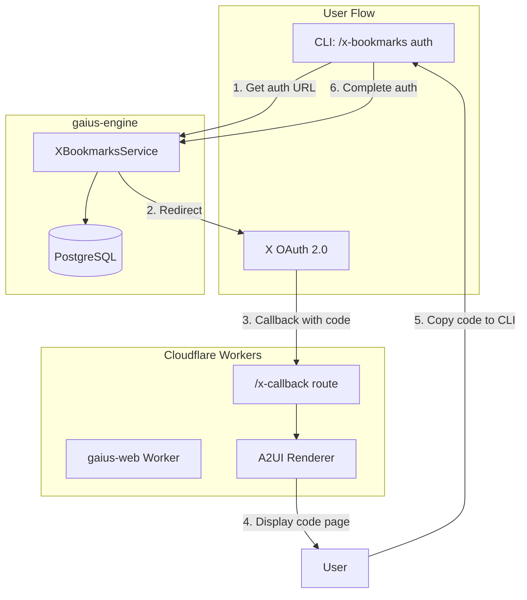

# Gaius Web Infrastructure

Cloudflare Workers and OpenTofu configuration for `gaius.zndx.org`. Provides the OAuth callback handler for X Bookmarks sync and serves A2UI surfaces.

## Architecture



## Directory Structure

```
infra/
├── main.tf                   # OpenTofu main config
├── variables.tf              # Cloudflare variables
├── terraform.tfvars.example  # Template for local config
├── playbooks/                # Ansible playbooks (devenv management)
├── inventory/                # Ansible inventory
├── k8s/                      # Kubernetes manifests
└── tilt/                     # Tilt development configs
```

## gaius-ui Worker

The Cloudflare Worker lives in `gaius-ui/apps/worker/`:

```
gaius-ui/apps/worker/
├── src/
│   ├── index.ts           # Hono router with routes
│   ├── routes/
│   │   └── callback.ts    # OAuth callback handler
│   └── a2ui/
│       ├── catalog.ts     # A2UI component catalog
│       └── renderer.ts    # HTML renderer
├── wrangler.toml          # Cloudflare Worker config
└── package.json           # Dependencies (Hono, a2ui-core)
```

### Routes

| Route | Handler | Purpose |
|-------|---------|---------|
| `/` | index | Simple status page |
| `/health` | healthCheck | JSON health endpoint |
| `/x-callback` | handleOAuthCallback | X OAuth 2.0 callback |

### A2UI Rendering

The worker uses A2UI (Agent-to-UI) protocol to render responses:

```typescript
import { createOAuthResultMessage } from '@gaius-ui/a2ui-core';
import { renderA2UIPage } from '../a2ui/renderer';

// Generate A2UI message from OAuth callback data
const a2uiMessage = createOAuthResultMessage(callbackData);

// Render as HTML
const html = renderA2UIPage(a2uiMessage, callbackData);
```

## Deployment

### Prerequisites

1. **Cloudflare API Token** with Workers permissions:
   ```bash
   export CLOUDFLARE_API_TOKEN="your-token"
   ```

2. **Create terraform.tfvars**:
   ```hcl
   cloudflare_account_id = "your-account-id"
   cloudflare_zone_id    = "your-zone-id-for-zndx.org"
   ```

### Deploy Worker

```bash
# From gaius-ui/apps/worker/
cd gaius-ui/apps/worker
npm install
npm run deploy
```

### Manage Infrastructure

```bash
# From infra/
cd infra
tofu init
tofu plan
tofu apply
```

## Configuration

### Environment Variables

| Variable | Required | Description |
|----------|----------|-------------|
| `CLOUDFLARE_API_TOKEN` | Yes | API token for wrangler/tofu |

### Terraform Variables

| Variable | Default | Description |
|----------|---------|-------------|
| `cloudflare_account_id` | - | Cloudflare account ID |
| `cloudflare_zone_id` | - | Zone ID for zndx.org |
| `zone_name` | `zndx.org` | DNS zone |
| `subdomain` | `gaius` | Worker subdomain |
| `worker_name` | `gaius-web` | Worker name |

### Worker Config (wrangler.toml)

```toml
name = "gaius-web"
main = "src/index.ts"
compatibility_date = "2024-12-01"
compatibility_flags = ["nodejs_compat"]

[[routes]]
pattern = "gaius.zndx.org"
zone_id = "b44e1003e7233d89a90312aeb88e31d4"
custom_domain = true
```

## OAuth Callback Flow

1. User runs `/x-bookmarks auth` in CLI
2. XBookmarksService generates auth URL with PKCE
3. User visits URL, authorizes on X
4. X redirects to `https://gaius.zndx.org/x-callback?code=...&state=...`
5. Worker renders A2UI page showing the authorization code
6. User copies code back to CLI
7. CLI completes auth via `XBookmarksService.complete_auth()`

### Callback Response

On success, the page displays:
- Authorization code in a copyable box
- Instructions for completing auth
- CLI command to run

On error:
- Error message from X API
- Troubleshooting steps

## Development

### Local Worker Development

```bash
cd gaius-ui/apps/worker
npm run dev
# Worker runs at http://localhost:8787
```

### Test Callback Locally

```bash
curl "http://localhost:8787/x-callback?code=test123&state=abc"
```

## Guru Meditation Codes

| Code | Description | Resolution |
|------|-------------|------------|
| `#INFRA.00000001.DEPLOY` | Worker deployment failed | Check CLOUDFLARE_API_TOKEN |
| `#INFRA.00000002.ROUTE` | Custom domain routing failed | Verify zone_id in wrangler.toml |

## See Also

- [Auth Module README](../src/gaius/auth/README.md) - OAuth implementation
- [XBookmarksService](../src/gaius/engine/services/README.md) - Engine service
- [A2UI Core](../gaius-ui/packages/a2ui-core/README.md) - A2UI protocol

---

<!-- GAI:META
module: infra
layer: L0-infrastructure
key_types: []
key_funcs: [handleOAuthCallback, renderA2UIPage, createOAuthResultMessage]
submodules: [playbooks, k8s, tilt]
depends: [cloudflare/cloudflare, hono, @gaius-ui/a2ui-core]
dependents: [gaius.auth, engine.services.x_bookmarks_service]
config_keys: []
env_vars: [CLOUDFLARE_API_TOKEN]
grpc_services: []
call_paths:
  oauth_callback: x_oauth→callback_url→gaius.zndx.org/x-callback→handleOAuthCallback→renderA2UIPage
deploy_cmds:
  worker: 'cd gaius-ui/apps/worker && npm run deploy'
  infra: 'cd infra && tofu apply'
test_cmds:
  health: 'curl https://gaius.zndx.org/health'
  callback: 'curl "http://localhost:8787/x-callback?code=test&state=test"'
guru_codes: [INFRA.00000001.DEPLOY, INFRA.00000002.ROUTE]
fail_fast: true
-->
