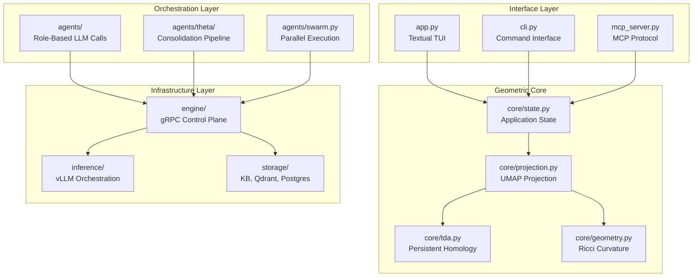

# Gaius

A terminal interface for navigating knowledge domains via topological and geometric structure. Gaius projects high-dimensional document embeddings onto a constrained 19×19 grid, applying persistent homology and Ollivier-Ricci curvature to reveal semantic organization.

## System Architecture



## Module Index

| Module | Description | Primary Components |
|--------|-------------|-------------------|
| [`core/`](core/README.md) | Geometric and topological computation | `tda.py`, `geometry.py`, `projection.py` |
| [`engine/`](engine/README.md) | gRPC server and process management | `server.py`, `orchestrator_service.py` |
| [`inference/`](inference/README.md) | vLLM endpoint management and scheduling | `orchestrator.py`, `scheduler.py` |
| [`health/`](health/README.md) | Diagnostics and remediation | `self_healing.py`, `fmea/` |
| [`agents/`](agents/README.md) | LLM orchestration patterns | `swarm.py`, `theta/`, `roles.py` |
| [`storage/`](storage/README.md) | Knowledge base and vector operations | `kb_ops.py`, `embeddings.py` |
| [`widgets/`](widgets/README.md) | TUI display components | `grid.py`, `minigrid.py` |
| [`models/`](models/README.md) | Model registry and evaluation | `registry.py`, `evaluation.py` |

## Entry Points

| Command | Description |
|---------|-------------|
| `uv run gaius` | Terminal interface with 19×19 grid |
| `uv run gaius-cli --cmd "/search query"` | Non-interactive command execution |
| `uv run gaius-mcp` | Model Context Protocol server |
| `uv run gaius-engine` | gRPC control plane daemon |

## Mathematical Foundations

### Grid Projection

Documents are mapped from $\mathbb{R}^{768}$ (embedding space) to a 19×19 discrete grid via UMAP dimensionality reduction (McInnes et al., 2018). The projection preserves local neighborhood structure while providing a fixed-size representation suitable for spatial navigation.

$$\phi: \mathbb{R}^{768} \to \{0, \ldots, 18\}^2$$

Grid coordinates follow Go board conventions (A1–T19, omitting I) to leverage spatial intuition from the game.

### Persistent Homology

Persistent homology (Edelsbrunner et al., 2002; Zomorodian & Carlsson, 2005) computes topological invariants across filtration scales. For a point cloud $X$ with distance function $d$, the Vietoris-Rips complex at scale $\epsilon$ is:

$$\text{VR}_\epsilon(X) = \{ \sigma \subseteq X : \text{diam}(\sigma) \leq \epsilon \}$$

Betti numbers $\beta_k$ count $k$-dimensional features:
- $\beta_0$: Connected components (document clusters)
- $\beta_1$: 1-cycles (circular dependency structures)
- $\beta_2$: 2-voids (topological cavities)

Persistence diagrams record feature birth-death pairs $(b_i, d_i)$, with persistence $p_i = d_i - b_i$ measuring feature significance.

### Ollivier-Ricci Curvature

Curvature on the $k$-nearest neighbor graph follows Ollivier (2009):

$$\kappa(x,y) = 1 - \frac{W_1(\mu_x, \mu_y)}{d(x,y)}$$

where $W_1$ denotes the Wasserstein-1 (earth mover's) distance between neighborhood distributions $\mu_x$ and $\mu_y$. This discrete analogue of Ricci curvature characterizes local geometry:

| Curvature | Interpretation |
|-----------|----------------|
| $\kappa > 0$ | Dense cluster interior (positive curvature) |
| $\kappa < 0$ | Sparse boundary region (negative curvature) |
| $\kappa \approx 0$ | Uniform transition zone |

## Design Principles

### Topology Over Distance

The system prioritizes topological structure (what persists across scales) over raw metric distances. Persistent homology filters noise by identifying features that survive across multiple scales, distinguishing significant structure from transient artifacts.

### Spatial Navigation

The 19×19 grid transforms abstract embedding spaces into navigable territory. Position encodes semantic similarity; navigation follows spatial intuition rather than list traversal.

### Deterministic Pipelines

Current "agent" components are deterministic orchestration pipelines rather than autonomous agents. ThetaAgent executes a fixed consolidation sequence; MetaAgent coordinates parallel LLM calls with synthesis. This provides predictable behavior during development, with agentic loops planned for future iterations.

## Configuration

HOCON configuration in `config/base.conf`:

```hocon
gaius {
  kb.root = "build/dev"
  inference.model = "nvidia/Llama-3.3-70B-Instruct-FP8"
  engine.grpc_port = 50051
}
```

Environment overrides:
```bash
export GAIUS_KB_ROOT="build/dev"
export GAIUS_ALLOW_FALLBACKS=true  # Development only
```

## Nomenclature

Named for Gaius Plinius Secundus (23–79 CE), author of *Naturalis Historia*—a systematic encyclopedia synthesizing knowledge across domains. The system aspires to similar synthesis: transforming scattered documents into structured understanding through geometric and topological analysis.

## References

- Edelsbrunner, H., Letscher, D., & Zomorodian, A. (2002). Topological persistence and simplification. *Discrete & Computational Geometry*, 28(4), 511–533.
- McInnes, L., Healy, J., & Melville, J. (2018). UMAP: Uniform Manifold Approximation and Projection for Dimension Reduction. *arXiv:1802.03426*.
- Ollivier, Y. (2009). Ricci curvature of Markov chains on metric spaces. *Journal of Functional Analysis*, 256(3), 810–864.
- Zomorodian, A., & Carlsson, G. (2005). Computing persistent homology. *Discrete & Computational Geometry*, 33(2), 249–274.

## See Also

- [Project README](../../README.md) — Installation and usage
- [Documentation](../../docs/) — mdbook documentation
- [CLAUDE.md](../../CLAUDE.md) — Development guidelines
