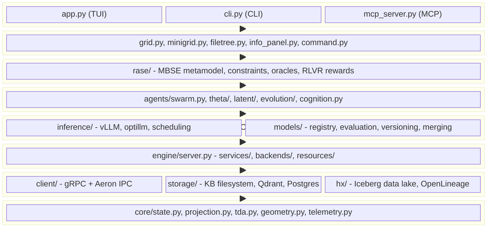
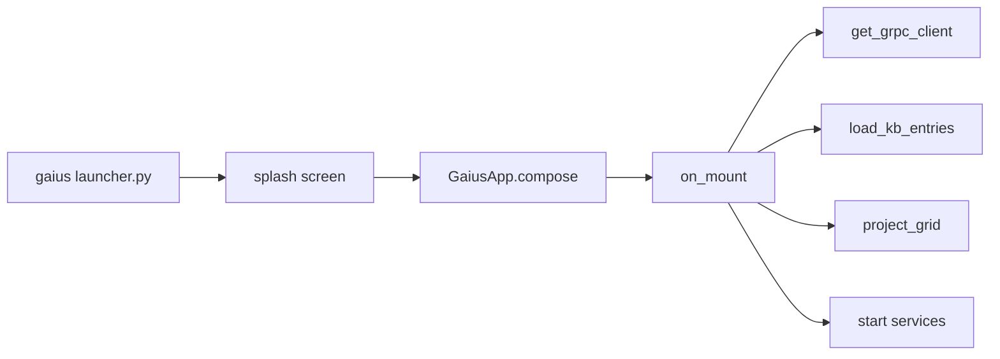
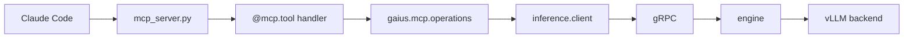
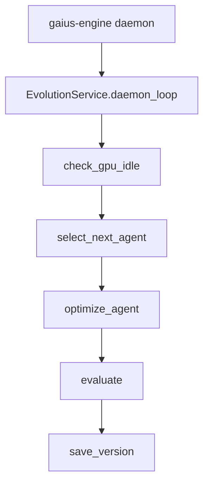
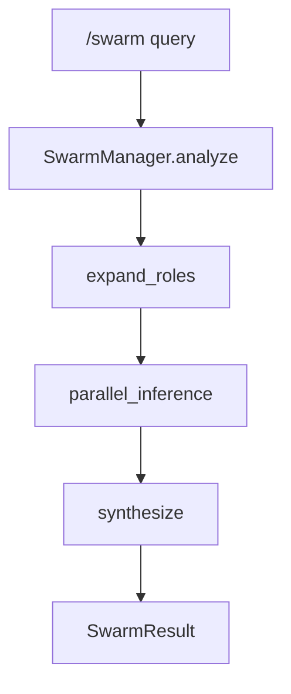
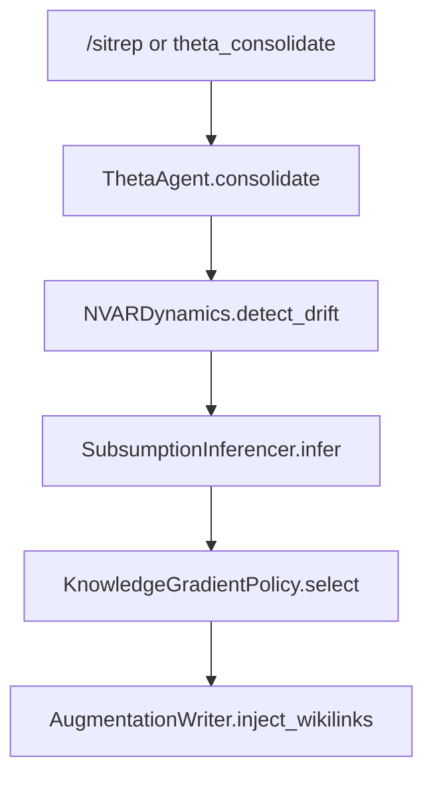

# Gaius

A terminal interface for navigating knowledge domains via topological and geometric structure. Gaius projects high-dimensional document embeddings onto a constrained 19×19 grid, applying persistent homology and Ollivier-Ricci curvature to reveal semantic organization.

## Layer Architecture

The system is organized into 8 architectural layers, with dependencies flowing downward:



## Execution Paths

### Path A: TUI Session



### Path B: MCP Tool Call



### Path C: Agent Evolution



### Path D: Swarm Analysis



### Path E: ThetaAgent Consolidation



## Module Index

### Core Infrastructure

| Module | Layer | Singleton | Key Types | Description |
|--------|-------|-----------|-----------|-------------|
| [`core/`](core/README.md) | L1 | — | `AppState`, `ViewMode` | TDA, geometry, projection, telemetry |
| [`client/`](client/README.md) | L2 | `get_grpc_client()` | `GrpcEngineClient` | gRPC + Aeron transport to engine |
| [`storage/`](storage/README.md) | L2 | `get_storage_backend()` | `StorageBackend` | KB filesystem, Minio sync |
| [`hx/`](hx/README.md) | L2 | — | `IcebergContentStore` | Raw content lake, lineage |
| [`engine/`](engine/README.md) | L3 | — | `GaiusEngine` | gRPC daemon, 9-phase startup |
| [`inference/`](inference/README.md) | L4 | `get_inference_client()` | `InferenceClient` | vLLM orchestration, optillm |
| [`models/`](models/README.md) | L4 | `get_model_registry()` | `ModelRegistry` | Versioning, evaluation, merging |

### Agent System

| Module | Layer | Singleton | Key Types | Description |
|--------|-------|-----------|-----------|-------------|
| [`agents/`](agents/README.md) | L5 | `get_swarm_manager()` | `SwarmManager` | Role-based parallel LLM calls |
| `agents/theta/` | L5 | — | `ThetaAgent` | Neuromorphic consolidation |
| `agents/latent/` | L5 | — | `LatentWorkingMemory` | Qdrant-based agent collaboration |
| `agents/evolution/` | L5 | — | `EvolutionDaemon` | Self-improvement loops |

### Verification & Safety

| Module | Layer | Singleton | Key Types | Description |
|--------|-------|-----------|-----------|-------------|
| [`rase/`](rase/README.md) | L6 | — | `TraceableId`, `Constraint` | MBSE metamodel (SysML v2) |
| [`health/`](health/README.md) | L5 | — | `HealthChecker` | Diagnostics, FMEA, self-healing |

### Interface & Display

| Module | Layer | Singleton | Key Types | Description |
|--------|-------|-----------|-----------|-------------|
| [`widgets/`](widgets/README.md) | L7 | — | `MainGrid`, `FileTree` | Textual TUI components |
| [`observability/`](observability/README.md) | L4 | — | `MetricSource` | Prometheus queries, metrics display |
| [`awareness/`](awareness/README.md) | L5 | — | `SituationalAwareness` | Startup reports, time horizons |

### Data Pipelines

| Module | Layer | Singleton | Key Types | Description |
|--------|-------|-----------|-----------|-------------|
| [`flows/`](flows/README.md) | L4 | — | `GaiusFlow` | Metaflow pipelines, OpenLineage |
| [`workers/`](workers/README.md) | L3 | — | `WorkerManager` | Fetch job queue, content ingestion |
| [`datasets/`](datasets/README.md) | L4 | — | `NiFiSoMGenerator` | SoM training data generation |

### External Integration

| Module | Layer | Singleton | Key Types | Description |
|--------|-------|-----------|-----------|-------------|
| [`acp/`](acp/README.md) | L5 | — | `GaiusACPClient` | Claude Code integration via ACP |
| [`mcp/`](mcp/README.md) | L5 | — | — | Programmatic MCP tool access |
| [`providers/`](providers/README.md) | L4 | — | `CerebrasClient` | Cloud GPU providers |

## Entry Points

| Command | Module | Description |
|---------|--------|-------------|
| `gaius` | `launcher.py` → `app.py` | TUI with splash screen |
| `gaius-cli` | `cli.py` | Non-interactive commands |
| `gaius-mcp` | `mcp_server.py` | MCP protocol server |
| `gaius-engine` | `engine/server.py` | gRPC daemon (9-phase startup) |
| `gaius-worker` | `workers/cli.py` | Fetch job processor |
| `gaius-dataset` | `datasets/nifi_som/cli.py` | SoM dataset generation |

## Singleton Registry

Critical singletons with factory functions (use these, don't instantiate directly):

| Factory | Returns | Module | Thread-Safe |
|---------|---------|--------|-------------|
| `get_config()` | `GaiusConfig` | `core.config` | ✓ |
| `get_grpc_client()` | `GrpcEngineClient` | `client` | ✓ |
| `get_storage_backend()` | `StorageBackend` | `storage` | ✓ |
| `get_inference_client()` | `InferenceClient` | `inference` | ✓ |
| `get_swarm_manager()` | `SwarmManager` | `agents` | ✓ |
| `get_model_registry()` | `ModelRegistry` | `models` | ✓ |
| `get_tracer()` | `Tracer` | `core.telemetry` | ✓ |
| `get_meter()` | `Meter` | `core.telemetry` | ✓ |

## Configuration Hierarchy

```
1. Environment variables (GAIUS_*)
2. ~/.gaius/config.hocon (user)
3. ./config.hocon (project)
4. config/base.conf (defaults)
```

Key configuration namespaces:

| Namespace | Description |
|-----------|-------------|
| `gaius.kb.*` | Knowledge base paths |
| `gaius.engine.*` | gRPC ports, startup options |
| `gaius.inference.*` | Model selection, vLLM parameters |
| `gaius.agents.*` | Role definitions, parallelism |
| `gaius.evolution.*` | Daemon intervals, budget limits |

## Mathematical Foundations

### Grid Projection

Documents are mapped from $\mathbb{R}^{768}$ (embedding space) to a 19×19 discrete grid via UMAP dimensionality reduction (McInnes et al., 2018):

$$\phi: \mathbb{R}^{768} \to \{0, \ldots, 18\}^2$$

Grid coordinates follow Go board conventions (A1–T19, omitting I).

### Persistent Homology

Persistent homology (Edelsbrunner et al., 2002) computes topological invariants via Vietoris-Rips complexes. Betti numbers count features:

| Dimension | Symbol | Interpretation |
|-----------|--------|----------------|
| 0 | $\beta_0$ | Connected components (clusters) |
| 1 | $\beta_1$ | 1-cycles (loops) |
| 2 | $\beta_2$ | 2-voids (cavities) |

### Ollivier-Ricci Curvature

Discrete curvature on the k-NN graph (Ollivier, 2009):

$$\kappa(x,y) = 1 - \frac{W_1(\mu_x, \mu_y)}{d(x,y)}$$

| Curvature | Interpretation |
|-----------|----------------|
| $\kappa > 0$ | Dense cluster interior |
| $\kappa < 0$ | Sparse boundary region |
| $\kappa \approx 0$ | Transition zone |

## Design Principles

### Fail-Fast with Remediation

All errors surface immediately with actionable paths. Guru Meditation codes identify failure modes; `/health fix` commands provide automated remediation.

### Topology Over Distance

Prioritize persistent homology (what survives across scales) over raw metric distances. Filter noise by identifying robust structure.

### Deterministic Pipelines

Current "agents" are orchestration pipelines with fixed sequences. Agentic loops are planned but not yet implemented.

## Nomenclature

Named for Gaius Plinius Secundus (23–79 CE), author of *Naturalis Historia*—synthesizing knowledge across domains into systematic organization.

## References

- Edelsbrunner, H., Letscher, D., & Zomorodian, A. (2002). Topological persistence and simplification. *Discrete & Computational Geometry*, 28(4), 511–533.
- McInnes, L., Healy, J., & Melville, J. (2018). UMAP: Uniform Manifold Approximation and Projection. *arXiv:1802.03426*.
- Ollivier, Y. (2009). Ricci curvature of Markov chains on metric spaces. *Journal of Functional Analysis*, 256(3), 810–864.
- Zomorodian, A., & Carlsson, G. (2005). Computing persistent homology. *Discrete & Computational Geometry*, 33(2), 249–274.

## See Also

- [Project README](../../README.md) — Installation and usage
- [Documentation](../../docs/) — mdbook documentation
- [CLAUDE.md](../../CLAUDE.md) — Development guidelines

---

<!-- GAI:META
module: gaius
layer: root
entry_points: [gaius, gaius-cli, gaius-mcp, gaius-engine, gaius-worker, gaius-dataset]
submodules: [core, client, storage, hx, engine, inference, models, agents, rase, health, widgets, observability, awareness, flows, workers, datasets, mcp, providers]
layer_deps:
  L8: [L7, L5, L4]
  L7: [L1]
  L6: [L2]
  L5: [L4, L3, L2]
  L4: [L3, L2]
  L3: [L2, L1]
  L2: [L1]
  L1: []
singletons: [get_config, get_grpc_client, get_storage_backend, get_inference_client, get_swarm_manager, get_model_registry, get_tracer, get_meter]
config_ns: [gaius.kb, gaius.engine, gaius.inference, gaius.agents, gaius.evolution]
env_prefix: GAIUS_
exec_paths:
  tui: launcher→app.compose→on_mount→services
  mcp: mcp_server→tool_handler→operations→inference
  evolution: engine→EvolutionService→optimize→evaluate→save
  swarm: SwarmManager→expand_roles→parallel_inference→synthesize
  theta: ThetaAgent→NVARDynamics→SubsumptionInferencer→KGPolicy→inject
-->
