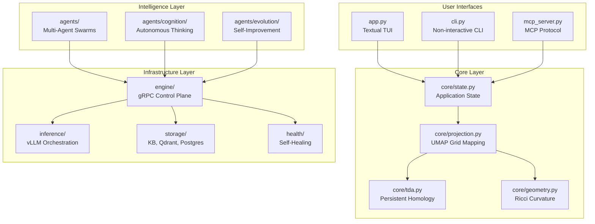

# Gaius Source Code

Spatial intelligence interface for navigating graph-oriented knowledge domains. This directory contains the core implementation of the Gaius system.

## Architecture Overview



## Module Index

| Module | Purpose | Key Files |
|--------|---------|-----------|
| [`core/`](core/README.md) | State, projection, TDA, geometry | `state.py`, `tda.py`, `geometry.py` |
| [`engine/`](engine/README.md) | gRPC server, control plane | `server.py`, `workloads.py` |
| [`inference/`](inference/README.md) | vLLM orchestration, scheduling | `orchestrator.py`, `scheduler.py` |
| [`health/`](health/README.md) | Health checks, FMEA, self-healing | `self_healing.py`, `fmea/` |
| [`agents/`](agents/README.md) | Swarms, cognition, evolution | `swarm.py`, `cognition/`, `evolution/` |
| [`storage/`](storage/README.md) | KB operations, embeddings | `kb_ops.py`, `embeddings.py` |
| [`widgets/`](widgets/README.md) | TUI components | `grid.py`, `minigrid.py` |
| [`models/`](models/README.md) | Model registry, specs | `registry.py`, `specs/` |

## Entry Points

### TUI Application (`app.py`)

The main Textual-based terminal interface:

```bash
uv run gaius
```

Features:
- 19x19 main grid with UMAP-projected documents
- 9x9 mini-grids (Embed similarity, Iso curvature)
- File tree navigation (Plan 9 style)
- Command input with slash commands
- Real-time overlays (Risk, H1/H2 homology, Agents)

### CLI Mode (`cli.py`)

Non-interactive command execution:

```bash
uv run gaius-cli --cmd "/search query" --format json
```

Useful for scripting, CI/CD pipelines, and batch operations.

### MCP Server (`mcp_server.py`)

Model Context Protocol server for Claude Code integration:

```bash
uv run gaius-mcp
```

Exposes tools like `search_kb`, `run_swarm`, `explain_grid_position`.

## Core Concepts

### The 19x19 Grid

Documents are projected from 768-dimensional embedding space onto a 19x19 grid using UMAP. The grid uses Go board conventions:
- Positions labeled A1-T19 (skipping I)
- Star points mark strategic positions
- Corner/edge/center regions have different semantic properties

### Topological Data Analysis

Persistent homology reveals structural patterns:
- **H0 (components)**: Isolated knowledge clusters
- **H1 (loops)**: Circular dependencies or themes
- **H2 (voids)**: Gaps in understanding

### Differential Geometry

Ollivier-Ricci curvature measures local structure:

$$\kappa(x,y) = 1 - \frac{W(\mu_x, \mu_y)}{d(x,y)}$$

- **Positive curvature** ($\kappa > 0$): Dense cluster cores
- **Negative curvature** ($\kappa < 0$): Sparse boundaries
- **Zero curvature** ($\kappa \approx 0$): Uniform regions

### The Go Board Metaphor

Inspired by the game of Go:
- **Tenuki**: Strategic jumps between contexts (not just adjacency)
- **Territory vs Influence**: Exploitation vs exploration trade-off
- **Life and Death**: Concept viability in knowledge space

## Configuration

Uses HOCON configuration in `config/base.conf`:

```hocon
gaius {
  kb.root = "build/dev"
  inference.model = "nvidia/Llama-3.3-70B-Instruct-FP8"
  engine.grpc_port = 50051
}
```

Environment overrides:
```bash
export GAIUS_KB_ROOT="build/dev"
export GAIUS_ALLOW_FALLBACKS=true  # dev only
```

## Design Philosophy

### Named for Pliny the Elder

Gaius Plinius Secundus (23-79 AD) authored *Naturalis Historia*, a systematic encyclopedia of knowledge. Like Pliny, Gaius aims to:
- Catalog and organize diverse knowledge
- Find patterns across domains
- Transform observation into understanding

### Topology Over Metrics

Structure matters more than distance. Persistent homology captures what survives across scales, filtering noise and revealing the essential shape of knowledge.

### Spatial Intuition

The 19x19 grid transforms abstract embeddings into navigable space. Instead of scrolling through lists, you explore a landscape where position encodes meaning.

## See Also

- [Root README](../../README.md) - Installation and usage
- [docs/](../../docs/) - mdbook documentation
- [CLAUDE.md](../../CLAUDE.md) - Development guidelines
