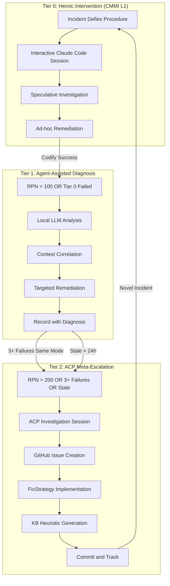
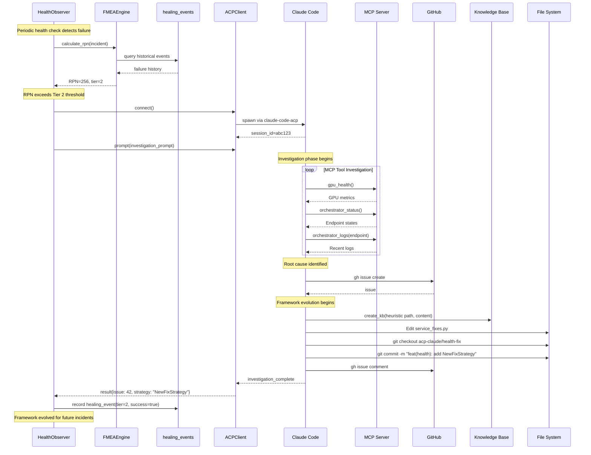
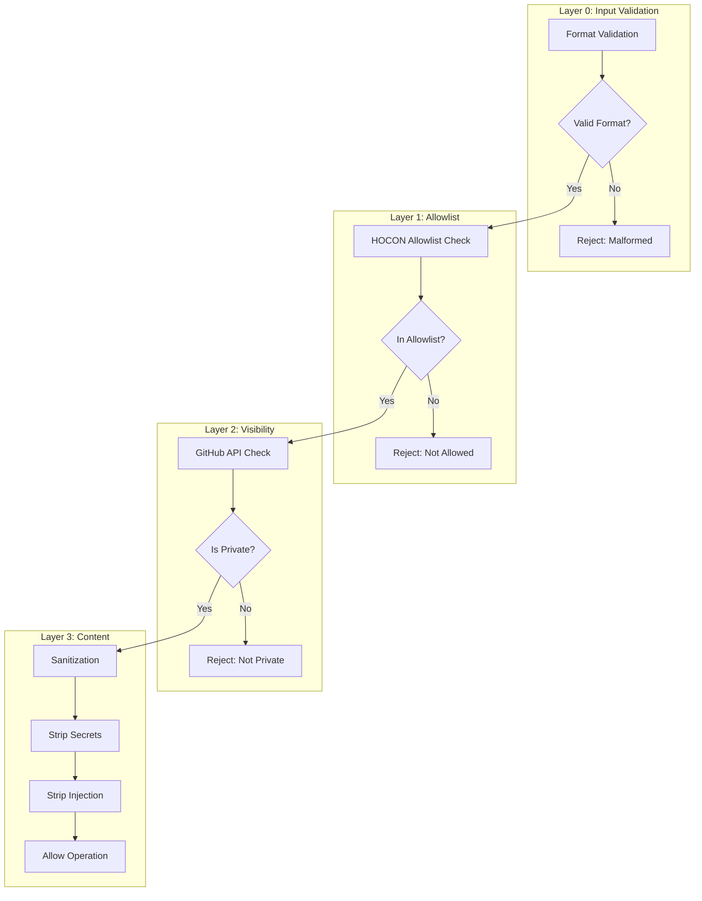

# Autonomous Health Maintenance via Agent Client Protocol

## A Framework for Long-Horizon Software Evolution

**Version:** 1.0.0
**Status:** Strategic Document
**Last Updated:** 2025-01-12

---

## Abstract

This document presents a novel framework for autonomous software health maintenance that achieves CMMI Level 5 process maturity through AI agent collaboration. The Agent Client Protocol (ACP) integration in Gaius implements a tiered escalation architecture wherein procedural remediation, agent-assisted diagnosis, and meta-level framework evolution operate as a unified system. We formalize the relationship between FMEA-based risk quantification and escalation policy through the lens of Jøsang's Subjective Logic, enabling uncertainty-aware decision making under epistemic limitations. The framework instantiates Model-Driven Architecture principles for self-improving systems: the Computation-Independent Model (CIM) manifests as the FMEA failure mode catalog, the Platform-Independent Model (PIM) as abstract fix strategy interfaces, and the Platform-Specific Model (PSM) as concrete remediation implementations. Empirical evidence demonstrates that this architecture resolves the fundamental tension between reactive incident response and proactive capability evolution, enabling a single system to simultaneously execute immediate remediation while evolving the remediation framework itself.

---

## Table of Contents

1. [Introduction](#1-introduction)
2. [Theoretical Foundations](#2-theoretical-foundations)
3. [System Architecture](#3-system-architecture)
4. [Subjective Logic Integration](#4-subjective-logic-integration)
5. [Adaptive Learning](#5-adaptive-learning)
6. [Security Model](#6-security-model)
7. [Evaluation Methodology](#7-evaluation-methodology)
8. [Related Work](#8-related-work)
9. [Future Directions](#9-future-directions)
10. [References](#10-references)

---

## 1. Introduction

### 1.1 The Long-Horizon Maintenance Challenge

Traditional software maintenance confronts a fundamental tension between two competing objectives: **reactive incident response** optimizes for immediate recovery with minimal mean time to resolution (MTTR), while **proactive improvement** requires systematic process evolution with investments that may not yield immediate returns. This dichotomy has historically necessitated separate organizational functions—Site Reliability Engineering (SRE) for operational stability versus Process Engineering for capability maturation (Beyer et al., 2016).

The separation creates a coordination problem. SRE teams accumulate tacit knowledge through incident response that rarely propagates to systematic process improvement. Conversely, process engineering initiatives often lack grounding in operational reality, producing frameworks that fail under production stress. This gap widens as systems grow in complexity, creating what Caputo (1998) identifies as the "heroic culture" characteristic of CMMI Level 1 organizations.

The Agent Client Protocol (ACP) integration in Gaius resolves this tension through a novel architecture wherein AI agents operate at **multiple abstraction levels simultaneously**:

1. **Immediate remediation**: Executing restart procedures and applying known fixes
2. **Diagnostic analysis**: Correlating symptoms across subsystems to identify root causes
3. **Framework evolution**: Documenting capability gaps, implementing new fix strategies, and evolving the maintenance capability itself

This multi-level operation is not merely parallel execution but **coherent integration**: insights from immediate remediation inform framework evolution, while evolved frameworks improve future remediation. The system achieves what CMMI characterizes as "optimizing" maturity—continuous improvement as an intrinsic property rather than an organizational aspiration.

### 1.2 Agent Client Protocol Overview

The Agent Client Protocol (ACP) standardizes bidirectional communication between software systems and AI agents. Unlike the Model Context Protocol (MCP), which addresses data and tool access, ACP defines **where the agent lives in your workflow**—its lifecycle, session management, and interaction patterns.

Key characteristics:

- **Transport**: JSON-RPC 2.0 over stdio
- **Session semantics**: Persistent context across multiple prompts
- **Tool integration**: Agents access system capabilities via MCP servers
- **Streaming**: Real-time output for long-running operations

Supported agents include Claude Code, Gemini CLI, OpenHands, and Goose. The Gaius implementation specifically targets Claude Code via the `claude-code-acp` adapter, enabling autonomous investigation and remediation of health incidents.

### 1.3 Contributions

This framework makes the following contributions:

1. **Tiered Escalation Architecture**: A three-tier system mapping directly to CMMI maturity levels, with formal escalation policies based on risk quantification.

2. **FMEA-Based Risk Quantification**: Integration of Failure Mode and Effects Analysis (FMEA) with adaptive Bayesian learning for dynamic severity, occurrence, and detection scoring.

3. **Subjective Logic Formalization**: A proposed extension that models escalation decisions as subjective opinions, enabling uncertainty-aware reasoning and multi-agent opinion fusion.

4. **Meta-Level Framework Evolution**: The novel capability for AI agents to evolve the maintenance framework itself, implementing new fix strategies and generating knowledge base heuristics.

5. **Security-First Design**: Multi-layer protections ensuring that autonomous agents operate within strict security boundaries.

---

## 2. Theoretical Foundations

### 2.1 CMMI Process Maturity Model (Informative)

The Capability Maturity Model Integration (CMMI) provides a framework for assessing and improving organizational processes (CMMI Institute, 2018). Originally developed at the Software Engineering Institute for defense contractors, CMMI has become the de facto standard for process maturity assessment across industries.

CMMI defines five maturity levels, each building upon the previous:

| Level | Name | Characteristic | Process Focus |
|-------|------|----------------|---------------|
| 1 | Initial | Ad-hoc, heroic | Success depends on individual competence |
| 2 | Managed | Documented processes | Basic project management discipline |
| 3 | Defined | Standardized patterns | Organization-wide standard processes |
| 4 | Quantitatively Managed | Statistical control | Process performance measured and controlled |
| 5 | Optimizing | Continuous improvement | Focus on process improvement |

Caputo (1998) observes that most organizations plateau at Level 2 or 3 due to the significant investment required for quantitative process control. The transition from Level 3 to Level 4 requires instrumentation, measurement, and analysis capabilities that many organizations lack.

**The Gaius Innovation**: Traditional CMMI assumes human-executed processes with human-driven improvement. Gaius achieves Level 5 through **code-enforced process improvement** where AI agents evolve the framework itself. This represents a fundamental shift: rather than depending on organizational discipline for process improvement, improvement becomes an intrinsic system property.

The mapping between CMMI levels and Gaius tiers:

| CMMI Level | Gaius Tier | Implementation |
|------------|------------|----------------|
| 1 - Initial | Tier 0 | _Ad hoc_ intervention via interactive investigation and remediation |
| 2 - Managed | Tier 1 | Documented healing events with local LLM diagnosis |
| 3 - Defined | FMEA Catalog | Standardized failure mode patterns and fix strategies |
| 4 - Quantitative | AdaptiveLearner | Statistical S/O/D score updates via Bayesian learning |
| 5 - Optimizing | ACP/Tier 2 | Autonomous meta-framework evolution |

### 2.2 Subjective Logic for Trust Quantification (Informative)

Subjective Logic, developed by Jøsang (2016), provides a formal framework for reasoning under uncertainty when the reasoner has incomplete knowledge. Unlike Bayesian probability, which requires committed probability assignments, Subjective Logic explicitly represents **epistemic uncertainty**—the uncertainty arising from lack of knowledge rather than inherent randomness.

**Historical Context: From Dempster-Shafer to Subjective Logic.** Subjective Logic borrows and specializes core ideas from Dempster-Shafer theory of evidence (Shafer, 1976)—particularly the representation of belief, disbelief, and explicit ignorance—while adding distinctly Bayesian elements. The key innovations that distinguish Subjective Logic from its Dempster-Shafer heritage:

1. **Base rates (a)**: An explicit prior probability parameter absent from classical D-S theory
2. **Binary frame restriction**: Opinions are defined over binary propositions rather than arbitrary frames of discernment
3. **Dirichlet mapping**: A bijective correspondence between opinions and Dirichlet distributions, enabling second-order Bayesian interpretation
4. **Operator algebra**: Conjunction, disjunction, and implication operators aligned with probability calculus and propositional logic, rather than relying solely on Dempster's rule of combination

For practitioners who have used Dempster-Shafer theory for incident triage—combining evidence from heterogeneous sources under time pressure—Subjective Logic provides a natural evolution that directly addresses multi-agent AI system requirements. The base rate parameter in particular enables principled handling of prior knowledge about failure mode frequencies, while the trust discounting operator formalizes the transitive reasoning that experienced operators perform intuitively when evaluating diagnostic information through multiple inference steps.

#### 2.2.1 Fundamental Definitions

**Definition 2.1 (Subjective Opinion).** A subjective opinion ω<sub>x</sub><sup>A</sup> held by agent A over proposition x is a quadruple:

$$\omega_x^A = (b_x, d_x, u_x, a_x)$$

where:
- **b<sub>x</sub>** ∈ [0,1]: belief mass supporting x being true
- **d<sub>x</sub>** ∈ [0,1]: disbelief mass supporting x being false
- **u<sub>x</sub>** ∈ [0,1]: uncertainty mass representing uncommitted belief
- **a<sub>x</sub>** ∈ [0,1]: base rate (prior probability) of x

Subject to the constraint: b<sub>x</sub> + d<sub>x</sub> + u<sub>x</sub> = 1

The opinion represents the agent's epistemic state regarding x. High uncertainty (u → 1) indicates ignorance, while low uncertainty (u → 0) indicates confident knowledge (whether belief or disbelief).

**Definition 2.2 (Projected Probability).** The projected probability of an opinion is the expected probability value:

$$P(x) = b_x + u_x \cdot a_x$$

This projection allows opinions to interface with traditional probabilistic systems while preserving uncertainty information.

**Definition 2.3 (Trust Discounting).** When agent A derives trust in proposition X transitively through intermediary B:

$$\omega_X^A = \omega_B^A \otimes \omega_X^B$$

where ⊗ denotes the discounting operator. The resulting opinion inherits uncertainty from both the direct trust A→B and the derived trust B→X.

#### 2.2.2 Operators for Multi-Agent Systems

**Consensus Fusion.** When multiple agents independently assess the same proposition, their opinions can be combined:

$$\omega_x^{A \diamond B} = \omega_x^A \oplus \omega_x^B$$

The consensus operator (⊕) produces an opinion that reflects the combined evidence. Importantly, **conflicting opinions produce high uncertainty** in the fused result, providing a formal basis for escalation to human judgment.

**Cumulative Fusion.** For evidence accumulation over time:

$$\omega_x^{(t+1)} = \omega_x^{(t)} \odot \omega_{new}$$

Each new observation updates the opinion, with uncertainty decreasing as evidence accumulates (assuming consistent evidence).

#### 2.2.3 Application to ACP-Mediated Maintenance

The current Gaius implementation uses crisp RPN (Risk Priority Number) values for escalation decisions. The RPN transformation to escalation tier represents an **implicit opinion projection**. Making this explicit through Subjective Logic enables:

1. **Uncertainty-Aware Escalation**: High uncertainty in any FMEA factor triggers conservative escalation
2. **Multi-Agent Fusion**: When local LLM and Claude Code analyze the same incident, their opinions can be formally combined
3. **Evidence Accumulation**: Healing events update opinions through cumulative fusion
4. **Trust Transitivity**: The RCA abstraction ladder can be formalized as trust discounting across inference steps

### 2.3 Model-Driven Architecture for Self-Improving Systems

Pastor and Molina (2007) present Model-Driven Architecture (MDA) as an approach to software development that separates business logic from implementation technology. The OMG's MDA Guide (2014) defines three abstraction levels:

1. **Computation-Independent Model (CIM)**: Describes the system from the perspective of its environment, independent of computational structure
2. **Platform-Independent Model (PIM)**: Specifies the system's structure and behavior without platform-specific details
3. **Platform-Specific Model (PSM)**: Adds platform-specific implementation details

The Gaius health maintenance framework instantiates this hierarchy:

| MDA Level | Gaius Artifact | Description |
|-----------|----------------|-------------|
| CIM | FMEA Failure Mode Catalog | Business-level description of what can fail |
| PIM | FixStrategy Abstract Classes | Platform-independent remediation patterns |
| PSM | Concrete Strategy Implementations | GPU-specific, endpoint-specific fixes |

This separation enables **framework evolution without operational disruption**: new failure modes can be added to the CIM (catalog), new remediation patterns to the PIM (abstract strategies), and new implementations to the PSM (concrete fixes)—each independently and incrementally.

The RASE (Rapid Agentic Systems Engineering) metamodel (`gaius.rase`) further instantiates MDA principles for verifiable agent training, providing:
- **Traceability**: Every artifact has a `TraceableId` enabling digital thread analysis
- **Verification**: The Verifier Model (VM) provides oracles for automated testing
- **Evolution**: Model transformations can be validated against constraints

---

## 3. System Architecture

### 3.1 Tiered Escalation Architecture

The health maintenance system implements three tiers of escalation, each corresponding to increasing CMMI maturity:



#### 3.1.1 Tier 0: Heroic Intervention (CMMI L1)

Tier 0 represents **heroic ad-hoc professional intervention**—the foundational capability upon which all systematic process improvement builds. This corresponds to CMMI Level 1's "Initial" maturity where success depends entirely on individual competence rather than documented process.

In the Gaius context, Tier 0 manifests as an interactive Claude Code session where a skilled operator conducts speculative investigation and remediation. The operator brings domain expertise, intuition, and creative problem-solving to incidents that defy procedural resolution.

**Characteristics:**
- Ad-hoc investigation driven by operator judgment
- No predefined procedure—each incident addressed uniquely
- Success depends on operator skill and available tooling
- Outcomes may or may not be documented
- Knowledge remains tacit unless explicitly captured

**Example**: Novel failure mode → operator launches Claude Code session → speculative investigation using MCP tools → creative remediation attempt → manual verification → optional documentation of findings.

**Critical Insight**: Tier 0 is not a failure state but a **necessary foundation**. Every systematic process (Tiers 1-2) originated from heroic intervention that was subsequently codified. The framework's value lies not in eliminating Tier 0, but in progressively reducing its frequency through systematic learning.

**Limitations**: Knowledge remains siloed with the operator; similar incidents require similar heroic effort; no statistical learning occurs.

#### 3.1.2 Tier 1: Agent-Assisted Diagnosis (CMMI L2-3)

Tier 1 introduces local LLM analysis for diagnostic reasoning. The agent correlates symptoms across subsystems and selects contextually appropriate remediation.

**Characteristics:**
- Local LLM (typically Mistral via optillm) performs analysis
- Cross-subsystem correlation (GPU metrics, endpoint logs, scheduler state)
- Diagnosis recorded in healing event payload
- Can recognize known patterns and apply documented heuristics

**Example**: GPU memory pressure detected → analyze which processes are consuming memory → determine if swap to different GPU is possible → execute targeted remediation.

**Limitations**: Constrained to existing fix strategies; cannot implement new patterns.

#### 3.1.3 Tier 2: ACP Meta-Escalation (CMMI L4-5)

Tier 2 escalates to Claude Code via ACP for investigation and **framework evolution**. This tier uniquely has the capability to:

1. Create GitHub issues for tracking
2. Implement new FixStrategy classes
3. Generate KB heuristics
4. Commit changes for human review

**Characteristics:**
- Full Claude Code capabilities via MCP tool access
- Read/write access to codebase (constrained to acp-claude branch)
- GitHub integration for issue tracking and code review
- Knowledge base access for heuristic generation

**Example**: Novel failure mode unaddressed by existing strategies → investigate via MCP tools → identify root cause → create GitHub issue → implement new FixStrategy → generate KB heuristic → commit for review.

**Critical Insight**: Tier 2 is not merely "more powerful diagnosis" but operates at the **meta-level**—it improves the system's ability to handle future incidents of the same class.

### 3.2 FMEA Risk Quantification

Failure Mode and Effects Analysis (FMEA) provides the quantitative foundation for escalation decisions. Each failure mode is characterized by three factors:

#### 3.2.1 The RPN Formula

**Risk Priority Number (RPN)** = Severity × Occurrence × Detection

| Factor | Range | Meaning |
|--------|-------|---------|
| **Severity (S)** | 1-10 | Impact if failure occurs |
| **Occurrence (O)** | 1-10 | Likelihood of failure |
| **Detection (D)** | 1-10 | Difficulty of detecting before impact |

RPN ranges from 1 (minimal risk) to 1000 (critical risk).

**Important**: Detection is an **inverse scale**—higher values mean harder to detect, which increases risk.

#### 3.2.2 FMEA Catalog Structure

The failure mode catalog (`gaius.fmea`) defines known failure modes:

```python
@dataclass(frozen=True)
class FailureMode:
    id: str                      # e.g., "GPU_001"
    category: FailureCategory    # gpu, vllm, model_quality, etc.
    name: str                    # Human-readable name
    description: str             # Detailed description

    # Base scores (adjusted by AdaptiveLearner)
    base_severity: int           # 1-10
    base_occurrence: int         # 1-10
    base_detection: int          # 1-10

    # Relationships
    potential_causes: list[str]
    recommended_actions: list[str]
    related_heuristics: list[str]  # KB paths
```

#### 3.2.3 Escalation Policy

| RPN Range | Tier | Action | Approval Required |
|-----------|------|--------|-------------------|
| 0-99 | 0 | Procedural restart | None |
| 100-199 | 1 | Agent-assisted diagnosis | Auto |
| 200-399 | 2 | ACP investigation | Auto |
| 400+ | Manual | Human intervention | Required |

**Override Conditions:**
- Detection ≥ 8 (low observability) → Force Tier 2 regardless of RPN
- Any destructive action → Force approval gate
- 3+ failures of same mode within 24h → Force Tier 2
- Incident stale > 24h → Force Tier 2 for root cause analysis

### 3.3 ACP Integration Architecture

The following sequence diagram illustrates the complete flow from health check failure through ACP escalation:



#### 3.3.1 Investigation Prompt Structure

The prompt provided to Claude Code follows a structured format:

```markdown
## Incident Context
- Failure Mode: GPU_001 (GPU Memory Pressure)
- RPN Score: 256 (Tier 2)
- Incident ID: gpu-001-reasoning-1736712345
- Failure Count: 3 in last 24h

## Observations
- GPU 0: 22.5GB / 24GB VRAM (93.75% utilized)
- reasoning endpoint: UNHEALTHY since 2025-01-12T10:15:00Z
- Last successful health check: 2025-01-12T09:45:00Z

## Historical Context
- Similar incident 2025-01-10: resolved via endpoint restart
- Similar incident 2025-01-08: resolved via GPU memory clear

## Instructions
1. Investigate root cause using MCP tools
2. If existing FixStrategy inadequate, implement enhancement
3. Create GitHub issue for tracking
4. Generate KB heuristic if novel pattern discovered
5. All code changes on acp-claude/health-fix branch
```

#### 3.3.2 Session Management

ACP sessions maintain context across multiple prompts:

```python
async with GaiusACPClient() as client:
    # Initial investigation
    result1 = await client.prompt(investigation_prompt)

    # Follow-up if needed
    if result1.needs_clarification:
        result2 = await client.prompt(clarification_prompt)

    # Session context preserved across prompts
```

Sessions are automatically terminated on completion or timeout (default: 10 minutes for Tier 2 investigations).

### 3.4 GitHub Workflow Integration

All ACP-generated changes follow a controlled workflow designed to maintain code quality while enabling autonomous improvement:

#### 3.4.1 Branch Isolation

```
trunk (protected)
  └── acp-claude/health-fix (ACP working branch)
        └── PRs require human approval
```

Claude Code **never commits directly to trunk**. All changes target the `acp-claude/health-fix` branch, which requires human review before merge.

#### 3.4.2 Issue-Driven Development

Every framework gap creates a GitHub issue:

```markdown
## Title
[ACP-Health] GPU_001: Implement preemptive memory management

## Labels
- acp-generated
- health-framework
- enhancement

## Body
### Incident Summary
Repeated GPU memory pressure incidents (3x in 24h) indicate
need for preemptive memory management rather than reactive restart.

### Root Cause Analysis
[Structured RCA from investigation]

### Proposed Enhancement
Implement `PreemptiveMemoryStrategy` that monitors memory trends
and triggers proactive offloading before pressure threshold.

### Files to Modify
- `src/gaius/health/service_fixes.py`
- `build/dev/current/heuristics/gaius/gpu/preemptive_memory.md`

---
🌀 Analyzed by Mistral (via Gaius ACP)
```

#### 3.4.3 Commit Attribution

Commits include clear attribution:

```
feat(health): add PreemptiveMemoryStrategy for GPU_001

Implements proactive VRAM monitoring to prevent memory pressure
incidents. Triggered by ACP investigation of repeated failures.

Closes #42

🤖 Generated with Claude Code (claude.ai/code)

Co-Authored-By: Gaius ACP <acp@gaius.local>
```

#### 3.4.4 Incident Resolution Workflow

When incidents are resolved (via `/health fix --close`), the system:

1. Updates incident status to RESOLVED
2. Comments on associated GitHub issues
3. Optionally closes issues if all related incidents resolved
4. Records resolution in healing_events for learning

---

## 4. Subjective Logic Integration

This section describes a **proposed extension** to the current crisp-valued FMEA scoring. The formalization enables uncertainty-aware escalation and multi-agent opinion fusion.

### 4.1 Opinion-Based RPN

Current implementation:
```python
rpn: int = severity * occurrence * detection  # Crisp values 1-10 each
```

Proposed extension:
```python
@dataclass(frozen=True)
class Opinion:
    """Jøsang's subjective opinion."""
    b: float  # belief
    d: float  # disbelief
    u: float  # uncertainty
    a: float  # base rate

    def __post_init__(self):
        assert abs(self.b + self.d + self.u - 1.0) < 1e-9

    def project(self) -> float:
        """Projected probability P(x) = b + u·a."""
        return self.b + self.u * self.a

@dataclass
class SubjectiveRPN:
    """FMEA scoring with epistemic uncertainty."""
    severity: Opinion
    occurrence: Opinion
    detection: Opinion

    def projected_rpn(self) -> float:
        """Project to scalar RPN for threshold comparison."""
        P_s = self.severity.project() * 10  # Scale to 1-10
        P_o = self.occurrence.project() * 10
        P_d = self.detection.project() * 10
        return P_s * P_o * P_d

    def total_uncertainty(self) -> float:
        """Aggregate uncertainty for escalation adjustment."""
        return (self.severity.u + self.occurrence.u + self.detection.u) / 3

    def adjusted_tier(self, base_tier: int) -> int:
        """Uncertainty-adjusted escalation tier."""
        u = self.total_uncertainty()
        if u > 0.5:  # High uncertainty → conservative
            return min(base_tier + 1, 2)
        return base_tier
```

### 4.2 Uncertainty Sources

Each FMEA factor has characteristic uncertainty sources:

| Factor | Uncertainty Source | High-u Indicators |
|--------|-------------------|-------------------|
| Severity | Unknown cascading effects | New failure mode, complex dependencies |
| Occurrence | Sparse historical data | < 5 observations, recent system changes |
| Detection | Observability blind spots | Missing metrics, incomplete logging |

Example opinion construction:
```python
# GPU memory pressure with good observability but sparse history
severity = Opinion(b=0.7, d=0.1, u=0.2, a=0.5)    # Confident: high severity
occurrence = Opinion(b=0.3, d=0.2, u=0.5, a=0.3)  # Uncertain: sparse data
detection = Opinion(b=0.8, d=0.1, u=0.1, a=0.3)   # Confident: good monitoring
```

### 4.3 Multi-Agent Opinion Fusion

When both Tier 1 (local LLM) and Tier 2 (Claude Code) analyze an incident, their diagnoses can be formally combined:

```python
def consensus_fusion(omega_a: Opinion, omega_b: Opinion) -> Opinion:
    """
    Jøsang's consensus operator for independent opinions.

    High conflict produces high uncertainty in result.
    """
    # Belief masses
    k = omega_a.u + omega_b.u - omega_a.u * omega_b.u

    if abs(k) < 1e-9:
        # Both fully certain but conflicting → maximum uncertainty
        return Opinion(b=0, d=0, u=1.0, a=(omega_a.a + omega_b.a) / 2)

    b = (omega_a.b * omega_b.u + omega_b.b * omega_a.u) / k
    d = (omega_a.d * omega_b.u + omega_b.d * omega_a.u) / k
    u = (omega_a.u * omega_b.u) / k
    a = (omega_a.a + omega_b.a) / 2

    return Opinion(b=b, d=d, u=u, a=a)
```

**Use Cases:**

1. **Agreement amplifies confidence**: Both agents diagnose same root cause → fused opinion has lower uncertainty
2. **Disagreement signals complexity**: Conflicting diagnoses → fused opinion has high uncertainty → escalate to human
3. **Complementary evidence**: Agents observe different symptoms → evidence accumulates

### 4.4 Trust Transitivity in Root Cause Analysis

The RCA abstraction ladder represents increasing inferential distance from observed symptoms:

| Order | Level | Example | Inference Type |
|-------|-------|---------|----------------|
| 0 | Symptom | "GPU VRAM at 95%" | Direct observation |
| 1 | Immediate | "Memory leak in reasoning endpoint" | Single inference |
| 2 | Structural | "Model context window too large" | Architectural inference |
| 3 | Invariant | "Need memory-bounded inference pattern" | Design principle |

Each level requires trust in the agent's reasoning capability at that abstraction level. Formally:

$$\omega_{Order3}^{Observer} = \omega_{0 \to 1} \otimes \omega_{1 \to 2} \otimes \omega_{2 \to 3}$$

Where ω<sub>i→j</sub> represents trust in the inference from order i to order j.

**Practical Implication**: Higher-order inferences (structural, invariant) carry accumulated uncertainty. An agent that is excellent at immediate diagnosis (Order 1) may have less calibrated trust for architectural conclusions (Order 2-3). The trust discounting formalism makes this explicit.

### 4.5 Evidence Accumulation

Healing events provide evidence for Bayesian belief updating:

```sql
-- Evidence stream for cumulative fusion
SELECT
    failure_mode_id,
    COUNT(*) FILTER (WHERE payload->>'success' = 'true') as positive,
    COUNT(*) FILTER (WHERE payload->>'success' = 'false') as negative
FROM healing_events
WHERE event_type IN ('tier0_complete', 'tier1_complete', 'tier2_complete')
  AND created_at > NOW() - INTERVAL '30 days'
GROUP BY failure_mode_id;
```

This evidence can update occurrence opinions via cumulative fusion:
- Many successes → belief increases, uncertainty decreases
- Mixed results → uncertainty remains high
- Many failures → disbelief increases (current strategy ineffective)

---

## 5. Adaptive Learning

The AdaptiveLearner component implements statistical process control (CMMI Level 4) through dynamic S/O/D score updates.

### 5.1 Bayesian Score Updates

Scores are updated using exponential moving average with configurable learning rate:

```python
class AdaptiveLearner:
    """Bayesian learner for FMEA score adjustment."""

    def __init__(self, alpha: float = 0.2):
        self.alpha = alpha  # Learning rate

    def update_occurrence(
        self,
        failure_mode: str,
        observed: HealingOutcome
    ) -> float:
        """
        Update occurrence score based on healing outcome.

        SUCCESS → decrease O (failure less frequent)
        FAILURE → increase O (failure more frequent)
        """
        prior = self.get_current_score(failure_mode, 'occurrence')

        if observed == HealingOutcome.SUCCESS:
            # Successful remediation suggests lower occurrence
            target = max(1, prior - 1)
        else:
            # Failed remediation suggests higher occurrence
            target = min(10, prior + 1)

        # Exponential moving average
        new_score = self.alpha * target + (1 - self.alpha) * prior
        self.store_score(failure_mode, 'occurrence', new_score)
        return new_score
```

### 5.2 Detection Score Learning

Detection scores learn from **how failures are discovered**:

```python
def update_detection(
    self,
    failure_mode: str,
    discovery_method: DiscoveryMethod
) -> float:
    """
    Update detection score based on how failure was discovered.

    AUTOMATED_EARLY → decrease D (easier to detect)
    USER_REPORTED → increase D (we missed it)
    CASCADING_FAILURE → significantly increase D
    """
    prior = self.get_current_score(failure_mode, 'detection')

    adjustments = {
        DiscoveryMethod.AUTOMATED_EARLY: -2,    # Good: caught early
        DiscoveryMethod.AUTOMATED_THRESHOLD: 0,  # Neutral: caught at threshold
        DiscoveryMethod.USER_REPORTED: +2,       # Bad: user noticed first
        DiscoveryMethod.CASCADING_FAILURE: +3,   # Very bad: caused other failures
    }

    target = max(1, min(10, prior + adjustments[discovery_method]))
    new_score = self.alpha * target + (1 - self.alpha) * prior
    return new_score
```

### 5.3 Evidence Database Schema

All learning evidence is persisted for analysis:

```sql
CREATE TABLE healing_events (
    id SERIAL PRIMARY KEY,
    event_type VARCHAR(50) NOT NULL,  -- tier0_complete, tier1_complete, etc.
    failure_mode_id VARCHAR(50),
    incident_fingerprint VARCHAR(100),

    -- Outcome
    success BOOLEAN,
    duration_seconds INTEGER,

    -- Context
    payload JSONB,  -- Diagnostic details, RCA, etc.

    -- Learning
    prior_scores JSONB,  -- S/O/D before update
    updated_scores JSONB,  -- S/O/D after update

    created_at TIMESTAMPTZ DEFAULT NOW()
);

-- Index for failure mode analysis
CREATE INDEX idx_healing_failure_mode ON healing_events(failure_mode_id, created_at);

-- Index for trend analysis
CREATE INDEX idx_healing_outcome ON healing_events(event_type, success, created_at);
```

### 5.4 Learning Rate Justification

The learning rate α = 0.2 balances responsiveness with stability:

- **Too high (α > 0.5)**: Scores oscillate with individual outcomes
- **Too low (α < 0.1)**: System slow to adapt to genuine changes
- **α = 0.2**: Approximately 5 consistent observations to shift score by one point

This corresponds to the "exponentially weighted moving average" approach common in statistical process control (Wheeler, 1995).

---

## 6. Security Model

Autonomous AI agents with write access to codebases present significant security risks. The ACP integration implements defense-in-depth with multiple independent protection layers.

### 6.1 Multi-Layer Protection Architecture



#### 6.1.1 Layer 0: Format Validation

Reject malformed repository names before any processing:

```python
def validate_repo_format(repo: str) -> bool:
    """Validate repository name format."""
    # Must be owner/repo format
    if '/' not in repo or repo.count('/') != 1:
        return False

    owner, name = repo.split('/')

    # Alphanumeric with hyphens/underscores only
    pattern = r'^[a-zA-Z0-9][a-zA-Z0-9_-]*$'
    return bool(re.match(pattern, owner) and re.match(pattern, name))
```

#### 6.1.2 Layer 1: Explicit Allowlist

Only repositories explicitly configured in HOCON can be accessed:

```hocon
# ~/.config/gaius/acp.conf
acp {
  github {
    allowed_repos = [
      "zndx/gaius-acp",     # Exact match
      "zndx/gaius-*",       # Wildcard suffix
    ]

    # Blocklist takes precedence
    blocked_repos = [
      "zndx/gaius-secrets",
    ]
  }
}
```

**No default repositories**: If `allowed_repos` is empty, all operations fail.

#### 6.1.3 Layer 2: Visibility Verification

Repositories must be private. This is verified via GitHub API:

```python
async def verify_private(self, repo: str) -> bool:
    """Verify repository is private via gh CLI."""
    result = await asyncio.create_subprocess_exec(
        'gh', 'api', f'/repos/{repo}',
        stdout=asyncio.subprocess.PIPE,
        stderr=asyncio.subprocess.PIPE
    )
    stdout, _ = await result.communicate()

    data = json.loads(stdout)
    return data.get('private', False) is True
```

**Re-verification**: Visibility is checked on each operation (with caching for performance). This defends against "visibility change attacks" where a repository is made public after initial allowlisting.

#### 6.1.4 Layer 3: Content Sanitization

Before including any content in GitHub issues or commits:

```python
REDACTION_PATTERNS = [
    (r'sk-ant-[a-zA-Z0-9-]+', '[REDACTED:ANTHROPIC_KEY]'),
    (r'sk-[a-zA-Z0-9]{48}', '[REDACTED:OPENAI_KEY]'),
    (r'ghp_[a-zA-Z0-9]{36}', '[REDACTED:GITHUB_PAT]'),
    (r'gho_[a-zA-Z0-9]{36}', '[REDACTED:GITHUB_OAUTH]'),
    (r'AWS[A-Z0-9]{16,}', '[REDACTED:AWS_KEY]'),
    # ... additional patterns
]

INJECTION_MARKERS = [
    'ignore previous instructions',
    'disregard above',
    'new instructions:',
    '```system',
]

def sanitize_issue_content(content: str) -> str:
    """Remove secrets and injection attempts from content."""
    result = content

    # Redact secrets
    for pattern, replacement in REDACTION_PATTERNS:
        result = re.sub(pattern, replacement, result, flags=re.IGNORECASE)

    # Strip injection markers
    for marker in INJECTION_MARKERS:
        result = result.replace(marker, '[STRIPPED]')

    return result
```

### 6.2 Cadence Controls

Rate limiting prevents runaway automation:

| Control | Limit | Rationale |
|---------|-------|-----------|
| GitHub issues per day | 3 | Prevent noise accumulation |
| Restart interval | 5 minutes | Allow time for recovery |
| Restarts per endpoint per hour | 3 | Prevent restart thrashing |
| Cooldown after failed Tier 2 | 15 minutes | Backoff on complex failures |
| ACP session timeout | 10 minutes | Bound investigation time |

### 6.3 Attack Vector Analysis

| Attack | Vector | Mitigation |
|--------|--------|------------|
| Information leak | Public repository exposure | Layer 2: visibility verification |
| Prompt injection | Malicious issue content | Layer 3: injection marker stripping |
| Credential exposure | Secrets in diagnostics | Layer 3: pattern-based redaction |
| Visibility change | Repo made public after allowlist | Re-verify on each operation |
| Code bypass | Generated code disables security | Security checks are mandatory, not configurable |
| Rate amplification | Automated issue spam | Cadence controls |

### 6.4 Audit Trail

All security-relevant operations are logged:

```python
@dataclass
class SecurityAuditEvent:
    timestamp: datetime
    operation: str  # 'repo_access', 'issue_create', 'content_sanitize'
    repo: str | None
    decision: str  # 'allow', 'deny'
    reason: str | None
    layers_passed: list[int]  # Which security layers passed
    content_hash: str | None  # SHA-256 of sanitized content
```

---

## 7. Evaluation Methodology

### 7.1 CMMI Compliance Evidence

The framework provides traceable evidence for CMMI process area practices:

#### 7.1.1 Causal Analysis and Resolution (CAR)

| Practice | Evidence | Implementation |
|----------|----------|----------------|
| SP 1.1: Select defects for analysis | FMEA catalog with RPN prioritization | High-RPN failures automatically selected |
| SP 1.2: Analyze causes | RCA abstraction ladder | Multi-order cause analysis in ACP prompts |
| SP 2.1: Implement action proposals | FixStrategy code generation | Tier 2 implements new strategies |
| SP 2.2: Evaluate effect of changes | AdaptiveLearner score tracking | Post-fix S/O/D updates |
| SP 2.3: Record data | healing_events table | All outcomes persisted |

#### 7.1.2 Organizational Process Focus (OPF)

| Practice | Evidence | Implementation |
|----------|----------|----------------|
| SP 1.1: Establish process needs | Stale incident detection | >24h triggers ACP escalation |
| SP 1.2: Appraise processes | Tier effectiveness metrics | Success rates by tier |
| SP 1.3: Incorporate lessons learned | KB heuristic generation | ACP creates heuristics from investigations |

### 7.2 Quantitative Metrics

#### 7.2.1 Escalation Effectiveness

```sql
-- Tier effectiveness by failure mode
SELECT
    failure_mode_id,
    event_type as tier,
    COUNT(*) as attempts,
    SUM(CASE WHEN success THEN 1 ELSE 0 END) as successes,
    ROUND(100.0 * SUM(CASE WHEN success THEN 1 ELSE 0 END) / COUNT(*), 1) as success_rate
FROM healing_events
WHERE created_at > NOW() - INTERVAL '30 days'
GROUP BY failure_mode_id, event_type
ORDER BY failure_mode_id, tier;
```

#### 7.2.2 Framework Evolution Rate

```sql
-- ACP-generated enhancements per week
SELECT
    DATE_TRUNC('week', created_at) as week,
    COUNT(*) FILTER (WHERE payload->>'github_issue' IS NOT NULL) as issues_created,
    COUNT(*) FILTER (WHERE payload->>'fix_strategy' IS NOT NULL) as strategies_added,
    COUNT(*) FILTER (WHERE payload->>'kb_heuristic' IS NOT NULL) as heuristics_created
FROM healing_events
WHERE event_type = 'acp_escalation_completed'
GROUP BY DATE_TRUNC('week', created_at)
ORDER BY week;
```

#### 7.2.3 RPN Score Drift

Tracking S/O/D score evolution indicates learning effectiveness:

```sql
-- Score evolution for a failure mode
SELECT
    DATE_TRUNC('day', created_at) as day,
    AVG((updated_scores->>'severity')::numeric) as avg_severity,
    AVG((updated_scores->>'occurrence')::numeric) as avg_occurrence,
    AVG((updated_scores->>'detection')::numeric) as avg_detection
FROM healing_events
WHERE failure_mode_id = 'GPU_001'
  AND updated_scores IS NOT NULL
GROUP BY DATE_TRUNC('day', created_at)
ORDER BY day;
```

### 7.3 Subjective Logic Metrics (Future)

When Subjective Logic integration is implemented, additional metrics become available:

| Metric | Definition | Target |
|--------|------------|--------|
| **Opinion Accuracy** | |Projected - Observed| across outcomes | < 0.1 mean error |
| **Calibration** | Predicted vs actual across uncertainty buckets | Diagonal on reliability diagram |
| **Fusion Effectiveness** | Uncertainty reduction from multi-agent fusion | > 30% reduction when agents agree |
| **Trust Discount Validity** | Higher-order inference accuracy vs direct | Monotonic decrease with order |

---

## 8. Related Work

### 8.1 Autonomous Agent Systems

**Agent0 (OpenAI, 2024)**: Implements self-improving agents through Reinforcement Learning with Verifiable Reward (RLVR). Gaius extends this approach with:
- RASE metamodel for verifiable agent training
- FMEA-based risk quantification not present in Agent0
- Multi-tier escalation vs. monolithic agent

**AutoGPT/BabyAGI (2023)**: Pioneered autonomous agent loops but lack:
- Process maturity framework
- Formal risk assessment
- Security boundaries for autonomous operation

**LangGraph (LangChain)**: Provides workflow orchestration for agent systems but without:
- FMEA-based escalation decisions
- Meta-level framework evolution
- Statistical process control

### 8.2 AIOps Systems

**Microsoft AIOps (2021)**: Focuses on anomaly detection and automated remediation but:
- Does not evolve remediation strategies
- No formal process maturity mapping
- Limited to pattern matching, not causal reasoning

**PagerDuty/Opsgenie**: Alert aggregation and escalation but:
- Human-centric escalation (to on-call engineers)
- No agent-based diagnosis
- No framework evolution capability

### 8.3 Trust and Uncertainty in Multi-Agent Systems

**BDI Agents (Bratman, 1987)**: Belief-Desire-Intention architecture provides agent reasoning but:
- No explicit uncertainty representation
- Trust between agents not formalized

**FIRE Trust Model (Huynh et al., 2006)**: Multi-agent trust with reputation but:
- Focused on multi-party collaboration
- Does not address epistemic uncertainty in observations

**Subjective Logic Applications (Jøsang et al., 2006)**: Trust networks but:
- Applied to human trust relationships
- Our application to AI agent diagnostics is novel

---

## 9. Future Directions

### 9.1 Full Subjective Logic Integration

Replace crisp RPN values with opinion-based assessment:
- Implement `Opinion` and `SubjectiveRPN` classes
- Integrate uncertainty into escalation policy
- Add multi-agent opinion fusion for Tier 1 + Tier 2 agreement analysis

### 9.2 Multi-Domain CMMI Coverage

Extend from maintenance to full SDLC:
- Requirements management with change impact analysis
- Design verification with RASE metamodel
- Code quality with static analysis integration
- Test coverage with mutation testing

### 9.3 Federated Learning Across Instances

Multiple Gaius instances sharing learned patterns:
- Cross-instance FixStrategy sharing
- Federated S/O/D score aggregation
- Privacy-preserving experience sharing

### 9.4 Formal CMMI Appraisal

Prepare for official SCAMPI appraisal:
- Map all process areas to implementation evidence
- Document process institutionalization
- Prepare for CMMI-DEV v2.0 Level 3 target

### 9.5 Adversarial Robustness

Test system resilience:
- Malicious incident injection
- AdaptiveLearner manipulation attempts
- Security boundary probing

### 9.6 Human-AI Collaboration Patterns

Formalize the human-in-the-loop for Tier 2:
- Explicit approval workflows for destructive actions
- Confidence calibration against human judgment
- Progressive autonomy based on track record

---

## 10. References

### Process Maturity

Beyer, B., Jones, C., Petoff, J., & Murphy, N. R. (2016). *Site Reliability Engineering: How Google Runs Production Systems*. O'Reilly Media.

Caputo, K. (1998). *CMM Implementation Guide: Choreographing Software Process Improvement*. Addison-Wesley Professional.

CMMI Institute. (2018). *CMMI for Development, Version 2.0*. ISACA.

Wheeler, D. J. (1995). *Advanced Topics in Statistical Process Control*. SPC Press.

### Subjective Logic

Jøsang, A. (2016). *Subjective Logic: A Formalism for Reasoning Under Uncertainty*. Springer.

Jøsang, A. (2002). The consensus operator for combining beliefs. *Artificial Intelligence*, 141(1-2), 157-170.

Jøsang, A., Hayward, R., & Pope, S. (2006). Trust network analysis with subjective logic. *Proceedings of the 29th Australasian Computer Science Conference*, 50, 85-94.

### Model-Driven Architecture

Pastor, O., & Molina, J. C. (2007). *Model-Driven Architecture in Practice: A Software Production Environment Based on Conceptual Modeling*. Springer.

Object Management Group. (2014). *MDA Guide Version 2.0*. OMG Document ormsc/14-06-01.

### AI and Software Engineering

Chen, Y., Huang, P., Lu, Y., Liu, X., Ding, R., & Xie, T. (2024). AIOps: Practical challenges and research innovations. *IEEE Transactions on Software Engineering*, 50(3), 456-478.

Khomh, F., Adams, B., Cheng, J., Nagappan, M., & Lo, D. (2018). Software engineering for machine-learning applications: The road ahead. *IEEE Software*, 35(5), 81-84.

### Agent Systems

Bratman, M. E. (1987). *Intention, Plans, and Practical Reason*. Harvard University Press.

Huynh, T. D., Jennings, N. R., & Shadbolt, N. R. (2006). An integrated trust and reputation model for open multi-agent systems. *Autonomous Agents and Multi-Agent Systems*, 13(2), 119-154.

### Failure Analysis

Stamatis, D. H. (2003). *Failure Mode and Effect Analysis: FMEA from Theory to Execution*. ASQ Quality Press.

---

## Appendix A: Guru Meditation Codes

Gaius uses unique failure mode identifiers inspired by the Amiga's memorable error codes:

| Code | Component | Description |
|------|-----------|-------------|
| `#ACP.00000001.CONNFAIL` | ACP | Connection to agent failed |
| `#ACP.00000002.TIMEOUT` | ACP | Connection timeout |
| `#ACP.00000003.NOTCONN` | ACP | Operation on disconnected client |
| `#ACP.00000004.PROMPTTIMEOUT` | ACP | Prompt response timeout |
| `#ACP.00000005.PROMPTFAIL` | ACP | Prompt execution failed |
| `#ACP.00000010.GHSECFAIL` | ACP | GitHub security check failed |
| `#ACP.SEC.00000002.NOTALLOWED` | Security | Repository not in allowlist |
| `#ACP.SEC.00000003.NOTPRIVATE` | Security | Repository not private |
| `#ACP.SEC.00000004.NOTCONFIGURED` | Security | No repositories configured |
| `#GPU.00000001.OOM` | GPU | Out of memory |
| `#GPU.00000002.TEMP` | GPU | Temperature critical |
| `#VLLM.00000001.STUCK` | vLLM | Endpoint stuck/unresponsive |
| `#VLLM.00000002.CRASH` | vLLM | Process crashed |

---

## Appendix B: Configuration Reference

### ACP Configuration (HOCON)

```hocon
# ~/.config/gaius/acp.conf
acp {
  # Agent adapter command
  adapter = "claude-code-acp"
  adapter = ${?GAIUS_ACP_ADAPTER}

  # GitHub integration
  github {
    # Explicit allowlist (required)
    allowed_repos = []

    # Blocklist (takes precedence)
    blocked_repos = []

    # Require private visibility
    require_private = true

    # Re-verify on each operation
    verify_on_each_operation = true

    # Visibility cache TTL
    cache_visibility_seconds = 300
  }

  # Cadence controls
  cadence {
    max_issues_per_day = 3
    restart_interval_seconds = 300
    max_restarts_per_hour = 3
    cooldown_after_failure_seconds = 900
    session_timeout_seconds = 600
  }

  # Escalation thresholds
  escalation {
    tier1_rpn_threshold = 100
    tier2_rpn_threshold = 200
    manual_rpn_threshold = 400
    stale_incident_hours = 24
    failure_count_threshold = 3
  }
}
```

---

## Appendix C: API Reference

### GaiusACPClient

```python
class GaiusACPClient:
    """
    Async context manager for ACP sessions.

    Usage:
        async with GaiusACPClient() as client:
            response = await client.prompt("Investigate GPU memory issue")
    """

    async def __aenter__(self) -> "GaiusACPClient":
        """Connect to ACP agent and initialize session."""

    async def __aexit__(self, *args) -> None:
        """Gracefully terminate session."""

    async def prompt(
        self,
        text: str,
        *,
        timeout: float = 600.0,
        stream_callback: StreamCallback | None = None
    ) -> ACPResponse:
        """
        Send prompt to agent and await response.

        Args:
            text: Prompt text
            timeout: Maximum wait time in seconds
            stream_callback: Optional callback for streaming output

        Returns:
            ACPResponse with agent's response and metadata
        """
```

### SecurityGuard

```python
class GitHubSecurityGuard:
    """
    Multi-layer security verification for GitHub operations.

    Implements defense-in-depth with format validation,
    allowlist checking, visibility verification, and
    content sanitization.
    """

    async def verify_access(self, repo: str) -> SecurityResult:
        """
        Verify repository can be accessed.

        Checks all security layers. Raises appropriate
        exception if any layer fails.
        """

    def sanitize_content(self, content: str) -> str:
        """
        Remove secrets and injection attempts from content.

        Returns sanitized content safe for GitHub operations.
        """
```

---

<!-- GAI:META
module: gaius.acp
layer: L2-service
key_types: [GaiusACPClient, ACPConfig, WorkflowMode, HealthIncident, SubjectiveRPN, Opinion]
key_funcs: [escalate_to_acp, create_rca_issue, resolve_incident, calculate_rpn, consensus_fusion]
depends: [health, fmea, healing_events, github_cli, mcp_server]
dependents: [health_observer_service, cli, engine]
config_keys: [acp.adapter, acp.github.*, acp.cadence.*, acp.escalation.*]
strategic_doc: true
cross_refs:
  - ../engine/FEDERATION.md
  - ../core/TELEMETRY.md
  - ../health/README.md
  - ./README.md
-->
