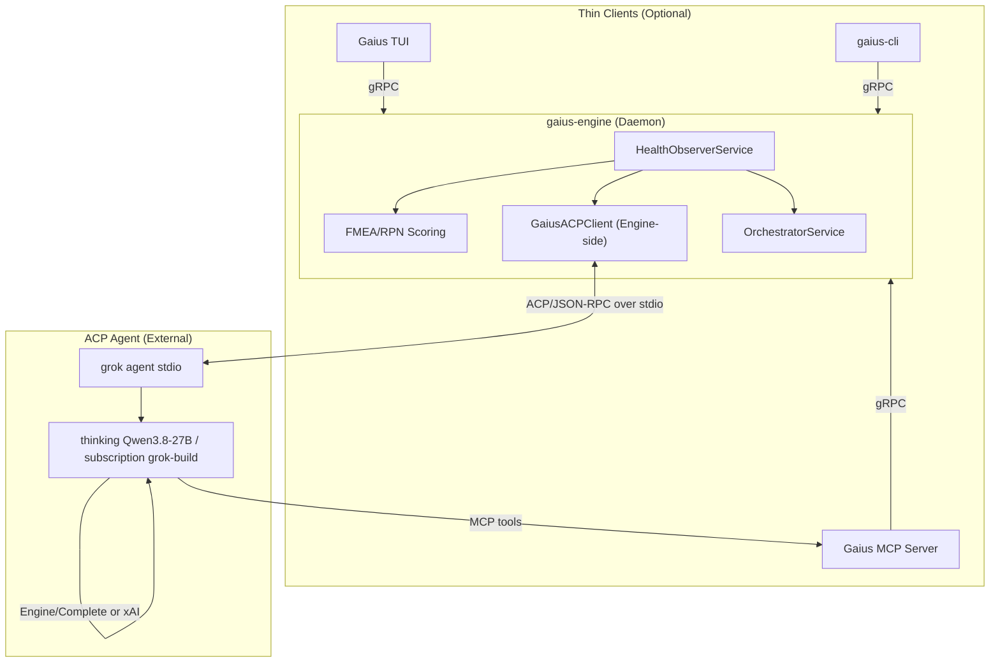
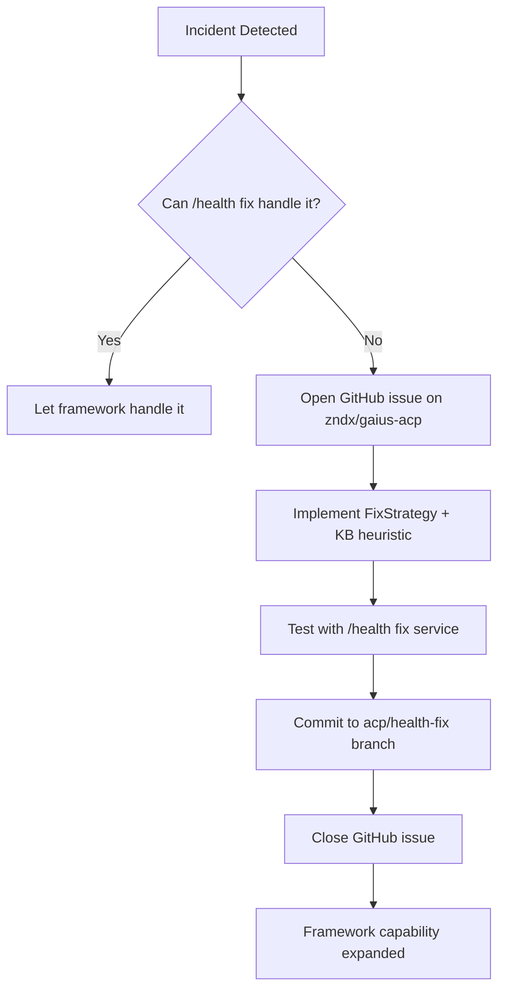

# Agent Client Protocol (ACP) Integration

This package provides ACP client integration for connecting Gaius to grok-build
(default: local thinking Qwen3.8-27B via Engine/Complete; escalate with a Grok
subscription), enabling autonomous health maintenance and framework evolution.

## Overview

The Agent Client Protocol (ACP) is a JSON-RPC 2.0 over stdio protocol that
standardizes communication between AI agent clients and hosts. Unlike MCP
(Model Context Protocol) which focuses on data and tools access, ACP defines
where the agent lives in your workflow and how it communicates bidirectionally.

**Key Insight**: The ACP agent acts as a *meta-level maintainer*. Rather than
just fixing issues one-off, it evolves the `/health fix` framework itself—
teaching Gaius to heal autonomously.

## Architecture

The HealthObserver runs inside the gaius-engine daemon, enabling autonomous
self-healing even when no clients are connected. The ACP agent interacts with
the engine via the MCP server's gRPC thin client.



**Key Points**:
- HealthObserver lives in the engine daemon, not in thin clients
- Engine can self-heal autonomously via `devenv up` without any client
- MCP tools call engine via gRPC (thin client architecture)
- The ACP agent accesses engine services through MCP's gRPC calls

## Components

### `client.py` - ACP Client

The `GaiusACPClient` manages the connection to the ACP agent:

```python
from gaius.acp import GaiusACPClient, ACPConfig

async with GaiusACPClient() as client:
    response = await client.prompt(
        "Analyze health report and suggest framework improvements"
    )
```

**Key Features**:
- Spawns grok-build via `grok agent stdio` (thinking by default)
- Auto-configures Gaius MCP server in the session
- Handles filesystem and terminal permissions
- Streams responses via configurable callback
- 16MB buffer limit for large file operations

### `prompts.py` - System Prompts and Workflow

Defines how the ACP agent should behave as the health maintenance agent:

```python
from gaius.acp import WorkflowMode, build_system_prompt

# Generate system prompt for observation mode
prompt = build_system_prompt(
    mode=WorkflowMode.OBSERVE,
    github_repo="zndx/gaius-acp",
)
```

**Workflow Modes**:
| Mode | Purpose |
|------|---------|
| `OBSERVE` | Gather diagnostics, identify gaps, recommend (no execution) |
| `INTERVENE` | Implement fixes, create KB heuristics, verify |
| `REPORT` | Generate coverage analysis and recommendations |

**Cadence Policy**:
- Max 3 GitHub issues per 24 hours
- Min 5 minutes between restart attempts
- Max 3 restarts per endpoint per hour
- All changes on `acp/health-fix` branch

### `security.py` - GitHub Security Controls

Multi-layer protection against information leakage and prompt injection:

```python
from gaius.acp import GitHubSecurityGuard

guard = GitHubSecurityGuard.from_config()
await guard.verify_repo("zndx/gaius-acp")  # Verifies allowlist + private
```

**Security Layers**:

| Layer | Check | Purpose |
|-------|-------|---------|
| 0 | Format validation | Reject malformed repo names |
| 1 | HOCON allowlist | Explicit repo patterns only |
| 2 | Visibility verification | Must be private (via gh API) |
| 3 | Content sanitization | Redact secrets, strip injection |

**IMPORTANT**: Security verification is **MANDATORY**. There is no option to
disable it—this prevents generated code from bypassing security checks.

## Configuration

### HOCON Config (`~/.config/gaius/acp.conf`)

```hocon
acp {
  # thinking = grok-build on local Qwen3.8-27B (default)
  # grok     = grok-build + Grok subscription (escalate)
  agent = "thinking"

  github {
    # Only this repo is allowed for ACP issue tracking
    allowed_repos = ["zndx/gaius-acp"]

    # Require private visibility (MANDATORY)
    require_private = true

    # Re-verify on each operation
    verify_on_each_operation = true

    # Cache visibility for 5 minutes
    cache_visibility_seconds = 300
  }
}
```

### Environment

The ACP client automatically removes sensitive API keys from the spawned
process environment to prevent credential leakage to the adapter process.

## Usage Patterns

### Health Incident Escalation (Engine-Side)

The HealthObserverService in gaius-engine handles escalation automatically.
When an incident exceeds FMEA thresholds, the engine spawns an ACP session:

```python
# This happens inside HealthObserverService in the engine daemon
# Users don't need to call this directly - it's automatic

class HealthObserverService:
    async def _escalate_to_acp(self, incident: HealthIncident) -> None:
        """Escalate to ACP agent when Tier 0/1 remediation fails."""
        from gaius.acp import GaiusACPClient, build_incident_prompt

        prompt = build_incident_prompt(
            incident=incident.to_dict(),
            mode=WorkflowMode.OBSERVE,
        )

        async with GaiusACPClient() as client:
            analysis = await client.prompt(prompt)
            # ACP agent uses MCP tools to diagnose and fix
```

### Monitoring via MCP Tools

Thin clients (MCP, TUI, CLI) can monitor and control the HealthObserver
via gRPC calls to the engine:

```python
# From MCP tool - calls engine via gRPC
from gaius.client.grpc_client import get_grpc_client

async def check_health():
    client = await get_grpc_client()
    status = await client.call("HealthObserver", "status")
    return status
```

### Streaming to TUI

The ACP client supports streaming responses to a TUI panel:

```python
from gaius.acp import GaiusACPClient, ACPConfig, StreamCallback

async def display_stream(chunk_type: str, content: str):
    """Display streaming content in TUI panel."""
    if chunk_type == "text":
        panel.append_text(content)
    elif chunk_type == "tool_start":
        panel.show_tool_activity(content)

config = ACPConfig(stream_callback=display_stream)
async with GaiusACPClient(config) as client:
    await client.prompt("Analyze system health...")
```

**Chunk Types**:
- `text` - Agent message text
- `thought` - Reasoning/thinking content
- `tool_start` - Tool invocation started
- `tool_progress` - Tool execution progress
- `tool_update` - Tool completed

### Framework Evolution Workflow

The primary mission of the ACP agent is to evolve the `/health fix` framework:



Note: The `acp/health-fix` branch naming reflects that the ACP agent operates
on an isolated branch for human review before merge.

## Security Considerations

### Attack Vectors Mitigated

| Attack | Mitigation |
|--------|------------|
| Info leak via public repo | Layer 2: visibility verification |
| Prompt injection from issues | Layer 1: explicit allowlist |
| Credential exposure | Layer 3: content sanitization |
| Repo confusion | Layer 0+1: format + exact match |
| Visibility change attack | Re-verify on each operation |

### Content Sanitization

Before any content is included in GitHub issues:

```python
from gaius.acp import sanitize_issue_content

# Automatically redacts:
# - API keys (Anthropic, OpenAI, AWS)
# - GitHub tokens (PAT, OAuth, App)
# - Prompt injection markers
sanitized = sanitize_issue_content(raw_content)
```

### Issue Title Validation

```python
from gaius.acp import validate_issue_title

# Must start with [HEALTH-FIX] prefix
title = validate_issue_title("[HEALTH-FIX] GPU_001: Implement OOM fix")
```

## Dependencies

- `agent-client-protocol` - ACP Python SDK
- `grok` CLI (grok-build) - default local thinking; subscription to escalate
- `gh` - GitHub CLI for API operations
- `pyhocon` (optional) - HOCON config parsing

## Guru Meditation Codes

| Code | Description |
|------|-------------|
| `#ACP.00000001.CONNFAIL` | Connection to ACP agent failed |
| `#ACP.00000002.TIMEOUT` | Connection timeout |
| `#ACP.00000003.NOTCONN` | Operation on disconnected client |
| `#ACP.00000004.PROMPTTIMEOUT` | Prompt response timeout |
| `#ACP.00000005.PROMPTFAIL` | Prompt execution failed |
| `#ACP.00000010.GHSECFAIL` | GitHub security check failed |
| `#ACP.SEC.00000002.NOTALLOWED` | Repo not in allowlist |
| `#ACP.SEC.00000003.NOTPRIVATE` | Repo not private |
| `#ACP.SEC.00000004.NOTCONFIGURED` | No repos configured |

## References

- [Agent Client Protocol Specification](https://github.com/anthropics/agent-client-protocol)
- [Gaius Health Framework](../health/README.md)
- [FMEA Failure Mode Catalog](../health/fmea/README.md)

## Development

All ACP agent code changes should go to the `acp/health-fix` branch
for human review before merging to trunk.

```bash
# Switch to development branch
git checkout acp/health-fix

# Test ACP connection
uv run python -c "
import asyncio
from gaius.acp import GaiusACPClient

async def test():
    async with GaiusACPClient() as client:
        print(f'Connected: {client.session_id}')
        resp = await client.prompt('Say hello')
        print(resp)

asyncio.run(test())
"
```

---

<!-- GAI:META
module: gaius.acp
layer: L3-engine
key_types: [GaiusACPClient, ACPConfig, StreamCallback, WorkflowMode, GitHubSecurityGuard, VisibilityCache]
key_funcs: [prompt, build_system_prompt, build_incident_prompt, sanitize_issue_content, validate_issue_title, verify_repo, from_config]
submodules: [client, prompts, security]
depends: [agent-client-protocol, gh-cli, pyhocon]
dependents: [health.observe]
config_keys: [acp.github.allowed_repos, acp.github.require_private, acp.github.verify_on_each_operation, acp.github.cache_visibility_seconds]
env_vars: [ANTHROPIC_API_KEY]
grpc_services: []
cross_module_calls:
  - from: health.observe.HealthObserver._tier2_remediate_acp
    to: acp.GaiusACPClient.prompt
    purpose: Escalate complex health incidents to ACP agent for framework evolution
  - from: health.observe.HealthObserver._tier2_remediate_acp
    to: acp.build_incident_prompt
    purpose: Format incident details for ACP agent analysis
  - from: health.healing_events.HealingEventRecorder.record_acp_escalation_*
    to: storage.database.get_pool
    purpose: Persist verbose ACP session history for narrative reports
guru_codes: [ACP.00000001.CONNFAIL, ACP.00000002.TIMEOUT, ACP.00000003.NOTCONN, ACP.00000004.PROMPTTIMEOUT, ACP.00000005.PROMPTFAIL, ACP.00000010.GHSECFAIL, ACP.SEC.00000002.NOTALLOWED, ACP.SEC.00000003.NOTPRIVATE, ACP.SEC.00000004.NOTCONFIGURED]
fail_fast: true
-->
