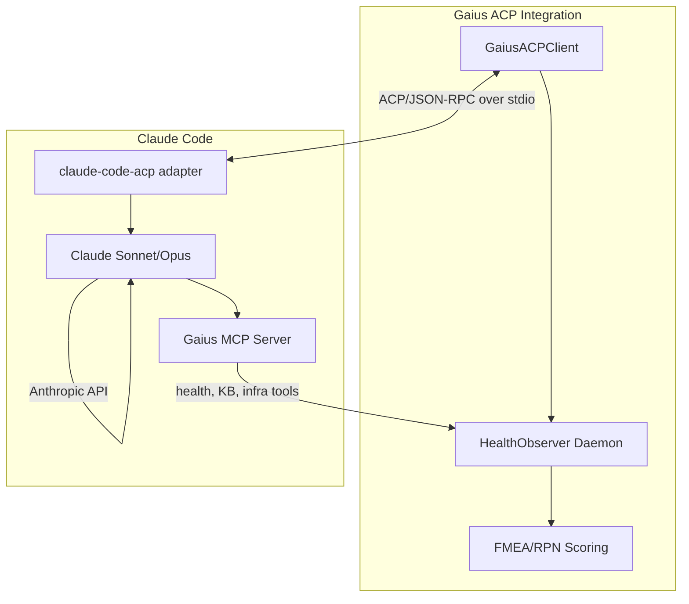
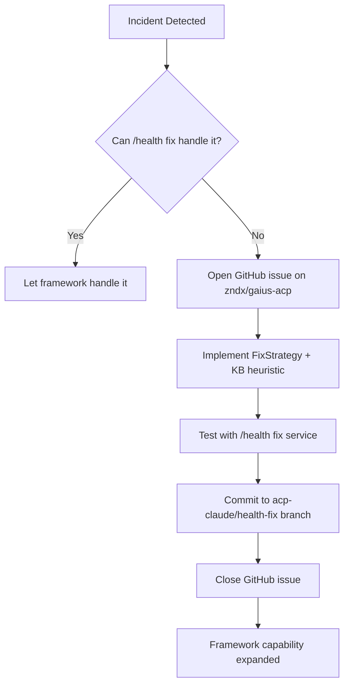

# Agent Client Protocol (ACP) Integration

This package provides ACP client integration for connecting Gaius to Claude Code,
enabling autonomous health maintenance and framework evolution.

## Overview

The Agent Client Protocol (ACP) is a JSON-RPC 2.0 over stdio protocol that
standardizes communication between AI agent clients and hosts. Unlike MCP
(Model Context Protocol) which focuses on data and tools access, ACP defines
where the agent lives in your workflow and how it communicates bidirectionally.

**Key Insight**: ACP-Claude acts as a *meta-level maintainer*. Rather than
just fixing issues one-off, it evolves the `/health fix` framework itself—
teaching Gaius to heal autonomously.

## Architecture



## Components

### `client.py` - ACP Client

The `GaiusACPClient` manages the connection to Claude Code:

```python
from gaius.acp import GaiusACPClient, ACPConfig

async with GaiusACPClient() as client:
    response = await client.prompt(
        "Analyze health report and suggest framework improvements"
    )
```

**Key Features**:
- Spawns Claude Code via the `@zed-industries/claude-code-acp` adapter
- Auto-configures Gaius MCP server in the session
- Handles filesystem and terminal permissions
- Streams responses via configurable callback
- 16MB buffer limit for large file operations

### `prompts.py` - System Prompts and Workflow

Defines how Claude Code should behave as the health maintenance agent:

```python
from gaius.acp import WorkflowMode, build_system_prompt

# Generate system prompt for observation mode
prompt = build_system_prompt(
    mode=WorkflowMode.OBSERVE,
    github_repo="zndx/gaius-acp",
)
```

**Workflow Modes**:
| Mode | Purpose |
|------|---------|
| `OBSERVE` | Gather diagnostics, identify gaps, recommend (no execution) |
| `INTERVENE` | Implement fixes, create KB heuristics, verify |
| `REPORT` | Generate coverage analysis and recommendations |

**Cadence Policy**:
- Max 3 GitHub issues per 24 hours
- Min 5 minutes between restart attempts
- Max 3 restarts per endpoint per hour
- All changes on `acp-claude/health-fix` branch

### `security.py` - GitHub Security Controls

Multi-layer protection against information leakage and prompt injection:

```python
from gaius.acp import GitHubSecurityGuard

guard = GitHubSecurityGuard.from_config()
await guard.verify_repo("zndx/gaius-acp")  # Verifies allowlist + private
```

**Security Layers**:

| Layer | Check | Purpose |
|-------|-------|---------|
| 0 | Format validation | Reject malformed repo names |
| 1 | HOCON allowlist | Explicit repo patterns only |
| 2 | Visibility verification | Must be private (via gh API) |
| 3 | Content sanitization | Redact secrets, strip injection |

**IMPORTANT**: Security verification is **MANDATORY**. There is no option to
disable it—this prevents generated code from bypassing security checks.

## Configuration

### HOCON Config (`~/.config/gaius/acp.conf`)

```hocon
acp {
  github {
    # Only this repo is allowed for ACP issue tracking
    allowed_repos = ["zndx/gaius-acp"]

    # Require private visibility (MANDATORY)
    require_private = true

    # Re-verify on each operation
    verify_on_each_operation = true

    # Cache visibility for 5 minutes
    cache_visibility_seconds = 300
  }
}
```

### Environment

The ACP client automatically removes `ANTHROPIC_API_KEY` from the spawned
process environment to ensure Claude Code uses subscription authentication
instead of API credits.

## Usage Patterns

### Health Incident Escalation

When the HealthObserver daemon detects an incident that exceeds the FMEA
risk threshold, it can escalate to Claude Code via ACP:

```python
from gaius.acp import GaiusACPClient, build_incident_prompt, WorkflowMode

async def escalate_incident(incident: HealthIncident):
    prompt = build_incident_prompt(
        incident=incident.to_dict(),
        mode=WorkflowMode.OBSERVE,
    )

    async with GaiusACPClient() as client:
        analysis = await client.prompt(prompt)
        # Claude Code will use MCP tools to diagnose
        # and recommend framework improvements
```

### Streaming to TUI

The ACP client supports streaming responses to a TUI panel:

```python
from gaius.acp import GaiusACPClient, ACPConfig, StreamCallback

async def display_stream(chunk_type: str, content: str):
    """Display streaming content in TUI panel."""
    if chunk_type == "text":
        panel.append_text(content)
    elif chunk_type == "tool_start":
        panel.show_tool_activity(content)

config = ACPConfig(stream_callback=display_stream)
async with GaiusACPClient(config) as client:
    await client.prompt("Analyze system health...")
```

**Chunk Types**:
- `text` - Agent message text
- `thought` - Reasoning/thinking content
- `tool_start` - Tool invocation started
- `tool_progress` - Tool execution progress
- `tool_update` - Tool completed

### Framework Evolution Workflow

The primary mission of ACP-Claude is to evolve the `/health fix` framework:



## Security Considerations

### Attack Vectors Mitigated

| Attack | Mitigation |
|--------|------------|
| Info leak via public repo | Layer 2: visibility verification |
| Prompt injection from issues | Layer 1: explicit allowlist |
| Credential exposure | Layer 3: content sanitization |
| Repo confusion | Layer 0+1: format + exact match |
| Visibility change attack | Re-verify on each operation |

### Content Sanitization

Before any content is included in GitHub issues:

```python
from gaius.acp import sanitize_issue_content

# Automatically redacts:
# - API keys (Anthropic, OpenAI, AWS)
# - GitHub tokens (PAT, OAuth, App)
# - Prompt injection markers
sanitized = sanitize_issue_content(raw_content)
```

### Issue Title Validation

```python
from gaius.acp import validate_issue_title

# Must start with [HEALTH-FIX] prefix
title = validate_issue_title("[HEALTH-FIX] GPU_001: Implement OOM fix")
```

## Dependencies

- `agent-client-protocol` - ACP Python SDK
- `@zed-industries/claude-code-acp` - Node.js adapter (npm)
- `gh` - GitHub CLI for API operations
- `pyhocon` (optional) - HOCON config parsing

## Guru Meditation Codes

| Code | Description |
|------|-------------|
| `#ACP.00000001.CONNFAIL` | Connection to Claude Code failed |
| `#ACP.00000002.TIMEOUT` | Connection timeout |
| `#ACP.00000003.NOTCONN` | Operation on disconnected client |
| `#ACP.00000004.PROMPTTIMEOUT` | Prompt response timeout |
| `#ACP.00000005.PROMPTFAIL` | Prompt execution failed |
| `#ACP.00000010.GHSECFAIL` | GitHub security check failed |
| `#ACP.SEC.00000002.NOTALLOWED` | Repo not in allowlist |
| `#ACP.SEC.00000003.NOTPRIVATE` | Repo not private |
| `#ACP.SEC.00000004.NOTCONFIGURED` | No repos configured |

## References

- [Agent Client Protocol Specification](https://github.com/anthropics/agent-client-protocol)
- [claude-code-acp Adapter](https://github.com/zed-industries/claude-code-acp)
- [Gaius Health Framework](../health/README.md)
- [FMEA Failure Mode Catalog](../health/fmea/README.md)

## Development

All ACP-Claude code changes should go to the `acp-claude/health-fix` branch
for human review before merging to trunk.

```bash
# Switch to development branch
git checkout acp-claude/health-fix

# Test ACP connection
uv run python -c "
import asyncio
from gaius.acp import GaiusACPClient

async def test():
    async with GaiusACPClient() as client:
        print(f'Connected: {client.session_id}')
        resp = await client.prompt('Say hello')
        print(resp)

asyncio.run(test())
"
```
