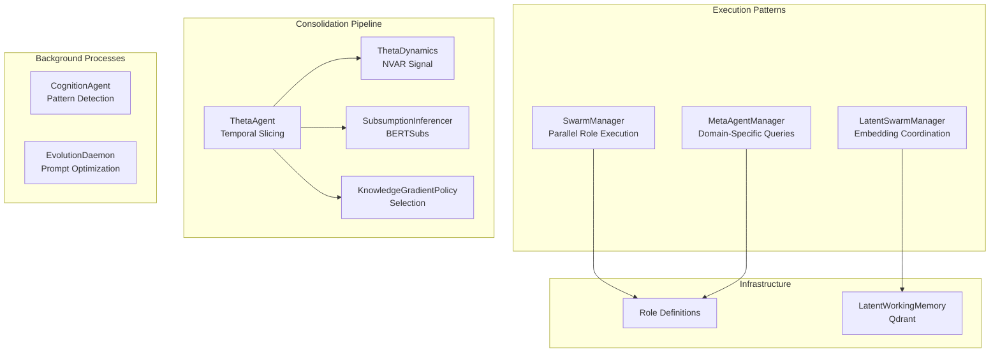
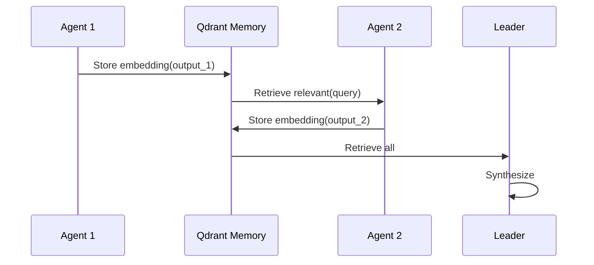

# Gaius Agents

LLM orchestration patterns for domain analysis. This module provides role-based prompt execution, parallel inference coordination, and temporal consolidation pipelines.

> **Terminology Note**: Components in this module are labeled "agents" following pre-2024 conventions (cf. LangChain, AutoGPT). They are *orchestrated pipelines* rather than autonomous agents in the contemporary sense—they lack observe-reason-act loops, self-directed goal pursuit, and multi-step planning with self-correction.

## Architecture



## Module Structure

```
agents/
├── swarm.py              # SwarmManager, parallel execution
├── roles.py              # Role definitions (system prompts)
├── metaagent_swarm.py    # MetaAgentManager, domain queries
├── cognition.py          # CognitionAgent, pattern detection
├── theta/                # Consolidation pipeline
│   ├── agent.py          # ThetaAgent orchestrator
│   ├── consolidation.py  # ThetaDynamics (NVAR)
│   ├── subsumption.py    # BERTSubs integration
│   ├── kg_policy.py      # Knowledge Gradient selection
│   ├── augmentation.py   # Document link injection
│   └── effectiveness.py  # SHAP-based evaluation
├── latent/
│   ├── memory.py         # LatentWorkingMemory
│   └── clt_memory.py     # Cross-Layer Transcoder features
└── evolution/
    ├── daemon.py         # Background optimization
    ├── engine.py         # Evolution loop
    └── merge_coordinator.py  # Model merging
```

## Swarm Execution

### Role-Based Prompts

The swarm pattern executes multiple LLM calls with distinct system prompts, collecting responses for synthesis. Each role defines a perspective on the input domain.

| Role | Perspective | Temperature |
|------|-------------|-------------|
| Leader | Strategic synthesis | 0.7 |
| Risk | Threat identification | 0.6 |
| Optimizer | Efficiency analysis | 0.7 |
| Planner | Roadmap development | 0.7 |
| Critic | Adversarial review | 0.8 |
| Executor | Implementation assessment | 0.6 |
| Adversary | Stress testing | 0.8 |

### Execution Model

```python
# Parallel execution with role-specific prompts
swarm = SwarmManager()
result = await swarm.run_round(
    domain="pension asset allocation",
    context="LDI strategy analysis",
)

# Result contains individual responses + synthesized consensus
for response in result.responses:
    print(f"{response.role}: {response.content[:100]}...")
```

Execution is *parallel* (concurrent LLM calls) but *not agentic*—roles do not observe each other's outputs, make decisions about next actions, or iterate based on feedback.

### Latent Swarm (LatentMAS)

An optimization reducing inter-agent token transfer by sharing embeddings instead of text (Guo et al., 2024). Agents store output embeddings in Qdrant; subsequent agents retrieve relevant context via semantic search rather than receiving full text.

Token reduction: 70–90% compared to text-based coordination.



## ThetaAgent: Consolidation Pipeline

ThetaAgent executes a deterministic consolidation sequence for cross-temporal knowledge linking. The pipeline draws on nonlinear dynamics for timing signals and ontological inference for relationship discovery.

### Pipeline Stages

```
1. Temporal Slicing → 2. NVAR Signal → 3. BERTSubs Inference → 4. KG Selection → 5. Augmentation
```

#### Stage 1: Temporal Slicing

Documents are organized into weekly slices (`YYYY-WNN` format). Each slice represents a temporal context for consolidation.

#### Stage 2: NVAR Dynamics

Nonlinear Vector AutoRegression (NVAR) using reservoir computing (Gauthier et al., 2021) computes a consolidation signal from embedding centroid trajectories.

Given slice centroids $\mathbf{c}_1, \ldots, \mathbf{c}_t \in \mathbb{R}^{768}$, NVAR predicts $\hat{\mathbf{c}}_{t+1}$ and computes:

$$\text{drift} = \|\hat{\mathbf{c}}_{t+1} - \mathbf{c}_t\|_2$$

$$\text{urgency} = \sigma(\alpha \cdot \text{drift})$$

where $\sigma$ is the sigmoid function and $\alpha$ scales drift to urgency. High urgency indicates rapid semantic drift requiring consolidation attention.

#### Stage 3: BERTSubs Inference

Subsumption relationships between concepts are inferred using BERTSubs (Chen et al., 2023) from DeepOnto. The inferencer identifies $A \sqsubseteq B$ (A is-a B) relationships via fine-tuned BERT classification on ontology subsumptions.

Requirements:
- OWL domain ontology with `rdfs:subClassOf` axioms
- DeepOnto with JVM (via JPype)
- Sufficient class count for training data extraction (~50+ classes)

#### Stage 4: Knowledge Gradient Selection

Candidate relationships are filtered using the Knowledge Gradient (KG) policy (Powell & Ryzhov, 2012). KG balances exploration (learning about uncertain candidates) against exploitation (selecting high-confidence relationships):

$$\text{KG}(x \mid S) = \mathbb{E}[\max_{x'} \mu_{n+1}(x') \mid S_n = S, x_n = x] - \max_{x'} \mu_n(x')$$

where $\mu_n(x)$ is the posterior mean value of candidate $x$ after $n$ observations. Candidates with high KG scores offer the greatest expected improvement in overall selection quality.

#### Stage 5: Document Augmentation

Selected relationships are injected into source documents as:
- **Wikilinks**: `[[Target Document]]` for navigation
- **Action links**: `[action:search "query"]` for deferred execution

### Usage

```python
theta = ThetaAgent(kb_root="build/dev")
result = await theta.run_consolidation(
    temporal_slice="2025-W52",
    max_candidates=10,
)

print(f"Candidates evaluated: {result.candidates_evaluated}")
print(f"Documents augmented: {result.documents_augmented}")
```

## MetaAgent: Domain Query Coordination

MetaAgentManager coordinates specialist "analysts" to answer natural language questions by querying structured data sources. Each analyst translates questions into domain-specific queries (Cypher for lineage graphs, SQL for metrics).

```
User Question → [Lineage, Ops, Resource, Topology] Analysts → Correlator → Answer
```

This is *parallel execution with synthesis*, not autonomous multi-agent reasoning. Analysts execute fixed query patterns; the Correlator is a single LLM call synthesizing results.

## Cognition: Pattern Detection

CognitionAgent analyzes recent KB activity to generate "thoughts"—observations about patterns, connections, and questions. Execution is triggered (scheduled or manual), not continuous.

| Thought Type | Description |
|--------------|-------------|
| `PATTERN` | Recurring themes across documents |
| `CONNECTION` | Cross-domain relationships |
| `CURIOSITY` | Questions warranting investigation |
| `SELF_OBSERVATION` | Meta-cognitive patterns |

## Evolution: Prompt Optimization

The evolution subsystem applies prompt optimization techniques during GPU idle periods.

### Optimization Methods

| Method | Description | Reference |
|--------|-------------|-----------|
| APO | Automatic Prompt Optimization | (Zhou et al., 2023) |
| GEPA | Genetic Evolution of Prompt Architectures | (Guo et al., 2024) |

### Model Merging

Agent versions can be combined using parameter-space merging:

| Method | Formula |
|--------|---------|
| Linear | $\theta = \alpha\theta_1 + (1-\alpha)\theta_2$ |
| TIES | Resolves sign conflicts (Yadav et al., 2023) |
| DARE | Drop and rescale (Yu et al., 2024) |

## Latent Memory

Qdrant-backed working memory for cross-component coordination:

```python
memory = LatentWorkingMemory()
await memory.store(agent_id="risk", content="...", domain="pension")
context = await memory.retrieve(agent_id="leader", domain="pension", limit=5)
```

Collection schema:
```
gaius_latent_memory
├── domain: string
├── agent_id: string
├── embedding: vector[768]
├── timestamp: datetime
└── session_id: string
```

## Configuration

```hocon
agents {
    swarm {
        parallel = true
        timeout = 60
    }
    theta {
        confidence_threshold = 0.8
        research_mode = true  # Bypass KG cost threshold
    }
    evolution {
        enabled = true
        idle_threshold = 60
        cycle_interval = 3600
    }
}
```

## References

- Chen, J., He, Y., Geng, Y., Jiménez-Ruiz, E., Dong, H., & Horrocks, I. (2023). Contextual semantic embeddings for ontology subsumption prediction. *World Wide Web*, 26, 2569–2591.
- Gauthier, D. J., Bollt, E., Griffith, A., & Barbosa, W. A. (2021). Next generation reservoir computing. *Nature Communications*, 12, 5564.
- Guo, T., Chen, X., Wang, Y., et al. (2024). Large Language Model based Multi-Agents: A Survey of Progress and Challenges. *arXiv:2402.01680*.
- Powell, W. B., & Ryzhov, I. O. (2012). *Optimal Learning*. Wiley.
- Yadav, P., Tam, D., Choshen, L., Raffel, C., & Bansal, M. (2023). TIES-Merging: Resolving Interference When Merging Models. *NeurIPS 2023*.
- Yu, L., Yu, B., Yu, H., Huang, F., & Li, Y. (2024). Language Models are Super Mario: Absorbing Abilities from Homologous Models as a Free Lunch. *ICML 2024*.
- Zhou, Y., Muresanu, A. I., Han, Z., et al. (2023). Large Language Models Are Human-Level Prompt Engineers. *ICLR 2023*.

## See Also

- [Parent README](../README.md) — System overview
- [Engine README](../engine/README.md) — gRPC integration
- [Models README](../models/README.md) — Evaluation and versioning
