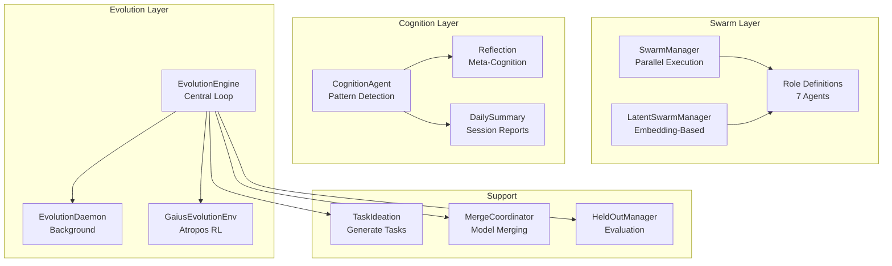
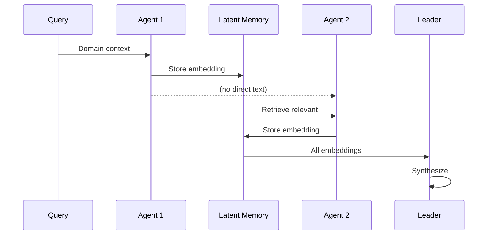
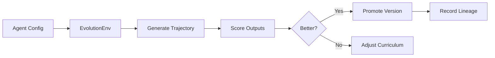

# Gaius Agents

Multi-agent swarms, autonomous cognition, and self-evolving agent systems for Gaius.

## Architecture



## Module Structure

```
agents/
├── __init__.py          # Module exports
├── roles.py             # Agent role definitions
├── swarm.py             # SwarmManager, LatentSwarmManager
├── cognition.py         # CognitionAgent for pattern detection
├── reflection.py        # Meta-cognitive reflection
├── daily_summary.py     # Session summary generation
├── latent/
│   ├── __init__.py
│   └── memory.py        # Qdrant-backed latent memory
├── evolution/
│   ├── __init__.py
│   ├── daemon.py        # Background evolution daemon
│   ├── engine.py        # Central evolution loop
│   ├── runner.py        # Agent execution
│   ├── atropos_env.py   # Atropos RL compatibility
│   ├── curriculum.py    # Training curriculum
│   ├── collector.py     # Training data collection
│   ├── evaluation.py    # Held-out evaluation
│   ├── task_ideation.py # Autonomous task generation
│   ├── task_authoring.py # Task formatting
│   ├── reasoning_tasks.py # Nous Research format
│   ├── merge_coordinator.py # Model merging
│   ├── orchestrated.py  # Engine integration
│   └── preemption.py    # GPU preemption handling
└── modeladd/
    ├── __init__.py
    ├── orchestrator.py  # Model addition workflow
    ├── prompts.py       # ModelSpec generation prompts
    ├── sandbox.py       # Validation sandbox
    └── tools.py         # MCP tools
```

## Swarm Roles

### Core Roles

| Role | Purpose | Temperature | Behavior |
|------|---------|-------------|----------|
| **Leader** | Strategic oversight, consensus | 0.7 | Center-seeking |
| **Risk** | Threat identification | 0.6 | Peripheral |
| **Optimizer** | Efficiency, opportunities | 0.7 | Cluster-seeking |
| **Planner** | Long-term roadmap | 0.7 | Random |
| **Critic** | Devil's advocate | 0.8 | Peripheral |
| **Executor** | Implementation simulation | 0.6 | Cluster-seeking |
| **Adversary** | Stress testing | 0.8 | Peripheral |

### Extended Roles

| Role | Purpose |
|------|---------|
| **Synthesizer** | Combine perspectives |
| **Questioner** | Generate inquiry |
| **Metacognizer** | Pattern recognition |

### Role Definition

```python
@dataclass
class RoleDefinition:
    role: AgentRole
    name: str
    description: str
    system_prompt: str
    color: str  # For grid visualization

    temperature: float = 0.7
    max_tokens: int = 1024

    # Model affinity
    preferred_model_id: str | None = None
    model_capabilities: list[str] = field(default_factory=list)
    min_context_length: int = 4096

    # Grid projection
    projection_behavior: Literal["center", "peripheral", "random"]
    cluster_affinity: float  # 0=avoid, 1=seek clusters

    # Collaboration
    responds_to: list[AgentRole] = field(default_factory=list)
    triggers: list[AgentRole] = field(default_factory=list)
```

## Swarm Execution

### Standard Swarm

Text-based parallel agent execution:

```python
from gaius.agents import SwarmManager, run_swarm_round

swarm = SwarmManager()
result = await swarm.run_round(
    domain="pension asset allocation",
    context="Recent KB entries about LDI strategies",
)

for response in result.responses:
    print(f"{response.role.value}: {response.content[:100]}...")

print(f"Consensus: {result.consensus}")
```

### Latent Swarm (LatentMAS)

Embedding-based collaboration with 70-90% token reduction:



```python
from gaius.agents import LatentSwarmManager, run_latent_swarm_round

latent_swarm = LatentSwarmManager()
result = await latent_swarm.run_round(
    domain="pension risk",
    context="",
)
# ~70-90% fewer tokens than text-based swarm
```

## Cognition Agent

Generates "thoughts" between sessions - patterns, connections, curiosities.

### Thought Types

| Type | Description | Example |
|------|-------------|---------|
| `PATTERN` | Emerging trends | "Raft mentions up 3x this week" |
| `CONNECTION` | Cross-domain links | "LDI and climate risk share frameworks" |
| `CURIOSITY` | Questions to investigate | "Why do LLM optimizations ignore drift?" |
| `MOMENTUM` | Trending topics | "Byzantine fault tolerance trending" |
| `OBSERVATION` | Notable changes | "Heavy distributed systems activity" |
| `SYNTHESIS` | Consolidated understanding | "Here's what we know about X" |
| `SELF_OBSERVATION` | Meta-cognition | "My patterns focus heavily on..." |
| `ENGINE_AUDIT` | System health | "Evolution cycles slowing..." |

### Usage

```python
from gaius.agents.cognition import get_cognition_agent

agent = get_cognition_agent()
thoughts = await agent.think()

for thought in thoughts:
    print(f"[{thought.thought_type.value}] {thought.title}")
    print(f"  {thought.summary}")
```

## Evolution System

### Atropos-Compatible RL

Integration with NousResearch's Atropos reinforcement learning framework:



### Evolution Engine

Central loop with proper GPU management:

```python
from gaius.agents.evolution import get_engine

engine = await get_engine()

# Run single cycle
result = await engine.run_evolution_cycle("leader")
print(f"Score: {result.score:.3f}")
print(f"Improvement: {result.improvement:.3f}")

# Get status
status = engine.get_status()
print(f"Cycles: {status['cycles_completed']}")
```

### Evolution Daemon

Background processing during GPU idle:

```python
from gaius.agents.evolution import get_evolution_daemon

daemon = get_evolution_daemon()
await daemon.start()

# Daemon monitors GPU utilization
# Runs evolution cycles when idle > threshold
# Rotates through agents: leader → risk → critic → ...
```

### Task Ideation

Autonomous generation of new reasoning tasks:

```python
from gaius.agents.evolution import get_task_ideation_agent

ideation = get_task_ideation_agent()
concepts = await ideation.ideate(max_concepts=5)

for concept in concepts:
    print(f"Task: {concept.name}")
    print(f"Capability: {concept.capability}")
    print(f"Novelty: {concept.novelty_score:.2f}")
```

### Model Merging

TIES/DARE-based version merging:

```python
from gaius.agents.evolution import get_merge_coordinator

coordinator = get_merge_coordinator()
result = await coordinator.run_merge_cycle("leader")

print(f"Parents: {result.parent_versions}")
print(f"New version: {result.merged_version_id}")
print(f"Score improvement: {result.score_improvement:.3f}")
```

## Knowledge Gradient Framework

Guides exploration vs exploitation trade-offs:

$$KG(x|S) = \mathbb{E}[\max_{x'} \mu_{n+1}(x') | S_n = S, x_n = x] - \max_{x'} \mu_n(x')$$

Where:
- $x$ = candidate action (topic to explore, agent to evolve)
- $S$ = current belief state
- $\mu_n$ = value estimate after $n$ observations
- $KG$ = expected improvement from learning about $x$

### Application

| Decision | High KG | Low KG |
|----------|---------|--------|
| Topic exploration | Uncertain, high-impact topics | Well-understood topics |
| Agent evolution | Agents with high variance | Stable, optimized agents |
| Task ideation | Novel capability gaps | Well-covered capabilities |

## Latent Memory

Qdrant-backed working memory for cross-agent coordination:

```python
from gaius.agents import get_latent_memory

memory = get_latent_memory()

# Store agent output as embedding
await memory.store(
    agent_id="risk",
    content="Analysis of LDI concentration risk...",
    domain="pension",
)

# Retrieve relevant context for another agent
context = await memory.retrieve(
    agent_id="leader",
    domain="pension",
    limit=5,
)
```

### Memory Structure

```
Qdrant Collection: gaius_latent_memory
├── domain: string (partition key)
├── agent_id: string
├── embedding: [768] (Nomic)
├── content_hash: string
├── timestamp: datetime
└── session_id: string
```

## Configuration

```hocon
agents {
    swarm {
        parallel = true
        default_roles = ["leader", "risk", "optimizer", "planner", "critic", "executor", "adversary"]
        timeout = 60
    }

    cognition {
        think_interval = 14400  # 4 hours
        max_thoughts = 5
        self_observation_interval = 28800  # 8 hours
    }

    evolution {
        enabled = true
        idle_threshold = 60
        cycle_interval = 3600
        rotation = ["leader", "risk", "critic", "optimizer"]
        min_examples = 10
    }
}
```

## See Also

- [Parent README](../README.md) - Module overview
- [Engine README](../engine/README.md) - Evolution service integration
- [Inference README](../inference/README.md) - Agent execution
