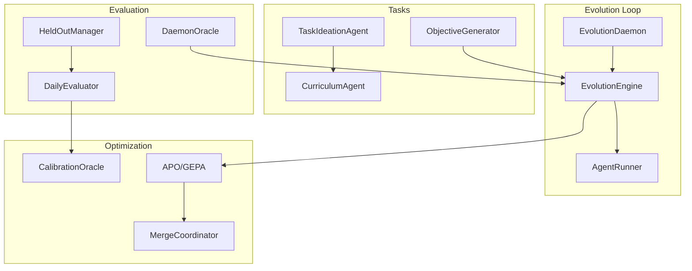
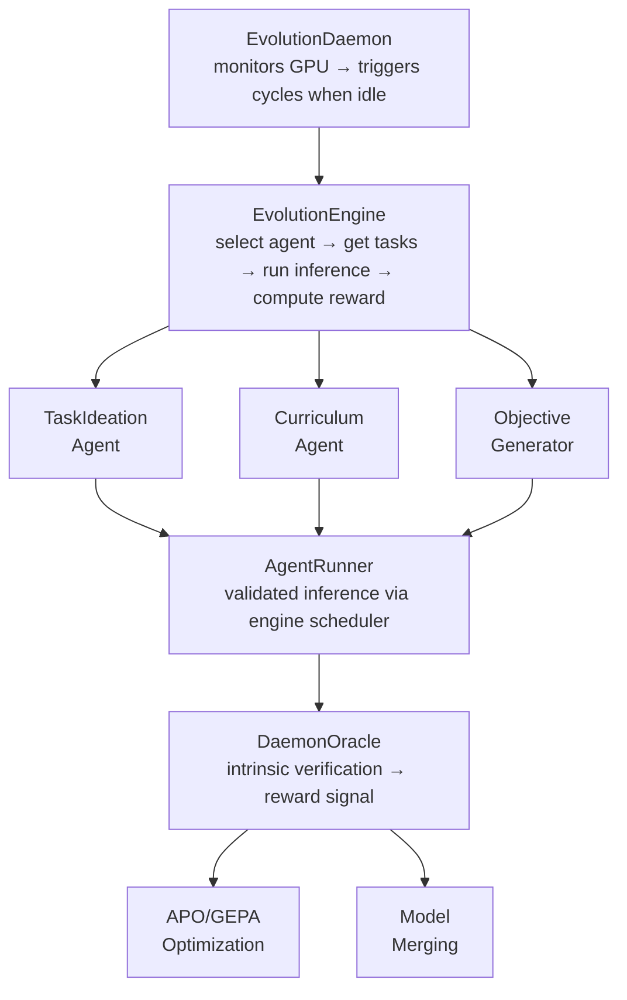

# Gaius Agents Evolution

Agent0-style autonomous self-improvement through RLVR (Reinforcement Learning with Verifiable Reward). Provides the evolution engine, daemon, and Atropos-compatible environment for continuous agent optimization.

## Architecture



## Module Structure

```
evolution/
├── __init__.py           # Module exports
├── daemon.py             # EvolutionDaemon background loop
├── engine.py             # EvolutionEngine central coordinator
├── runner.py             # AgentRunner for validated inference
├── preemption.py         # PreemptionManager for GPU sharing
├── atropos_env.py        # GaiusEvolutionEnv (Atropos BaseEnv adapter)
├── curriculum.py         # CurriculumAgent task ordering
├── collector.py          # TrainingCollector for Nous format
├── reasoning_tasks.py    # Nous Research task loading
├── evaluation.py         # HeldOutManager, DailyEvaluator
├── task_authoring.py     # TaskAuthor for upstream contribution
├── task_ideation.py      # TaskIdeationAgent for gap analysis
├── merge_coordinator.py  # TIES/DARE model merging
├── objective_generator.py # RASE objective→task conversion
├── daemon_oracle.py      # Intrinsic verification oracle
└── calibration.py        # Outer loop calibration
```

## Core Components

### EvolutionDaemon

Background daemon that monitors GPU utilization and runs optimization cycles when resources are idle:

```python
from gaius.agents.evolution import get_evolution_daemon

daemon = get_evolution_daemon()
await daemon.start()

# Status check
status = await daemon.status()
print(f"Cycles: {status.cycles_completed}")
print(f"Next agent: {status.next_agent}")
```

### EvolutionEngine

Central loop coordinating task selection, inference, and optimization:

```python
from gaius.agents.evolution import get_engine

engine = await get_engine()

# Run a single evolution cycle
result = await engine.run_evolution_cycle("leader")
print(f"Score: {result.score}")
print(f"Improved: {result.improved}")
```

### GaiusEvolutionEnv (Atropos Adapter)

Atropos-compatible interface for external RL frameworks:

```python
from gaius.agents.evolution import GaiusEvolutionEnv

env = GaiusEvolutionEnv("leader")

# Get next training item
item = await env.get_next_item()

# Score a response
reward = await env.score_response(response)
```

## Evolution Flow



## Key Types

### TaskItem

```python
@dataclass
class TaskItem:
    id: str
    agent_id: str
    input_prompt: str
    expected_output: str | None
    context: str | None
    difficulty: float
    capability: str
```

### Trajectory

```python
@dataclass
class Trajectory:
    task: TaskItem
    response: str
    reward: float
    verification_result: VerificationResult | None
```

### CycleResult

```python
@dataclass
class CycleResult:
    agent_id: str
    trajectories: list[Trajectory]
    avg_reward: float
    improved: bool
    new_version_id: str | None
```

## Task Sources

### Nous Research Format

Load reasoning tasks from JSONL:

```python
from gaius.agents.evolution import load_reasoning_tasks

tasks = load_reasoning_tasks("tasks/reasoning_v1.jsonl")
for task in tasks:
    print(f"{task.capability}: {task.question}")
```

### RASE Objectives

Generate tasks from KB objectives:

```python
from gaius.agents.evolution import get_objective_generator

gen = get_objective_generator()
tasks = await gen.generate_from_objective("research-synthesis-verification")
```

### Task Ideation

Autonomous task generation from capability gaps:

```python
from gaius.agents.evolution import get_task_ideation_agent

agent = get_task_ideation_agent()
gap_analysis = await agent.analyze_capability_gaps()
concepts = await agent.generate_task_concepts(gap_analysis)
```

## Evaluation

### Held-Out Evaluation

Objective evaluation against reserved query pool:

```python
from gaius.agents.evolution import get_daily_evaluator

evaluator = get_daily_evaluator()
summary = await evaluator.run_evaluation(sample_size=50)
print(f"Accuracy: {summary.accuracy:.2%}")
```

### Calibration

Cross-validate local vs frontier model scores:

```python
from gaius.agents.evolution import get_calibration_oracle

oracle = get_calibration_oracle()
result = await oracle.calibrate("leader", provider="cerebras")
print(f"Drift: {result.drift_detected}")
```

## Model Merging

TIES/DARE algorithms for combining agent versions:

```python
from gaius.agents.evolution import get_merge_coordinator

coordinator = get_merge_coordinator()
result = await coordinator.run_merge_cycle("leader")
print(f"Merged {len(result.parent_versions)} versions")
```

## Call Graph

```
# Evolution Daemon Path
mcp_server.py:start_evolution_daemon()
  └─→ evolution.daemon.get_evolution_daemon()
      └─→ EvolutionDaemon.start()
          └─→ asyncio.create_task(self._run_loop())
              └─→ [while running]
                  ├─→ preemption.check_gpu_idle()
                  └─→ engine.run_evolution_cycle(agent)

# Evolution Cycle Path
evolution.engine.EvolutionEngine.run_evolution_cycle()
  ├─→ curriculum.get_next_tasks(agent)
  │   └─→ objective_generator.generate_from_objectives()
  └─→ [for each task]
      ├─→ runner.run(task)
      │   └─→ scheduler.submit(prompt, priority=EVOLUTION)
      └─→ daemon_oracle.verify(response)
          └─→ rase.vm.Oracle.verify()
              └─→ compute_reward(result)

# Held-Out Evaluation Path
evolution.evaluation.DailyEvaluator.run_evaluation()
  └─→ [for each held-out query]
      ├─→ runner.run(query)
      └─→ xai_evaluator.evaluate(response)
          └─→ aggregate_scores()
              └─→ DailyEvalSummary

# Model Merge Path
evolution.merge_coordinator.MergeCoordinator.run_merge_cycle()
  ├─→ get_merge_candidates(agent)
  └─→ [if enough candidates]
      ├─→ mergekit.ties_merge(versions)
      └─→ validate_merged_model()
          └─→ register_new_version()
```

## Integration Points

| Component | Uses | Used By | Integration |
|-----------|------|---------|-------------|
| `EvolutionDaemon` | engine, preemption | mcp_server | `start()`, `stop()`, `status()` |
| `EvolutionEngine` | runner, oracle, curriculum | daemon | `run_evolution_cycle()` |
| `AgentRunner` | scheduler, inference | engine | `run()` |
| `DaemonOracle` | rase.vm | engine | `verify()` |
| `HeldOutManager` | storage | daily_evaluator | `get_queries()`, `add_query()` |
| `MergeCoordinator` | mergekit | mcp_server | `run_merge_cycle()` |
| `CalibrationOracle` | cerebras, xai | daemon | `calibrate()` |

## See Also

- [Parent README](../README.md) — Agents overview
- [RASE VM README](../../rase/vm/README.md) — Verification oracle
- [Models README](../../models/README.md) — Version management
- [Engine README](../../engine/README.md) — Scheduler integration

---

<!-- GAI:META
module: gaius.agents.evolution
layer: L5-orchestration
key_types: [EvolutionDaemon, EvolutionEngine, AgentRunner, GaiusEvolutionEnv, TaskItem, Trajectory, CycleResult, DaemonOracle, CalibrationOracle, MergeCoordinator, TaskIdeationAgent, HeldOutManager, DailyEvaluator]
key_funcs: [get_evolution_daemon, get_engine, get_runner, run_evolution_cycle, verify, calibrate, run_merge_cycle, get_task_ideation_agent, get_daily_evaluator]
singletons: [get_evolution_daemon, get_engine, get_runner, get_daemon_oracle, get_calibration_oracle, get_merge_coordinator]
submodules: []
depends: [rase.vm, models.registry, engine.services.scheduler, inference, providers.cerebras]
dependents: [mcp_server, engine.services.evolution]
config_keys: [evolution.idle_threshold_percent, evolution.min_idle_seconds, evolution.cycle_interval_seconds]
env_vars: [CEREBRAS_API_KEY, XAI_API_KEY]
grpc_services: []
atropos_compat: true
task_sources: [nous_research, rase_objectives, task_ideation]
call_paths:
  daemon: mcp.start_evolution_daemon→EvolutionDaemon.start→run_loop→engine.run_cycle
  cycle: engine.run_evolution_cycle→curriculum→runner.run→oracle.verify→compute_reward
  evaluate: DailyEvaluator.run_evaluation→held_out→runner→xai_evaluator→summary
  merge: MergeCoordinator.run_merge_cycle→get_candidates→mergekit.ties_merge→register
test_cmds:
  status: 'uv run gaius-cli --cmd "/evolve status"'
  trigger: 'uv run gaius-cli --cmd "/evolve trigger leader"'
  evaluate: 'uv run gaius-cli --cmd "/evolve evaluate --sample-size 20"'
guru_codes: [EV.00001.DAEMON_CRASH, EV.00002.ORACLE_FAIL, EV.00003.MERGE_FAIL, EV.00004.CALIBRATION_DRIFT]
fail_fast: true
-->
