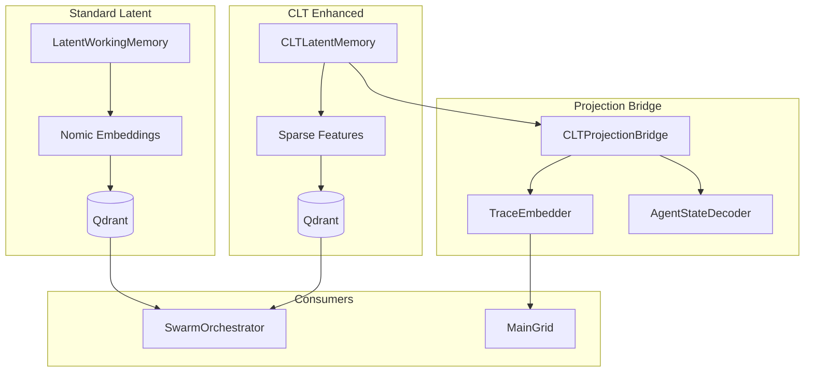
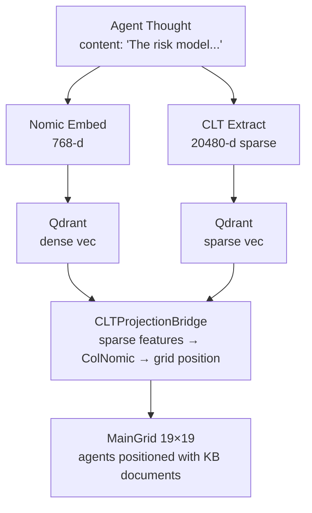

# Gaius Agents Latent

LatentMAS-style latent collaboration for multi-agent communication. Provides Qdrant-backed working memory and CLT (Cross-Layer Transcoder) enhanced memory for sharing embeddings between agents with 70-90% token reduction.

## Architecture



## Module Structure

```
latent/
├── __init__.py         # Module exports
├── memory.py           # LatentWorkingMemory (Nomic embeddings)
├── clt_memory.py       # CLTLatentMemory (sparse features)
└── clt_projection.py   # CLTProjectionBridge (CLT→ColNomic)
```

## Standard Latent Memory

Nomic embedding-based working memory for agent collaboration:

```python
from gaius.agents.latent import LatentWorkingMemory, LatentThought, get_latent_memory

memory = get_latent_memory()

# Store a thought
thought = LatentThought(
    agent_id="leader",
    domain="pension",
    content="The annuity rate is tied to 10-year Treasury yields.",
    embedding=nomic_embedding,
)
await memory.store(thought)

# Retrieve similar thoughts
similar = await memory.retrieve_similar(query_embedding, limit=5)
for t in similar:
    print(f"{t.agent_id}: {t.content[:50]}...")
```

### LatentThought

```python
@dataclass
class LatentThought:
    id: str
    agent_id: str
    domain: str
    content: str
    embedding: list[float]  # 768-dim Nomic
    timestamp: datetime
    metadata: dict[str, Any]
```

## CLT-Enhanced Memory

Sparse feature-based memory using Cross-Layer Transcoders from BluelightAI:

```python
from gaius.agents.latent import CLTLatentMemory, get_clt_memory

memory = get_clt_memory()

# Store from content (extracts features automatically)
thought = await memory.store_from_content(
    agent_id="critic",
    content="The risk model underestimates tail events.",
    domain="pension",
)

print(f"Active features: {len(thought.features.active_indices)}")

# Compute feature consensus across agents
consensus = await memory.compute_feature_consensus("pension")
print(f"Shared features: {consensus.shared_features}")
print(f"Agreement score: {consensus.agreement_ratio:.2%}")
```

### CLTLatentThought

```python
@dataclass
class CLTLatentThought:
    id: str
    agent_id: str
    domain: str
    content: str
    features: SparseFeatureSet
    timestamp: datetime

@dataclass
class SparseFeatureSet:
    active_indices: list[int]    # ~115 active per layer
    activations: list[float]
    layer_index: int
    feature_dim: int = 20480     # CLT feature space
```

## CLT Projection Bridge

Projects sparse CLT features to ColNomic embeddings for unified grid visualization:

```python
from gaius.agents.latent import get_clt_projection_bridge

bridge = get_clt_projection_bridge()

# Project sparse features to dense embedding
embedding = bridge.project_sparse_features(features)
print(f"Embedding dim: {len(embedding)}")  # 768

# Project directly to grid position
grid_pos = bridge.project_to_grid(features, grid_projector)
print(f"Grid position: ({grid_pos.x}, {grid_pos.y})")
```

### TraceEmbedder

Converts agent execution traces to embeddings:

```python
from gaius.agents.latent import get_trace_embedder, TraceState

embedder = get_trace_embedder()

trace = TraceState(
    agent_id="synthesizer",
    step=3,
    action="aggregate",
    state_hash="abc123",
)

embedding = await embedder.embed(trace)
```

### AgentStateDecoder

Bidirectional channel for agent state interpretation:

```python
from gaius.agents.latent import get_agent_state_decoder

decoder = get_agent_state_decoder()

# Decode grid position to agent state
state = decoder.decode_position(grid_x=9, grid_y=9)
print(f"Agent focus: {state.focus_domain}")
print(f"Confidence: {state.confidence:.2%}")
```

## Integration with Swarm

The latent memory enables two collaboration modes:

### Dense Collaboration (Standard)

```python
from gaius.agents.swarm import SwarmOrchestrator

orchestrator = SwarmOrchestrator(use_latent=True)

# Agents share Nomic embeddings via Qdrant
result = await orchestrator.analyze(query, domain)
```

### Sparse Collaboration (CLT)

```python
from gaius.agents.swarm import SwarmOrchestrator

orchestrator = SwarmOrchestrator(use_clt=True)

# Agents share sparse features with visible consensus
result = await orchestrator.analyze(query, domain)
print(f"Feature overlap: {result.clt_stats.overlap_ratio:.2%}")
```

## Call Graph

```
# Standard Latent Store Path
agents.swarm.SwarmOrchestrator.analyze()
  └─→ [for each agent]
      └─→ agent.think()
          └─→ latent.memory.LatentWorkingMemory.store()
              └─→ qdrant.upsert(thought.embedding)

# Standard Latent Retrieve Path
agents.swarm.Synthesizer.synthesize()
  └─→ latent.memory.LatentWorkingMemory.retrieve_similar()
      └─→ qdrant.search(query_embedding)
          └─→ [LatentThought, ...]

# CLT Store Path
agents.swarm.SwarmOrchestrator.analyze(use_clt=True)
  └─→ [for each agent]
      └─→ latent.clt_memory.CLTLatentMemory.store_from_content()
          ├─→ engine.clt_service.extract_features()
          └─→ qdrant.upsert(sparse_vector)

# CLT Consensus Path
agents.swarm.Synthesizer.synthesize()
  └─→ latent.clt_memory.CLTLatentMemory.compute_feature_consensus()
      └─→ qdrant.search_batch()
          └─→ intersect_active_features()
              └─→ FeatureConsensus

# Grid Projection Path
widgets.grid.MainGrid.update_agent_positions()
  └─→ latent.clt_projection.CLTProjectionBridge.project_to_grid()
      └─→ project_sparse_features()
          └─→ apply_umap_projector()
              └─→ GridPosition
```

## Data Flow



## Constants

```python
CLT_FEATURE_DIM = 20480   # BluelightAI CLT feature space
COLNOMIC_DIM = 768        # ColNomic output dimension
ACTIVE_FEATURES = 115     # Typical active features per layer
```

## Integration Points

| Component | Uses | Used By | Integration |
|-----------|------|---------|-------------|
| `LatentWorkingMemory` | qdrant, nomic | swarm, agents | `store()`, `retrieve_similar()` |
| `CLTLatentMemory` | qdrant, clt_service | swarm, agents | `store_from_content()`, `compute_feature_consensus()` |
| `CLTProjectionBridge` | clt_memory | widgets.grid, topology | `project_sparse_features()`, `project_to_grid()` |
| `TraceEmbedder` | nomic | agents, grid | `embed()` |
| `AgentStateDecoder` | — | grid, mcp_server | `decode_position()` |

## See Also

- [Parent README](../README.md) — Agents overview
- [Swarm README](../swarm/README.md) — Multi-agent orchestration
- [Engine CLT Service](../../engine/services/README.md) — CLT extraction
- [Models CLT](../../models/README.md) — CLT model registry
- [Widgets Grid](../../widgets/README.md) — Grid visualization

---

<!-- GAI:META
module: gaius.agents.latent
layer: L5-orchestration
key_types: [LatentThought, LatentWorkingMemory, CLTLatentThought, CLTLatentMemory, SparseFeatureSet, CLTProjectionBridge, TraceState, TraceEmbedder, AgentStateDecoder]
key_funcs: [get_latent_memory, get_clt_memory, get_clt_projection_bridge, get_trace_embedder, get_agent_state_decoder, store, retrieve_similar, store_from_content, compute_feature_consensus, project_sparse_features, project_to_grid]
singletons: [get_latent_memory, get_clt_memory, get_clt_projection_bridge, get_trace_embedder, get_agent_state_decoder]
submodules: []
depends: [qdrant_client, engine.services.clt, models.nomic, models.colnomic]
dependents: [agents.swarm, widgets.grid, engine.services.topology]
config_keys: [latent.qdrant_collection, latent.similarity_threshold]
env_vars: []
grpc_services: []
constants:
  CLT_FEATURE_DIM: 20480
  COLNOMIC_DIM: 768
  ACTIVE_FEATURES: 115
latentmas_compat: true
call_paths:
  store: swarm.agent.think→LatentWorkingMemory.store→qdrant.upsert
  retrieve: synthesizer.synthesize→LatentWorkingMemory.retrieve_similar→qdrant.search
  clt_store: swarm.analyze→CLTLatentMemory.store_from_content→clt_service.extract→qdrant.upsert
  consensus: synthesizer→CLTLatentMemory.compute_feature_consensus→intersect_features
  project: grid.update_agent_positions→CLTProjectionBridge.project_to_grid→umap
test_cmds:
  stats: 'uv run gaius-cli --cmd "/latent stats"'
  clt_stats: 'uv run gaius-cli --cmd "/clt memory-stats"'
guru_codes: [LT.00001.QDRANT_DOWN, LT.00002.CLT_UNAVAIL, LT.00003.PROJECTION_FAIL]
fail_fast: true
-->
