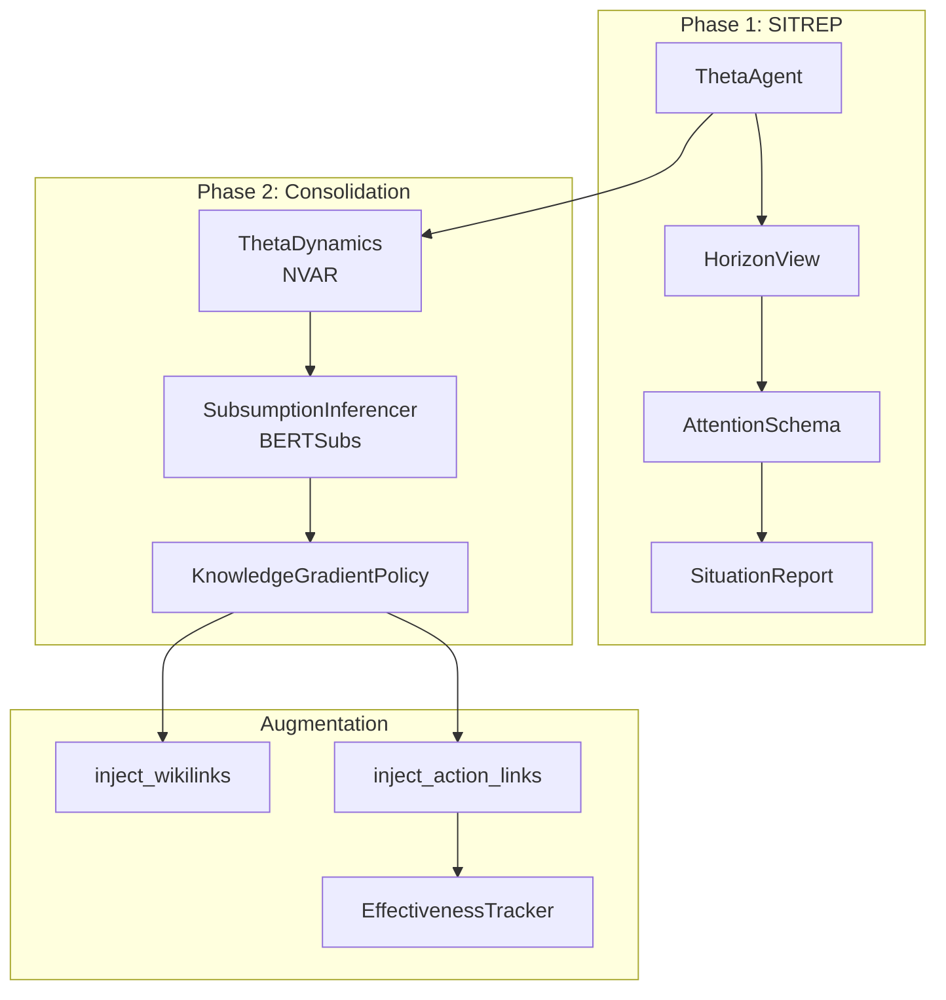

# Gaius Agents Theta

Neuromorphic situational awareness agent implementing Attention Schema Theory (AST) and hippocampal theta wave dynamics. Provides `/sitrep` as the single pane of glass for daily situational awareness with NVAR-mediated cross-temporal consolidation.

## Architecture



## Module Structure

```
theta/
├── __init__.py         # Module exports
├── horizons.py         # Horizon, HorizonView
├── schema.py           # AttentionTarget, AttentionSchema
├── sitrep.py           # SituationReport, SitrepSection
├── agent.py            # ThetaAgent, ConsolidationResult
├── consolidation.py    # ThetaDynamics, ConsolidationSignal, TemporalSlice
├── subsumption.py      # SubsumptionInferencer (BERTSubs)
├── augmentation.py     # inject_wikilinks, inject_action_links
├── effectiveness.py    # EffectivenessTracker, SHAP analysis
└── kg_policy.py        # KnowledgeGradientPolicy, BeliefState
```

## Phase 1: SITREP

### ThetaAgent

Core agent providing situational awareness:

```python
from gaius.agents.theta import ThetaAgent

agent = ThetaAgent()

# Generate situational report
sitrep = await agent.generate_sitrep(
    horizon="day",
    domain="pension",
    include_objectives=True,
)

print(sitrep.to_markdown())
```

### Horizons

Time-based attention windows inspired by hippocampal theta waves:

```python
from gaius.agents.theta import Horizon, HorizonView

# Available horizons
horizons = [
    Horizon.EMPHASIS,    # Today (1 day)
    Horizon.TACTICAL,    # This week (7 days)
    Horizon.STRATEGIC,   # This month (30 days)
    Horizon.SECULAR,     # This quarter (90 days)
    Horizon.OPEN,        # Unbounded
]

# Get view for horizon
view = HorizonView(Horizon.TACTICAL)
entries = await view.get_entries(domain="pension")
```

### Attention Schema

Models what information is currently attended to:

```python
from gaius.agents.theta import AttentionSchema, AttentionTarget

schema = AttentionSchema()

# Register attention targets
schema.attend(AttentionTarget(
    source="kb",
    path="current/objectives/rsv.md",
    priority=0.9,
    decay_rate=0.1,
))

# Get current attention state
active = schema.get_active_targets()
```

### SituationReport

Structured output from `/sitrep`:

```python
@dataclass
class SituationReport:
    horizon: Horizon
    domain: str | None
    generated_at: datetime
    sections: list[SitrepSection]

    # Content
    objectives: list[ObjectiveSummary]
    recent_thoughts: list[ThoughtSummary]
    agenda_items: list[AgendaItem]
    current_events: list[EventSummary]
    capabilities: list[CapabilityNote]

    def to_markdown(self) -> str: ...
```

## Phase 2: Consolidation

### ThetaDynamics

NVAR (Nonlinear Vector Autoregression) for temporal drift detection:

```python
from gaius.agents.theta import ThetaDynamics, TemporalSlice

dynamics = ThetaDynamics()

# Create temporal slices
slices = [
    TemporalSlice.from_week("2025-W51"),
    TemporalSlice.from_week("2025-W52"),
]

# Detect consolidation signal
signal = await dynamics.compute_consolidation_signal(slices)
print(f"Drift detected: {signal.drift_magnitude:.3f}")
print(f"Candidates: {len(signal.candidates)}")
```

### SubsumptionInferencer

BERTSubs-based semantic relationship discovery:

```python
from gaius.agents.theta import SubsumptionInferencer, SubsumptionCandidate

inferencer = SubsumptionInferencer()

# Find subsumption relationships
candidates = await inferencer.find_candidates(
    concept_a="neural network",
    concept_b="machine learning",
)

for c in candidates:
    print(f"{c.narrower} ⊆ {c.broader} ({c.confidence:.2f})")
```

### KnowledgeGradientPolicy

Economic decision-making for consolidation:

```python
from gaius.agents.theta import KnowledgeGradientPolicy, BeliefState

policy = KnowledgeGradientPolicy()

# Evaluate candidate value
belief = BeliefState(
    prior_value=0.5,
    observation_variance=0.1,
)

decision = policy.evaluate(candidate, belief)
print(f"Knowledge gradient: {decision.kg_value:.3f}")
print(f"Should reify: {decision.should_reify}")
```

## Augmentation

### Link Injection

Add cross-references to KB documents:

```python
from gaius.agents.theta import inject_wikilinks, inject_action_links, inject_mixed

# Wiki-style links
augmented = inject_wikilinks(
    content="The ThetaAgent uses NVAR dynamics.",
    targets=["NVAR", "ThetaAgent"],
)
# Result: "The [[ThetaAgent]] uses [[NVAR]] dynamics."

# Action links (for search integration)
augmented = inject_action_links(
    content="See the KB for details.",
    actions=[("KB", "action:search KB overview")],
)

# Mixed augmentation
augmented = inject_mixed(content, wikilinks, action_links)
```

### Effectiveness Tracking

Measure augmentation impact:

```python
from gaius.agents.theta import EffectivenessTracker, compute_augmentation_contribution

tracker = EffectivenessTracker()

# Record outcome
result = await tracker.record(
    document_path="current/topics/theta.md",
    augmentation_type="wikilinks",
    user_followed=True,
    time_to_follow_ms=1500,
)

# Compute contribution
contribution = compute_augmentation_contribution(
    augmented_outcomes=[...],
    baseline_outcomes=[...],
)
print(f"Contribution: {contribution.delta:.2%}")
```

### SHAP Analysis

Explainable feature attribution:

```python
from gaius.agents.theta import SHAPAnalyzer, SHAP_AVAILABLE

if SHAP_AVAILABLE:
    analyzer = SHAPAnalyzer()
    attribution = await analyzer.analyze(
        features=augmentation_features,
        outcomes=effectiveness_scores,
    )

    for feat, value in attribution.top_features(k=5):
        print(f"{feat}: {value:.3f}")
```

## Call Graph

```
# SITREP Generation Path
mcp_server.py:theta_sitrep()
  └─→ agents.theta.ThetaAgent.generate_sitrep()
      ├─→ HorizonView(horizon).get_entries(domain)
      ├─→ storage.kb_ops.list_kb("current/objectives/")
      ├─→ agents.cognition.get_recent_thoughts()
      └─→ SituationReport.to_markdown()

# Consolidation Path
mcp_server.py:theta_consolidate()
  └─→ agents.theta.ThetaAgent.consolidate()
      ├─→ ThetaDynamics.compute_consolidation_signal(slices)
      │   └─→ nvar_predict() → drift_magnitude
      ├─→ SubsumptionInferencer.find_candidates()
      │   └─→ deeponto.BERTSubs.classify()
      └─→ KnowledgeGradientPolicy.evaluate(candidates)
          └─→ [for selected candidates]
              ├─→ inject_wikilinks() or inject_action_links()
              └─→ storage.kb_ops.update_kb()

# Effectiveness Tracking Path
theta.effectiveness.EffectivenessTracker.record()
  └─→ [after user interaction]
      ├─→ compute_augmentation_contribution()
      └─→ [if SHAP_AVAILABLE]
          └─→ SHAPAnalyzer.analyze()
              └─→ SHAPAttribution
```

## Data Flow

```
┌─────────────────────────────────────────────────────────────────────┐
│                    /sitrep Command                                   │
│                 horizon: day, domain: pension                        │
└─────────────────────────────────┬───────────────────────────────────┘
                                  │
                                  ▼
┌─────────────────────────────────────────────────────────────────────┐
│                    ThetaAgent                                        │
│         gather objectives, thoughts, agenda, events                  │
└─────────────────────────────────┬───────────────────────────────────┘
                                  │
              ┌───────────────────┴───────────────────┐
              ▼                                       ▼
     ┌──────────────┐                        ┌──────────────┐
     │ HorizonView  │                        │ Consolidation│
     │  (temporal)  │                        │  (Phase 2)   │
     └──────┬───────┘                        └──────┬───────┘
            │                                       │
            ▼                                       ▼
     ┌──────────────┐                        ┌──────────────┐
     │ Attention    │                        │ ThetaDynamics│
     │   Schema     │                        │   (NVAR)     │
     └──────┬───────┘                        └──────┬───────┘
            │                                       │
            └───────────────────┬───────────────────┘
                                ▼
┌─────────────────────────────────────────────────────────────────────┐
│                    SituationReport                                   │
│              to_markdown() → formatted output                        │
└─────────────────────────────────────────────────────────────────────┘
```

## References

- Graziano, M.S.A. (2013). *Consciousness and the Social Brain*
- Zhang et al. (2015). "Traveling Theta Waves in the Human Hippocampus"
- Monaco et al. (2020). "Cognitive Swarming with Attractor Dynamics"
- Gauthier et al. (2021). "Next Generation Reservoir Computing"
- Powell & Ryzhov (2012). *Optimal Learning*

## Integration Points

| Component | Uses | Used By | Integration |
|-----------|------|---------|-------------|
| `ThetaAgent` | horizons, schema, storage | mcp_server | `generate_sitrep()`, `consolidate()` |
| `ThetaDynamics` | nvar | ThetaAgent | `compute_consolidation_signal()` |
| `SubsumptionInferencer` | deeponto | ThetaAgent | `find_candidates()` |
| `KnowledgeGradientPolicy` | — | ThetaAgent | `evaluate()` |
| `inject_wikilinks()` | — | consolidation | Text augmentation |
| `EffectivenessTracker` | storage | mcp_server | `record()` |

## See Also

- [Parent README](../README.md) — Agents overview
- [Awareness README](../../awareness/README.md) — Situational awareness primitives
- [Cognition README](../cognition/README.md) — Thought generation
- [Core State README](../../core/README.md) — Horizon configuration

---

<!-- GAI:META
module: gaius.agents.theta
layer: L5-orchestration
key_types: [ThetaAgent, ConsolidationResult, Horizon, HorizonView, AttentionTarget, AttentionSchema, SituationReport, SitrepSection, ThetaDynamics, ConsolidationSignal, TemporalSlice, SubsumptionInferencer, SubsumptionCandidate, KnowledgeGradientPolicy, BeliefState, ConsolidationDecision, EffectivenessResult, EffectivenessTracker, SHAPAnalyzer, SHAPAttribution, AugmentationResult]
key_funcs: [generate_sitrep, consolidate, compute_consolidation_signal, find_candidates, evaluate, inject_wikilinks, inject_action_links, inject_mixed, strip_augmentation, has_augmentation, compute_augmentation_contribution]
submodules: []
depends: [awareness, storage.kb_ops, agents.cognition, deeponto, shap]
dependents: [mcp_server]
config_keys: [theta.default_horizon, theta.consolidation_threshold]
env_vars: []
grpc_services: []
horizons:
  emphasis: 1d
  tactical: 7d
  strategic: 30d
  secular: 90d
  open: unbounded
references:
  - "Graziano (2013) Consciousness and the Social Brain"
  - "Zhang et al. (2015) Traveling Theta Waves"
  - "Monaco et al. (2020) Cognitive Swarming"
  - "Gauthier et al. (2021) Next Generation Reservoir Computing"
  - "Powell & Ryzhov (2012) Optimal Learning"
call_paths:
  sitrep: mcp.theta_sitrep→ThetaAgent.generate_sitrep→HorizonView→AttentionSchema→SituationReport
  consolidate: mcp.theta_consolidate→ThetaAgent.consolidate→ThetaDynamics→SubsumptionInferencer→KGPolicy→inject
  effectiveness: EffectivenessTracker.record→compute_contribution→SHAPAnalyzer
test_cmds:
  sitrep: 'uv run gaius-cli --cmd "/sitrep"'
  consolidate: 'uv run gaius-cli --cmd "/theta consolidate"'
guru_codes: [TH.00001.DEEPONTO_UNAVAIL, TH.00002.SHAP_UNAVAIL, TH.00003.NVAR_DIVERGE]
fail_fast: true
-->
