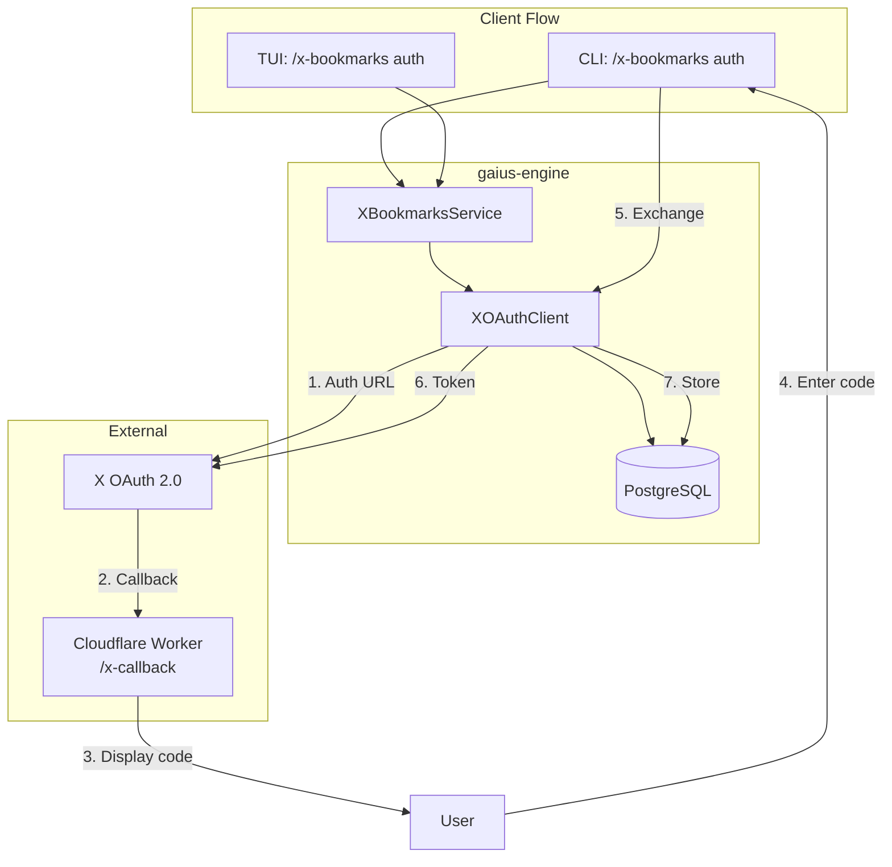

# Gaius Authentication

OAuth 2.0 authentication flows for external service integration. Currently implements X (Twitter) API authentication with PKCE for bookmark synchronization.

## Architecture



## Module Structure

```
auth/
├── __init__.py    # Module exports
└── x_oauth.py     # X (Twitter) OAuth 2.0 with PKCE
```

## X OAuth Flow

The X API v2 requires OAuth 2.0 Authorization Code Flow with PKCE for bookmark access.

### Required Scopes

| Scope | Purpose |
|-------|---------|
| `bookmark.read` | Read user's bookmarks |
| `users.read` | Get user profile (id, username) |
| `tweet.read` | Read tweet content in bookmarks |
| `offline.access` | Get refresh token for long-lived access |

### Flow Steps

1. **Get Auth URL**: Generate PKCE pair, build authorization URL
2. **User Authorization**: User visits URL, grants access
3. **Callback**: X redirects to Cloudflare Worker with authorization code
4. **Code Display**: Worker displays code for user to copy
5. **Code Entry**: User enters code in CLI/TUI
6. **Token Exchange**: Exchange code for access/refresh tokens
7. **Token Storage**: Store tokens in PostgreSQL

### Usage

```python
from gaius.auth import XOAuthClient, XOAuthConfig, ensure_valid_token

# Via XOAuthClient (recommended)
client = XOAuthClient(pool, XOAuthConfig.from_env())

# Get authorization URL
url, state, verifier = client.get_auth_url()
print(f"Visit: {url}")

# Complete auth with code from callback
tokens = await client.complete_auth(code, verifier)
print(f"Authenticated as @{tokens.username}")

# Get valid token (auto-refresh if expired)
access_token = await client.get_valid_token()
```

### Standalone Functions

```python
from gaius.auth import (
    generate_pkce_pair,
    get_authorization_url,
    exchange_code_for_token,
    refresh_access_token,
    save_tokens,
    get_tokens,
    ensure_valid_token,
)

# Generate PKCE pair
verifier, challenge = generate_pkce_pair()

# Build auth URL
url, verifier = get_authorization_url(state)

# Exchange code for tokens
token_data = await exchange_code_for_token(code, verifier)

# Refresh expired token
new_tokens = await refresh_access_token(refresh_token)

# Ensure valid token (auto-refresh)
tokens = await ensure_valid_token(pool, user_id)
```

## Configuration

### Environment Variables

| Variable | Required | Description |
|----------|----------|-------------|
| `X_CLIENT_ID` | Yes | OAuth 2.0 Client ID from X Developer Portal |
| `X_CLIENT_SECRET` | Yes* | OAuth 2.0 Client Secret (*for confidential clients) |
| `X_REDIRECT_URI` | No | Callback URL (default: `https://gaius.zndx.org/x-callback`) |

### Database Schema

Tokens are stored in the `x_oauth_tokens` table:

```sql
CREATE TABLE x_oauth_tokens (
    user_id VARCHAR(64) PRIMARY KEY,
    username VARCHAR(64) NOT NULL,
    access_token TEXT NOT NULL,
    refresh_token TEXT,
    token_type VARCHAR(32) DEFAULT 'Bearer',
    scopes TEXT[],
    expires_at TIMESTAMPTZ,
    created_at TIMESTAMPTZ DEFAULT NOW(),
    updated_at TIMESTAMPTZ DEFAULT NOW()
);
```

Pending authorizations use `x_oauth_pending`:

```sql
CREATE TABLE x_oauth_pending (
    state VARCHAR(64) PRIMARY KEY,
    verifier VARCHAR(128) NOT NULL,
    created_at TIMESTAMPTZ DEFAULT NOW(),
    expires_at TIMESTAMPTZ DEFAULT NOW() + INTERVAL '10 minutes'
);
```

## Key Types

### XOAuthConfig

```python
@dataclass
class XOAuthConfig:
    client_id: str
    client_secret: str | None
    redirect_uri: str
    scopes: list[str]

    @classmethod
    def from_env(cls) -> "XOAuthConfig": ...
```

### XTokens

```python
@dataclass
class XTokens:
    user_id: str
    username: str
    access_token: str
    refresh_token: str | None
    expires_at: datetime | None
    scopes: list[str]

    @property
    def is_expired(self) -> bool: ...

    @property
    def needs_refresh(self) -> bool: ...
```

### XOAuthClient

```python
class XOAuthClient:
    def __init__(self, pool: asyncpg.Pool, config: XOAuthConfig | None = None): ...
    def get_auth_url(self, state: str | None = None) -> tuple[str, str, str]: ...
    async def complete_auth(self, code: str, verifier: str) -> XTokens: ...
    async def get_valid_token(self, user_id: str | None = None) -> str: ...
```

## Guru Meditation Codes

| Code | Description | Resolution |
|------|-------------|------------|
| `#XB.00000001.NOTOKEN` | No OAuth tokens found | Run `/x-bookmarks auth` |
| `#XB.00000002.TOKENEXP` | Token expired, no refresh token | Re-run `/x-bookmarks auth` |
| `#XB.00000003.NOCLIENT` | X_CLIENT_ID not configured | Set environment variable |
| `#XB.00000005.APIERROR` | X API error | Check X Developer Portal status |

## Security Considerations

- **PKCE**: All authorization requests use Proof Key for Code Exchange
- **Token Storage**: Tokens stored in PostgreSQL (encrypt at rest in production)
- **Refresh Logic**: Access tokens auto-refresh 5 minutes before expiry
- **State Parameter**: Random state for CSRF protection
- **Short-lived Pending**: Pending auth entries expire after 10 minutes

## Testing

```bash
# Check auth status
uv run gaius-cli --cmd "/x-bookmarks status" --format json

# Start auth flow
uv run gaius-cli --cmd "/x-bookmarks auth"

# After entering code, verify
uv run gaius-cli --cmd "/x-bookmarks status" --format json
```

## See Also

- [XBookmarksService](../engine/services/README.md) - Engine service using this auth
- [X Bookmarks Migration](../../../db/migrations/20251227000001_x_bookmarks_sync.sql) - Database schema
- [Cloudflare Worker](../../../infra/README.md) - OAuth callback handler

---

<!-- GAI:META
module: gaius.auth
layer: L2-services
key_types: [XOAuthConfig, XOAuthClient, XTokens, XOAuthError]
key_funcs: [generate_pkce_pair, get_authorization_url, exchange_code_for_token, refresh_access_token, save_tokens, get_tokens, ensure_valid_token, get_any_tokens, get_user_info]
submodules: [x_oauth]
depends: [asyncpg, httpx]
dependents: [engine.services.x_bookmarks_service]
config_keys: []
env_vars: [X_CLIENT_ID, X_CLIENT_SECRET, X_REDIRECT_URI]
grpc_services: []
call_paths:
  auth_flow: cli.x_bookmarks_auth→XBookmarksService.get_auth_url→XOAuthClient.get_auth_url→generate_pkce_pair
  complete: cli.x_bookmarks_complete→XBookmarksService.complete_auth→XOAuthClient.complete_auth→exchange_code_for_token→save_tokens
  refresh: XBookmarksService.trigger_sync→ensure_valid_token→refresh_access_token→save_tokens
test_cmds:
  status: 'uv run gaius-cli --cmd "/x-bookmarks status" --format json'
  auth: 'uv run gaius-cli --cmd "/x-bookmarks auth"'
guru_codes: [XB.00000001.NOTOKEN, XB.00000002.TOKENEXP, XB.00000003.NOCLIENT, XB.00000005.APIERROR]
fail_fast: true
-->
