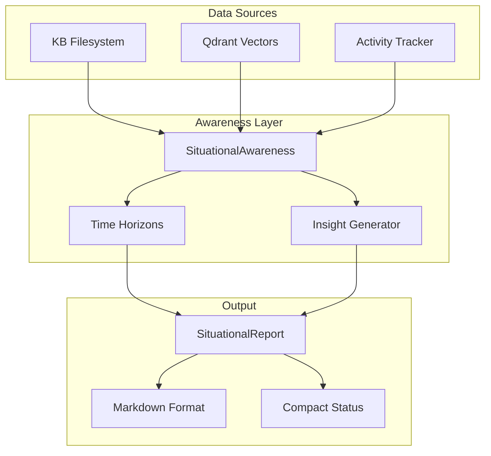

# Gaius Awareness

Situational awareness module providing startup reports, activity summaries, and time-horizon-based context for knowledge base state. Inspired by military situational awareness systems adapted for information management.

## Architecture



## Module Structure

```
awareness/
├── __init__.py        # Module exports
└── situational.py     # SituationalAwareness, SituationalReport
```

## Time Horizons

The awareness system organizes information across temporal scales:

| Horizon | Default Duration | Purpose |
|---------|------------------|---------|
| Emphasis | 24 hours | Immediate attention, recent activity |
| Tactical | 7 days | Short-term patterns, current projects |
| Strategic | 30 days | Medium-term trends, goal progress |
| Secular | 90+ days | Long-term evolution, quarterly themes |

Each horizon tracks:
- Entry count within the time window
- Key topics extracted from titles
- Notable entries (most recent)

## Usage

### Generate Startup Report

```python
from gaius.awareness import generate_startup_report

report = await generate_startup_report(
    profile="default",
    domain="pension",
    include_insights=True,
)

print(report.to_markdown())
```

### Access Situational Awareness

```python
from gaius.awareness import get_situational_awareness

awareness = get_situational_awareness()

report = await awareness.generate_report(
    profile="research",
    current_domain="kudu",
    include_insights=True,
)
```

## Data Structures

### SituationalReport

```python
@dataclass
class SituationalReport:
    generated_at: datetime
    profile: str
    current_domain: str | None

    # Time horizons
    emphasis: TimeHorizon | None
    tactical: TimeHorizon | None
    strategic: TimeHorizon | None
    secular: TimeHorizon | None

    # Activity
    activity_today: ActivitySummary | None
    activity_yesterday: ActivitySummary | None
    activity_week: ActivitySummary | None

    # System state
    kb_total_entries: int
    vector_store_count: int
    last_tda_run: datetime | None
    pending_jobs: int

    # Insights
    key_insights: list[str]
    recommended_focus: str | None
```

### TimeHorizon

```python
@dataclass
class TimeHorizon:
    name: str              # "emphasis", "tactical", etc.
    description: str
    start: datetime
    end: datetime
    entry_count: int
    key_topics: list[str]
    notable_entries: list[RecentEntry]
```

### RecentEntry

```python
@dataclass
class RecentEntry:
    title: str
    path: str
    created_at: datetime
    domain: str | None
    summary: str | None
```

## Output Formats

### Markdown Report

```python
markdown = report.to_markdown()
```

Produces structured markdown:

```markdown
# Situational Awareness Report
*Generated: 2024-12-25 10:30*
*Profile: default*
*Domain: pension*

## Emphasis: Last 24 hours
**15 entries** in the last 24 hours

### Recent:
- **TDA Grid Projection Improvements**
  Implementation of Ollivier-Ricci curvature...
- **Agent Evolution Metrics**
  Updated evaluation dimensions...

## Key Insights
- High activity in TDA-related research
- Evolution system showing steady improvement

## System State
- KB entries: 1,247
- Vector store: 1,089 embeddings
- Last TDA: 09:45
```

### Compact Status

```python
compact = report.to_compact()
# Output: "15 recent | 12q | 3s | 1247 KB"
```

Components:
- Recent entry count
- Today's queries (q)
- Today's swarm runs (s)
- Total KB entries

## Configuration

```python
@dataclass
class AwarenessConfig:
    emphasis_hours: int = 24
    default_horizon_days: int = 7
    include_insights_by_default: bool = False
```

## Insight Generation

When `include_insights=True`, the module:

1. Generates heuristic insights from data patterns
2. Optionally uses LLM synthesis for deeper analysis

Heuristic patterns detected:
- High activity periods
- Heavy swarm usage
- Active week indicators

## Integration Points

### Activity Tracker

```python
from gaius.core.activity import get_activity_tracker

tracker = get_activity_tracker()
today = await tracker.get_today()
yesterday = await tracker.get_yesterday()
week = await tracker.get_this_week()
```

### Vector Store

Queries Qdrant for embedding count:

```python
from qdrant_client import QdrantClient

client = QdrantClient(host=config.host, port=config.port)
info = client.get_collection(config.collection)
count = info.points_count
```

## See Also

- [Parent README](../README.md) — Module overview
- [Core README](../core/README.md) — Activity tracking
- [Storage README](../storage/README.md) — KB access
