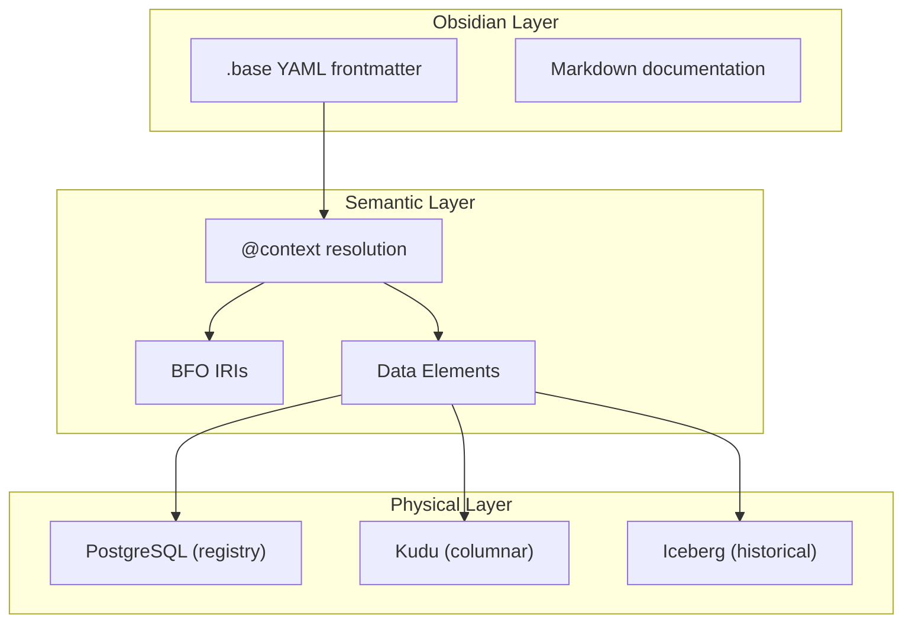
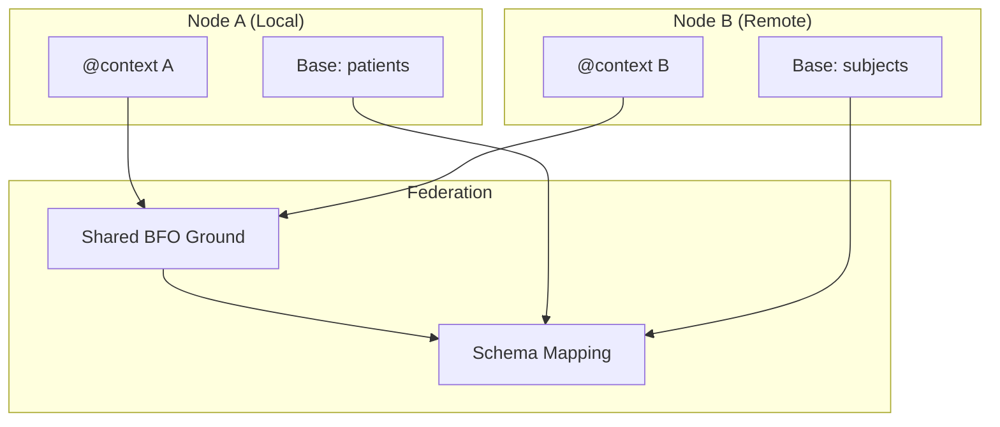

# Semantic Data Exchange with BFO-Grounded JSON-LD

This document describes the semantic layer for Obsidian Bases, enabling BFO-grounded data exchange via JSON-LD conventions. The semantic layer bridges human-readable `.base` files with formal ontology IRIs, supporting federated queries across heterogeneous data sources.

## Overview

### Why Semantic Grounding?

Data exchange between systems typically suffers from:
- **Schema drift** - Column names change, meanings diverge
- **Implicit assumptions** - "site" means anatomical location vs. website
- **Lost context** - Dependent fields (distance + direction) separated

Semantic grounding addresses these by anchoring field definitions to stable ontology IRIs. When two systems both map their "location" field to `BFO:0000029` (site), they can interoperate regardless of column naming conventions.

### BFO as Upper Ontology

[Basic Formal Ontology (BFO)](https://basic-formal-ontology.org/) serves as the upper ontology. BFO provides:
- **Stable IRIs** - ISO/IEC 21838-2:2021 standardized
- **Clear distinctions** - Continuants (things) vs. occurrents (processes)
- **Composability** - Domain ontologies build on BFO (OBO Foundry)

### JSON-LD for Linked Data

The `@context` block in `.base` YAML frontmatter follows [JSON-LD 1.1](https://www.w3.org/TR/json-ld11/) conventions:
- Standard prefix mappings (BFO, OBO, Schema.org)
- Column-to-IRI bindings
- Type annotations for Kudu storage

## Current State (2026-02)

| Component | Status | Location |
|-----------|--------|----------|
| BFO prefixes | Production | `gaius.bases.semantic.prefixes` |
| `@context` resolution | Production | `gaius.bases.semantic.context` |
| Data Elements | Production | `gaius.bases.semantic.data_element` |
| Kudu backend | Alpha | `gaius.bases.backends.kudu` |
| Fluent query API | Alpha | `gaius.bases.query` |
| MA-ABE federation | Planned | Future |

## Architecture

### Three-Layer Model



### `.base` YAML Format

```yaml
---
"@context":
  "@vocab": "https://gaius.zndx.dev/ontology/"
  Person: "http://dbpedia.org/ontology/Person"
  entity_id:
    "@id": "BFO:0000040"  # material entity
    "@type": "STRING"
  event_time:
    "@id": "BFO:0000038"  # one-dimensional temporal region
    "@type": "UNIXTIME_MICROS"
  biopsy_location:
    "@id": "BFO:0000029"  # site
    "@type": "STRING"

# Kudu-specific metadata
kudu:
  table: "gaius.biopsy_events"
  primary_key: [entity_id, event_time]
  partitioning:
    hash:
      columns: [entity_id]
      buckets: 16

# Schema with Data Element references
schema:
  - name: entity_id
    type: STRING
    "@id": "BFO:0000040"

  - name: biopsy_location
    type: STRING
    "@id": "BFO:0000029"
    depends_on: [distance_from_landmark, direction_from_landmark]

  - name: distance_from_landmark
    type: DECIMAL(10, 2)
    "@id": "BFO:0000019"  # quality
    unit: "cm"

  - name: direction_from_landmark
    type: STRING
    "@id": "BFO:0000026"  # one-dimensional spatial region
    value_domain:
      enum: [superior, inferior, anterior, posterior, medial, lateral]
---
```

Obsidian ignores unknown YAML frontmatter keys, so `.base` files are valid Obsidian notes that happen to carry semantic metadata.

## @context Conventions

### Standard Prefixes

The following prefixes are always available (defined in `prefixes.py`):

| Prefix | IRI Base | Purpose |
|--------|----------|---------|
| `BFO` | `http://purl.obolibrary.org/obo/BFO_` | Basic Formal Ontology |
| `obo` | `http://purl.obolibrary.org/obo/` | OBO Foundry ontologies |
| `rdf` | `http://www.w3.org/1999/02/22-rdf-syntax-ns#` | RDF syntax |
| `rdfs` | `http://www.w3.org/2000/01/rdf-schema#` | RDF Schema |
| `xsd` | `http://www.w3.org/2001/XMLSchema#` | XML Schema datatypes |
| `owl` | `http://www.w3.org/2002/07/owl#` | OWL Web Ontology Language |
| `skos` | `http://www.w3.org/2004/02/skos/core#` | SKOS vocabulary |
| `schema` | `https://schema.org/` | Schema.org |
| `gaius` | `https://gaius.zndx.dev/ontology/` | Gaius local namespace |

### Term Mapping Types

#### Simple Mapping

```yaml
"@context":
  site: "BFO:0000029"
```

Maps column "site" directly to BFO site IRI.

#### Expanded Mapping

```yaml
"@context":
  entity_id:
    "@id": "BFO:0000040"
    "@type": "STRING"
    description: "Unique identifier for material entity"
```

Includes type annotation and documentation.

### CURIE Expansion

CURIEs (Compact URIs) like `BFO:0000040` expand to full IRIs:

```python
from gaius.bases.semantic.prefixes import expand_curie

expand_curie("BFO:0000040")
# → "http://purl.obolibrary.org/obo/BFO_0000040"

expand_curie("schema:Person")
# → "https://schema.org/Person"
```

## BFO 2020 Class Hierarchy

BFO distinguishes **continuants** (entities that persist through time) from **occurrents** (entities that unfold in time).

### Independent Continuants

Things that exist independently:

| Class | BFO ID | Description |
|-------|--------|-------------|
| Material Entity | `BFO:0000040` | Physical objects with mass |
| Object | `BFO:0000030` | Bounded material entity |
| Object Aggregate | `BFO:0000027` | Collection of objects |
| Fiat Object Part | `BFO:0000024` | Part demarcated by fiat |

### Dependent Continuants

Qualities, roles, and dispositions that inhere in independent continuants:

| Class | BFO ID | Description |
|-------|--------|-------------|
| Quality | `BFO:0000019` | Measurement, color, etc. |
| Relational Quality | `BFO:0000145` | Quality involving multiple entities |
| Role | `BFO:0000023` | Externally grounded realizable |
| Disposition | `BFO:0000016` | Internally grounded realizable |
| Function | `BFO:0000034` | Selected-for disposition |

### Spatial Regions

| Class | BFO ID | Description |
|-------|--------|-------------|
| Spatial Region | `BFO:0000006` | Abstract spatial region |
| Site | `BFO:0000029` | 3D region of a material entity |
| 1D Spatial Region | `BFO:0000026` | Line |
| 2D Spatial Region | `BFO:0000009` | Surface |
| 3D Spatial Region | `BFO:0000028` | Volume |

### Temporal Regions

| Class | BFO ID | Description |
|-------|--------|-------------|
| Temporal Region | `BFO:0000008` | Abstract temporal region |
| Zero-D Temporal Region | `BFO:0000148` | Instant |
| One-D Temporal Region | `BFO:0000038` | Interval |

### Occurrents

| Class | BFO ID | Description |
|-------|--------|-------------|
| Process | `BFO:0000015` | Occurrent with temporal parts |
| Process Boundary | `BFO:0000035` | Instant boundary of process |
| History | `BFO:0000182` | Sum of processes of a continuant |

### Relations

| Relation | BFO ID | Description |
|----------|--------|-------------|
| participates_in | `BFO:0000056` | Continuant participates in process |
| has_participant | `BFO:0000057` | Process has participant |
| located_in | `BFO:0000171` | Spatial location |
| occurs_in | `BFO:0000066` | Process occurs in site |
| part_of | `BFO:0000050` | Parthood relation |
| has_part | `BFO:0000051` | Inverse of part_of |

## Data Elements (M.D. Anderson Pattern)

Data Elements extend column definitions with **dependent field semantics** - the recognition that some fields only make sense in combination with others.

### The Problem

Consider a clinical data entry screen:

```
Biopsy Location: [Liver]
Distance from Landmark: [____]  ← Often left blank!
Direction from Landmark: [____] ← Often left blank!
```

Without distance and direction, "liver" is imprecise. Data Elements enforce that these fields travel together.

### Data Element Definition

```python
from gaius.bases.semantic.data_element import DataElement, ValueConstraint

biopsy_location = DataElement(
    name="biopsy_location",
    term_iri="BFO:0000029",  # site
    kudu_type="STRING",
    depends_on=["distance_from_landmark", "direction_from_landmark"],
    constraints=[
        ValueConstraint(
            when={"procedure_type": "biopsy"},
            # When it's a biopsy, location requires context
        )
    ],
)
```

### Contextual Validation

Constraints can be context-dependent:

```yaml
schema:
  - name: diagnosis_code
    type: STRING
    "@id": "obo:OGMS_0000073"
    depends_on: [coding_system]
    value_domain:
      - when: {coding_system: ICD10}
        pattern: "^[A-Z][0-9]{2}(\\.[0-9]{1,4})?$"
      - when: {coding_system: SNOMED}
        pattern: "^[0-9]+$"
```

The validation pattern changes based on which coding system is in use.

### Dependency Order

`DataElementSchema.get_dependency_order()` returns columns in topological order (dependencies first), enabling:
- Correct form field ordering in UIs
- Validation in dependency-aware sequence
- Correct ETL column processing order

## Fluent Query API

The fluent query API mirrors [Apache Kudu's SDK](https://kudu.apache.org/) patterns while supporting ontology-term queries.

### Column-Based Query (Kudu SDK Style)

```python
from gaius.bases import Base, col

results = (Base("biopsy_events")
    .where(col("biopsy_location") == "liver")
    .where(col("distance_from_landmark") < 5.0)
    .select("entity_id", "event_time", "direction_from_landmark")
    .order_by("event_time", desc=True)
    .limit(100)
    .scan())
```

### Ontology-Term Query (BFO Grounded)

```python
from gaius.bases import Base, term

# Query by semantic meaning, not column name
results = (Base("biopsy_events")
    .where(term("BFO:site") == "liver")
    .select(term("BFO:material_entity"), term("BFO:temporal_region"))
    .scan())
```

The `term()` function resolves the BFO IRI to the actual column name via the `@context`, enabling queries that work across bases with different column naming conventions.

### Query Compilation

Fluent queries compile to SQL via [SQLGlot](https://github.com/tobymao/sqlglot):

```python
# The fluent API builds a query plan, SQLGlot compiles to:
# SELECT entity_id, event_time, direction_from_landmark
# FROM kudu.biopsy_events
# WHERE biopsy_location = 'liver' AND distance_from_landmark < 5.0
# ORDER BY event_time DESC
# LIMIT 100
```

## Integration Points

### Collections Pipeline

The semantic layer integrates with the collections pipeline for publishing:


Cards inherit semantic grounding from their parent Base, ensuring published content retains ontology mappings.

### Federated Engine (Future)

The semantic layer provides the foundation for federated data exchange:



Both nodes map their local column names to BFO IRIs. The federation layer uses these shared IRIs to map between schemas without manual column matching.

#### MA-ABE Integration (Planned)

Multi-Authority Attribute-Based Encryption will use BFO grounding as policy anchors:

- Access policies reference ontology terms, not column names
- Policy: "Can access `BFO:0000029` (site) data for entity type `obo:OGMS_0000073` (diagnosis)"
- Portable across federated nodes with different schemas

## Guru Meditation Codes

| Code | Component | Description |
|------|-----------|-------------|
| `#SEMANTIC.00000001.NOTERM` | context.py | Term not found in @context |
| `#SEMANTIC.00000002.INVALIDCTX` | context.py | Invalid @context structure |
| `#DATAELEMENT.00000001.INVALID` | data_element.py | Invalid data element definition |
| `#DATAELEMENT.00000002.DEPNOTFOUND` | data_element.py | Dependency not found (circular or missing) |
| `#DATAELEMENT.00000003.VALIDATION` | data_element.py | Value validation failed |

### Error Handling

```python
from gaius.bases.semantic.context import OntologyContext, TermResolutionError

ctx = OntologyContext.from_dict(base.context)
column = ctx.resolve_term("BFO:unknown_term")

if column is None:
    # Term not mapped in this base's @context
    raise TermResolutionError("BFO:unknown_term")
    # → [#SEMANTIC.00000001.NOTERM] Term not found in @context: BFO:unknown_term
```

## Implementation Guide

### Adding a New Data Element

1. **Define in schema** (`.base` YAML):
   ```yaml
   schema:
     - name: new_field
       type: STRING
       "@id": "BFO:0000019"  # Pick appropriate BFO class
       depends_on: [related_field]
   ```

2. **Add value constraints** if needed:
   ```yaml
       value_domain:
         - when: {context_field: value}
           pattern: "^[A-Z]+$"
   ```

3. **Verify dependency order**:
   ```python
   from gaius.bases.semantic.data_element import DataElementSchema

   schema = DataElementSchema.from_list(base_definition.schema)
   order = schema.get_dependency_order()
   # Ensure new_field comes after its dependencies
   ```

### Extending Prefixes

Add new ontology prefixes in `prefixes.py`:

```python
CHEBI = OntologyPrefix(
    prefix="CHEBI",
    iri_base="http://purl.obolibrary.org/obo/CHEBI_",
    description="Chemical Entities of Biological Interest",
)

# Add to DEFAULT_PREFIXES
DEFAULT_PREFIXES["CHEBI"] = CHEBI.iri_base
```

### Custom @context Resolution

For bases with complex mappings:

```python
from gaius.bases.semantic.context import OntologyContext

# Merge base context with custom prefixes
base_ctx = OntologyContext.from_dict(base.context)
custom_ctx = OntologyContext(
    prefixes={"custom": "https://example.org/ontology/"},
    term_mappings={...}
)

merged = base_ctx.merge(custom_ctx)
```

## Implementation Priorities

### Phase 1: Foundation (Complete)

- [x] BFO prefix definitions
- [x] `@context` parsing and resolution
- [x] Data Element model with validation
- [x] CURIE expansion/compaction

### Phase 2: Storage (Current)

- [ ] Kudu backend integration
- [ ] PostgreSQL FDW for Kudu
- [ ] Schema synchronization (`.base` → Kudu table)
- [ ] Primary key and partitioning support

### Phase 3: Query (Next)

- [ ] Fluent query builder classes
- [ ] SQLGlot compilation
- [ ] `term()` resolution in queries
- [ ] MCP tool exposure (`bases_query`)

### Phase 4: Federation (Planned)

- [ ] Cross-node schema mapping
- [ ] BFO-grounded access policies
- [ ] MA-ABE integration
- [ ] Federated query routing

## References

- [Basic Formal Ontology 2020](https://basic-formal-ontology.org/bfo-2020.html)
- [BFO 2020 GitHub](https://github.com/BFO-ontology/BFO-2020)
- [OBO Foundry](https://obofoundry.org/)
- [JSON-LD 1.1 Specification](https://www.w3.org/TR/json-ld11/)
- [JSON-LD @context](https://www.w3.org/TR/json-ld11/#the-context)
- [Apache Kudu Schema Design](https://kudu.apache.org/docs/schema_design.html)
- [SQLGlot](https://github.com/tobymao/sqlglot)

## See Also

- [FEDERATION.md](../engine/FEDERATION.md) - Federated engine architecture
- [TELEMETRY.md](../core/TELEMETRY.md) - OTel instrumentation strategy
- [Kudu Backed Bases Spec](../../docs/scratch/2026-01-22/100000_kudu_backed_bases_spec.md) - Original design document

---

<!-- GAI:META
module: gaius.bases.semantic
layer: L2-services
key_types: [OntologyContext, TermMapping, OntologyPrefix, BFOClasses, DataElement, DataElementSchema, ValueConstraint]
key_funcs: [expand_curie, compact_iri, resolve_term, resolve_column, get_dependency_order, validate_row]
depends: [gaius.bases.models.types]
dependents: [gaius.bases.query, gaius.bases.backends, gaius.bases.service, gaius.engine.services.collection_service]
config_keys: []
env_vars: []
strategic_doc: true
-->
