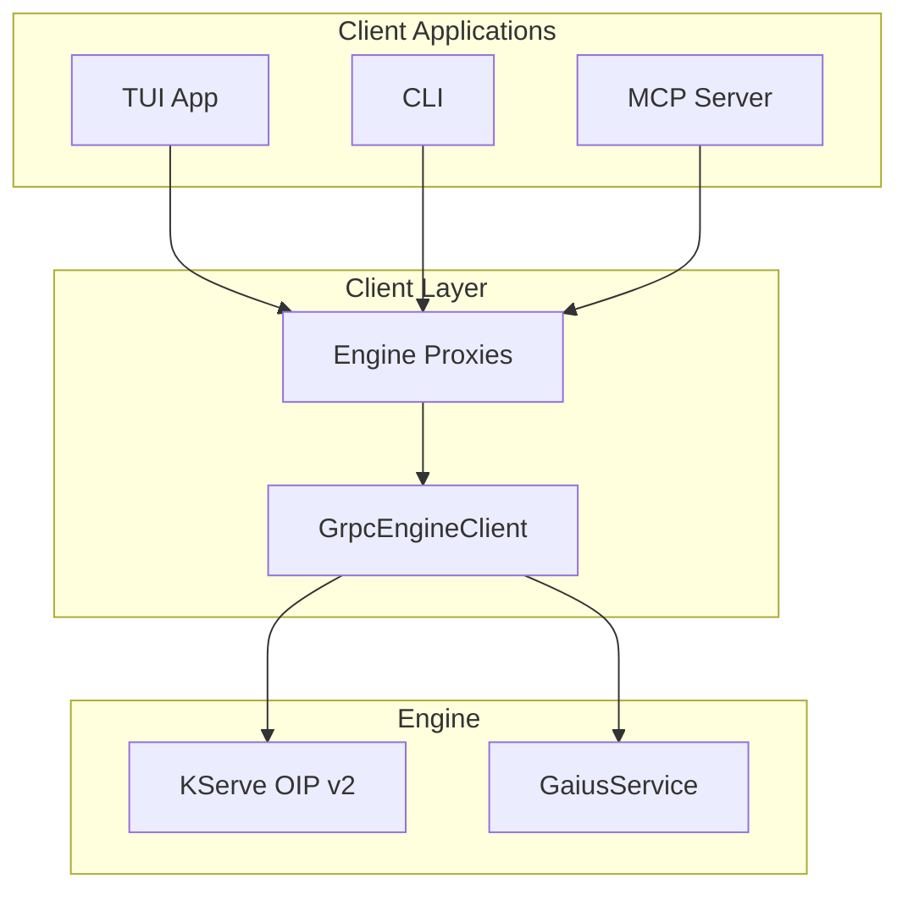
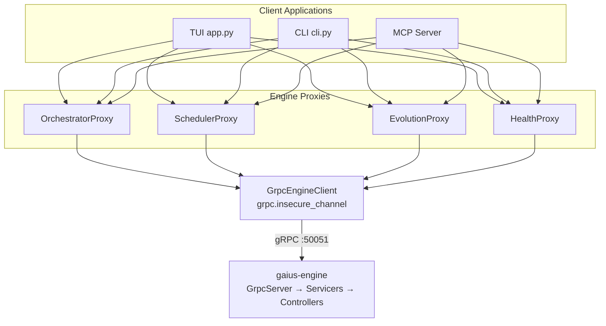

# Gaius Client

gRPC client library for TUI, CLI, and MCP communication with gaius-engine. Implements KServe Open Inference Protocol v2 (KServe, 2023) for inference requests and custom Gaius services for orchestration.

## Architecture



## Module Structure

```
client/
├── __init__.py          # Module exports, get_engine_client()
├── grpc_client.py       # GrpcEngineClient (primary transport)
├── engine_proxy.py      # High-level proxy classes
├── state_client.py      # Reactive state synchronization
├── command_client.py    # Slash command dispatch
└── aeron_client.py      # Deprecated IPC transport
```

## gRPC Client

The `GrpcEngineClient` is the primary transport for engine communication:

```python
from gaius.client import get_engine_client

client = await get_engine_client()

# Direct service call
result = await client.call("Orchestrator", "status", {})

# Streaming events
async for event in client.health_stream():
    print(f"Health: {event.status}")
```

### Configuration

```python
@dataclass
class GrpcClientConfig:
    host: str = "localhost"
    port: int = 50051
    timeout: float = 30.0
    connect_timeout: float = 5.0
```

Environment variables:
- `GAIUS_GRPC_HOST`: Server hostname (default: `localhost`)
- `GAIUS_GRPC_PORT`: Server port (default: `50051`)
- `GAIUS_ENGINE_TIMEOUT`: Request timeout in seconds

## Engine Proxies

High-level typed interfaces for engine services:

### OrchestratorProxy

GPU and endpoint management:

```python
from gaius.client import get_orchestrator_proxy

proxy = get_orchestrator_proxy()

status = await proxy.status()
print(f"Endpoints: {status.endpoints}")
print(f"GPU health: {status.gpu_health}")

await proxy.start_endpoint("reasoning")
await proxy.stop_endpoint("coding")
await proxy.restart_endpoint("reasoning")
```

### SchedulerProxy

Job scheduling and queue management:

```python
from gaius.client import get_scheduler_proxy

proxy = get_scheduler_proxy()

# Submit inference job
job_id = await proxy.submit_async(
    prompt="Explain TDA",
    priority="high",
    max_tokens=1024,
)

# Get result
result = await proxy.get_result(job_id)
```

### EvolutionProxy

Agent evolution monitoring:

```python
from gaius.client import get_evolution_proxy

proxy = get_evolution_proxy()

status = await proxy.status()
print(f"Running: {status.running}")
print(f"Current agent: {status.current_agent}")

await proxy.trigger(agent_id="leader")
```

### HealthProxy

System health monitoring:

```python
from gaius.client import get_health_proxy

proxy = get_health_proxy()

health = await proxy.check()
for issue in health.issues:
    print(f"{issue.severity}: {issue.message}")
```

### GridProxy

Embedding projection and TDA:

```python
from gaius.client import get_grid_proxy

proxy = get_grid_proxy()

# Project embeddings to grid
grid = await proxy.project_embeddings(embeddings)

# Explain grid position
explanation = await proxy.explain(x=9, y=9)
```

### TDAProxy

Topological data analysis:

```python
from gaius.client import get_tda_proxy

proxy = get_tda_proxy()

features = await proxy.compute_tda(embeddings)
print(f"Betti numbers: {features.betti}")
```

## Streaming

The client supports server-sent event streams:

### Health Stream

```python
async for event in client.health_stream():
    print(f"GPU memory: {event.gpu_memory_used}%")
    print(f"Queue depth: {event.queue_depth}")
```

### Evolution Stream

```python
async for event in client.evolution_stream():
    print(f"Cycle: {event.cycle}")
    print(f"Agent: {event.agent_id}")
    print(f"Score: {event.score}")
```

### Swarm Stream

```python
async for event in client.swarm_stream(query="TDA analysis"):
    print(f"Agent: {event.agent_id}")
    print(f"Response: {event.content}")
```

## Protocol

The client implements two gRPC services:

### KServe OIP v2

Standard inference protocol (KServe, 2023):

| RPC | Description |
|-----|-------------|
| `ServerLive` | Liveness probe |
| `ServerReady` | Readiness probe |
| `ModelReady` | Model availability |
| `ServerMetadata` | Server information |
| `ModelMetadata` | Model information |
| `ModelInfer` | Inference request |

### GaiusService

Custom orchestration protocol:

| RPC | Description |
|-----|-------------|
| `Complete` | Synchronous completion |
| `SubmitJob` | Async job submission |
| `GetJobResult` | Retrieve job result |
| `OrchestratorStatus` | GPU/endpoint status |
| `StartEndpoint` | Start vLLM endpoint |
| `StopEndpoint` | Stop endpoint |
| `TriggerEvolution` | Start evolution cycle |
| `HealthStream` | Health event stream |
| `SwarmStream` | Swarm analysis stream |

## Error Handling

```python
from gaius.client import get_engine_client

try:
    client = await get_engine_client()
except ConnectionError as e:
    # Engine not running
    print("Start engine with: devenv up")
```

## References

- KServe. (2023). *Open Inference Protocol*. https://kserve.github.io/website/latest/modelserving/data_plane/v2_protocol/

## Call Graph

```
# Inference Request Path
agents.swarm.SwarmManager.analyze()
  └─→ inference.client.InferenceClient.complete()
      └─→ client.grpc_client.GrpcEngineClient.infer()
          └─→ grpc.stub.ModelInfer(request)
              └─→ engine.grpc.servicers.gaius_servicer

# Orchestrator Status Path
mcp_server.py:orchestrator_status()
  └─→ client.engine_proxy.OrchestratorProxy.status()
      └─→ client.grpc_client.call("Orchestrator", "status")
          └─→ grpc.stub.OrchestratorStatus(request)

# Streaming Health Path
app.py:GaiusApp.on_mount()
  └─→ client.grpc_client.health_stream()
      └─→ async for event in grpc.stub.WatchHealth(request):
          └─→ yield HealthEvent

# Evolution Trigger Path
mcp_server.py:trigger_evolution()
  └─→ client.engine_proxy.EvolutionProxy.trigger(agent_id)
      └─→ client.grpc_client.call("Evolution", "trigger", {agent_id})
```

## Data Flow



## Integration Points

| Component | Uses | Used By | Integration |
|-----------|------|---------|-------------|
| `get_engine_client()` | grpc | inference, app, mcp_server | Singleton factory |
| `GrpcEngineClient` | grpc.aio | engine_proxy, inference.client | Connection pool |
| `OrchestratorProxy` | GrpcEngineClient | mcp_server, health | `status()`, `start_endpoint()` |
| `SchedulerProxy` | GrpcEngineClient | mcp_server, inference | `submit_async()`, `get_result()` |
| `EvolutionProxy` | GrpcEngineClient | mcp_server | `status()`, `trigger()` |
| `HealthProxy` | GrpcEngineClient | app, health | `check()`, `stream()` |

## See Also

- [Parent README](../README.md) — Module overview
- [Engine README](../engine/README.md) — Server-side implementation
- [Inference README](../inference/README.md) — InferenceClient using gRPC
- [Health README](../health/README.md) — Health proxy integration

---

<!-- GAI:META
module: gaius.client
layer: L2-transport
singleton: get_engine_client
key_types: [GrpcEngineClient, OrchestratorProxy, SchedulerProxy, EvolutionProxy, HealthProxy, GridProxy, TDAProxy]
key_funcs: [get_engine_client, get_orchestrator_proxy, get_scheduler_proxy, get_evolution_proxy, get_health_proxy]
submodules: []
depends: [core.config, grpc]
dependents: [inference, app, mcp_server, health]
config_keys: [client.grpc.host, client.grpc.port, client.grpc.timeout]
env_vars: [GAIUS_GRPC_HOST, GAIUS_GRPC_PORT, GAIUS_ENGINE_TIMEOUT]
grpc_services: [GaiusService, GRPCInferenceService]
ports: [50051]
external_deps: [grpc, grpcio-tools]
call_paths:
  infer: inference.client.complete→grpc_client.infer→grpc.stub.ModelInfer
  orchestrator: mcp.orchestrator_status→OrchestratorProxy.status→grpc_client.call
  stream: app.on_mount→grpc_client.health_stream→async_generator
test_cmds:
  connect: 'uv run python -c "from gaius.client import get_engine_client; import asyncio; asyncio.run(get_engine_client())"'
guru_codes: [CL.00001.GRPC_UNAVAIL, CL.00002.TIMEOUT, CL.00003.AUTH_FAIL]
fail_fast: true
-->
