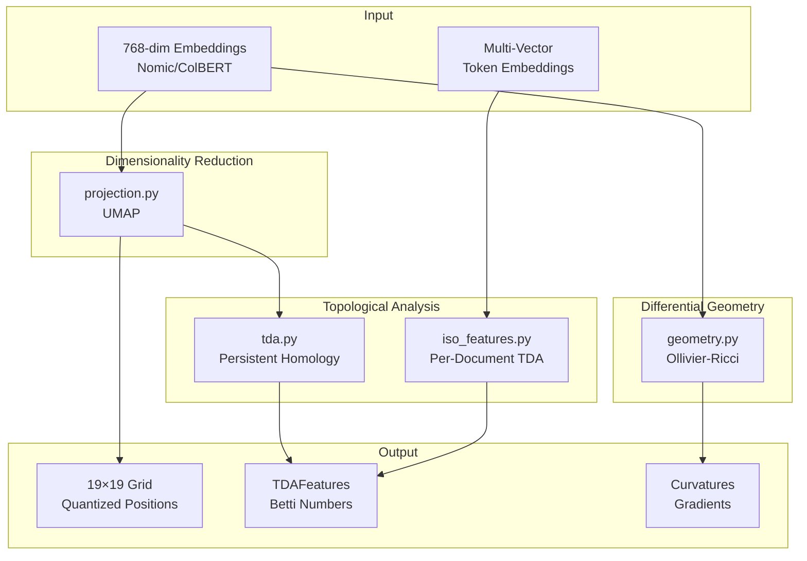
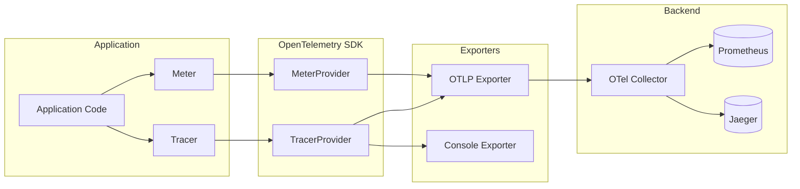
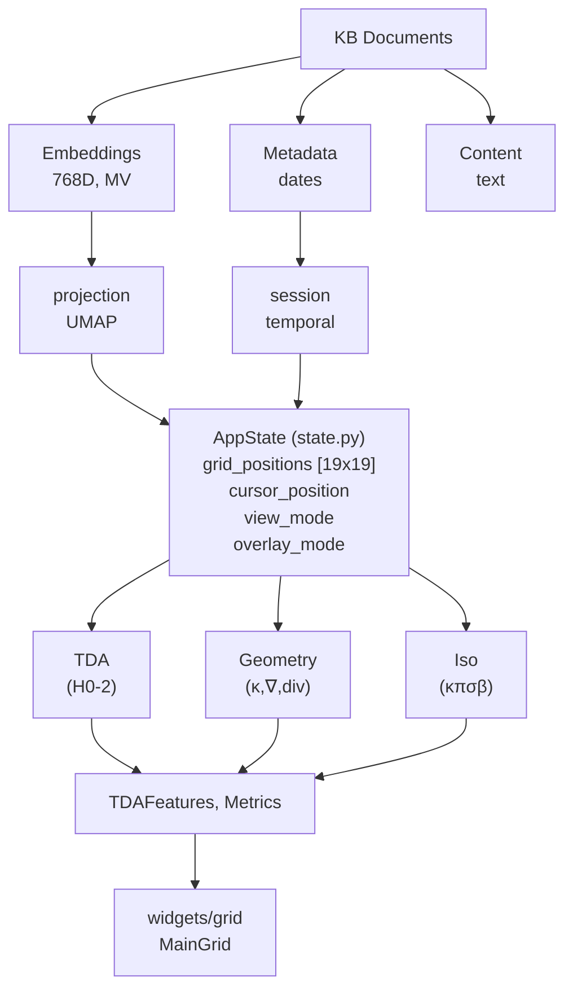

# Gaius Core

Mathematical and computational foundations for topological data analysis, differential geometry, and dimensionality reduction. This module provides the geometric primitives underlying the 19×19 grid projection.

## Architecture



## Module Structure

| File | Purpose |
|------|---------|
| `state.py` | Application state, view/overlay modes |
| `projection.py` | UMAP projection to 19×19 grid |
| `tda.py` | Persistent homology (H₀, H₁, H₂) |
| `geometry.py` | Ollivier-Ricci curvature |
| `iso_features.py` | Four Iso view modes (κ, π, σ, β) |
| `minigrids.py` | 9×9 orthographic view computation |
| `config.py` | HOCON configuration |
| `activity.py` | Activity logging |
| `session.py` | Session management |
| `kb_capture.py` | Zettelkasten note generation |
| `telemetry.py` | OpenTelemetry instrumentation |

## Persistent Homology

Persistent homology (Edelsbrunner, Letscher, & Zomorodian, 2002; Zomorodian & Carlsson, 2005) computes topological invariants that persist across filtration scales, revealing the intrinsic "shape" of data independent of coordinate representation.

### Vietoris-Rips Complex

For a point cloud $X$ with metric $d$, the Vietoris-Rips complex at scale $\epsilon$ is:

$$\text{VR}_\epsilon(X) = \{ \sigma \subseteq X : \text{diam}(\sigma) \leq \epsilon \}$$

where $\text{diam}(\sigma) = \max_{x,y \in \sigma} d(x,y)$.

### Betti Numbers

The Betti numbers $\beta_k$ count $k$-dimensional topological features:

| Dimension | Symbol | Interpretation |
|-----------|--------|----------------|
| 0 | $\beta_0$ | Connected components (document clusters) |
| 1 | $\beta_1$ | 1-cycles (circular structures, loops) |
| 2 | $\beta_2$ | 2-voids (cavities, enclosed regions) |

### Persistence Diagram

Features are characterized by birth-death pairs $(b_i, d_i)$ where $b_i$ is the scale at which feature $i$ appears and $d_i$ is the scale at which it disappears. The persistence $p_i = d_i - b_i$ measures feature significance—long-lived features represent robust topological structure, while short-lived features are typically noise.

### Persistence Entropy

Following Rucco et al. (2016), persistence entropy quantifies the complexity of the persistence diagram:

$$H = -\sum_{i=1}^{n} \hat{p}_i \log(\hat{p}_i)$$

where $\hat{p}_i = \frac{p_i}{\sum_j p_j}$ normalizes the persistence values to a probability distribution. High entropy indicates complex, multi-scale structure; low entropy indicates simple, single-scale organization.

### Implementation

Uses [ripser](https://ripser.scikit-tda.org/) (Bauer, 2021) for efficient Vietoris-Rips persistent homology:

```python
from gaius.core.tda import TDAComputer, TDAFeatures

computer = TDAComputer(max_dimension=2)
features: TDAFeatures = computer.compute(embeddings, grid_coords)

print(f"Components: {features.h0_count}")
print(f"Loops: {features.h1_count}")
print(f"Voids: {features.h2_count}")
print(f"Entropy: {features.entropy:.3f}")
```

## Ollivier-Ricci Curvature

Ollivier-Ricci curvature (Ollivier, 2009) provides a discrete analogue of Riemannian curvature for graphs, measuring local geometric structure via optimal transport.

### Definition

For vertices $x, y$ in a graph $G$, the Ollivier-Ricci curvature is:

$$\kappa(x,y) = 1 - \frac{W_1(\mu_x, \mu_y)}{d(x,y)}$$

where:
- $W_1(\mu_x, \mu_y)$ is the Wasserstein-1 (earth mover's) distance between probability measures
- $d(x,y)$ is the graph distance between vertices
- $\mu_x$ is a probability measure over the neighborhood of $x$ (typically uniform over $k$-nearest neighbors)

### Geometric Interpretation

| Curvature | Local Geometry | Interpretation |
|-----------|----------------|----------------|
| $\kappa > 0$ | Positive (spherical) | Dense cluster interior |
| $\kappa < 0$ | Negative (hyperbolic) | Sparse boundary region |
| $\kappa \approx 0$ | Flat (Euclidean) | Uniform transition zone |

Positive curvature indicates that neighborhoods converge (points are tightly clustered); negative curvature indicates that neighborhoods diverge (points are at boundaries between clusters).

### Implementation

Uses [GraphRicciCurvature](https://github.com/saibalmars/GraphRicciCurvature) (Ni, Lin, Gao, Gu, & Saucan, 2019):

```python
from gaius.core.geometry import GeometryComputer, GeometricFeatures

computer = GeometryComputer(k_neighbors=15, metric="cosine")
features: GeometricFeatures = await computer.compute_features(
    embeddings, grid_positions
)

curvatures = features.curvatures      # (n,) per-point curvature
gradients = features.gradients        # (n, 2) semantic gradient vectors
divergence = features.divergence      # (n,) divergence at each point
```

## UMAP Projection

UMAP (McInnes, Healy, & Melville, 2018) projects 768-dimensional embeddings to 2D coordinates while preserving local neighborhood structure.

### Pipeline

```mermaid
graph LR
    A[768-D Embeddings] --> B[UMAP<br/>n_neighbors=15]
    B --> C[2-D Continuous]
    C --> D[Normalize<br/>to [0, 18]]
    D --> E[Quantize<br/>to Integers]
    E --> F[19×19 Grid]
```

### Parameters

| Parameter | Value | Rationale |
|-----------|-------|-----------|
| `n_neighbors` | 15 | Balances local/global structure preservation |
| `min_dist` | 0.1 | Allows tight clustering while preventing collapse |
| `metric` | cosine | Appropriate for normalized text embeddings |
| `random_state` | 42 | Reproducibility across runs |

### Grid Quantization

The continuous UMAP output $\mathbf{z} \in \mathbb{R}^2$ is mapped to discrete grid coordinates:

$$\phi(\mathbf{z}) = \left\lfloor 18 \cdot \frac{\mathbf{z} - \mathbf{z}_{\min}}{\mathbf{z}_{\max} - \mathbf{z}_{\min}} + 0.5 \right\rfloor$$

Grid coordinates follow Go board conventions (A1–T19, omitting I).

## Iso View Features

Four toggleable visualization modes for per-document topological analysis:

| Mode | Symbol | Computation | Reveals |
|------|--------|-------------|---------|
| Curvature | κ | Ollivier-Ricci on local k-NN | Semantic boundaries |
| Persistence | π | Sum of death − birth | Document complexity |
| Complexity | σ | Variance of token embeddings | Semantic diversity |
| Boundary | β | H₁ cocycle attribution | Loop participation |

### Per-Document TDA

Each document's multi-vector (ColBERT-style) embeddings undergo separate persistent homology computation:

```python
@dataclass
class DocumentTopology:
    b0: int                     # Connected components
    b1: int                     # 1-cycles (loops)
    b2: int                     # 2-voids (cavities)
    total_persistence: float    # Sum of lifespans
    persistence_entropy: float  # Complexity measure
```

This captures internal document structure—documents with high $\beta_1$ contain circular reasoning patterns; documents with high persistence entropy exhibit multi-scale semantic organization.

## State Management

### View Modes

```python
class ViewMode(Enum):
    GO = "go"        # Default Go board view
    THETA = "theta"  # Information density (θ waves)
    SWARM = "swarm"  # Multi-agent analysis view
```

### Overlay Modes

```python
class OverlayMode(Enum):
    NONE = "none"           # No overlay
    TOPOLOGY = "topology"   # H₀/H₁/H₂ features
    GEOMETRY = "geometry"   # Curvature heatmap
    DYNAMICS = "dynamics"   # Gradient vector field
    AGENTS = "agents"       # Agent positions
```

### Iso Modes

```python
class IsoMode(Enum):
    CURVATURE = "curvature"     # κ: Ricci curvature
    PERSISTENCE = "persistence"  # π: Total persistence
    COMPLEXITY = "complexity"    # σ: Token variance
    BOUNDARY = "boundary"        # β: Loop participation
```

## Configuration

```hocon
gaius {
  tda {
    max_points = 500     # Subsample for large datasets
    max_dimension = 2    # Compute H₀, H₁, H₂
    entropy_base = "e"   # Natural log for entropy
  }

  geometry {
    k_neighbors = 15     # k-NN graph construction
    metric = "cosine"    # Distance metric
  }

  projection {
    method = "umap"      # Dimensionality reduction
    grid_size = 19       # Fixed at 19×19
  }
}
```

## Computational Complexity

| Operation | Complexity | Subsample Threshold |
|-----------|------------|---------------------|
| UMAP projection | $O(n \log n)$ | 10,000 points |
| Persistent homology | $O(n^3)$ | 500 points |
| Ricci curvature | $O(n^2 k)$ | 1,000 points |
| Per-document TDA | $O(t^3)$ per document | 150 tokens/document |

The system subsamples large datasets automatically to maintain interactive performance.

## OpenTelemetry Instrumentation

The `telemetry.py` module provides vendor-neutral distributed tracing and metrics following the OpenTelemetry specification (Blanco et al., 2024). This is the **emission side** of observability—for metric consumption and visualization, see [observability/README.md](../observability/README.md).

### Architecture



### Entry Point Detection

The telemetry module auto-detects the application entry point for proper trace attribution:

```python
ENTRY_POINTS = ("tui", "cli", "mcp", "engine", "worker")

def _detect_entry_point() -> str:
    """Detect which entry point is running based on sys.argv[0]."""
    ...
```

| Entry Point | Service Name | Use Case |
|-------------|--------------|----------|
| `gaius-tui` | gaius-tui | Interactive TUI session |
| `gaius-cli` | gaius-cli | Non-interactive commands |
| `gaius-mcp` | gaius-mcp | MCP server for Claude Code |
| `gaius-engine` | gaius-engine | gRPC daemon |
| `gaius-worker` | gaius-worker | Fetch worker pool |

### Tracing API

```python
from gaius.core.telemetry import get_tracer, trace_operation, traced_command

# Get a tracer for a component
tracer = get_tracer("gaius.agents.swarm")

# Manual span creation
with tracer.start_as_current_span("analyze_query") as span:
    span.set_attribute("query", query)
    span.set_attribute("domain", domain)
    result = await perform_analysis()
    span.set_attribute("result_count", len(result))

# Decorator for automatic tracing
@trace_operation("swarm_synthesis")
async def synthesize_results(results: list) -> str:
    ...

# Context manager for CLI commands
async def run_command():
    async with traced_command("health_check"):
        await check_endpoints()
```

### Metrics API

```python
from gaius.core.telemetry import get_meter

meter = get_meter("gaius.inference")

# Counter for events
inference_counter = meter.create_counter(
    "gaius.inference.count",
    description="Number of inference requests",
)
inference_counter.add(1, {"model": "reasoning", "status": "success"})

# Histogram for latency
latency_histogram = meter.create_histogram(
    "gaius.inference.latency",
    description="Inference latency in milliseconds",
    unit="ms",
)
latency_histogram.record(elapsed_ms, {"model": "reasoning"})
```

### Pre-defined Metrics

| Metric | Type | Description |
|--------|------|-------------|
| `gaius.search.count` | Counter | KB search operations |
| `gaius.inference.count` | Counter | Inference requests |
| `gaius.inference.latency` | Histogram | Inference latency (ms) |
| `gaius.swarm.rounds` | Histogram | Swarm synthesis rounds |

### Configuration

Environment variables:

| Variable | Default | Description |
|----------|---------|-------------|
| `OTEL_EXPORTER_OTLP_ENDPOINT` | `http://localhost:4317` | OTLP collector endpoint |
| `OTEL_TRACES_EXPORTER` | `otlp` | Trace exporter (`otlp`, `console`, `none`) |
| `OTEL_METRICS_EXPORTER` | `otlp` | Metrics exporter |
| `OTEL_SERVICE_NAME` | Auto-detected | Service name override |

### CLI Flush Pattern

For short-lived CLI commands, explicitly flush telemetry before exit:

```python
from gaius.core.telemetry import flush_telemetry

async def main():
    async with traced_command("my_command"):
        await do_work()

    # Ensure spans are exported before process exits
    flush_telemetry()
```

## References

- Bauer, U. (2021). Ripser: Efficient computation of Vietoris–Rips persistence barcodes. *Journal of Applied and Computational Topology*, 5, 391–423.
- Blanco, A., Shkuro, Y., & Parker, D. (2024). *OpenTelemetry in Action*. Manning Publications.
- Edelsbrunner, H., Letscher, D., & Zomorodian, A. (2002). Topological persistence and simplification. *Discrete & Computational Geometry*, 28(4), 511–533.
- McInnes, L., Healy, J., & Melville, J. (2018). UMAP: Uniform Manifold Approximation and Projection for Dimension Reduction. *arXiv:1802.03426*.
- Ni, C.-C., Lin, Y.-Y., Gao, J., Gu, X. D., & Saucan, E. (2019). Ricci curvature of the internet topology. *Proceedings of IEEE INFOCOM*, 2758–2766.
- Ollivier, Y. (2009). Ricci curvature of Markov chains on metric spaces. *Journal of Functional Analysis*, 256(3), 810–864.
- Rucco, M., Castiglione, F., Merelli, E., & Pettini, M. (2016). Characterisation of the idiotypic immune network through persistent entropy. *Proceedings of ECCS*, 117–128.
- Zomorodian, A., & Carlsson, G. (2005). Computing persistent homology. *Discrete & Computational Geometry*, 33(2), 249–274.

## Call Graph

```
# Grid Projection Pipeline
widgets.grid.MainGrid.on_mount()
  └─→ engine.compute.grid_service.project()
      └─→ core.projection.GridProjector.project()
          ├─→ embeddings from storage.kb_ops.get_embeddings()
          ├─→ umap.UMAP.fit_transform()           # 768D → 2D
          └─→ quantize_to_grid()                  # continuous → 19x19

# TDA Computation Pipeline
engine.compute.tda_service.compute()
  └─→ core.tda.TDAComputer.compute()
      ├─→ ripser.ripser()                         # Vietoris-Rips
      ├─→ compute_betti_numbers()                 # H0, H1, H2
      └─→ compute_persistence_entropy()

# Curvature Computation Pipeline
core.geometry.GeometryComputer.compute_features()
  ├─→ sklearn.neighbors.NearestNeighbors()       # k-NN graph
  ├─→ GraphRicciCurvature.compute_ricci()        # Ollivier-Ricci
  └─→ compute_gradient_field()                   # semantic gradients

# Telemetry Instrumentation
any_component:
  └─→ core.telemetry.get_tracer("component_name")
      └─→ tracer.start_as_current_span()
          └─→ OTLP → OTel Collector → Prometheus
```

## Data Flow



## Integration Points

| Component | Uses | Used By | Integration |
|-----------|------|---------|-------------|
| `AppState` | — | app, widgets, commands | Global state container |
| `GridProjector` | storage.embeddings | engine.grid_service | `project(embeddings)` |
| `TDAComputer` | ripser | engine.tda_service | `compute(embeddings, positions)` |
| `GeometryComputer` | GraphRicciCurvature | engine.tda_service | `compute_features()` |
| `get_tracer()` | opentelemetry | all modules | `@trace_operation` decorator |
| `get_meter()` | opentelemetry | all modules | Counter, histogram |
| `get_config()` | pyhocon | all modules | Singleton config |

## See Also

- [Parent README](../README.md) — System overview, layer architecture
- [Widgets README](../widgets/README.md) — Grid visualization
- [Engine README](../engine/README.md) — compute services
- [Observability README](../observability/README.md) — Metric consumption
- [Storage README](../storage/README.md) — Embedding source

---

<!-- GAI:META
module: gaius.core
layer: L1-foundation
singletons: [get_config, get_tracer, get_meter]
key_types: [AppState, ViewMode, OverlayMode, IsoMode, GaiusConfig, GridProjector, TDAComputer, TDAFeatures, GeometryComputer, GeometricFeatures]
key_funcs: [get_config, get_tracer, get_meter, trace_operation, traced_command, flush_telemetry]
depends: []
dependents: [engine, widgets, agents, inference, storage, health, app]
config_keys: [gaius.kb.root, gaius.tda.max_points, gaius.tda.max_dimension, gaius.geometry.k_neighbors, gaius.projection.method]
env_vars: [GAIUS_KB_ROOT, OTEL_EXPORTER_OTLP_ENDPOINT, OTEL_TRACES_EXPORTER]
external_deps: [umap, ripser, GraphRicciCurvature, opentelemetry, pyhocon, numpy, scipy]
math:
  betti: β_k counts k-dim topological features
  curvature: κ(x,y) = 1 - W_1(μ_x,μ_y)/d(x,y)
  persistence: p_i = d_i - b_i (feature lifespan)
  entropy: H = -Σ p̂_i log(p̂_i)
call_paths:
  projection: grid_service→GridProjector.project→UMAP→quantize
  tda: tda_service→TDAComputer.compute→ripser→betti_numbers
  geometry: GeometryComputer.compute_features→k_NN→Ricci→gradients
  telemetry: any_module→get_tracer→start_span→OTLP
test_cmd: 'uv run python -c "from gaius.core import AppState, ViewMode"'
guru_codes: [CO.00001.UMAP_DIM, CO.00002.RIPSER_MEM, CO.00003.OTEL_EXPORT]
fail_fast: true
-->

