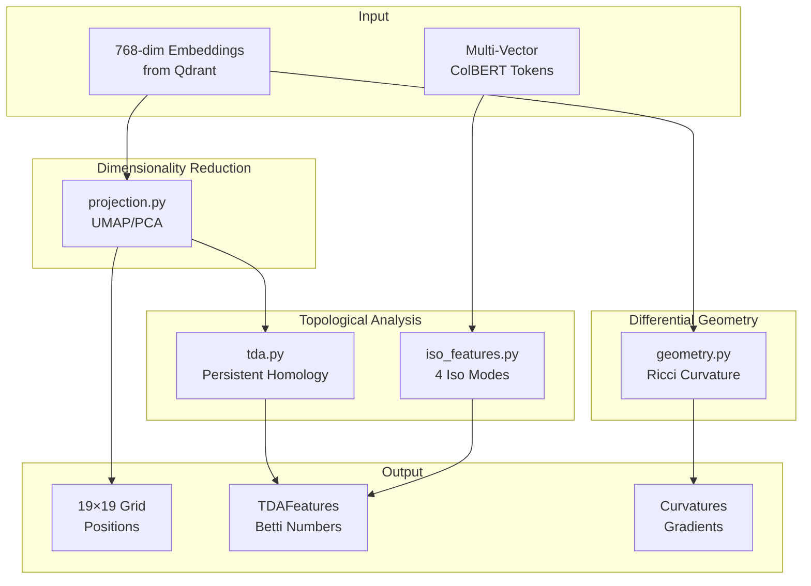
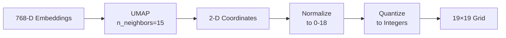

# Gaius Core

Mathematical and computational foundations for the Gaius spatial intelligence interface. This module provides topological data analysis, differential geometry, dimensionality reduction, and state management.

## Architecture



## Modules

| File | Purpose |
|------|---------|
| `state.py` | Application state, view/overlay modes |
| `projection.py` | UMAP projection to 19×19 grid |
| `tda.py` | Persistent homology (H0, H1, H2) |
| `geometry.py` | Ollivier-Ricci curvature |
| `iso_features.py` | Four Iso view modes (κ, π, σ, β) |
| `minigrids.py` | 9×9 orthographic views |
| `config.py` | HOCON configuration |
| `activity.py` | Activity logging |
| `session.py` | Session management |
| `kb_capture.py` | Zettelkasten note generation |

## Mathematical Foundations

### Persistent Homology (`tda.py`)

Persistent homology computes topological features that persist across scales, revealing the "shape" of data.

**Betti Numbers:**
- $\beta_0$: Connected components (clusters)
- $\beta_1$: 1-cycles (loops, circular dependencies)
- $\beta_2$: 2-cycles (voids, cavities)

**Persistence Diagram:**

Features are born at scale $b$ and die at scale $d$. The persistence $p = d - b$ measures feature significance.

**Persistence Entropy:**

$$H = -\sum_{i=1}^{n} p_i \log(p_i)$$

where $p_i = \frac{l_i}{\sum_j l_j}$ and $l_i = d_i - b_i$ is the lifespan of feature $i$.

High entropy indicates complex, multi-scale structure. Low entropy indicates simple, single-scale organization.

**Implementation:**

Uses [ripser](https://ripser.scikit-tda.org/) for fast Vietoris-Rips persistent homology:

```python
from gaius.core.tda import TDAComputer, TDAFeatures

computer = TDAComputer(max_dimension=2)
features: TDAFeatures = computer.compute(embeddings, grid_coords)

# Access results
print(f"Components: {features.h0_count}")
print(f"Loops: {features.h1_count}")
print(f"Voids: {features.h2_count}")
print(f"Entropy: {features.entropy:.3f}")
```

### Ollivier-Ricci Curvature (`geometry.py`)

Measures semantic boundary strength via optimal transport on k-NN graphs.

**Definition:**

$$\kappa(x,y) = 1 - \frac{W(\mu_x, \mu_y)}{d(x,y)}$$

Where:
- $W(\mu_x, \mu_y)$ = Wasserstein-1 distance between neighborhood distributions
- $d(x,y)$ = graph distance between nodes
- $\mu_x$ = uniform probability measure over neighbors of $x$

**Interpretation:**

| Curvature | Meaning | Visual |
|-----------|---------|--------|
| $\kappa > 0$ | Dense cluster core | Bright in Embed view |
| $\kappa < 0$ | Sparse boundary region | Dark in Iso view |
| $\kappa \approx 0$ | Uniform transition | Neutral gray |

**Biomorphic Analogy:**

From "Environmental randomness underlies morphological complexity of colonial diatoms":
- Negative curvature (boundaries) ↔ turbulent stream flow → complex colonial structures
- Positive curvature (interiors) ↔ calm water → simple single-cell forms

**Implementation:**

```python
from gaius.core.geometry import GeometryComputer, GeometricFeatures

computer = GeometryComputer(k_neighbors=15, metric="cosine")
features: GeometricFeatures = await computer.compute_features(
    embeddings, grid_positions
)

# Access results
curvatures = features.curvatures      # (n,) per-point curvature
gradients = features.gradients        # (n, 2) semantic gradient vectors
divergence = features.divergence      # (n,) divergence at each point
```

### UMAP Projection (`projection.py`)

Projects 768-dimensional embeddings to 19×19 grid coordinates.

**Pipeline:**



**Parameters:**
- `n_neighbors=15`: Local structure preservation
- `min_dist=0.1`: Minimum distance between points
- `metric="cosine"`: Angular similarity for text embeddings
- `random_state=42`: Reproducibility

**Multi-Vector Support:**

ColBERT embeddings provide multiple token vectors per document. The projection uses the aggregated "agg" vector while preserving per-token embeddings for TDA.

### Iso View Features (`iso_features.py`)

Four toggleable visualization modes for the 9×9 Iso mini-grid:

| Mode | Symbol | Computation | Reveals |
|------|--------|-------------|---------|
| Curvature | κ | Ollivier-Ricci on k-NN | Semantic boundaries |
| Persistence | π | Sum of (death - birth) | Document complexity |
| Complexity | σ | Variance of token embeddings | Semantic diversity |
| Boundary | β | H1 cocycle attribution | Loop participation |

**Per-Document TDA:**

Each document's multi-vector embeddings undergo separate persistent homology:

```python
@dataclass
class DocumentTopology:
    b0: int                     # Connected components
    b1: int                     # 1-cycles (loops)
    b2: int                     # 2-voids (cavities)
    total_persistence: float    # Sum of lifespans
    persistence_entropy: float  # Complexity measure
```

## State Management (`state.py`)

### View Modes

```python
class ViewMode(Enum):
    GO = "go"        # Default Go board view
    THETA = "theta"  # Information density (θ waves)
    SWARM = "swarm"  # Multi-agent analysis view
```

### Overlay Modes

```python
class OverlayMode(Enum):
    NONE = "none"           # No overlay
    TOPOLOGY = "topology"   # H0/H1/H2 features
    GEOMETRY = "geometry"   # Curvature heatmap
    DYNAMICS = "dynamics"   # Gradient vector field
    AGENTS = "agents"       # Agent positions
```

### Iso Modes

```python
class IsoMode(Enum):
    CURVATURE = "curvature"     # κ: Ricci curvature
    PERSISTENCE = "persistence"  # π: Total persistence
    COMPLEXITY = "complexity"    # σ: Token variance
    BOUNDARY = "boundary"        # β: Loop participation
```

## Configuration (`config.py`)

HOCON configuration with environment variable overrides:

```hocon
gaius {
  tda {
    max_points = 500     # Subsample for large datasets
    max_dimension = 2    # H0, H1, H2
    entropy_base = "e"   # Natural log for entropy
  }

  geometry {
    k_neighbors = 15     # k-NN graph construction
    metric = "cosine"    # Distance metric
  }

  projection {
    method = "umap"      # or "pca"
    grid_size = 19       # Fixed at 19×19
  }
}
```

## Performance Considerations

| Operation | Complexity | Subsample Threshold |
|-----------|------------|---------------------|
| UMAP projection | O(n log n) | 10,000 points |
| Persistent homology | O(n³) | 500 points |
| Ricci curvature | O(n² k) | 1,000 points |
| Per-doc TDA | O(t³) per doc | 150 tokens/doc |

The system subsamples large datasets automatically to maintain interactive performance.

## See Also

- [Parent README](../README.md) - Module overview
- [TDA documentation](../../../../docs/current/src/concepts/homology.md)
- [Geometry design notes](../../../../docs/scratch/2025-12-03/01_differential_geometry_tda_design.md)
