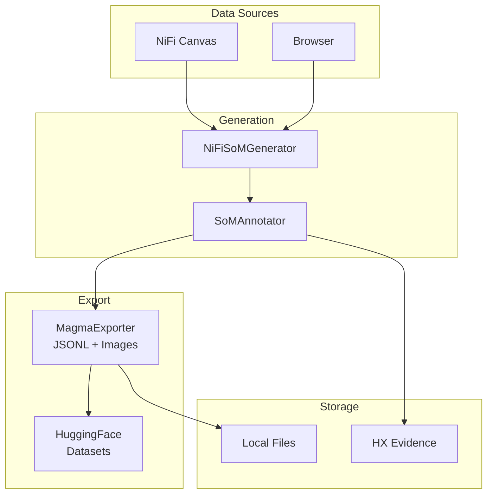

# Gaius Datasets

Dataset generators for training vision-language models. Produces SoM (Set-of-Mark) annotated screenshots for UI automation tasks.

## Architecture



## Module Structure

```
datasets/
├── __init__.py       # Module exports
├── storage.py        # Dataset storage utilities
└── nifi_som/
    ├── __init__.py   # NiFiSoMGenerator, SoMAnnotator, MagmaExporter
    ├── generator.py  # Screenshot + mark generation
    ├── annotator.py  # SoM annotation logic
    └── exporter.py   # Magma format export
```

## NiFi SoM Generator

Generate SoM-annotated screenshots from NiFi canvas:

```python
from gaius.datasets import NiFiSoMGenerator

generator = NiFiSoMGenerator(
    nifi_url="http://localhost:8080/nifi",
    screenshot_dir="data/screenshots",
)

# Generate dataset from current canvas
samples = await generator.generate(
    scenarios=["create_processor", "connect_processors"],
    variations=10,
)

for sample in samples:
    print(f"Screenshot: {sample.image_path}")
    print(f"Marks: {len(sample.marks)}")
    print(f"Action: {sample.action}")
```

## SoM Annotator

Apply Set-of-Mark annotations to screenshots:

```python
from gaius.datasets import SoMAnnotator

annotator = SoMAnnotator()

# Annotate screenshot
annotated = annotator.annotate(
    image=screenshot,
    elements=ui_elements,
)

# Access marks
for mark in annotated.marks:
    print(f"Mark {mark.id}: {mark.role} at {mark.bbox}")
```

### Mark Structure

```python
@dataclass
class Mark:
    id: int
    bbox: BoundingBox
    role: UIRole
    label: str
    interactable: bool = True
    semantic_type: str | None = None  # NiFi-specific type
```

### UI Roles

```python
class UIRole(Enum):
    BUTTON = "button"
    INPUT = "input"
    PROCESSOR = "processor"
    CONNECTION = "connection"
    MENU = "menu"
    CANVAS = "canvas"
    LABEL = "label"
```

## Magma Exporter

Export to Magma training format (Microsoft, 2024):

```python
from gaius.datasets import MagmaExporter

exporter = MagmaExporter(output_dir="data/magma")

# Export dataset
await exporter.export(
    samples=samples,
    split_ratio={"train": 0.8, "val": 0.1, "test": 0.1},
)
```

### Output Format

```
data/magma/
├── train.jsonl
├── val.jsonl
├── test.jsonl
└── images/
    ├── 000001.png
    ├── 000002.png
    └── ...
```

### JSONL Schema

```json
{
  "id": "sample_001",
  "image": "images/000001.png",
  "conversations": [
    {
      "role": "user",
      "content": "<image>\nClick on the 'Add Processor' button"
    },
    {
      "role": "assistant",
      "content": "I'll click on mark [3] which is the Add Processor button."
    }
  ],
  "marks": [
    {"id": 3, "bbox": [100, 200, 150, 230], "label": "Add Processor"}
  ]
}
```

## Dataset Storage

```python
from gaius.datasets.storage import DatasetStorage

storage = DatasetStorage(base_dir="data/datasets")

# Save dataset
await storage.save(
    name="nifi_som_v1",
    samples=samples,
    metadata={
        "created_at": datetime.now().isoformat(),
        "nifi_version": "2.0.0",
        "scenarios": ["create_processor"],
    },
)

# Load dataset
dataset = await storage.load("nifi_som_v1")
```

## HuggingFace Integration

```python
from datasets import Dataset

# Convert to HuggingFace format
hf_dataset = Dataset.from_generator(
    lambda: (sample.to_dict() for sample in samples)
)

# Push to Hub
hf_dataset.push_to_hub("organization/nifi-som-dataset")
```

## Scenario Types

| Scenario | Description |
|----------|-------------|
| `create_processor` | Drag processor to canvas |
| `connect_processors` | Create connections |
| `configure_processor` | Edit processor properties |
| `start_processor` | Start/stop processors |
| `create_group` | Create process groups |

## Configuration

```python
@dataclass
class GeneratorConfig:
    screenshot_width: int = 1920
    screenshot_height: int = 1080
    mark_font_size: int = 14
    mark_color: str = "#FF0000"
    include_invisible: bool = False
```

## See Also

- [Parent README](../README.md) — Module overview
- [RASE README](../rase/README.md) — UOM integration
- [HX README](../hx/README.md) — Evidence storage
