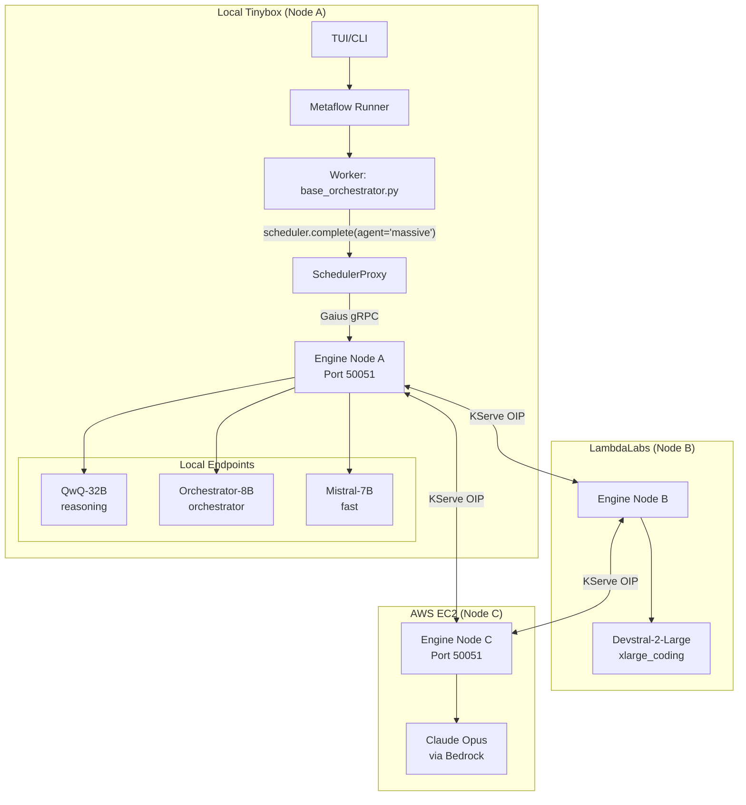
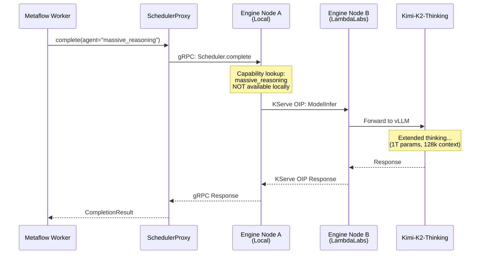
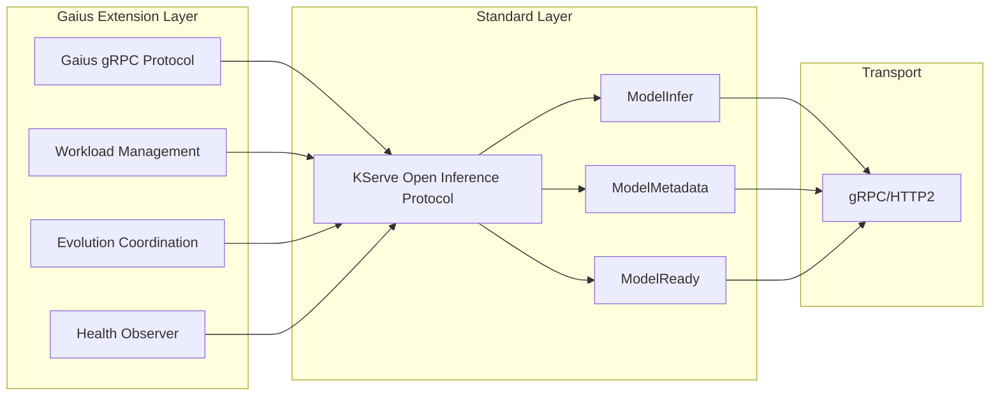
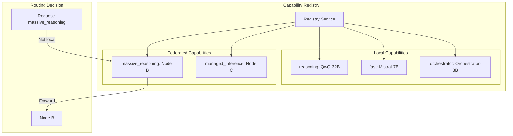
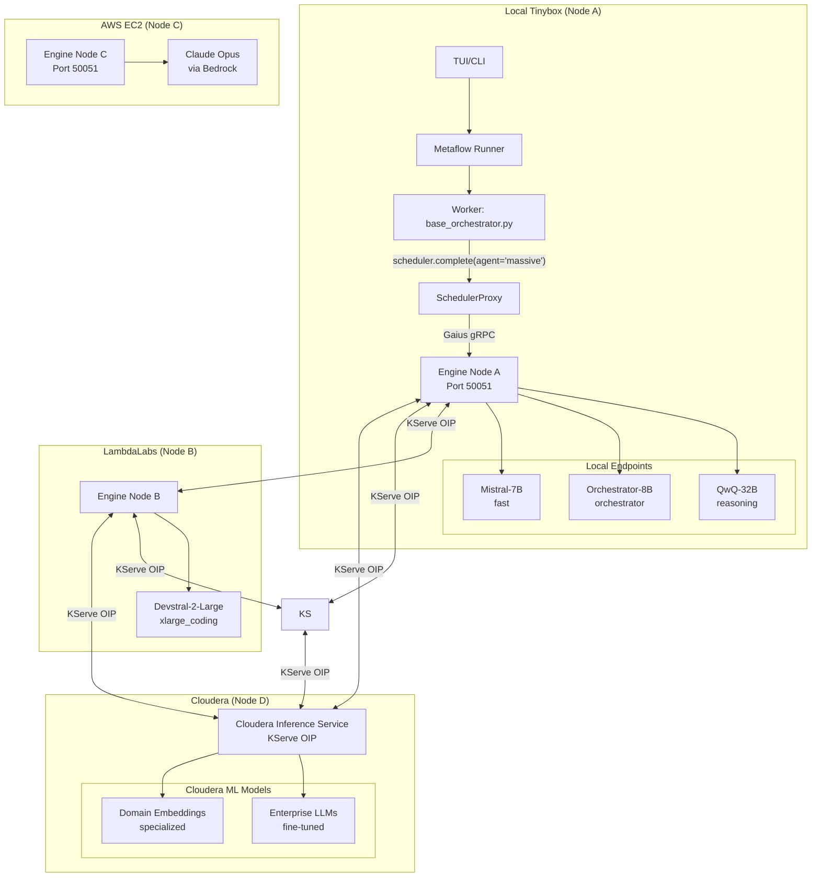
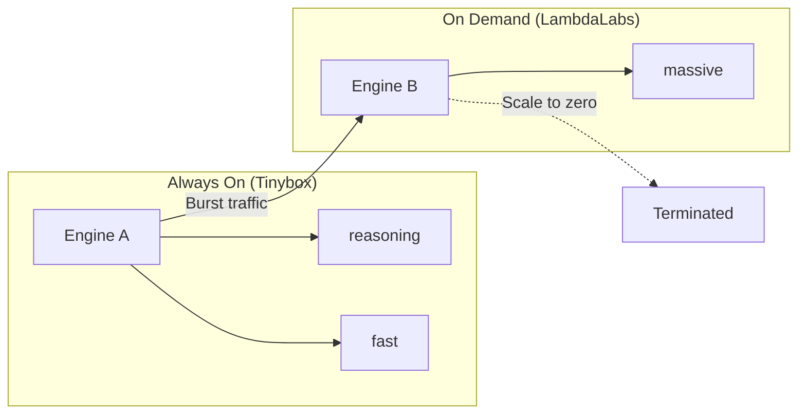
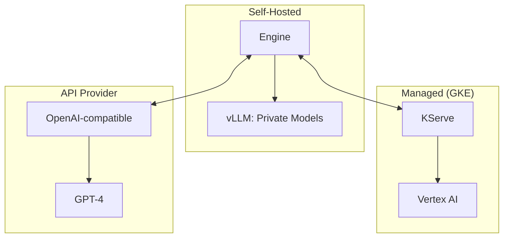
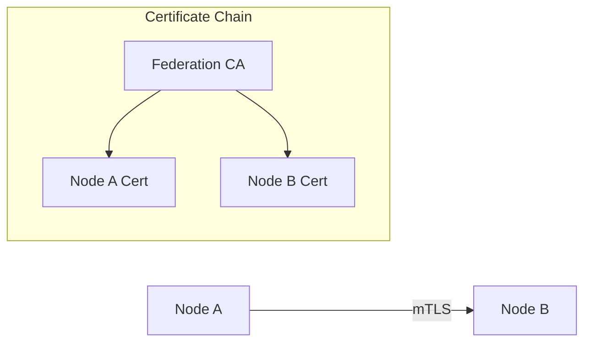
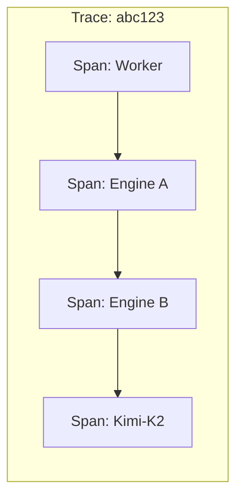

# Federated Engine Architecture

This document describes the Gaius Engine Federation architecture, enabling distributed inference across heterogeneous GPU deployments using standard protocols.

## Overview

The Gaius Engine Federation allows multiple engine nodes to collaborate as a unified inference mesh. Each node can:

- Serve local GPU endpoints directly
- Forward requests to peer nodes when needed capabilities aren't local
- Participate in distributed scheduling decisions
- Mix Gaius engines with vanilla KServe-compatible servers



## Request Flow Example

When a Metaflow worker needs a capability not available locally:



## Protocol Layers

The federation uses a layered protocol approach:



### KServe Open Inference Protocol (Standard)

The foundation layer - any compliant server can participate:

| Method | Purpose |
|--------|---------|
| `ModelInfer` | Inference requests with tensor I/O |
| `ModelMetadata` | Model capabilities, shapes |
| `ModelReady` | Model health/readiness |
| `ServerLive` | Server liveness probe |
| `ServerReady` | Server readiness probe |

Compatible implementations:
- vLLM (native support)
- Hugging Face TGI
- NVIDIA Triton (TensorRT-LLM)
- Ray Serve (with KServe adapter)
- Seldon Core
- Any Kubernetes InferenceService

### Gaius Extension Layer (Optional)

Additional capabilities for full-featured nodes:

| Service | Purpose |
|---------|---------|
| `Scheduler` | Capability-based routing, priority queues |
| `Workload` | Multi-step workload resource allocation |
| `Evolution` | Agent training coordination |
| `HealthObserver` | Distributed health monitoring |
| `Cognition` | Cross-node thought synchronization |

Nodes without Gaius extensions simply provide inference - fully valid.

## Capability Registry

Each engine maintains a capability registry:



### Capability Types

| Capability | Description | Typical Provider |
|------------|-------------|------------------|
| `fast` | Low-latency, small model | Local 7B |
| `reasoning` | Extended thinking | Local 32B |
| `coding` | Code generation | Local Coder model |
| `orchestrator` | Tool selection | Local Orchestrator-8B |
| `massive_reasoning` | Frontier-scale thinking | Remote 1T+ model |
| `embedding` | Text/vision embeddings | Local or managed |

## Extended 4-Node Mesh with Cloudera

Adding Cloudera's Inference Service as a fourth node demonstrates how enterprise-managed inference integrates seamlessly with self-hosted and cloud infrastructure:



### Cloudera Inference Service Integration

Cloudera's AI Inference service provides KServe Open Inference Protocol endpoints, making it a first-class participant in the federation:

| Feature | Cloudera CIS |
|---------|--------------|
| Protocol | KServe OIP (native) |
| Authentication | CDP workload auth |
| Model Types | Fine-tuned LLMs, domain embeddings |
| Deployment | Cloudera Machine Learning |
| GPU Support | NVIDIA GPUs via CML |

### Configuration for Cloudera Node

```hocon
gaius {
  engine {
    federation {
      peers = [
        # ... existing peers ...
        {
          id = "cloudera-cis"
          endpoint = "grpc://cis.cloudera.example.com:443"
          capabilities = ["enterprise_llm", "domain_embedding"]
          protocol = "kserve"  # Standard KServe OIP

          # CDP workload authentication
          auth {
            type = "cdp_workload"
            credential_provider = "env"  # Uses CDP_WORKLOAD_* env vars
          }

          # Enterprise SLA settings
          cost_multiplier = 0.8  # On-prem advantage
          timeout_ms = 30000
          retry_policy = "exponential"
        }
      ]
    }
  }
}
```

### Use Cases for Cloudera Node

1. **Domain-Specific Models**: Fine-tuned models for financial, healthcare, or industrial domains
2. **Data Locality**: Keep inference close to data lakes for compliance
3. **Enterprise Embeddings**: Specialized embedding models trained on proprietary corpora
4. **Hybrid Burst**: Use Cloudera for steady-state, burst to cloud for peaks

## Deployment Patterns

### Pattern 1: Local + Burst

Primary workloads run locally; burst to cloud for peak demand.



### Pattern 2: Hybrid Cloud

Mix self-hosted and managed services:



### Pattern 3: Multi-Region

Distribute for latency and redundancy:

```mermaid
graph TB
    subgraph "US-West"
        UW[Engine US-W]
    end

    subgraph "US-East"
        UE[Engine US-E]
    end

    subgraph "EU"
        EU[Engine EU]
    end

    UW <-->|"Peer mesh"| UE
    UE <-->|"Peer mesh"| EU
    EU <-->|"Peer mesh"| UW

    C1[Client West] --> UW
    C2[Client East] --> UE
    C3[Client EU] --> EU
```

## Configuration

### Peer Discovery

Peers are configured in `agents.conf`:

```hocon
gaius {
  engine {
    federation {
      # Local node identity
      node_id = "tinybox-local"

      # Peer nodes
      peers = [
        {
          id = "lambda-burst"
          endpoint = "grpc://lambda.example.com:50051"
          capabilities = ["xlarge_coding"]
          cost_multiplier = 1.5  # Cloud premium
        },
        {
          id = "aws-ec2"
          endpoint = "grpc://ec2-gaius.us-east-1.example.com:50051"
          capabilities = ["frontier_reasoning"]
          # Full Gaius engine with Bedrock backend for Claude Opus
        }
      ]

      # Routing policy
      routing {
        prefer_local = true
        cost_weight = 0.3
        latency_weight = 0.7
      }
    }
  }
}
```

### Capability Advertisement

Each node advertises its capabilities on startup:

```python
from gaius.engine.federation import FederationService

federation = FederationService(config)
await federation.advertise_capabilities([
    Capability(name="reasoning", model="Qwen/QwQ-32B", gpu_memory_gb=48),
    Capability(name="fast", model="mistralai/Mistral-7B", gpu_memory_gb=16),
])
```

## Security Considerations

### Authentication

Inter-node communication uses mTLS:



### Authorization

Capability-based access control:

| Capability | Access Level |
|------------|--------------|
| `public` | Any authenticated node |
| `internal` | Same organization |
| `restricted` | Explicit allowlist |

## Observability

### Distributed Tracing

Requests carry trace context across nodes:



### Metrics

Each node exports federation metrics:

| Metric | Description |
|--------|-------------|
| `federation_requests_total` | Requests by destination node |
| `federation_latency_seconds` | Cross-node latency |
| `federation_errors_total` | Failed federation calls |
| `capability_availability` | Per-capability health |

## Future Directions

1. **Dynamic Peer Discovery** - mDNS/DNS-SD for local network nodes
2. **Capability Negotiation** - Runtime capability matching
3. **Cost-Aware Routing** - Real-time pricing integration
4. **Federated Training** - Distributed model fine-tuning
5. **State Synchronization** - Cross-node KB replication

## References

- [KServe Open Inference Protocol](https://github.com/kserve/open-inference-protocol)
- [gRPC Service Definition](./proto/gaius_service.proto)
- [Engine Architecture](./README.md)
