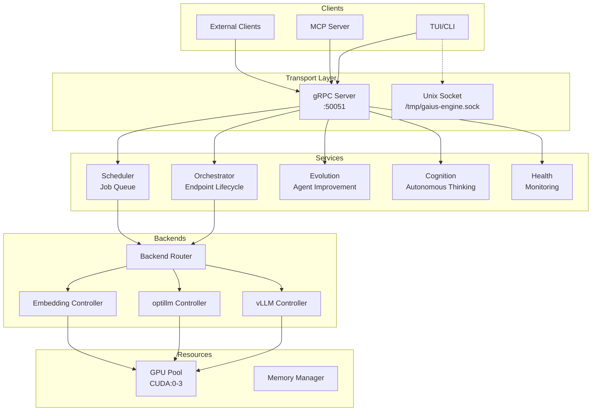
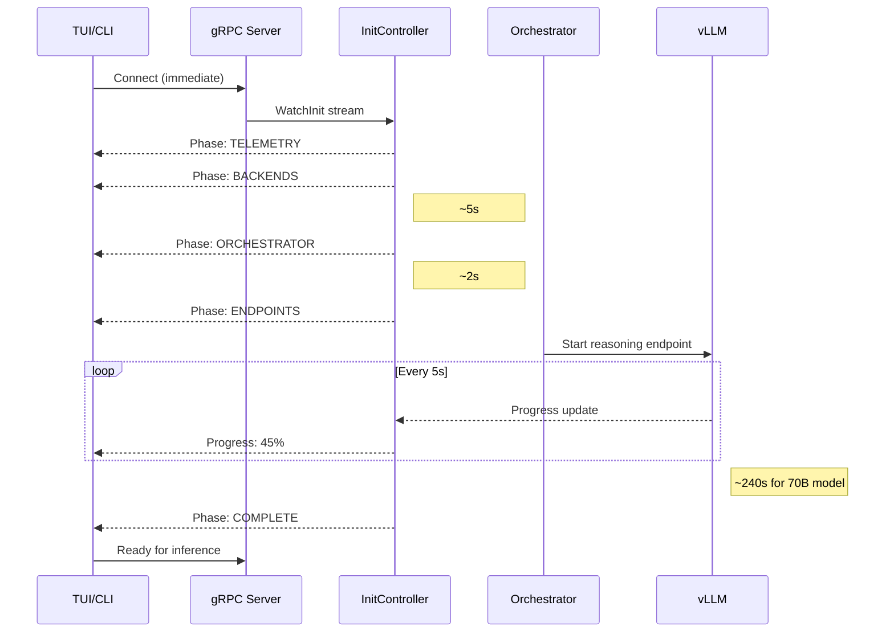
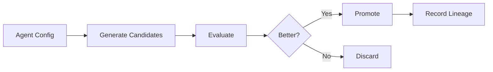

# Gaius Engine

Centralized daemon for GPU orchestration, inference scheduling, and agent evolution. The engine serves as the control plane for all Gaius operations.

## Architecture



## Module Structure

```
engine/
├── server.py              # Main daemon loop
├── config.py              # Engine configuration
├── init_controller.py     # Initialization progress streaming
├── workloads.py           # Workload definitions
├── grpc/
│   ├── server.py          # gRPC server
│   └── servicers/
│       ├── inference_servicer.py  # KServe OIP
│       └── gaius_servicer.py      # Custom extensions
├── backends/
│   ├── backend_router.py  # Unified routing
│   ├── vllm_controller.py # vLLM process management
│   ├── optillm_controller.py
│   └── embedding_controller.py
├── services/
│   ├── orchestrator_service.py  # Endpoint lifecycle
│   ├── scheduler_service.py     # Job scheduling
│   ├── evolution_service.py     # Agent evolution
│   ├── cognition_service.py     # Autonomous thinking
│   └── health_service.py        # Health monitoring
├── compute/
│   ├── grid_service.py    # UMAP projection
│   └── tda_service.py     # Topological analysis
├── resources/
│   ├── manager.py         # Resource allocation
│   └── allocations.py     # GPU allocations
├── transport/
│   ├── protocol.py        # Message protocol
│   └── aeron_bridge.py    # Aeron IPC (legacy)
├── generated/             # Protobuf generated code
└── proto/                 # Protobuf definitions
```

## gRPC Protocol

### KServe Open Inference Protocol (OIP)

The engine implements KServe's standard inference protocol for compatibility with Cloudera and other ML platforms:

```protobuf
service GRPCInferenceService {
    rpc ServerLive(ServerLiveRequest) returns (ServerLiveResponse);
    rpc ServerReady(ServerReadyRequest) returns (ServerReadyResponse);
    rpc ModelMetadata(ModelMetadataRequest) returns (ModelMetadataResponse);
    rpc ModelInfer(ModelInferRequest) returns (ModelInferResponse);
}
```

### Gaius Extensions

Custom extensions for Gaius-specific functionality:

```protobuf
service GaiusService {
    // Bidirectional streaming for initialization progress
    rpc WatchInit(stream InitRequest) returns (stream InitProgress);

    // Health and metrics streaming
    rpc WatchHealth(HealthRequest) returns (stream HealthMetrics);

    // Evolution control
    rpc EvolutionStatus(Empty) returns (EvolutionStatusResponse);
    rpc TriggerEvolution(TriggerRequest) returns (TriggerResponse);

    // Orchestrator
    rpc GetEndpointStatus(Empty) returns (EndpointStatusResponse);
    rpc StartEndpoint(StartRequest) returns (StartResponse);
    rpc StopEndpoint(StopRequest) returns (StopResponse);
}
```

## Initialization Flow



The gRPC server starts **early** so clients can connect immediately and receive real-time progress updates during the ~4 minute vLLM preload phase.

## Services

### Orchestrator Service

Manages vLLM/optillm endpoint lifecycle:

```python
@dataclass
class EndpointStatus:
    agent_alias: str      # "reasoning", "coding", etc.
    model: str            # HuggingFace model ID
    port: int             # Serving port
    gpu_ids: list[int]    # Allocated GPUs
    status: str           # "starting", "healthy", "unhealthy", "stopped"
    startup_progress: float  # 0.0 - 1.0
```

**Yunikorn-Style Workload Management:**
- Capability-based routing: requests declare capabilities, not endpoints
- Priority-based preemption: idle endpoints evicted for higher-priority work
- Makespan fulfillment: engine ensures work completes, then restores set points

### Scheduler Service

Priority-based job queue for inference requests:

| Priority | Use Case |
|----------|----------|
| `critical` | Interactive user requests |
| `high` | Agent evolution |
| `normal` | Background processing |
| `low` | Speculative inference |

### Evolution Service

Continuous agent improvement via APO (Automatic Prompt Optimization):



### Cognition Service

Scheduled autonomous thinking:

| Task | Schedule | Purpose |
|------|----------|---------|
| `cognition_cycle` | Every 4h | Generate new thoughts |
| `self_observation` | Every 8h | Meta-cognitive reflection |
| `engine_audit` | Every 12h | System health analysis |

## Backend Controllers

### vLLM Controller

Manages vLLM inference server processes:

```python
class VLLMController:
    async def start_endpoint(
        self,
        model: str,
        gpu_ids: list[int],
        port: int,
        tensor_parallel: int = 1,
    ) -> ProcessStatus

    async def stop_endpoint(self, port: int) -> bool

    async def health_check(self, port: int) -> bool
```

**Process Management:**
- Graceful shutdown with SIGTERM
- Force kill after timeout
- CUDA memory cleanup
- Orphan process detection

### optillm Controller

Manages optillm reasoning enhancement server:

```python
class OptillmController:
    async def start(self) -> ProcessStatus
    async def stop(self) -> bool
    async def health_check(self) -> bool
```

Supports techniques: `cot_reflection`, `bon`, `moa`, `rto`, `z3`, `leap`.

### Backend Router

Unified routing to appropriate backend:

```python
class BackendRouter:
    async def route_inference(
        self,
        model: str,
        prompt: str,
        max_tokens: int,
        technique: str = "",  # optillm technique
    ) -> str
```

## Configuration

```hocon
engine {
    grpc {
        enabled = true
        host = "0.0.0.0"
        port = 50051
        max_workers = 10
        max_message_size = 104857600  # 100MB
        reflection_enabled = true
    }

    orchestrator {
        preload_endpoints = ["reasoning"]
        startup_timeout = 600  # 10 minutes
        health_check_interval = 30
    }

    scheduler {
        max_queue_size = 1000
        default_timeout = 120
    }

    evolution {
        enabled = true
        idle_threshold = 60  # seconds
        cycle_interval = 3600  # 1 hour
    }
}
```

## Usage

### Running the Engine

```bash
# Start engine daemon
uv run python -m gaius.engine

# Or via entry point
uv run gaius-engine
```

### Client Connection

```python
import grpc
from gaius.engine.generated import gaius_service_pb2_grpc

channel = grpc.insecure_channel("localhost:50051")
stub = gaius_service_pb2_grpc.GaiusServiceStub(channel)

# Watch initialization progress
for progress in stub.WatchInit(InitRequest()):
    print(f"{progress.phase}: {progress.message}")
```

### Security

**Secure-by-Default Architecture:**

All inference requests route through the gRPC engine for:
- Authentication and authorization
- Audit logging
- Resource management and rate limiting

Direct HTTP access to optillm/vLLM is disabled by default:

```bash
# Enable direct HTTP fallbacks (dev/debug only)
export GAIUS_ALLOW_FALLBACKS=true
```

## See Also

- [Parent README](../README.md) - Module overview
- [Inference README](../inference/README.md) - vLLM orchestration details
- [Health README](../health/README.md) - Self-healing integration
