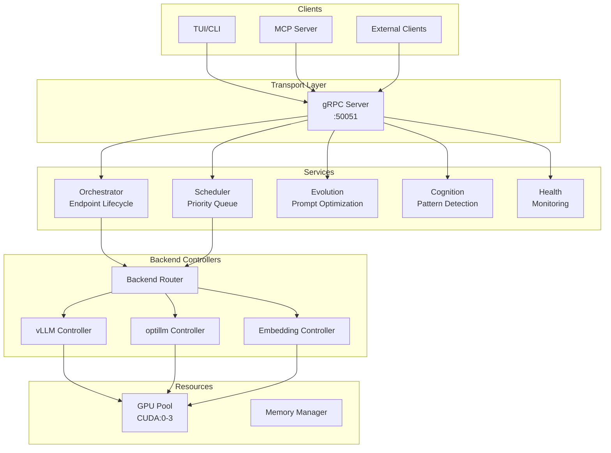
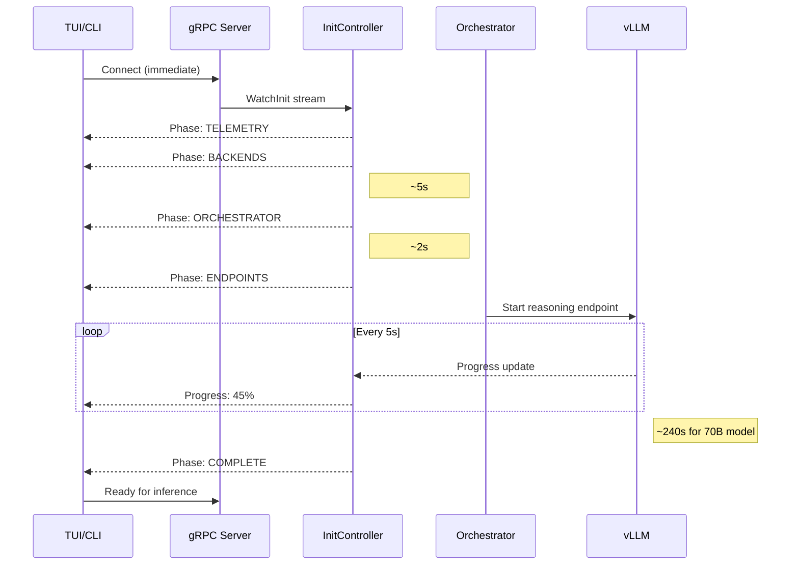
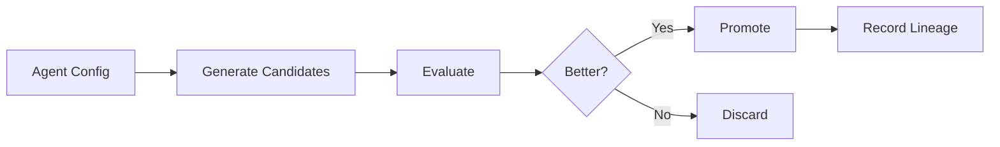

# Gaius Engine

Centralized daemon for GPU orchestration, inference scheduling, and background processes. The engine serves as the control plane for all Gaius operations, exposing a gRPC interface for client communication.

## Architecture



## Module Structure

```
engine/
├── server.py              # Main daemon entry point
├── config.py              # Engine configuration
├── init_controller.py     # Initialization progress streaming
├── workloads.py           # Workload definitions
├── grpc/
│   ├── server.py          # gRPC server
│   └── servicers/
│       ├── inference_servicer.py  # KServe OIP implementation
│       └── gaius_servicer.py      # Custom extensions
├── backends/
│   ├── backend_router.py  # Unified request routing
│   ├── vllm_controller.py # vLLM process management
│   ├── optillm_controller.py
│   └── embedding_controller.py
├── services/
│   ├── orchestrator_service.py  # Endpoint lifecycle
│   ├── scheduler_service.py     # Job scheduling
│   ├── evolution_service.py     # Prompt optimization
│   ├── cognition_service.py     # Pattern detection
│   └── health_service.py        # Health monitoring
├── compute/
│   ├── grid_service.py    # UMAP projection
│   └── tda_service.py     # Topological analysis
├── resources/
│   ├── manager.py         # Resource allocation
│   └── allocations.py     # GPU allocations
├── generated/             # Protobuf generated code
└── proto/                 # Protobuf definitions
```

## gRPC Protocol

### KServe Open Inference Protocol

The engine implements KServe's standard inference protocol (KServe, 2023) for compatibility with Cloudera AI and other ML platforms:

```protobuf
service GRPCInferenceService {
    rpc ServerLive(ServerLiveRequest) returns (ServerLiveResponse);
    rpc ServerReady(ServerReadyRequest) returns (ServerReadyResponse);
    rpc ModelMetadata(ModelMetadataRequest) returns (ModelMetadataResponse);
    rpc ModelInfer(ModelInferRequest) returns (ModelInferResponse);
}
```

### Gaius Extensions

Custom extensions for Gaius-specific functionality:

```protobuf
service GaiusService {
    // Bidirectional streaming for initialization progress
    rpc WatchInit(stream InitRequest) returns (stream InitProgress);

    // Health and metrics streaming
    rpc WatchHealth(HealthRequest) returns (stream HealthMetrics);

    // Evolution control
    rpc EvolutionStatus(Empty) returns (EvolutionStatusResponse);
    rpc TriggerEvolution(TriggerRequest) returns (TriggerResponse);

    // Orchestrator
    rpc GetEndpointStatus(Empty) returns (EndpointStatusResponse);
    rpc StartEndpoint(StartRequest) returns (StartResponse);
    rpc StopEndpoint(StopRequest) returns (StopResponse);
}
```

## Initialization Protocol

The engine implements a phased initialization with progress streaming, allowing clients to display real-time status during the ~4 minute vLLM startup:



The gRPC server starts early so clients can connect immediately and receive real-time progress updates during vLLM model loading.

## Services

### Orchestrator Service

Manages vLLM and optillm endpoint lifecycle with capability-based routing:

```python
@dataclass
class EndpointStatus:
    agent_alias: str      # "reasoning", "coding", etc.
    model: str            # HuggingFace model ID
    port: int             # Serving port
    gpu_ids: list[int]    # Allocated GPUs
    status: str           # "starting", "healthy", "unhealthy", "stopped"
    startup_progress: float  # 0.0 - 1.0
```

**Workload Management**: Follows Yunikorn-style capability-based scheduling (Apache Yunikorn, 2024):
- Requests declare required capabilities, not specific endpoints
- Priority-based preemption: idle endpoints evicted for higher-priority work
- Makespan fulfillment: engine ensures work completes, then restores set points

### Scheduler Service

Priority-based job queue using weighted completion time minimization:

| Priority | Weight | Use Case |
|----------|--------|----------|
| `critical` | 1.0 | Interactive user requests |
| `high` | 2.0 | Swarm agent coordination |
| `normal` | 4.0 | Background processing |
| `low` | 8.0 | Speculative inference |

Lower weights receive preferential scheduling.

### Evolution Service

Background prompt optimization using APO (Zhou et al., 2023):



Evolution cycles execute during GPU idle periods, optimizing agent system prompts based on evaluation feedback.

### Cognition Service

Scheduled background tasks for pattern detection:

| Task | Schedule | Purpose |
|------|----------|---------|
| `cognition_cycle` | Every 4h | Detect patterns in recent KB activity |
| `self_observation` | Every 8h | Meta-cognitive reflection on thought patterns |
| `engine_audit` | Every 12h | System health and resource analysis |

## Backend Controllers

### vLLM Controller

Manages vLLM inference server processes:

```python
class VLLMController:
    async def start_endpoint(
        self,
        model: str,
        gpu_ids: list[int],
        port: int,
        tensor_parallel: int = 1,
    ) -> ProcessStatus

    async def stop_endpoint(self, port: int) -> bool

    async def health_check(self, port: int) -> bool
```

**Process Management**:
- Graceful shutdown with SIGTERM, force kill after timeout
- CUDA memory cleanup via `torch.cuda.empty_cache()`
- Orphan process detection and cleanup
- Circular log buffer (500 lines) for diagnostics

### optillm Controller

Manages optillm reasoning enhancement server (Maheshwari, 2024):

Supported techniques:
- `cot_reflection`: Chain-of-thought with reflection
- `bon`: Best-of-N sampling
- `moa`: Mixture of Agents
- `rto`: Round-trip optimization
- `z3`: Z3 solver integration for logical reasoning
- `leap`: Learn from examples

### Backend Router

Unified request routing to appropriate backend based on capability requirements:

```python
class BackendRouter:
    async def route_inference(
        self,
        model: str,
        prompt: str,
        max_tokens: int,
        technique: str = "",  # optillm technique
    ) -> str
```

## Configuration

```hocon
engine {
    grpc {
        enabled = true
        host = "0.0.0.0"
        port = 50051
        max_workers = 10
        max_message_size = 104857600  # 100MB
        reflection_enabled = true
    }

    orchestrator {
        preload_endpoints = ["reasoning"]
        startup_timeout = 600  # 10 minutes
        health_check_interval = 30
    }

    scheduler {
        max_queue_size = 1000
        default_timeout = 120
    }

    evolution {
        enabled = true
        idle_threshold = 60  # seconds
        cycle_interval = 3600  # 1 hour
    }
}
```

## Usage

### Running the Engine

```bash
# Start engine daemon
uv run gaius-engine

# Or as module
uv run python -m gaius.engine
```

### Client Connection

```python
import grpc
from gaius.engine.generated import gaius_service_pb2_grpc

channel = grpc.insecure_channel("localhost:50051")
stub = gaius_service_pb2_grpc.GaiusServiceStub(channel)

# Watch initialization progress
for progress in stub.WatchInit(InitRequest()):
    print(f"{progress.phase}: {progress.message}")
```

### Security

All inference requests route through the gRPC engine for centralized:
- Authentication and authorization
- Audit logging
- Resource management and rate limiting

All clients (TUI, CLI, MCP) must connect via gRPC. Direct HTTP access to optillm/vLLM backends is not supported.

## References

- Apache Yunikorn. (2024). *Yunikorn: A Universal Resource Scheduler*. https://yunikorn.apache.org/
- KServe. (2023). *Open Inference Protocol*. https://kserve.github.io/website/latest/modelserving/data_plane/
- Maheshwari, P. (2024). *optillm: Inference-time reasoning optimization*. https://github.com/codelion/optillm
- Zhou, Y., Muresanu, A. I., Han, Z., et al. (2023). Large Language Models Are Human-Level Prompt Engineers. *ICLR 2023*.

## Call Graph

```
# Engine Startup (gaius-engine)
engine/server.py:main()
  └─→ GaiusEngine.start()
      ├─→ Phase 1: InitController.start()
      ├─→ Phase 2: grpc.server.start()          # Clients can connect early
      ├─→ Phase 3: core.telemetry.setup()
      ├─→ Phase 4: backends.router.initialize()
      │     ├─→ vllm_controller.start()
      │     └─→ optillm_controller.start()
      ├─→ Phase 5: orchestrator_service.start()
      ├─→ Phase 6: preload_endpoints()          # Load models to VRAM (~240s)
      │     └─→ vllm_controller.start_endpoint("reasoning")
      ├─→ Phase 7: transport.aeron_bridge.start()
      ├─→ Phase 8: background_services.start()
      │     ├─→ cognition_service.start()
      │     ├─→ evolution_service.start()
      │     ├─→ flow_scheduler_service.start()
      │     └─→ topology_service.start()
      └─→ Phase 9: init_controller.mark_complete()

# Inference Request Path
client.grpc_client.infer(messages)
  └─→ grpc.servicers.gaius_servicer.ModelInfer()
      └─→ scheduler_service.submit_job()
          └─→ backends.router.route_inference()
              ├─→ optillm_controller.enhance()  # if technique specified
              └─→ vllm_controller.infer()
                  └─→ HTTP POST to vLLM endpoint

# Evolution Daemon Path
evolution_service.start_daemon()
  └─→ EvolutionDaemon.run()
      └─→ while True:
          ├─→ gpu_monitor.check_idle()         # <30% utilization
          ├─→ wait_for_idle(idle_threshold)
          └─→ evolution.engine.run_cycle()
              ├─→ select_agent()               # round-robin
              ├─→ generate_candidates()
              ├─→ evaluate_candidates()
              └─→ promote_best()
```

## Integration Points

| Service | Provides | Consumers | Protocol |
|---------|----------|-----------|----------|
| `GrpcServer` | Inference, health, evolution APIs | TUI, CLI, MCP | gRPC |
| `OrchestratorService` | Endpoint lifecycle | Scheduler, health | Internal |
| `SchedulerService` | Job queue, priority | gRPC servicers | Internal |
| `EvolutionService` | Prompt optimization | Background daemon | Internal |
| `CognitionService` | Pattern detection | Scheduled tasks | Internal |
| `VllmController` | vLLM process management | Orchestrator | HTTP |
| `OptillmController` | Reasoning enhancement | Router | HTTP |

## See Also

- [Parent README](../README.md) — System overview, layer architecture
- [Client README](../client/README.md) — gRPC client implementation
- [Inference README](../inference/README.md) — vLLM orchestration details
- [Agents README](../agents/README.md) — Evolution daemon, cognition
- [Health README](../health/README.md) — Self-healing integration
- [Models README](../models/README.md) — Versioning for evolution

---

<!-- GAI:META
module: gaius.engine
layer: L3-engine
entry_point: gaius-engine
key_types: [GaiusEngine, GrpcServer, OrchestratorService, SchedulerService, EvolutionService, VllmController, OptillmController, BackendRouter]
key_funcs: []
submodules: [grpc, backends, services, compute, resources, transport, generated]
depends: [core.telemetry, core.config, models, agents.evolution, health]
dependents: [client, app, mcp_server]
config_keys: [engine.grpc.port, engine.grpc.host, engine.orchestrator.preload_endpoints, engine.scheduler.max_queue_size, engine.evolution.enabled, engine.evolution.idle_threshold]
env_vars: [GAIUS_ENGINE_HOST, GAIUS_ENGINE_PORT]
grpc_services: [GaiusService, GRPCInferenceService]
ports: [50051]
startup_phases: [INIT, GRPC, TELEMETRY, BACKENDS, ORCHESTRATOR, ENDPOINTS, TRANSPORT, SERVICES, COMPLETE]
external_deps: [grpc, vllm, optillm, pynvml]
call_paths:
  startup: main→GaiusEngine.start→9_phases→init_complete
  inference: grpc.ModelInfer→scheduler.submit→router.route→vllm.infer
  evolution: evolution_service→EvolutionDaemon.run→run_cycle→promote
test_cmd: 'uv run gaius-engine'
guru_codes: [EN.00001.GRPC_BIND, EN.00002.VLLM_START, EN.00003.GPU_OOM, EN.00004.ORPHAN_PROC]
fail_fast: true
-->

