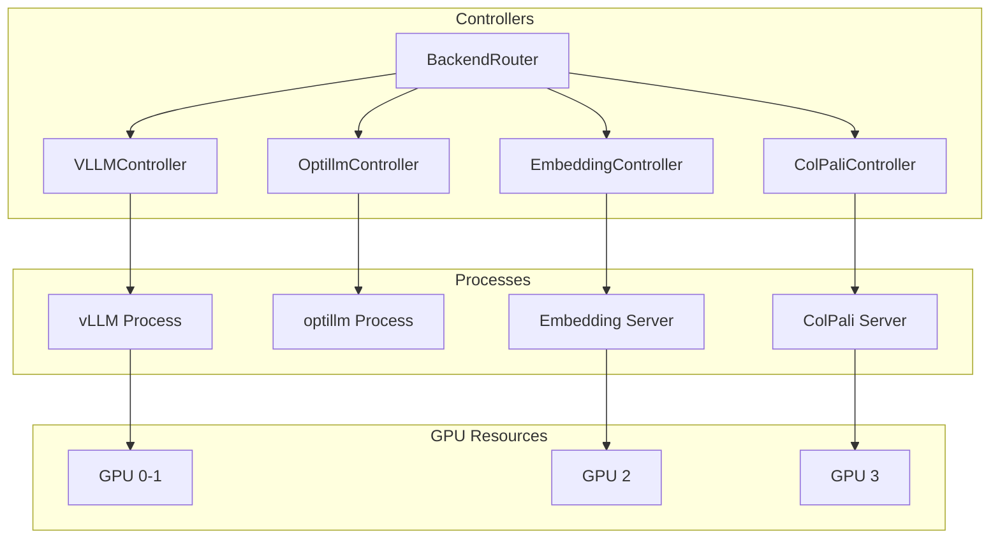
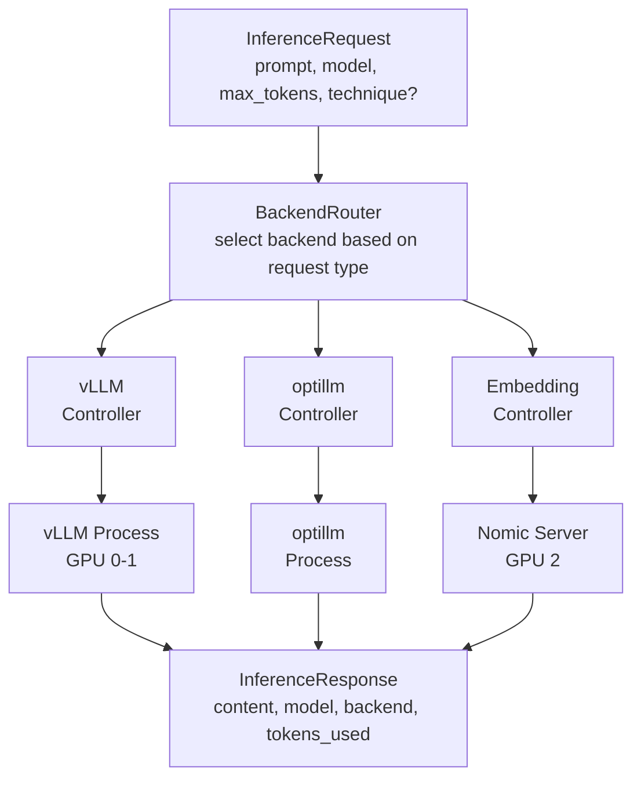

# Gaius Engine Backends

Inference backend controllers for vLLM, optillm, embeddings, and ColPali. These controllers manage process lifecycle and provide typed request/response interfaces to inference backends.

## Architecture



## Module Structure

```
backends/
├── __init__.py              # Module exports
├── backend_router.py        # BackendRouter (unified dispatch)
├── vllm_controller.py       # VLLMController (vLLM process management)
├── optillm_controller.py    # OptillmController (optillm techniques)
├── embedding_controller.py  # EmbeddingController (Nomic/ColNomic)
├── colpali_controller.py    # ColPaliController (multi-vector)
└── external/
    └── __init__.py          # External provider adapters
```

## BackendRouter

Unified dispatch to appropriate backend:

```python
from gaius.engine.backends import BackendRouter, InferenceRequest

router = BackendRouter()

# Route automatically based on request type
request = InferenceRequest(
    prompt="Analyze the pension risk model...",
    model="reasoning",
    max_tokens=2048,
)

response = await router.route(request)
print(f"Response: {response.content}")
print(f"Backend used: {response.backend}")
```

### InferenceRequest

```python
@dataclass
class InferenceRequest:
    prompt: str
    model: str = "reasoning"
    max_tokens: int = 1024
    temperature: float = 0.7
    system_prompt: str | None = None
    technique: str | None = None  # For optillm
```

### InferenceResponse

```python
@dataclass
class InferenceResponse:
    content: str
    model: str
    backend: str
    tokens_used: int
    latency_ms: int
    finish_reason: str
```

## VLLMController

Manages vLLM inference server processes:

```python
from gaius.engine.backends import VLLMController, VLLMRequest, ProcessStatus

controller = VLLMController()

# Start process
await controller.start(
    model="mistralai/Mistral-7B-Instruct-v0.3",
    gpus=[0, 1],
    port=8000,
)

# Check status
status = controller.get_status()
print(f"Status: {status.state}")  # healthy, starting, unhealthy
print(f"PID: {status.pid}")

# Inference
request = VLLMRequest(
    prompt="Explain pension fund management...",
    max_tokens=1024,
)
response = await controller.infer(request)
print(response.content)

# Stop
await controller.stop()
```

### VLLMProcess

```python
@dataclass
class VLLMProcess:
    pid: int
    port: int
    model: str
    gpus: list[int]
    started_at: datetime
    status: ProcessStatus
```

### ProcessStatus

```python
class ProcessStatus(Enum):
    STARTING = "starting"
    HEALTHY = "healthy"
    UNHEALTHY = "unhealthy"
    STOPPED = "stopped"
```

## OptillmController

Optillm reasoning enhancement techniques:

```python
from gaius.engine.backends import OptillmController, OptillmRequest, OptillmTechnique

controller = OptillmController()

# Available techniques
techniques = [
    OptillmTechnique.COT_REFLECTION,  # Chain-of-thought with reflection
    OptillmTechnique.BON,             # Best-of-N sampling
    OptillmTechnique.MOA,             # Mixture of Agents
    OptillmTechnique.PV,              # Plan and Verify
    OptillmTechnique.Z3,              # Z3 solver integration
]

# Inference with technique
request = OptillmRequest(
    prompt="Solve this optimization problem...",
    technique=OptillmTechnique.COT_REFLECTION,
    max_tokens=2048,
)
response = await controller.infer(request)
```

## EmbeddingController

Single-vector embedding generation:

```python
from gaius.engine.backends import EmbeddingController, EmbeddingRequest, get_embedding_controller

controller = get_embedding_controller()

# Single embedding
request = EmbeddingRequest(text="Pension fund risk management")
response = await controller.embed(request)
print(f"Embedding dim: {len(response.embedding)}")  # 768

# Batch embedding
texts = ["Risk analysis", "Portfolio optimization", "Liability matching"]
responses = await controller.embed_batch(texts)

# Status
status = controller.get_status()
print(f"Endpoint: {status.endpoint}")
print(f"Model: {status.model}")
```

### EmbeddingEndpoint

```python
@dataclass
class EmbeddingEndpoint:
    url: str
    model: str
    dimension: int
    status: EmbeddingStatus
```

## ColPaliController

Multi-vector (late interaction) embeddings:

```python
from gaius.engine.backends import ColPaliController, ColPaliRequest, get_colpali_controller

controller = get_colpali_controller()

# Generate multi-vector embedding
request = ColPaliRequest(
    text="Complex pension liability analysis",
    image=None,  # Optional image for vision tasks
)
response = await controller.embed(request)
print(f"Vectors: {len(response.vectors)}")  # Multiple vectors
print(f"Vector dim: {len(response.vectors[0])}")

# Vision embedding
request = ColPaliRequest(
    text="Describe this chart",
    image=chart_bytes,
)
response = await controller.embed(request)
```

## Call Graph

```
# Backend Routing Path
mcp_server.py:ask_reasoning()
  └─→ engine.backends.BackendRouter.route()
      ├─→ [if technique specified]
      │   └─→ OptillmController.infer()
      └─→ [else]
          └─→ VLLMController.infer()

# vLLM Lifecycle Path
engine.services.OrchestratorService.ensure_endpoint()
  └─→ backends.VLLMController.start()
      ├─→ subprocess.Popen(vllm_cmd)
      └─→ wait_for_healthy()
          └─→ httpx.get(health_endpoint)

# Embedding Path
storage.sync_engine.SyncEngine.embed()
  └─→ backends.EmbeddingController.embed()
      └─→ httpx.post(embedding_endpoint)
          └─→ EmbeddingResponse

# ColPali Path
inference.client.InferenceClient.embed_multi()
  └─→ backends.ColPaliController.embed()
      └─→ httpx.post(colpali_endpoint)
          └─→ ColPaliResponse
```

## Data Flow



## GPU Allocation

| Backend | Default GPUs | Memory | Use Case |
|---------|--------------|--------|----------|
| vLLM (reasoning) | 0, 1 | 80GB each | Large model inference |
| vLLM (coding) | 2, 3 | 80GB each | Code generation |
| Embedding | 2 | 24GB | Single-vector embeddings |
| ColPali | 3 | 24GB | Multi-vector embeddings |

## Integration Points

| Component | Uses | Used By | Integration |
|-----------|------|---------|-------------|
| `BackendRouter` | all controllers | inference.client | `route()` |
| `VLLMController` | subprocess, httpx | orchestrator, scheduler | `start()`, `infer()`, `stop()` |
| `OptillmController` | httpx | scheduler | `infer()` |
| `EmbeddingController` | httpx | sync_engine, storage | `embed()`, `embed_batch()` |
| `ColPaliController` | httpx | inference.client | `embed()` |

## See Also

- [Parent README](../README.md) — Engine overview
- [Services README](../services/README.md) — Orchestrator/Scheduler
- [Inference README](../../inference/README.md) — Client interface
- [Models README](../../models/README.md) — Model registry

---

<!-- GAI:META
module: gaius.engine.backends
layer: L3-engine
key_types: [BackendRouter, InferenceRequest, InferenceResponse, VLLMController, VLLMProcess, VLLMRequest, VLLMResponse, ProcessStatus, OptillmController, OptillmRequest, OptillmResponse, OptillmTechnique, EmbeddingController, EmbeddingEndpoint, EmbeddingRequest, EmbeddingResponse, EmbeddingStatus, ColPaliController, ColPaliEndpoint, ColPaliRequest, ColPaliResponse, ColPaliStatus]
key_funcs: [route, start, stop, infer, embed, embed_batch, get_status, get_embedding_controller, get_colpali_controller]
singletons: [get_embedding_controller, get_colpali_controller]
submodules: [external]
depends: [subprocess, httpx, pynvml]
dependents: [services.orchestrator, services.scheduler, inference.client, storage.sync_engine]
config_keys: [backends.vllm_default_gpus, backends.embedding_gpu, backends.colpali_gpu]
env_vars: []
grpc_services: []
gpu_allocation:
  vllm_reasoning: [0, 1]
  vllm_coding: [2, 3]
  embedding: [2]
  colpali: [3]
optillm_techniques: [cot_reflection, bon, moa, pv, z3]
call_paths:
  route: mcp.ask_reasoning→BackendRouter.route→VLLMController.infer|OptillmController.infer
  lifecycle: OrchestratorService→VLLMController.start→subprocess.Popen→wait_healthy
  embed: sync_engine.embed→EmbeddingController.embed→httpx.post
  colpali: inference.embed_multi→ColPaliController.embed→httpx.post
test_cmds:
  status: 'uv run gaius-cli --cmd "/orchestrator status"'
  infer: 'uv run gaius-cli --cmd "/ask \"test prompt\""'
guru_codes: [BE.00001.VLLM_START_FAIL, BE.00002.VLLM_OOM, BE.00003.EMBED_UNAVAIL, BE.00004.COLPALI_UNAVAIL]
fail_fast: true
-->
