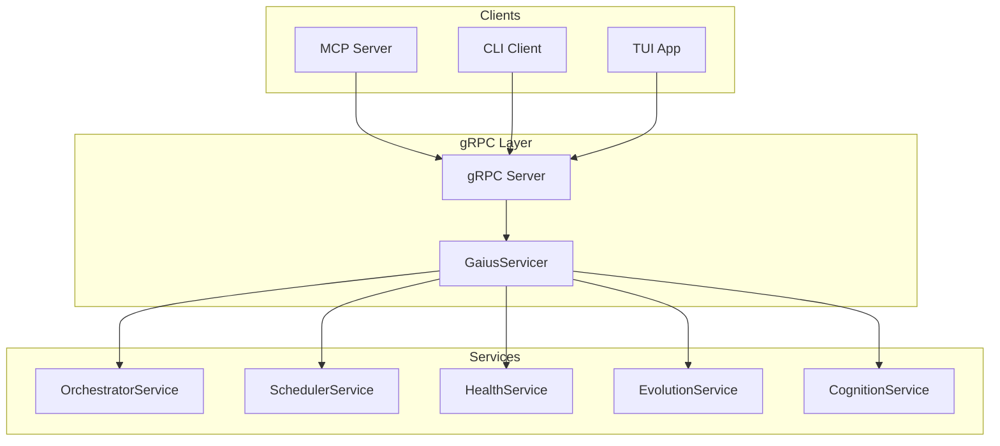
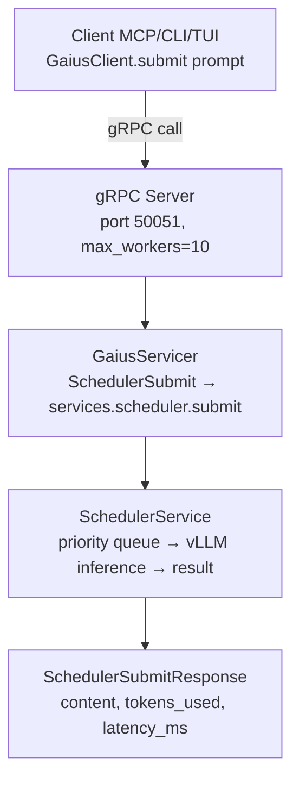

# Gaius Engine gRPC

gRPC server implementation providing the network interface to engine services. Implements the GaiusService protocol defined in `proto/gaius_service.proto`.

## Architecture



## Module Structure

```
grpc/
├── __init__.py              # Module exports
└── servicers/
    ├── __init__.py          # Servicer exports
    └── gaius_servicer.py    # GaiusServicer implementation
```

## GaiusServicer

Main servicer implementing the GaiusService protocol:

```python
from gaius.engine.grpc.servicers import GaiusServicer

servicer = GaiusServicer(
    orchestrator=orchestrator_service,
    scheduler=scheduler_service,
    health=health_service,
    evolution=evolution_service,
    cognition=cognition_service,
)
```

## Protocol Methods

### Orchestrator

```protobuf
service GaiusService {
    rpc OrchestratorStatus(Empty) returns (OrchestratorStatusResponse);
    rpc OrchestratorStart(OrchestratorStartRequest) returns (OrchestratorStartResponse);
    rpc OrchestratorStop(OrchestratorStopRequest) returns (OrchestratorStopResponse);
    rpc OrchestratorCleanStart(CleanStartRequest) returns (CleanStartResponse);
}
```

### Scheduler

```protobuf
service GaiusService {
    rpc SchedulerSubmit(SchedulerSubmitRequest) returns (SchedulerSubmitResponse);
    rpc SchedulerSubmitAsync(SchedulerSubmitRequest) returns (JobIdResponse);
    rpc SchedulerGetResult(JobIdRequest) returns (SchedulerResultResponse);
    rpc SchedulerStatus(Empty) returns (SchedulerStatusResponse);
}
```

### Health

```protobuf
service GaiusService {
    rpc GPUHealth(Empty) returns (GPUHealthResponse);
    rpc SystemHealth(Empty) returns (SystemHealthResponse);
}
```

### Evolution

```protobuf
service GaiusService {
    rpc EvolutionStatus(Empty) returns (EvolutionStatusResponse);
    rpc EvolutionTrigger(EvolutionTriggerRequest) returns (EvolutionTriggerResponse);
    rpc EvolutionStart(Empty) returns (EvolutionStartResponse);
    rpc EvolutionStop(Empty) returns (EvolutionStopResponse);
}
```

### Cognition

```protobuf
service GaiusService {
    rpc TriggerCognition(CognitionRequest) returns (CognitionResponse);
    rpc GetRecentThoughts(ThoughtsRequest) returns (ThoughtsResponse);
}
```

## Server Startup

```python
from gaius.engine.grpc import create_server

server = await create_server(
    host="0.0.0.0",
    port=50051,
    max_workers=10,
)

await server.start()
await server.wait_for_termination()
```

## Client Usage

From `gaius.client`:

```python
from gaius.client import get_engine_client

client = get_engine_client()

# Orchestrator
status = await client.orchestrator_status()
await client.orchestrator_start("reasoning")

# Scheduler
result = await client.submit("Analyze this...", priority="high")

# Health
gpu_health = await client.gpu_health()

# Evolution
await client.evolution_trigger("leader")
```

## Request/Response Types

Generated from protobuf definitions in `proto/gaius_service.proto`:

```python
from gaius.engine.generated import (
    OrchestratorStatusResponse,
    SchedulerSubmitRequest,
    SchedulerSubmitResponse,
    GPUHealthResponse,
    EvolutionStatusResponse,
)
```

## Call Graph

```
# gRPC Request Path
client.grpc_client.GaiusClient.submit()
  └─→ grpc.aio.Channel.unary_unary()
      └─→ [network]
          └─→ grpc.server.serve()
              └─→ GaiusServicer.SchedulerSubmit()
                  └─→ services.SchedulerService.submit()
                      └─→ SchedulerSubmitResponse

# Server Startup Path
engine.main.start_engine()
  └─→ grpc.create_server()
      ├─→ GaiusServicer(services)
      ├─→ grpc.aio.server()
      └─→ server.add_insecure_port()
          └─→ server.start()
```

## Data Flow



## Configuration

```python
@dataclass
class GRPCConfig:
    host: str = "0.0.0.0"
    port: int = 50051
    max_workers: int = 10
    max_message_length: int = 100 * 1024 * 1024  # 100 MB
    reflection: bool = True  # Enable gRPC reflection
```

Environment variables:
- `GAIUS_ENGINE_HOST`: Engine host (default: localhost)
- `GAIUS_ENGINE_PORT`: Engine port (default: 50051)

## Integration Points

| Component | Uses | Used By | Integration |
|-----------|------|---------|-------------|
| `GaiusServicer` | all services | gRPC server | Protocol implementation |
| `create_server()` | GaiusServicer | engine.main | Server factory |
| `gaius_service_pb2` | protobuf | servicer, client | Generated types |
| `gaius_service_pb2_grpc` | grpc | servicer, client | Generated stubs |

## See Also

- [Parent README](../README.md) — Engine overview
- [Services README](../services/README.md) — Service implementations
- [Client README](../../client/README.md) — gRPC client
- [Proto file](../proto/gaius_service.proto) — Protocol definition

---

<!-- GAI:META
module: gaius.engine.grpc
layer: L3-engine
key_types: [GaiusServicer]
key_funcs: [create_server, OrchestratorStatus, SchedulerSubmit, GPUHealth, EvolutionStatus, TriggerCognition]
submodules: [servicers]
depends: [services, generated]
dependents: [engine.main, client.grpc_client]
config_keys: [grpc.host, grpc.port, grpc.max_workers, grpc.max_message_length]
env_vars: [GAIUS_ENGINE_HOST, GAIUS_ENGINE_PORT]
grpc_services: [GaiusService]
protocol_file: proto/gaius_service.proto
call_paths:
  request: client.submit→grpc.Channel→GaiusServicer.SchedulerSubmit→services.scheduler
  startup: engine.main→create_server→GaiusServicer→server.start
test_cmds:
  health: 'grpcurl -plaintext localhost:50051 gaius.GaiusService/GPUHealth'
  status: 'grpcurl -plaintext localhost:50051 gaius.GaiusService/OrchestratorStatus'
guru_codes: [GR.00001.SERVER_BIND_FAIL, GR.00002.SERVICER_ERROR]
fail_fast: true
-->
