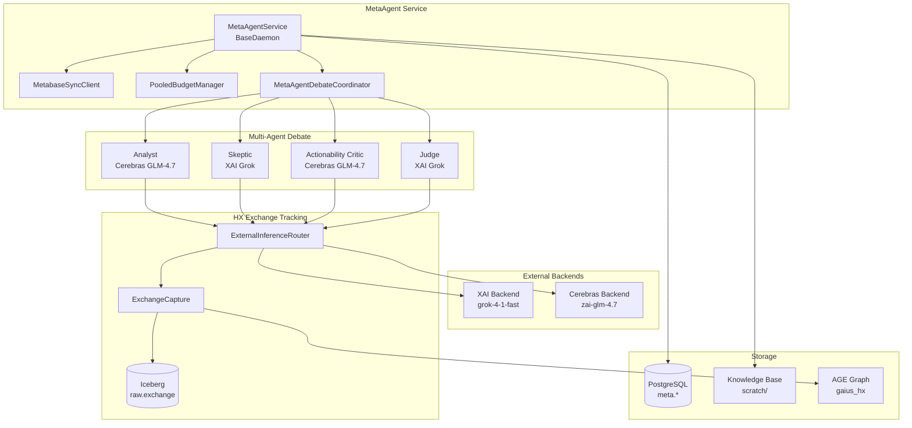
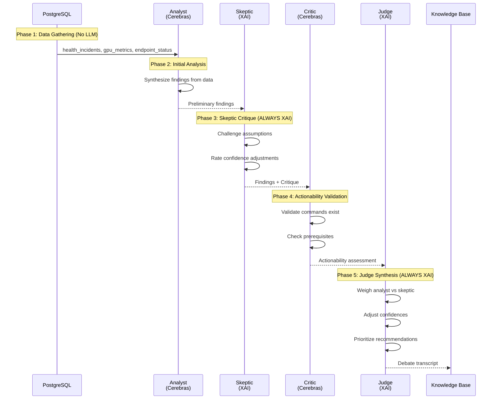

# MetaAgent Service

MetaAgent is Gaius's self-observability and self-improvement daemon. It coordinates observability sync (Metabase dashboards), runs LLM-powered audits using Multi-Agent Debate architecture, and captures exchanges for On-Policy Distillation.

## Overview



## Multi-Agent Debate Architecture

MetaAgent uses Multi-Agent Debate (Du et al., 2023) to overcome "Degeneration-of-Thought" where single-agent systems become overconfident. The debate produces robust findings that survive adversarial scrutiny.

### 5-Phase Debate Flow



### Budget Strategy: Quality-First

The debate uses a **Quality-First** strategy that reserves XAI Grok for critical phases:

| Phase | Provider | Model | Role | Rationale |
|-------|----------|-------|------|-----------|
| 2 | Cerebras | zai-glm-4.7 | Analyst | Fast initial synthesis |
| 3 | XAI | grok-4-1-fast | Skeptic | High-quality adversarial critique |
| 4 | Cerebras | zai-glm-4.7 | Critic | Fast command validation |
| 5 | XAI | grok-4-1-fast | Judge | High-quality final synthesis |

**Estimated cost per audit**: ~4 LLM calls, ~18K tokens, ~$0.20

### Debate Roles

Three debate-specific roles are defined in `gaius.agents.roles`:

```python
from gaius.agents.roles import AgentRole, get_debate_roles

# SKEPTIC: Adversarial reviewer challenging assumptions
# ACTIONABILITY_CRITIC: Validates recommendations are executable
# JUDGE: Synthesizes balanced verdict from debate

roles = get_debate_roles()
for role in roles:
    print(f"{role.name}: {role.description}")
    print(f"  Provider: {role.preferred_model_id or 'default'}")
```

## HX Exchange Tracking

All LLM calls are captured to Iceberg for On-Policy Distillation training data.

### Exchange Record Schema

```python
@dataclass
class ExchangeRecord:
    provider: str                    # xai, cerebras, bytez
    request_messages: list[dict]     # Chat messages (OpenAI format)
    request_model: str               # Model identifier
    request_params: dict             # temperature, max_tokens, etc.
    response_content: str            # Full response text
    response_model: str | None       # Actual model used
    response_reasoning: str | None   # Chain-of-thought (GLM-4.7)
    input_tokens: int
    output_tokens: int
    latency_ms: int
    source_context: dict             # agent_alias, task_type, parent_run_id
```

### Chain-of-Thought Capture

Cerebras GLM-4.7 provides chain-of-thought reasoning in the `response_reasoning` field:

```python
# Captured automatically by ExternalInferenceRouter
record = ExchangeRecord(
    provider="cerebras",
    response_content="The analysis shows...",
    response_reasoning="<thinking>First, I need to consider...</thinking>",
    # ... other fields
)
```

This reasoning data is valuable for On-Policy Distillation - training smaller models to replicate the teacher's thinking process.

### Exchange Linkage

Each exchange gets a unique ID and request hash for lineage tracking:

```python
# After router.complete():
response.exchange_id      # UUID for HX table linkage
response.request_hash     # SHA-256 for deduplication

# Link KB artifact to source exchange
from gaius.engine.services.llm_exchange_context import link_kb_artifact
await link_kb_artifact(
    kb_path="scratch/2026-01-19/audit_report.md",
    exchange_id=response.exchange_id,
    exchange_hash=response.request_hash,
)
```

### Iceberg Storage

Exchanges are stored in the `raw.exchange` Iceberg table with:
- **Partitioning**: By provider and month (`provider_part`, `created_month`)
- **Sort order**: `created_at DESC` for efficient recent-first queries
- **Schema evolution**: New columns (like `response_reasoning`) auto-evolve

Query exchanges in Iceberg:

```python
from gaius.hx.catalog import get_catalog
from gaius.hx.config import get_hx_config

catalog = get_catalog(get_hx_config())
table = catalog.load_table("raw.exchange")

# Recent Cerebras exchanges with reasoning
df = table.scan(
    row_filter="provider = 'cerebras' AND response_reasoning IS NOT NULL",
    selected_fields=["id", "request_model", "response_content", "response_reasoning"],
).to_pandas()
```

## Module Structure

```
services/
├── metaagent_service.py          # MetaAgentService (BaseDaemon)
├── metaagent_debate.py           # MetaAgentDebateCoordinator
├── llm_exchange_context.py       # Exchange tracking utilities
├── metabase_sync.py              # MetabaseSyncClient
├── pooled_budget.py              # PooledBudgetManager
└── METAAGENT.md                  # This file

engine/backends/external/
├── router.py                     # ExternalInferenceRouter (captures exchanges)
├── xai_backend.py                # XAI/Grok backend
├── cerebras_backend.py           # Cerebras GLM-4.7 (captures reasoning)
└── base.py                       # ExternalResponse with exchange fields

hx/
├── exchange.py                   # ExchangeRecord, ExchangeCapture
├── exchange_tables.py            # Iceberg schema (includes response_reasoning)
└── lineage.py                    # OpenLineage event emission
```

## Usage

### Manual Audit Trigger

```python
from gaius.engine.services.metaagent_service import get_metaagent_service

service = get_metaagent_service()
await service.start()

# Trigger audit (uses Multi-Agent Debate)
result = await service.trigger_audit(scope="full", use_remote_llm=True)

print(f"Success: {result.success}")
print(f"Findings: {len(result.findings)}")
print(f"Recommendations: {len(result.recommendations)}")
print(f"Tokens used: {result.tokens_used}")
```

### Direct Debate Coordinator

```python
from gaius.engine.services.metaagent_debate import get_debate_coordinator

coordinator = get_debate_coordinator(
    pool=db_pool,
    parent_run_id="audit-run-123",
)

result = await coordinator.run_debate(scope="health")

# Result contains:
# - findings: List[Finding] with severity, confidence
# - recommendations: List[Recommendation] with commands
# - transcript: DebateTranscript with all phases
# - verdict_summary: Full judge output
```

### CLI Commands

```bash
# Check MetaAgent status
uv run gaius-cli --cmd "/metaagent status" --format json

# Trigger audit manually
uv run gaius-cli --cmd "/metaagent audit" --format json

# Sync Metabase dashboards
uv run gaius-cli --cmd "/metaagent sync" --format json

# List audit recommendations
uv run gaius-cli --cmd "/metaagent recommendations" --format json
```

## Database Schema

### Audit Tables

```sql
-- Audit runs
CREATE TABLE meta.metaagent_audits (
    audit_id UUID PRIMARY KEY,
    scope TEXT NOT NULL,
    status TEXT DEFAULT 'running',
    findings JSONB,
    provider TEXT,
    started_at TIMESTAMPTZ DEFAULT NOW(),
    completed_at TIMESTAMPTZ,
    metadata JSONB DEFAULT '{}'
);

-- Recommendations lifecycle
CREATE TABLE meta.audit_recommendations (
    id SERIAL PRIMARY KEY,
    audit_id UUID REFERENCES meta.metaagent_audits(audit_id),
    category TEXT,
    severity TEXT,
    title TEXT,
    description TEXT,
    suggested_implementation TEXT,
    affected_component TEXT,
    status TEXT DEFAULT 'pending',  -- pending, accepted, rejected, implemented, verified
    created_at TIMESTAMPTZ DEFAULT NOW(),
    accepted_at TIMESTAMPTZ,
    implemented_at TIMESTAMPTZ,
    verified_at TIMESTAMPTZ
);
```

### Quality Assessment

```sql
-- Textbook quality detection for training data
CREATE TABLE meta.quality_assessments (
    id SERIAL PRIMARY KEY,
    source_type TEXT NOT NULL,      -- kb, hx, exchange, reasoning_trace
    source_id TEXT NOT NULL,
    coherence_score REAL,
    coverage_score REAL,
    novelty_score REAL,
    is_textbook_quality BOOLEAN,
    weighted_reward REAL,
    assessed_at TIMESTAMPTZ DEFAULT NOW()
);
```

## Guru Meditation Codes

| Code | Description |
|------|-------------|
| `#MA.00000001.BUDGETEXHAUST` | Weekly LLM budget exhausted |
| `#MA.00000002.BUDGETLOCK` | Failed to acquire budget lock |
| `#MA.00000003.BUDGETDB` | Database error during budget operation |
| `#MA.00000010.MBNOCONFIG` | Metabase not configured |
| `#MA.00000011.MBCONNFAIL` | Metabase connection failed |
| `#MA.00000012.MBSYNCFAIL` | Sync operation failed |
| `#MA.00000020.AUDITFAIL` | Audit execution failed |
| `#MA.00000021.AUDITTIMEOUT` | Audit timed out |
| `#MA.00000030.NOTRUNNING` | Service not running |
| `#MA.DEBATE.00000001.GATHERINGFAIL` | Data gathering phase failed |
| `#MA.DEBATE.00000002.ANALYSISFAIL` | Initial analysis phase failed |
| `#MA.DEBATE.00000003.SKEPTICFAIL` | Skeptic critique phase failed |
| `#MA.DEBATE.00000004.CRITICFAIL` | Actionability validation failed |
| `#MA.DEBATE.00000005.JUDGEFAIL` | Judge synthesis failed |
| `#MA.DEBATE.00000006.NOXAI` | XAI backend not available |
| `#MA.DEBATE.00000007.NOCEREBRAS` | Cerebras backend not available |

## Scheduling

MetaAgent runs on a periodic schedule:

| Task | Interval | Trigger |
|------|----------|---------|
| Metabase Sync | Hourly | `_sync_loop` |
| Weekly Audit | Monday 5 AM UTC | `_sync_loop` |

Override schedule via environment:

```bash
export METAAGENT_AUDIT_DAY=0      # 0=Monday
export METAAGENT_AUDIT_HOUR=5     # 5 AM UTC
export METAAGENT_SYNC_INTERVAL=1  # Hours between syncs
```

## Integration Points

| Component | Uses | Used By | Integration |
|-----------|------|---------|-------------|
| `MetaAgentService` | PooledBudgetManager, MetabaseSyncClient, DebateCoordinator | mcp_server, grpc servicers | `trigger_audit()`, `trigger_sync()` |
| `MetaAgentDebateCoordinator` | ExternalInferenceRouter | MetaAgentService | `run_debate()` |
| `ExternalInferenceRouter` | XAI/Cerebras backends, ExchangeCapture | DebateCoordinator, agents | `complete()` with source_context |
| `ExchangeCapture` | Iceberg (PyIceberg) | ExternalInferenceRouter | `capture()` |
| `link_kb_artifact()` | AGE lineage graph | MetaAgentService | Post-KB-write linkage |

## See Also

- [Services README](./README.md) - All engine services overview
- [Federation Architecture](../FEDERATION.md) - Multi-node inference routing
- [Telemetry Strategy](../../core/TELEMETRY.md) - OTel tracing patterns
- [FMEA Catalog](../../health/fmea_catalog.py) - Failure mode reference
- [Agent Roles](../../agents/roles.py) - Debate role definitions

---

<!-- GAI:META
module: gaius.engine.services.metaagent
layer: L3-engine
key_types: [MetaAgentService, MetaAgentDebateCoordinator, DebateTranscript, DebateResult, Finding, Recommendation, ExchangeRecord, ExchangeCapture, ExternalInferenceRouter]
key_funcs: [trigger_audit, trigger_sync, run_debate, get_metaagent_service, get_debate_coordinator, get_source_context, link_kb_artifact]
submodules: [metaagent_debate, llm_exchange_context, pooled_budget, metabase_sync]
depends: [backends.external, hx.exchange, hx.lineage, agents.roles]
dependents: [grpc.servicers, mcp_server]
config_keys: [metaagent.audit_day, metaagent.audit_hour, metaagent.sync_interval]
env_vars: [XAI_API_KEY, CEREBRAS_API_KEY, GAIUS_HX_CAPTURE_EXCHANGES, METAAGENT_AUDIT_DAY, METAAGENT_AUDIT_HOUR, METAAGENT_SYNC_INTERVAL]
grpc_services: [GaiusService.TriggerMetaAgentAudit, GaiusService.TriggerMetaAgentSync]
call_paths:
  audit: mcp.metaagent_audit→MetaAgentService.trigger_audit→DebateCoordinator.run_debate→Router.complete→HX.capture
  sync: mcp.metaagent_sync→MetaAgentService.trigger_sync→MetabaseSyncClient.sync_all_models
cross_module_calls:
  - from: MetaAgentService._run_audit_analysis
    to: metaagent_debate.MetaAgentDebateCoordinator.run_debate
    purpose: Execute 5-phase Multi-Agent Debate
  - from: MetaAgentDebateCoordinator._run_*_phase
    to: backends.external.router.ExternalInferenceRouter.complete
    purpose: Route LLM calls with exchange capture
  - from: ExternalInferenceRouter._complete_with_provider
    to: hx.exchange.ExchangeCapture.capture
    purpose: Persist exchanges to Iceberg
  - from: MetaAgentService._run_audit_analysis
    to: llm_exchange_context.link_kb_artifact
    purpose: Link KB artifacts to source exchanges
test_cmds:
  status: 'uv run gaius-cli --cmd "/metaagent status" --format json'
  audit: 'uv run gaius-cli --cmd "/metaagent audit" --format json'
  sync: 'uv run gaius-cli --cmd "/metaagent sync" --format json'
guru_codes: [MA.00000001.BUDGETEXHAUST, MA.00000010.MBNOCONFIG, MA.00000020.AUDITFAIL, MA.DEBATE.00000001.GATHERINGFAIL, MA.DEBATE.00000006.NOXAI]
fail_fast: true
-->
