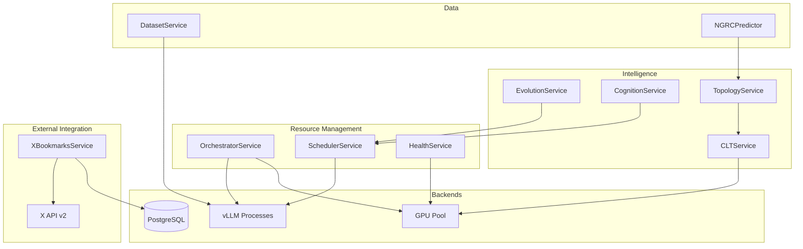
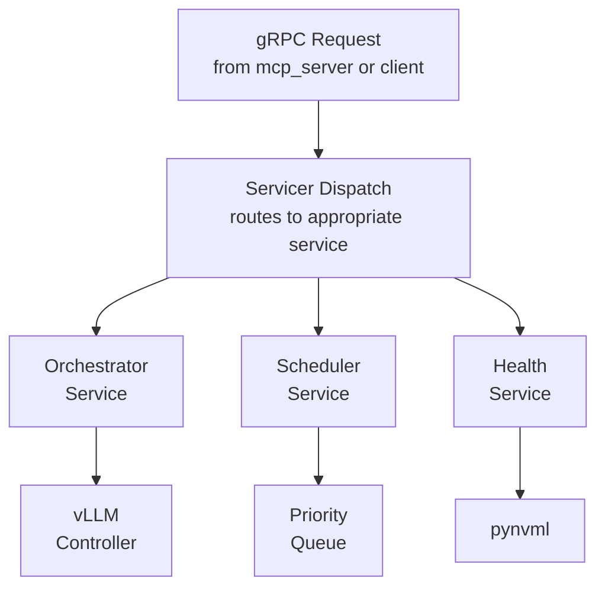

# Gaius Engine Services

Core engine services providing orchestration, scheduling, health monitoring, evolution, cognition, dataset generation, CLT processing, and topology tracking. These services run within the gRPC engine daemon.

## Architecture



## Module Structure

```
services/
├── __init__.py               # Module exports
├── orchestrator_service.py   # OrchestratorService (vLLM lifecycle)
├── scheduler_service.py      # SchedulerService (job queue)
├── health_service.py         # HealthService (GPU/endpoint health)
├── evolution_service.py      # EvolutionService (agent optimization)
├── cognition_service.py      # CognitionService (thought generation)
├── dataset_service.py        # DatasetService (SoM generation)
├── clt_service.py            # CLTService (sparse features)
├── topology_service.py       # TopologyService (semantic attractors)
├── ngrc.py                   # NGRCPredictor (reservoir computing)
├── agenda_tracker.py         # AgendaTracker (makespan scheduling)
└── x_bookmarks_service.py    # XBookmarksService (X API sync)
```

## OrchestratorService

Manages vLLM process lifecycle and GPU allocation:

```python
from gaius.engine.services import OrchestratorService, EndpointStatus

orch = OrchestratorService()

# Start endpoint
await orch.ensure_endpoint("reasoning", gpus="0,1")

# Get status
status = await orch.status()
for endpoint in status.endpoints:
    print(f"{endpoint.name}: {endpoint.state} on GPUs {endpoint.gpus}")

# Clean start (kill stale, start fresh)
result = await orch.clean_start(endpoints=["reasoning"])
print(f"Killed {result.killed_processes} stale processes")
```

### EndpointStatus

```python
@dataclass
class EndpointStatus:
    name: str
    state: str  # "healthy", "starting", "unhealthy", "stopped"
    gpus: list[int]
    pid: int | None
    port: int
    model: str
    uptime_seconds: int
```

## SchedulerService

Priority queue for inference jobs with XAI budget management:

```python
from gaius.engine.services import SchedulerService, InferenceJob, JobPriority

scheduler = SchedulerService()

# Submit job
job = InferenceJob(
    prompt="Analyze the pension risk...",
    priority=JobPriority.HIGH,
    max_tokens=2048,
)
result = await scheduler.submit(job)
print(f"Response: {result.content}")

# Check XAI budget
budget = scheduler.get_xai_budget()
print(f"Daily remaining: {budget.daily_remaining}")
```

### JobPriority

```python
class JobPriority(Enum):
    CRITICAL = 0    # User-facing, immediate
    HIGH = 1        # Interactive queries
    NORMAL = 2      # Background processing
    LOW = 3         # Evolution, batch
    EVOLUTION = 4   # Lowest priority
```

## HealthService

GPU and endpoint health monitoring:

```python
from gaius.engine.services import HealthService, GPUHealth, SystemHealth

health = HealthService()

# GPU health
gpu_health = await health.get_gpu_health()
for gpu in gpu_health.gpus:
    print(f"GPU {gpu.index}: {gpu.memory_used_gb:.1f}/{gpu.memory_total_gb:.1f} GB")
    print(f"  Temp: {gpu.temperature_c}°C, Util: {gpu.utilization_percent}%")

# System health
system = await health.get_system_health()
print(f"Endpoints: {system.healthy_endpoints}/{system.total_endpoints}")
```

### GPUHealth

```python
@dataclass
class GPUHealth:
    index: int
    name: str
    memory_used_gb: float
    memory_total_gb: float
    memory_percent: float
    temperature_c: int
    power_w: int
    utilization_percent: int
```

## EvolutionService

Agent optimization lifecycle:

```python
from gaius.engine.services import EvolutionService, EvolutionConfig, CycleStatus

evol = EvolutionService()

# Run cycle
result = await evol.run_cycle(
    agent_id="leader",
    config=EvolutionConfig(strategy=EvolutionStrategy.APO),
)

print(f"Status: {result.status}")
print(f"Improved: {result.improved}")
```

## CognitionService

Autonomous thought generation:

```python
from gaius.engine.services import CognitionService, CognitionConfig

cognition = CognitionService()

# Trigger cognition cycle
thoughts = await cognition.trigger(
    config=CognitionConfig(max_thoughts=5),
    trigger_reason="manual",
)

for thought in thoughts:
    print(f"[{thought.type}] {thought.content[:50]}...")
```

## DatasetService

NiFi SoM dataset generation:

```python
from gaius.engine.services import DatasetService, DatasetJobConfig

ds = DatasetService()

# Start generation job
job = await ds.start_job(
    config=DatasetJobConfig(
        scenarios=["create_processor"],
        variations=10,
    )
)

# Monitor progress
async for event in ds.stream_progress(job.id):
    print(f"{event.type}: {event.message}")
```

## CLTService

Cross-Layer Transcoder feature extraction:

```python
from gaius.engine.services import CLTService, AgentCLTState

clt = CLTService()

# Extract features
state = await clt.extract_features(
    agent_id="critic",
    content="The risk model has issues...",
)

print(f"Active features: {len(state.features.active_indices)}")

# Get swarm CLT result
swarm_result = await clt.compute_swarm_features(domain="pension")
print(f"Consensus features: {len(swarm_result.consensus_features)}")
```

## TopologyService

Semantic attractor detection and drift monitoring:

```python
from gaius.engine.services import TopologyService, SemanticAttractor, DriftMetrics

topo = TopologyService()

# Detect attractors
attractors = await topo.detect_attractors(domain="pension")
for a in attractors:
    print(f"Attractor at ({a.x}, {a.y}): {a.agent_count} agents")

# Compute drift
drift = await topo.compute_drift(
    baseline_snapshot_id="snap_001",
    current_snapshot_id="snap_002",
)
print(f"Drift magnitude: {drift.magnitude:.3f}")
```

## AgendaTracker

Tracks scheduled endpoint transitions for makespan scheduling. This enables distinguishing between intentional state changes (part of a scheduled workload operation) and unexpected failures.

```python
from gaius.engine.services import get_agenda_tracker, set_agenda_tracker
from gaius.engine.services.agenda_tracker import AgendaTracker, ControlMode

# Get singleton (may be None if not initialized)
tracker = get_agenda_tracker()

# Check if endpoint is in scheduled transition
if tracker and tracker.is_endpoint_in_scheduled_transition("reasoning"):
    expected = tracker.get_scheduled_endpoint_state("reasoning")
    print(f"Endpoint transitioning to: {expected}")  # e.g., "starting", "stopping"

# Register a new workload operation
from uuid import uuid4
operation_id = uuid4()
tracker.register_operation(
    operation_id=operation_id,
    workload_id=uuid4(),
    control_mode=ControlMode.POSITIVE,
    target_endpoints=["reasoning", "fast"],
)
```

### ControlMode

```python
class ControlMode(Enum):
    POSITIVE = "positive"      # Planned operation (start/stop)
    FAILURE = "failure"        # Responding to failure
    RESTART_RECOVERY = "restart_recovery"  # Restarting after failure
```

### Cross-Module Integration

The AgendaTracker is consumed by the HealthObserver to avoid false-positive incidents during scheduled makespan operations. When an endpoint is part of a planned transition, the HealthObserver skips incident creation.

### Makespan Tracing Strategy

OR-Tools mediated makespans will become increasingly complex with federated engine topology (LambdaLabs, AWS, Home Lab). Each makespan should be traced as a parent span with child spans for each operation phase:

```
makespan.execute [parent span]
├── allocate_gpus              # OR-Tools resource assignment
├── evict_if_needed            # Preemption decisions
├── start_endpoints            # vLLM process spawning
│   ├── endpoint.start: reasoning
│   │   ├── process_spawn
│   │   ├── model_load         # ~240s for 70B
│   │   └── health_check
│   └── endpoint.start: coding
├── execute_workload           # Actual inference (may include black box API calls)
└── restore_baseline           # Return to set points
```

**Black box stages** (external API calls like Bytez, Anthropic) should be wrapped with spans to measure duration even though we can't instrument inside them. This enables tracing *around* transient failures.

For detailed tracing patterns and federated topology considerations, see [core/TELEMETRY.md](../../core/TELEMETRY.md).

## NGRCPredictor

Next-Generation Reservoir Computing for temporal prediction:

```python
from gaius.engine.services import NGRCPredictor, NGRCConfig

ngrc = NGRCPredictor(config=NGRCConfig())

# Train on domain history
await ngrc.train(domain="pension", lookback_days=30)

# Predict future state
prediction = await ngrc.predict(steps_ahead=7)
print(f"Predicted embedding: {prediction.embedding[:5]}...")
print(f"Confidence: {prediction.confidence:.2%}")
```

## XBookmarksService

X (Twitter) bookmark synchronization with folder-first sync:

```python
from gaius.engine.services import XBookmarksService, XBookmarksConfig

xbs = XBookmarksService(pool, XBookmarksConfig())

# Check auth status
status = await xbs.get_auth_status()
if status["authenticated"]:
    print(f"Authenticated as @{status['username']}")

# Trigger sync (folder-first, skips unfiled)
result = await xbs.trigger_sync()
print(f"Synced {result.folders_synced} folders, {result.bookmarks_new} new bookmarks")

# List folders
folders = await xbs.list_folders()
for f in folders:
    print(f"{f['name']}: {f['bookmark_count']} bookmarks")
```

### XBookmark

```python
@dataclass
class XBookmark:
    tweet_id: str
    folder_id: str | None
    folder_name: str | None
    text: str
    author_id: str
    author_username: str
    urls: list[str]
    media_urls: list[str]
    tweet_created_at: datetime | None
    bookmarked_at: datetime | None
    metadata: dict[str, Any]

    @property
    def content_hash(self) -> str: ...
```

### XSyncRun

```python
@dataclass
class XSyncRun:
    run_id: int
    user_id: str
    status: str  # "queued", "running", "completed", "failed"
    bookmarks_fetched: int
    bookmarks_new: int
    folders_synced: int
    pagination_token: str | None
    started_at: datetime | None
    completed_at: datetime | None
    error_message: str | None
```

### Folder-First Sync

XBookmarksService uses a folder-first approach:

1. Fetch all bookmark folders from X API
2. For each folder, fetch bookmarks within that folder
3. Store bookmarks with folder_id and folder_name
4. Write weekly manifest to KB at `current/bookmarks/{folder_name}/`

**Unfiled bookmarks are skipped** - only bookmarks in folders are synced.

If the folders endpoint returns 403 (not available on API tier), the service raises `XBookmarksError` with guru code `#XB.00000011.NOFOLDER` and the feature is disabled.

## Call Graph


## Data Flow



## Integration Points

| Component | Uses | Used By | Integration |
|-----------|------|---------|-------------|
| `OrchestratorService` | vllm_controller | mcp_server, evolution | `ensure_endpoint()`, `clean_start()` |
| `SchedulerService` | vllm_controller, priority_queue | mcp_server, agents | `submit()`, `submit_async()` |
| `HealthService` | pynvml | mcp_server, fmea | `get_gpu_health()`, `get_system_health()` |
| `EvolutionService` | scheduler, oracle | mcp_server | `run_cycle()`, `status()` |
| `CognitionService` | scheduler, storage | mcp_server | `trigger()` |
| `DatasetService` | nifi_client, selenium | mcp_server | `start_job()`, `stream_progress()` |
| `CLTService` | clt_worker | topology, swarm | `extract_features()` |
| `TopologyService` | clt_service | mcp_server, grid | `detect_attractors()`, `compute_drift()` |
| `NGRCPredictor` | topology | theta | `train()`, `predict()` |
| `AgendaTracker` | - | health.observe.HealthObserver | `is_endpoint_in_scheduled_transition()`, `get_scheduled_endpoint_state()` |
| `XBookmarksService` | httpx, asyncpg, auth.x_oauth | mcp_server | `trigger_sync()`, `get_auth_status()`, `list_folders()` |

## See Also

- [Parent README](../README.md) — Engine overview
- [Telemetry Strategy](../../core/TELEMETRY.md) — OTel tracing, makespan instrumentation, federated topology
- [Backends README](../backends/README.md) — vLLM/embedding controllers
- [gRPC README](../grpc/README.md) — Protocol implementation
- [Health README](../../health/README.md) — FMEA integration

---

<!-- GAI:META
module: gaius.engine.services
layer: L3-engine
key_types: [OrchestratorService, EndpointStatus, CleanupResult, SchedulerService, InferenceJob, JobPriority, XAIBudget, AgentMetrics, HealthService, GPUHealth, SystemHealth, EndpointHealth, EvolutionService, EvolutionConfig, EvolutionCycle, CycleStatus, EvolutionStrategy, CognitionService, CognitionConfig, DatasetService, DatasetJob, DatasetJobConfig, ProgressEvent, ProgressEventType, CLTService, AgentCLTState, SwarmCLTResult, TopologyService, SemanticAttractor, SwarmSnapshot, AgentPosition, DriftMetrics, NGRCPredictor, NGRCConfig, NGRCPrediction, NGRCState, AgendaTracker, ControlMode, OperationPhase, XBookmarksService, XBookmarksConfig, XBookmark, XSyncRun, XBookmarksError]
key_funcs: [ensure_endpoint, clean_start, submit, submit_async, get_gpu_health, get_system_health, run_cycle, trigger, start_job, stream_progress, extract_features, compute_swarm_features, detect_attractors, compute_drift, train, predict, is_endpoint_in_scheduled_transition, get_scheduled_endpoint_state, get_agenda_tracker, set_agenda_tracker, trigger_sync, get_auth_status, list_folders, get_auth_url, complete_auth]
submodules: []
depends: [backends, pynvml, clt_worker, priority_queue, auth.x_oauth, httpx]
dependents: [grpc.servicers, mcp_server, agents.evolution, agents.theta, health.observe]
config_keys: [engine.max_concurrent_jobs, engine.xai_daily_limit, engine.gpu_memory_threshold, gaius.x.sync.poll_interval_s, gaius.x.sync.batch_size]
env_vars: [XAI_API_KEY, CEREBRAS_API_KEY, X_CLIENT_ID, X_CLIENT_SECRET, X_REDIRECT_URI]
grpc_services: [GaiusService]
call_paths:
  orchestrator: mcp.orchestrator_start→OrchestratorService.ensure_endpoint→VLLMController.start
  scheduler: mcp.scheduler_submit→SchedulerService.submit→priority_queue→VLLMController.infer
  health: mcp.gpu_health→HealthService.get_gpu_health→pynvml
  clt: mcp.clt_extract→CLTService.extract_features→clt_worker→circuit-tracer
  topology: mcp.topology_attractors→TopologyService.detect_attractors→clt_service→cluster
  x_bookmarks: mcp.x_bookmarks_sync→XBookmarksService.trigger_sync→_fetch_folders→X_API→_store_bookmarks→KB
cross_module_calls:
  - from: health.observe.HealthObserver._process_failures
    to: agenda_tracker.AgendaTracker.is_endpoint_in_scheduled_transition
    purpose: Skip incident creation for endpoints in scheduled makespan operations
  - from: health.observe.HealthObserver._process_failures
    to: agenda_tracker.AgendaTracker.get_scheduled_endpoint_state
    purpose: Get expected state to log why incident was skipped
  - from: health.observe.HealthObserver
    to: agenda_tracker.get_agenda_tracker
    purpose: Access singleton tracker instance from health module
test_cmds:
  status: 'uv run gaius-cli --cmd "/orchestrator status"'
  health: 'uv run gaius-cli --cmd "/gpu health"'
  submit: 'uv run gaius-cli --cmd "/scheduler submit \"test prompt\""'
  x_status: 'uv run gaius-cli --cmd "/x-bookmarks status" --format json'
  x_folders: 'uv run gaius-cli --cmd "/x-bookmarks folders"'
guru_codes: [EN.00001.VLLM_CRASH, EN.00002.SCHEDULER_FULL, EN.00003.GPU_OOM, EN.00004.CLT_UNAVAIL, XB.00000001.NOTOKEN, XB.00000011.NOFOLDER, XB.00000012.FOLDERFAIL, XB.00000013.BOOKMARKFAIL]
fail_fast: true
-->
