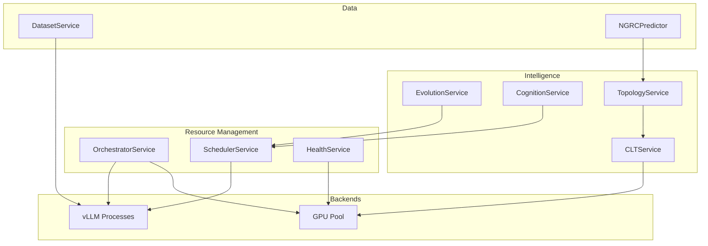

# Gaius Engine Services

Core engine services providing orchestration, scheduling, health monitoring, evolution, cognition, dataset generation, CLT processing, and topology tracking. These services run within the gRPC engine daemon.

## Architecture



## Module Structure

```
services/
├── __init__.py               # Module exports
├── orchestrator_service.py   # OrchestratorService (vLLM lifecycle)
├── scheduler_service.py      # SchedulerService (job queue)
├── health_service.py         # HealthService (GPU/endpoint health)
├── evolution_service.py      # EvolutionService (agent optimization)
├── cognition_service.py      # CognitionService (thought generation)
├── dataset_service.py        # DatasetService (SoM generation)
├── clt_service.py            # CLTService (sparse features)
├── topology_service.py       # TopologyService (semantic attractors)
└── ngrc.py                   # NGRCPredictor (reservoir computing)
```

## OrchestratorService

Manages vLLM process lifecycle and GPU allocation:

```python
from gaius.engine.services import OrchestratorService, EndpointStatus

orch = OrchestratorService()

# Start endpoint
await orch.ensure_endpoint("reasoning", gpus="0,1")

# Get status
status = await orch.status()
for endpoint in status.endpoints:
    print(f"{endpoint.name}: {endpoint.state} on GPUs {endpoint.gpus}")

# Clean start (kill stale, start fresh)
result = await orch.clean_start(endpoints=["reasoning"])
print(f"Killed {result.killed_processes} stale processes")
```

### EndpointStatus

```python
@dataclass
class EndpointStatus:
    name: str
    state: str  # "healthy", "starting", "unhealthy", "stopped"
    gpus: list[int]
    pid: int | None
    port: int
    model: str
    uptime_seconds: int
```

## SchedulerService

Priority queue for inference jobs with XAI budget management:

```python
from gaius.engine.services import SchedulerService, InferenceJob, JobPriority

scheduler = SchedulerService()

# Submit job
job = InferenceJob(
    prompt="Analyze the pension risk...",
    priority=JobPriority.HIGH,
    max_tokens=2048,
)
result = await scheduler.submit(job)
print(f"Response: {result.content}")

# Check XAI budget
budget = scheduler.get_xai_budget()
print(f"Daily remaining: {budget.daily_remaining}")
```

### JobPriority

```python
class JobPriority(Enum):
    CRITICAL = 0    # User-facing, immediate
    HIGH = 1        # Interactive queries
    NORMAL = 2      # Background processing
    LOW = 3         # Evolution, batch
    EVOLUTION = 4   # Lowest priority
```

## HealthService

GPU and endpoint health monitoring:

```python
from gaius.engine.services import HealthService, GPUHealth, SystemHealth

health = HealthService()

# GPU health
gpu_health = await health.get_gpu_health()
for gpu in gpu_health.gpus:
    print(f"GPU {gpu.index}: {gpu.memory_used_gb:.1f}/{gpu.memory_total_gb:.1f} GB")
    print(f"  Temp: {gpu.temperature_c}°C, Util: {gpu.utilization_percent}%")

# System health
system = await health.get_system_health()
print(f"Endpoints: {system.healthy_endpoints}/{system.total_endpoints}")
```

### GPUHealth

```python
@dataclass
class GPUHealth:
    index: int
    name: str
    memory_used_gb: float
    memory_total_gb: float
    memory_percent: float
    temperature_c: int
    power_w: int
    utilization_percent: int
```

## EvolutionService

Agent optimization lifecycle:

```python
from gaius.engine.services import EvolutionService, EvolutionConfig, CycleStatus

evol = EvolutionService()

# Run cycle
result = await evol.run_cycle(
    agent_id="leader",
    config=EvolutionConfig(strategy=EvolutionStrategy.APO),
)

print(f"Status: {result.status}")
print(f"Improved: {result.improved}")
```

## CognitionService

Autonomous thought generation:

```python
from gaius.engine.services import CognitionService, CognitionConfig

cognition = CognitionService()

# Trigger cognition cycle
thoughts = await cognition.trigger(
    config=CognitionConfig(max_thoughts=5),
    trigger_reason="manual",
)

for thought in thoughts:
    print(f"[{thought.type}] {thought.content[:50]}...")
```

## DatasetService

NiFi SoM dataset generation:

```python
from gaius.engine.services import DatasetService, DatasetJobConfig

ds = DatasetService()

# Start generation job
job = await ds.start_job(
    config=DatasetJobConfig(
        scenarios=["create_processor"],
        variations=10,
    )
)

# Monitor progress
async for event in ds.stream_progress(job.id):
    print(f"{event.type}: {event.message}")
```

## CLTService

Cross-Layer Transcoder feature extraction:

```python
from gaius.engine.services import CLTService, AgentCLTState

clt = CLTService()

# Extract features
state = await clt.extract_features(
    agent_id="critic",
    content="The risk model has issues...",
)

print(f"Active features: {len(state.features.active_indices)}")

# Get swarm CLT result
swarm_result = await clt.compute_swarm_features(domain="pension")
print(f"Consensus features: {len(swarm_result.consensus_features)}")
```

## TopologyService

Semantic attractor detection and drift monitoring:

```python
from gaius.engine.services import TopologyService, SemanticAttractor, DriftMetrics

topo = TopologyService()

# Detect attractors
attractors = await topo.detect_attractors(domain="pension")
for a in attractors:
    print(f"Attractor at ({a.x}, {a.y}): {a.agent_count} agents")

# Compute drift
drift = await topo.compute_drift(
    baseline_snapshot_id="snap_001",
    current_snapshot_id="snap_002",
)
print(f"Drift magnitude: {drift.magnitude:.3f}")
```

## NGRCPredictor

Next-Generation Reservoir Computing for temporal prediction:

```python
from gaius.engine.services import NGRCPredictor, NGRCConfig

ngrc = NGRCPredictor(config=NGRCConfig())

# Train on domain history
await ngrc.train(domain="pension", lookback_days=30)

# Predict future state
prediction = await ngrc.predict(steps_ahead=7)
print(f"Predicted embedding: {prediction.embedding[:5]}...")
print(f"Confidence: {prediction.confidence:.2%}")
```

## Call Graph

```
# Orchestrator Path
mcp_server.py:orchestrator_start()
  └─→ engine.services.OrchestratorService.ensure_endpoint()
      ├─→ backends.vllm_controller.VLLMController.start()
      └─→ wait_for_healthy()

# Scheduler Path
mcp_server.py:scheduler_submit()
  └─→ engine.services.SchedulerService.submit()
      ├─→ priority_queue.push(job)
      └─→ [when resources available]
          └─→ backends.vllm_controller.VLLMController.infer()

# Health Check Path
mcp_server.py:gpu_health()
  └─→ engine.services.HealthService.get_gpu_health()
      └─→ pynvml.nvmlDeviceGetMemoryInfo()
          └─→ GPUHealth

# CLT Extraction Path
mcp_server.py:clt_extract()
  └─→ engine.services.CLTService.extract_features()
      └─→ clt_worker.extract()
          └─→ circuit-tracer.extract_sparse()
              └─→ AgentCLTState

# Topology Path
mcp_server.py:topology_attractors()
  └─→ engine.services.TopologyService.detect_attractors()
      └─→ clt_service.compute_swarm_features()
          └─→ cluster_features()
              └─→ [SemanticAttractor, ...]
```

## Data Flow

```
┌─────────────────────────────────────────────────────────────────────┐
│                    gRPC Request                                      │
│              (from mcp_server or client)                             │
└─────────────────────────────────┬───────────────────────────────────┘
                                  │
                                  ▼
┌─────────────────────────────────────────────────────────────────────┐
│                    Servicer Dispatch                                 │
│              routes to appropriate service                           │
└─────────────────────────────────┬───────────────────────────────────┘
                                  │
     ┌────────────────────────────┼────────────────────────────────┐
     ▼                            ▼                                ▼
┌──────────┐              ┌──────────┐                      ┌──────────┐
│Orchestrator              │Scheduler│                      │  Health  │
│  Service │              │ Service  │                      │ Service  │
└────┬─────┘              └────┬─────┘                      └────┬─────┘
     │                         │                                 │
     ▼                         ▼                                 ▼
┌──────────┐              ┌──────────┐                      ┌──────────┐
│  vLLM    │              │ Priority │                      │  pynvml  │
│Controller│              │  Queue   │                      │          │
└──────────┘              └──────────┘                      └──────────┘
```

## Integration Points

| Component | Uses | Used By | Integration |
|-----------|------|---------|-------------|
| `OrchestratorService` | vllm_controller | mcp_server, evolution | `ensure_endpoint()`, `clean_start()` |
| `SchedulerService` | vllm_controller, priority_queue | mcp_server, agents | `submit()`, `submit_async()` |
| `HealthService` | pynvml | mcp_server, fmea | `get_gpu_health()`, `get_system_health()` |
| `EvolutionService` | scheduler, oracle | mcp_server | `run_cycle()`, `status()` |
| `CognitionService` | scheduler, storage | mcp_server | `trigger()` |
| `DatasetService` | nifi_client, selenium | mcp_server | `start_job()`, `stream_progress()` |
| `CLTService` | clt_worker | topology, swarm | `extract_features()` |
| `TopologyService` | clt_service | mcp_server, grid | `detect_attractors()`, `compute_drift()` |
| `NGRCPredictor` | topology | theta | `train()`, `predict()` |

## See Also

- [Parent README](../README.md) — Engine overview
- [Backends README](../backends/README.md) — vLLM/embedding controllers
- [gRPC README](../grpc/README.md) — Protocol implementation
- [Health README](../../health/README.md) — FMEA integration

---

<!-- GAI:META
module: gaius.engine.services
layer: L3-engine
key_types: [OrchestratorService, EndpointStatus, CleanupResult, SchedulerService, InferenceJob, JobPriority, XAIBudget, AgentMetrics, HealthService, GPUHealth, SystemHealth, EndpointHealth, EvolutionService, EvolutionConfig, EvolutionCycle, CycleStatus, EvolutionStrategy, CognitionService, CognitionConfig, DatasetService, DatasetJob, DatasetJobConfig, ProgressEvent, ProgressEventType, CLTService, AgentCLTState, SwarmCLTResult, TopologyService, SemanticAttractor, SwarmSnapshot, AgentPosition, DriftMetrics, NGRCPredictor, NGRCConfig, NGRCPrediction, NGRCState]
key_funcs: [ensure_endpoint, clean_start, submit, submit_async, get_gpu_health, get_system_health, run_cycle, trigger, start_job, stream_progress, extract_features, compute_swarm_features, detect_attractors, compute_drift, train, predict]
submodules: []
depends: [backends, pynvml, clt_worker, priority_queue]
dependents: [grpc.servicers, mcp_server, agents.evolution, agents.theta]
config_keys: [engine.max_concurrent_jobs, engine.xai_daily_limit, engine.gpu_memory_threshold]
env_vars: [XAI_API_KEY, CEREBRAS_API_KEY]
grpc_services: [GaiusService]
call_paths:
  orchestrator: mcp.orchestrator_start→OrchestratorService.ensure_endpoint→VLLMController.start
  scheduler: mcp.scheduler_submit→SchedulerService.submit→priority_queue→VLLMController.infer
  health: mcp.gpu_health→HealthService.get_gpu_health→pynvml
  clt: mcp.clt_extract→CLTService.extract_features→clt_worker→circuit-tracer
  topology: mcp.topology_attractors→TopologyService.detect_attractors→clt_service→cluster
test_cmds:
  status: 'uv run gaius-cli --cmd "/orchestrator status"'
  health: 'uv run gaius-cli --cmd "/gpu health"'
  submit: 'uv run gaius-cli --cmd "/scheduler submit \"test prompt\""'
guru_codes: [EN.00001.VLLM_CRASH, EN.00002.SCHEDULER_FULL, EN.00003.GPU_OOM, EN.00004.CLT_UNAVAIL]
fail_fast: true
-->
