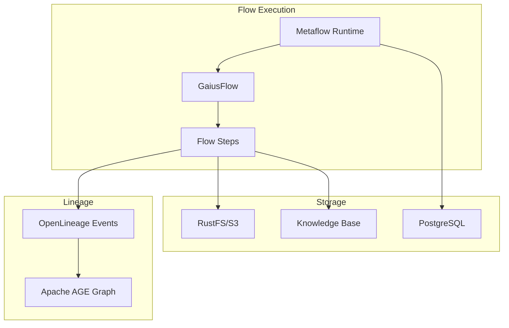
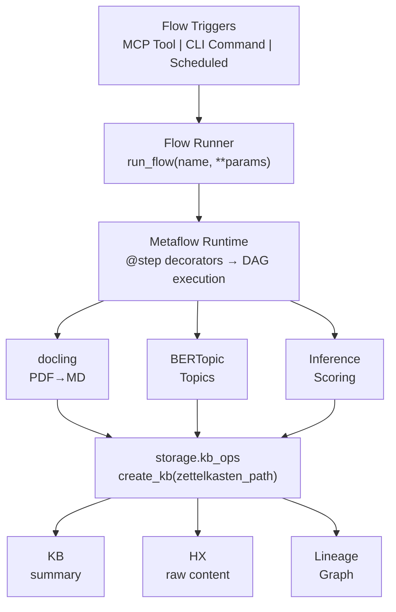

# Gaius Flows

Metaflow-based data pipelines with OpenLineage tracking (OpenLineage, 2024). Integrates with devenv PostgreSQL, RustFS for storage, and Apache AGE graph for lineage.

## Architecture



## Module Structure

```
flows/
├── __init__.py          # Flow registry, register_flow decorator
├── base.py              # GaiusFlow base class
├── config.py            # Flow configuration
├── runner.py            # Flow execution utilities
├── docling/             # arXiv paper processing
│   └── arxiv_flow.py    # ArxivDoclingFlow
├── cloudera_docs/       # Cloudera documentation sync
└── topics/              # Topic extraction flows
```

## GaiusFlow Base Class

All Gaius flows inherit from `GaiusFlow` for lineage integration:

```python
from gaius.flows import GaiusFlow
from metaflow import step

class MyFlow(GaiusFlow):
    @step
    def start(self):
        self.emit_lineage_start(
            "my_flow",
            inputs=[Dataset("source", "input.pdf")],
        )
        self.next(self.process)

    @step
    def process(self):
        # Process data...
        self.next(self.end)

    @step
    def end(self):
        self.emit_lineage_complete(
            outputs=[Dataset("gaius.kb", "scratch/output.md")],
        )
```

### KB Path Helpers

```python
# Zettelkasten path: scratch/{date}/{HHMMSS}_{title}.md
path = self.zettelkasten_path("My Analysis")
# → "scratch/2024-12-25/103045_my_analysis.md"

# Archive path: current/archive/{quarter}/attachments/{filename}
path = self.archive_path("paper.pdf")
# → "current/archive/2024Q4/attachments/paper.pdf"
```

## Flow Registry

Flows are registered for CLI discovery:

```python
from gaius.flows import register_flow

@register_flow("my-flow")
class MyFlow(GaiusFlow):
    ...
```

List registered flows:

```python
from gaius.flows import FLOW_REGISTRY

for name, flow_class in FLOW_REGISTRY.items():
    print(f"{name}: {flow_class.__doc__}")
```

## Available Flows

### ArxivDoclingFlow

Fetches arXiv papers, converts PDF to markdown using docling (DS4SD, 2024), and stores in KB:

```bash
uv run python -m metaflow.run gaius.flows.docling:ArxivDoclingFlow \
    --arxiv_id 2312.12345
```

Pipeline:
1. Download PDF from arXiv
2. Convert to markdown via docling (GPU-accelerated)
3. Extract topics using BERTopic
4. Score relevance with local LLM
5. Save to KB zettelkasten

### ClouderaDocsFlow

Syncs Cloudera documentation archives:

```bash
uv run python -m gaius.flows.cloudera_docs --product csa
```

## OpenLineage Integration

Flows emit OpenLineage events for provenance tracking:

### Event Types

| Event | Timing | Purpose |
|-------|--------|---------|
| `START` | Flow begin | Record inputs |
| `COMPLETE` | Flow end | Record outputs |
| `FAIL` | On error | Record failure |

### Dataset Schema

```python
from gaius.hx.lineage.events import Dataset

# Source dataset
input_ds = Dataset(
    namespace="gaius.source",
    name="arxiv:2312.12345",
)

# Output dataset
output_ds = Dataset(
    namespace="gaius.kb",
    name="scratch/2024-12-25/paper.md",
)
```

### Lineage Graph

Events are stored in Apache AGE graph:

```sql
-- Query lineage for a KB file
SELECT * FROM ag_catalog.cypher('openlineage', $$
    MATCH path = (src:Dataset)-[:INPUT_TO|OUTPUTS*]->(kb:Dataset)
    WHERE kb.name = 'scratch/2024-12-25/paper.md'
    RETURN path
$$) as (path agtype);
```

## Configuration

```python
@dataclass
class FlowConfig:
    metaflow_datastore: str = "postgresql"
    metaflow_metadata: str = "postgresql"
    kb_root: Path = Path("build/dev")
    archive_pdfs: bool = True
```

Environment variables:
- `GAIUS_KB_ROOT`: KB root directory
- `METAFLOW_DATASTORE_SYSROOT_S3`: RustFS path for artifacts
- `METAFLOW_DEFAULT_METADATA`: Metadata backend

## Running Flows

### Via Metaflow CLI

```bash
python -m metaflow.run gaius.flows.docling:ArxivDoclingFlow \
    --arxiv_id 2312.12345 \
    --enable_topics \
    --enable_scoring
```

### Via MCP

```bash
uv run gaius-cli --cmd "/fetch_paper 2312.12345"
```

### Programmatically

```python
from gaius.flows.runner import run_flow

result = await run_flow(
    "arxiv-docling",
    arxiv_id="2312.12345",
    enable_topics=True,
)
```

## References

- DS4SD. (2024). *docling: Document Understanding*. https://github.com/DS4SD/docling
- OpenLineage. (2024). *OpenLineage Specification*. https://openlineage.io/

## Call Graph

```
# ArXiv Flow Execution
mcp_server.py:fetch_paper(arxiv_id)
  └─→ flows.runner.run_flow("arxiv-docling", arxiv_id)
      └─→ ArxivDoclingFlow().run()
          ├─→ start: emit_lineage_start(inputs=[arxiv_url])
          ├─→ download: arxiv.fetch_pdf()
          ├─→ convert: docling.convert_pdf_to_markdown()
          ├─→ topics: bertopic.extract_topics()
          ├─→ score: inference.client.complete(scoring_prompt)
          ├─→ save: storage.kb_ops.create_kb(zettelkasten_path)
          └─→ end: emit_lineage_complete(outputs=[kb_path])

# Cloudera Docs Flow
mcp_server.py:sync_cloudera_docs()
  └─→ ClouderaDocsFlow().run()
      ├─→ start: download archive zip
      ├─→ extract: unzip to temp directory
      ├─→ convert: [parallel] docling.convert_pdf()
      ├─→ save: storage.kb_ops.create_kb()
      └─→ end: emit_lineage_complete()

# Lineage Emission Path
GaiusFlow.emit_lineage_complete()
  └─→ hx.lineage.emitter.emit(RunEvent.complete())
      └─→ ag_catalog.cypher(insert_vertex, insert_edge)
```

## Data Flow



## Integration Points

| Component | Uses | Used By | Integration |
|-----------|------|---------|-------------|
| `GaiusFlow` | metaflow, hx.lineage | all flows | Base class |
| `FLOW_REGISTRY` | — | mcp_server, cli | `@register_flow` decorator |
| `ArxivDoclingFlow` | docling, bertopic, inference | mcp_server | `run()` |
| `ClouderaDocsFlow` | docling, storage | mcp_server | `run()` |
| `run_flow()` | FLOW_REGISTRY | mcp_server | Flow invocation |

## See Also

- [Parent README](../README.md) — Module overview
- [HX README](../hx/README.md) — Lineage storage
- [Storage README](../storage/README.md) — KB integration
- [Workers README](../workers/README.md) — Fetch job queue
- [Inference README](../inference/README.md) — Scoring integration

---

<!-- GAI:META
module: gaius.flows
layer: L4-inference
entry_point: python -m metaflow.run
key_types: [GaiusFlow, FlowConfig]
key_funcs: [register_flow, run_flow, zettelkasten_path, archive_path]
submodules: [docling, cloudera_docs, topics]
depends: [metaflow, hx.lineage, storage.kb_ops, inference.client]
dependents: [mcp_server, workers]
config_keys: [flows.kb_root, flows.archive_pdfs]
env_vars: [GAIUS_KB_ROOT, METAFLOW_DATASTORE_SYSROOT_S3, METAFLOW_DEFAULT_METADATA]
grpc_services: []
metaflow_flows: [ArxivDoclingFlow, ClouderaDocsFlow, TopicExtractionFlow]
external_deps: [metaflow, docling, bertopic]
call_paths:
  arxiv: mcp.fetch_paper→run_flow→ArxivDoclingFlow.run→docling→kb_ops.create
  cloudera: mcp.sync_cloudera_docs→ClouderaDocsFlow.run→docling→kb_ops.create
  lineage: GaiusFlow.emit_lineage_complete→hx.lineage.emit→AGE_insert
test_cmds:
  arxiv: 'uv run gaius-cli --cmd "/fetch_paper 2312.12345"'
  list: 'uv run gaius-cli --cmd "/flows list"'
guru_codes: [FL.00001.DOCLING_FAIL, FL.00002.METAFLOW_DB, FL.00003.ARXIV_RATE]
fail_fast: true
-->
