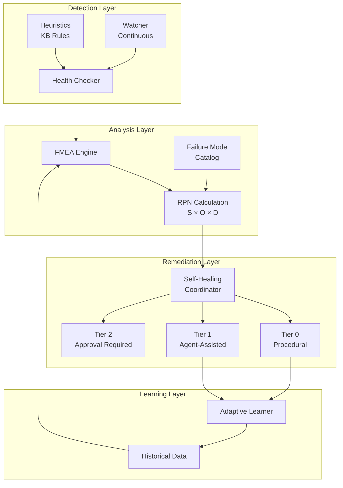
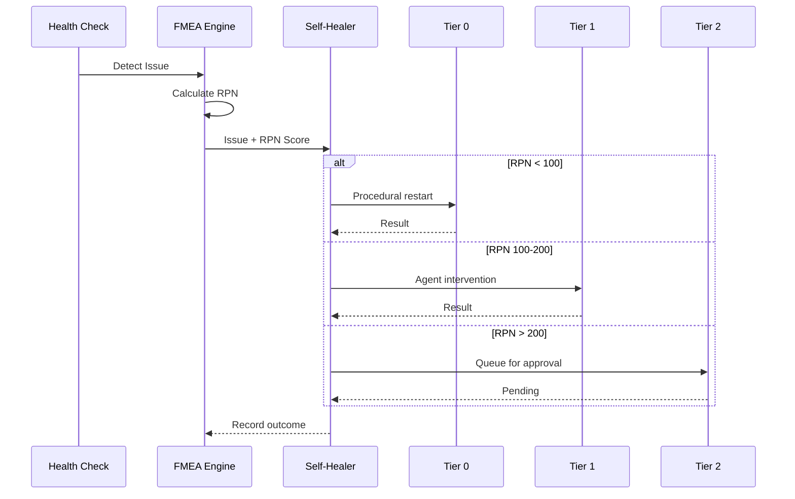

# Gaius Health

Health monitoring, diagnostics, and self-healing for the Gaius platform. Implements FMEA (Failure Mode and Effects Analysis) for quantitative risk-based remediation.

## Architecture



## Module Structure

```
health/
├── checker.py          # Health check definitions and execution
├── heuristics.py       # KB-based diagnostic heuristics
├── watcher.py          # Continuous health monitoring
├── self_healing.py     # Tiered self-healing coordinator
├── remediation.py      # Remediation action definitions
├── service_fixes.py    # Service-specific fix strategies
└── fmea/
    ├── __init__.py
    ├── models.py       # RPNScore, FailureMode, ActionPolicy
    ├── engine.py       # FMEAEngine core
    ├── loader.py       # Health check → failure mode mapping
    └── learning.py     # Adaptive S/O/D updates
```

## FMEA (Failure Mode and Effects Analysis)

FMEA replaces simple severity classification with quantitative risk assessment using Risk Priority Numbers (Stamatis, 2003).

### Risk Priority Number

$$\text{RPN} = S \times O \times D$$

where:
- **S (Severity)**: Impact on system availability (1–10)
- **O (Occurrence)**: Probability of recurrence (1–10)
- **D (Detection)**: Ability to detect before impact (1–10, lower is better)

Maximum RPN = 1000 (10 × 10 × 10).

### Action Thresholds

| RPN Range | Tier | Action |
|-----------|------|--------|
| 1–100 | Tier 0 | Automatic procedural remediation |
| 101–200 | Tier 1 | Agent-assisted remediation |
| 201–400 | Tier 2 | Requires user approval |
| 401–1000 | Manual | Human intervention required |

### Conservative Overrides

Certain conditions always escalate to higher tiers:
- Detection $D \geq 8$: Poor observability requires approval
- `SafetyLevel.DESTRUCTIVE`: Data-modifying actions require approval
- Multiple correlated failures: Escalate to next tier

### Failure Mode Catalog

34 failure modes across 7 categories:

**GPU (6 modes)**:
| ID | Failure Mode | S | O | D | RPN |
|----|--------------|---|---|---|-----|
| GPU_001 | Memory Exhaustion | 8 | 6 | 4 | 192 |
| GPU_002 | Temperature Critical | 9 | 3 | 2 | 54 |
| GPU_003 | Hardware Error | 10 | 2 | 3 | 60 |
| GPU_004 | Driver Crash | 8 | 3 | 4 | 96 |
| GPU_005 | Memory Fragmentation | 7 | 5 | 4 | 140 |
| GPU_006 | Power Throttling | 5 | 4 | 3 | 60 |

**vLLM Endpoint (6 modes)**:
| ID | Failure Mode | S | O | D | RPN |
|----|--------------|---|---|---|-----|
| VLLM_001 | Stuck Starting | 6 | 5 | 5 | 150 |
| VLLM_002 | Stuck Stopping | 4 | 4 | 4 | 64 |
| VLLM_003 | Health Check Failure | 7 | 6 | 3 | 126 |
| VLLM_004 | Orphan Process | 5 | 5 | 4 | 100 |
| VLLM_005 | OOM Crash | 8 | 5 | 3 | 120 |
| VLLM_006 | KV-Cache Exhaustion | 5 | 6 | 5 | 150 |

**Model Quality (5 modes)**:
| ID | Failure Mode | S | O | D | RPN |
|----|--------------|---|---|---|-----|
| MQ_001 | Hallucination Increase | 7 | 4 | 6 | 168 |
| MQ_002 | Latency Degradation | 4 | 5 | 3 | 60 |
| MQ_003 | Output Quality Drift | 5 | 6 | 7 | 210 |
| MQ_004 | Semantic Drift | 6 | 4 | 8 | 192 |
| MQ_005 | Context Exhaustion | 6 | 5 | 4 | 120 |

**Emergent Behavior (4 modes)**:
| ID | Failure Mode | S | O | D | RPN |
|----|--------------|---|---|---|-----|
| EB_001 | Swarm Consensus Failure | 6 | 4 | 6 | 144 |
| EB_002 | Cognition Loop | 5 | 4 | 7 | 140 |
| EB_003 | Embedding Drift | 6 | 5 | 8 | 240 |
| EB_004 | Self-Observation Bias | 6 | 5 | 9 | 270 |

Note: Emergent behavior modes have high Detection scores (poor observability), reflecting the difficulty of detecting these failure modes automatically.

## Self-Healing System

### 3-Tier Architecture



### Tier 0: Procedural Restart

Code-only remediation without agent involvement:

```python
async def tier0_restart(self, issue: HealthIssue) -> HealingResult:
    """Simple restart sequence."""
    await self.orchestrator.stop_endpoint(issue.endpoint)
    await asyncio.sleep(5)  # Cool-down period
    await self.orchestrator.start_endpoint(issue.endpoint)
    return HealingResult(success=True, tier=0, action="restart")
```

### Tier 1: Agent-Assisted

Uses healthy endpoints to diagnose and remediate:

```python
async def tier1_agent(self, issue: HealthIssue) -> HealingResult:
    """Agent-assisted recovery."""
    diagnosis = await self.inference.analyze(issue.to_dict())

    if diagnosis.action == "clear_cache":
        await self.clear_kv_cache(issue.endpoint)
    elif diagnosis.action == "rollback":
        await self.rollback_config(issue.endpoint)

    return HealingResult(success=True, tier=1, action=diagnosis.action)
```

### Tier 2: Approval Required

Creates approval record for user review:

```python
async def tier2_escalate(self, issue: HealthIssue, rpn: RPNScore) -> HealingResult:
    """Escalate for user approval."""
    approval_id = await self.db.insert_approval_request(
        failure_mode_id=rpn.failure_mode_id,
        rpn_score=rpn.rpn,
        recommended_action=self.get_recommended_action(rpn),
    )
    return HealingResult(
        success=False,
        tier=2,
        action="pending_approval",
        approval_id=approval_id,
    )
```

## Adaptive Learning

### S/O/D Score Updates

The adaptive learner adjusts base scores based on remediation outcomes using exponential moving average:

$$S_{\text{new}} = (1 - \alpha) \cdot S_{\text{current}} + \alpha \cdot S_{\text{target}}$$

where $\alpha = 0.2$ (learning rate).

```python
class AdaptiveLearner:
    LEARNING_RATE = 0.2

    async def update_from_outcome(
        self,
        failure_mode_id: str,
        rpn_score: RPNScore,
        outcome: HealingResult,
    ) -> None:
        # Update Occurrence based on success rate
        if outcome.success and outcome.duration_ms < 30000:
            new_o = self._ema(rpn_score.occurrence, target=3)
        elif not outcome.success:
            new_o = self._ema(rpn_score.occurrence, target=8)

        # Update Detection based on discovery method
        if outcome.detected_by == "user_report":
            new_d = min(10, rpn_score.detection + 1)
        elif outcome.lead_time_seconds > 300:
            new_d = max(1, rpn_score.detection - 1)

        await self._save_adjustment(failure_mode_id, new_s, new_o, new_d)
```

## Health Check Categories

| Category | Checks | Purpose |
|----------|--------|---------|
| Infrastructure | grpc_connection, postgresql, qdrant, minio | Core service connectivity |
| GPU | gpu_memory, gpu_temperature | Hardware health |
| Endpoints | endpoints, stuck_endpoints, stale_processes | vLLM/optillm health |
| Evolution | evolution_daemon, cognition_daemon | Background services |
| Resources | disk_space, scheduler_queue, xai_budget | Resource limits |

## CLI Commands

```bash
# FMEA summary
uv run gaius-cli --cmd "/fmea" --format json

# List failure modes
uv run gaius-cli --cmd "/fmea catalog" --format json

# Show failure mode details
uv run gaius-cli --cmd "/fmea detail GPU_001" --format json

# Recent incidents
uv run gaius-cli --cmd "/fmea history" --format json

# Approve pending remediation
uv run gaius-cli --cmd "/fmea approve <id>" --format json

# General health check
uv run gaius-cli --cmd "/health check" --format json
```

## Database Schema

```sql
-- Failure mode catalog
CREATE TABLE fmea_catalog (
    failure_mode_id VARCHAR(32) PRIMARY KEY,
    category VARCHAR(32) NOT NULL,
    name VARCHAR(128) NOT NULL,
    base_severity INT CHECK (base_severity BETWEEN 1 AND 10),
    base_occurrence INT CHECK (base_occurrence BETWEEN 1 AND 10),
    base_detection INT CHECK (base_detection BETWEEN 1 AND 10),
    recommended_actions TEXT[],
    preventive_controls TEXT[],
    detective_controls TEXT[],
    mitigative_controls TEXT[]
);

-- Occurrence history (for O calculation)
CREATE TABLE fmea_occurrences (
    id SERIAL PRIMARY KEY,
    failure_mode_id VARCHAR(32) REFERENCES fmea_catalog,
    occurred_at TIMESTAMPTZ DEFAULT NOW(),
    endpoint VARCHAR(64),
    context JSONB
);

-- Remediation outcomes (for learning)
CREATE TABLE fmea_outcomes (
    id SERIAL PRIMARY KEY,
    failure_mode_id VARCHAR(32) REFERENCES fmea_catalog,
    rpn_score INT NOT NULL,
    severity INT, occurrence INT, detection INT,
    action_taken VARCHAR(128),
    success BOOLEAN,
    duration_ms INT,
    downtime_seconds INT
);
```

## References

- Stamatis, D. H. (2003). *Failure Mode and Effect Analysis: FMEA from Theory to Execution*. ASQ Quality Press.

## See Also

- [Parent README](../README.md) — Module overview
- [Engine README](../engine/README.md) — Orchestrator integration
