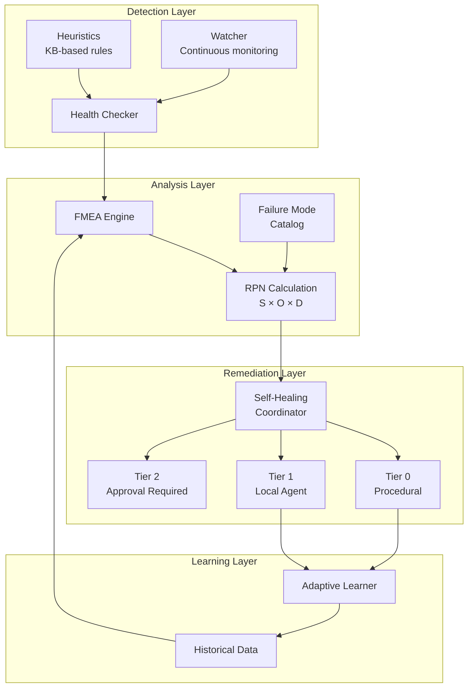
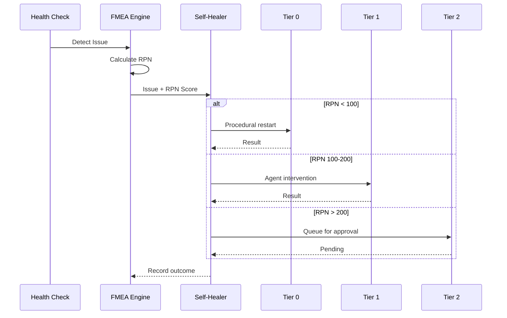

# Gaius Health

Health monitoring, diagnostics, and self-healing for the Gaius platform. Includes FMEA (Failure Mode and Effects Analysis) for quantitative risk-based remediation.

## Architecture



## Module Structure

```
health/
├── checker.py          # Health check definitions and execution
├── heuristics.py       # KB-based diagnostic heuristics
├── watcher.py          # Continuous health monitoring
├── self_healing.py     # Tiered self-healing coordinator
├── remediation.py      # Remediation action definitions
├── service_fixes.py    # Service-specific fixes
└── fmea/
    ├── __init__.py
    ├── models.py       # RPNScore, FailureMode, ActionPolicy
    ├── engine.py       # FMEAEngine core
    ├── loader.py       # Health check → failure mode mapping
    └── learning.py     # Adaptive S/O/D updates
```

## FMEA (Failure Mode and Effects Analysis)

### Core Concept

FMEA replaces simple severity classification (low/medium/high/critical) with quantitative risk assessment using Risk Priority Numbers:

$$RPN = S \times O \times D$$

Where:
- **S (Severity)**: Impact on system availability (1-10)
- **O (Occurrence)**: Probability of recurrence (1-10)
- **D (Detection)**: Ability to detect before impact (1-10, lower is better)

Maximum RPN = 1000 (10 × 10 × 10)

### RPN Thresholds

| RPN Range | Tier | Action |
|-----------|------|--------|
| 1-100 | Tier 0 | Auto-remediate immediately |
| 101-200 | Tier 1 | Auto-remediate with agent validation |
| 201-400 | Tier 2 | Require user approval |
| 401-1000 | Manual | Human intervention required |

### Conservative Overrides

- **Detection D >= 8**: Always requires approval (poor observability)
- **SafetyLevel.DESTRUCTIVE**: Always requires approval
- **Multiple correlated failures**: Escalate to next tier

### Failure Mode Catalog

34 failure modes across 7 categories:

```
GPU (6 modes)
├── GPU_001: Memory Exhaustion (S=8, O=6, D=4, RPN=192)
├── GPU_002: Temperature Critical (S=9, O=3, D=2, RPN=54)
├── GPU_003: Hardware Error (S=10, O=2, D=3, RPN=60)
├── GPU_004: Driver Crash (S=8, O=3, D=4, RPN=96)
├── GPU_005: Memory Fragmentation (S=7, O=5, D=4, RPN=140)
└── GPU_006: Power Throttling (S=5, O=4, D=3, RPN=60)

vLLM Endpoint (6 modes)
├── VLLM_001: Stuck Starting (S=6, O=5, D=5, RPN=150)
├── VLLM_002: Stuck Stopping (S=4, O=4, D=4, RPN=64)
├── VLLM_003: Health Check Failure (S=7, O=6, D=3, RPN=126)
├── VLLM_004: Orphan Process (S=5, O=5, D=4, RPN=100)
├── VLLM_005: OOM Crash (S=8, O=5, D=3, RPN=120)
└── VLLM_006: KV-Cache Exhaustion (S=5, O=6, D=5, RPN=150)

Model Quality (5 modes)
├── MQ_001: Hallucination Increase (S=7, O=4, D=6, RPN=168)
├── MQ_002: Latency Degradation (S=4, O=5, D=3, RPN=60)
├── MQ_003: Output Quality Drift (S=5, O=6, D=7, RPN=210)
├── MQ_004: Semantic Drift (S=6, O=4, D=8, RPN=192)
└── MQ_005: Context Exhaustion (S=6, O=5, D=4, RPN=120)

Evolution System (5 modes)
├── EV_001: Training Divergence (S=8, O=4, D=3, RPN=96)
├── EV_002: Held-out Score Drop (S=6, O=5, D=4, RPN=120)
├── EV_003: Version Conflict (S=5, O=3, D=5, RPN=75)
├── EV_004: Optimization Loop (S=4, O=3, D=6, RPN=72)
└── EV_005: Data Staleness (S=7, O=6, D=5, RPN=210)

Emergent Behavior (4 modes)
├── EB_001: Swarm Consensus Failure (S=6, O=4, D=6, RPN=144)
├── EB_002: Cognition Loop (S=5, O=4, D=7, RPN=140)
├── EB_003: Embedding Drift (S=6, O=5, D=8, RPN=240)
└── EB_004: Self-Observation Bias (S=6, O=5, D=9, RPN=270)

Resource Contention (4 modes)
├── RC_001: Scheduler Queue Starvation (S=6, O=4, D=4, RPN=96)
├── RC_002: Batch Fairness Violation (S=4, O=5, D=5, RPN=100)
├── RC_003: XAI Budget Exhausted (S=5, O=5, D=2, RPN=50)
└── RC_004: DB Connection Pool (S=7, O=4, D=3, RPN=84)

Infrastructure (4 modes)
├── INFRA_001: gRPC Connection (S=8, O=3, D=2, RPN=48)
├── INFRA_002: PostgreSQL (S=8, O=3, D=2, RPN=48)
├── INFRA_003: Qdrant (S=7, O=3, D=2, RPN=42)
└── INFRA_004: MinIO (S=6, O=3, D=2, RPN=36)
```

## Self-Healing System

### 3-Tier Architecture



### Tier 0: Procedural Restart

Code-only remediation, no agent involvement:

```python
async def tier0_restart(self, issue: HealthIssue) -> HealingResult:
    """Simple restart sequence."""
    await self.orchestrator.stop_endpoint(issue.endpoint)
    await asyncio.sleep(5)  # Cool-down
    await self.orchestrator.start_endpoint(issue.endpoint)
    return HealingResult(success=True, tier=0, action="restart")
```

### Tier 1: Local Agent Intervention

Uses healthy endpoints to diagnose and remediate:

```python
async def tier1_agent(self, issue: HealthIssue) -> HealingResult:
    """Agent-assisted recovery."""
    # Use reasoning endpoint to analyze issue
    diagnosis = await self.inference.analyze(issue.to_dict())

    # Apply recommended fix
    if diagnosis.action == "clear_cache":
        await self.clear_kv_cache(issue.endpoint)
    elif diagnosis.action == "rollback":
        await self.rollback_config(issue.endpoint)

    return HealingResult(success=True, tier=1, action=diagnosis.action)
```

### Tier 2: Approval Required

Creates approval record for user review:

```python
async def tier2_escalate(self, issue: HealthIssue, rpn: RPNScore) -> HealingResult:
    """Escalate for user approval."""
    approval_id = await self.db.insert_approval_request(
        failure_mode_id=rpn.failure_mode_id,
        rpn_score=rpn.rpn,
        recommended_action=self.get_recommended_action(rpn),
    )
    return HealingResult(
        success=False,
        tier=2,
        action="pending_approval",
        approval_id=approval_id,
    )
```

## Health Checks

### Check Categories

| Category | Checks | Purpose |
|----------|--------|---------|
| Infrastructure | grpc_connection, postgresql, qdrant, minio | Core service connectivity |
| GPU | gpu_memory, gpu_temperature | Hardware health |
| Endpoints | endpoints, stuck_endpoints, stale_processes | vLLM/optillm health |
| Evolution | evolution_daemon, cognition_daemon | Background services |
| Resources | disk_space, scheduler_queue, xai_budget | Resource limits |

### Example Check

```python
async def check_gpu_memory(self) -> CheckResult:
    """Check GPU memory utilization."""
    try:
        import pynvml
        pynvml.nvmlInit()

        results = []
        for i in range(pynvml.nvmlDeviceGetCount()):
            handle = pynvml.nvmlDeviceGetHandleByIndex(i)
            info = pynvml.nvmlDeviceGetMemoryInfo(handle)
            utilization = info.used / info.total

            if utilization > 0.95:
                return CheckResult(
                    name="gpu_memory",
                    status=CheckStatus.FAIL,
                    message=f"GPU {i} memory critical: {utilization:.1%}",
                    details={"gpu_id": i, "utilization": utilization},
                )

        return CheckResult(
            name="gpu_memory",
            status=CheckStatus.PASS,
            message="GPU memory OK",
        )
    except Exception as e:
        return CheckResult(
            name="gpu_memory",
            status=CheckStatus.SKIP,
            message=f"Cannot check GPU: {e}",
        )
```

## Adaptive Learning

### S/O/D Score Updates

The adaptive learner adjusts base scores based on remediation outcomes:

```python
class AdaptiveLearner:
    """Update S/O/D scores based on actual outcomes."""

    LEARNING_RATE = 0.2  # EMA alpha

    async def update_from_outcome(
        self,
        failure_mode_id: str,
        rpn_score: RPNScore,
        outcome: HealingResult,
    ) -> None:
        # Update Occurrence based on success rate
        if outcome.success and outcome.duration_ms < 30000:
            new_o = self._ema(rpn_score.occurrence, target=3)
        elif not outcome.success:
            new_o = self._ema(rpn_score.occurrence, target=8)

        # Update Detection based on discovery method
        if outcome.detected_by == "user_report":
            new_d = min(10, rpn_score.detection + 1)
        elif outcome.lead_time_seconds > 300:
            new_d = max(1, rpn_score.detection - 1)

        # Update Severity based on actual impact
        if outcome.downtime_seconds > 600:
            new_s = min(10, rpn_score.severity + 1)

        await self._save_adjustment(failure_mode_id, new_s, new_o, new_d)
```

### Exponential Moving Average

$$S_{new} = (1 - \alpha) \cdot S_{current} + \alpha \cdot S_{target}$$

With $\alpha = 0.2$, scores adjust gradually based on observed outcomes.

## CLI Commands

```bash
# FMEA summary
uv run gaius-cli --cmd "/fmea" --format json

# List failure modes
uv run gaius-cli --cmd "/fmea catalog" --format json

# Show failure mode details
uv run gaius-cli --cmd "/fmea detail GPU_001" --format json

# Recent incidents
uv run gaius-cli --cmd "/fmea history" --format json

# Approve pending remediation
uv run gaius-cli --cmd "/fmea approve <id>" --format json

# General health check
uv run gaius-cli --cmd "/health check" --format json
```

## Database Schema

```sql
-- Failure mode catalog
CREATE TABLE fmea_catalog (
    failure_mode_id VARCHAR(32) PRIMARY KEY,
    category VARCHAR(32) NOT NULL,
    name VARCHAR(128) NOT NULL,
    base_severity INT CHECK (base_severity BETWEEN 1 AND 10),
    base_occurrence INT CHECK (base_occurrence BETWEEN 1 AND 10),
    base_detection INT CHECK (base_detection BETWEEN 1 AND 10),
    recommended_actions TEXT[],
    preventive_controls TEXT[],
    detective_controls TEXT[],
    mitigative_controls TEXT[]
);

-- Occurrence history (for O calculation)
CREATE TABLE fmea_occurrences (
    id SERIAL PRIMARY KEY,
    failure_mode_id VARCHAR(32) REFERENCES fmea_catalog,
    occurred_at TIMESTAMPTZ DEFAULT NOW(),
    endpoint VARCHAR(64),
    context JSONB
);

-- Remediation outcomes (for learning)
CREATE TABLE fmea_outcomes (
    id SERIAL PRIMARY KEY,
    failure_mode_id VARCHAR(32) REFERENCES fmea_catalog,
    rpn_score INT NOT NULL,
    severity INT, occurrence INT, detection INT,
    action_taken VARCHAR(128),
    success BOOLEAN,
    duration_ms INT,
    downtime_seconds INT
);

-- Runtime adjustments (learned)
CREATE TABLE fmea_adjustments (
    failure_mode_id VARCHAR(32) REFERENCES fmea_catalog,
    endpoint VARCHAR(64),
    adjusted_severity INT,
    adjusted_occurrence INT,
    adjusted_detection INT,
    sample_count INT DEFAULT 0
);
```

## See Also

- [Parent README](../README.md) - Module overview
- [Engine README](../engine/README.md) - Orchestrator integration
- [FMEA Implementation Notes](../../../../docs/notes/2025-12-13/210000_fmea_implementation.md)
