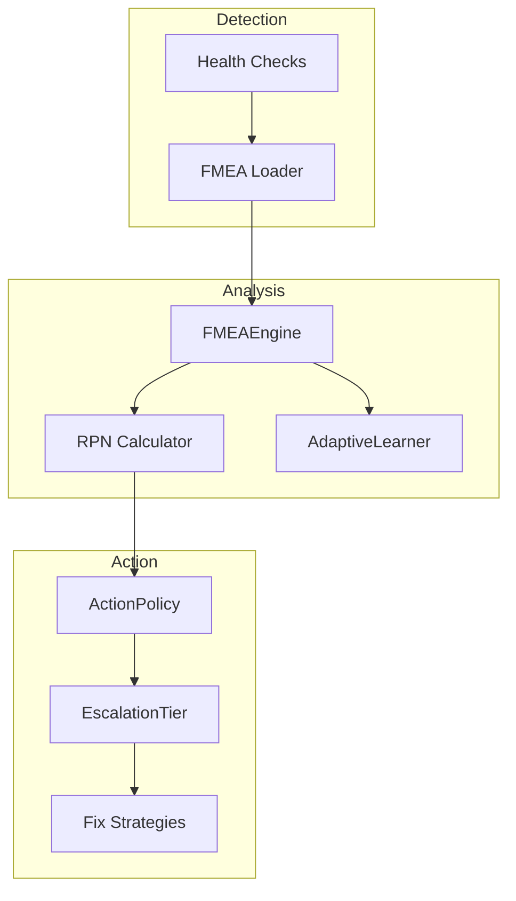

# Gaius Health FMEA

Failure Mode and Effects Analysis for quantitative risk assessment in AIOps. Uses RPN (Risk Priority Number) scoring with S×O×D calculations to drive automated remediation decisions.

## Architecture



## Module Structure

```
fmea/
├── __init__.py    # Module exports
├── models.py      # RPNScore, FailureMode, ActionPolicy, FMEAIncident, EscalationTier
├── engine.py      # FMEAEngine (assessment coordinator)
├── loader.py      # HEALTH_CHECK_TO_FMEA mapping, catalog loading
└── learning.py    # AdaptiveLearner (outcome-based adjustment)
```

## RPN Scoring

RPN = Severity × Occurrence × Detection (max 1000)

```python
from gaius.health.fmea import RPNScore

score = RPNScore(
    severity=8,      # Impact if failure occurs (1-10)
    occurrence=4,    # Likelihood of occurrence (1-10)
    detection=3,     # Ability to detect before impact (1-10)
)

print(f"RPN: {score.value}")  # 96
print(f"Tier: {score.tier}")  # EscalationTier.TIER_0
```

### EscalationTier

| Tier | RPN Range | Action |
|------|-----------|--------|
| TIER_0 | < 100 | Auto-remediate immediately |
| TIER_1 | 100-200 | Auto-remediate with logging |
| TIER_2 | 200-400 | Require approval |
| MANUAL | > 400 | Manual intervention required |

```python
from gaius.health.fmea import EscalationTier

class EscalationTier(Enum):
    TIER_0 = "tier_0"   # Auto-remediate immediately
    TIER_1 = "tier_1"   # Auto-remediate with logging
    TIER_2 = "tier_2"   # Require approval
    MANUAL = "manual"   # Manual intervention
```

## Failure Modes

Catalog of known failure modes:

```python
from gaius.health.fmea import FailureMode

mode = FailureMode(
    id="GPU_001",
    category="gpu",
    name="GPU Memory Exhaustion",
    description="VRAM usage exceeds 95% threshold",
    base_severity=9,
    base_occurrence=5,
    base_detection=2,
    controls=["memory_monitoring", "auto_restart"],
    kb_heuristic="current/heuristics/gaius/gpu/memory_exhaustion.md",
)
```

### Failure Mode Categories

| Category | Examples |
|----------|----------|
| `gpu` | GPU_001 (OOM), GPU_002 (Thermal) |
| `vllm` | VLLM_001 (Crash), VLLM_002 (Timeout) |
| `model_quality` | MQ_001 (Drift), MQ_002 (Hallucination) |
| `evolution` | EV_001 (Daemon Crash), EV_002 (Calibration) |
| `emergent` | EM_001 (Novel Failure) |
| `resource` | RS_001 (Disk Full), RS_002 (Network) |
| `infra` | IN_001 (Postgres), IN_002 (Qdrant) |

## FMEAEngine

Coordinator for risk assessment:

```python
from gaius.health.fmea import FMEAEngine

engine = FMEAEngine()

# Assess failure mode with context
context = {
    "gpu_memory_percent": 97,
    "unhealthy_endpoints": ["reasoning"],
    "recent_restarts": 3,
}

incident = await engine.assess(
    failure_mode_id="GPU_001",
    context=context,
)

print(f"RPN: {incident.rpn.value}")
print(f"Tier: {incident.tier}")
print(f"Recommended action: {incident.action.name}")
```

### FMEAIncident

```python
@dataclass
class FMEAIncident:
    id: str
    failure_mode: FailureMode
    rpn: RPNScore
    tier: EscalationTier
    action: ActionPolicy
    context: dict[str, Any]
    timestamp: datetime
    resolved: bool = False
    resolution_notes: str | None = None
```

## ActionPolicy

Remediation policies:

```python
from gaius.health.fmea import ActionPolicy

policy = ActionPolicy(
    name="restart_vllm",
    description="Restart vLLM process",
    tier_required=EscalationTier.TIER_0,
    command="/health fix vllm",
    rollback_command="/orchestrator stop reasoning",
    timeout_seconds=120,
    requires_approval=False,
)
```

## Health Check Mapping

Map health check names to FMEA failure modes:

```python
from gaius.health.fmea import map_health_check_to_failure_mode, HEALTH_CHECK_TO_FMEA

# Mapping dictionary
HEALTH_CHECK_TO_FMEA = {
    "gpu_memory": "GPU_001",
    "gpu_temperature": "GPU_002",
    "vllm_health": "VLLM_001",
    "stuck_endpoints": "VLLM_002",
    "postgres_connection": "IN_001",
    "qdrant_health": "IN_002",
}

# Get failure mode for health check
failure_mode = map_health_check_to_failure_mode("gpu_memory")
```

## AdaptiveLearner

Outcome-based RPN adjustment:

```python
from gaius.health.fmea import AdaptiveLearner

learner = AdaptiveLearner()

# Record outcome
await learner.record_outcome(
    incident_id="inc_001",
    action_taken="restart_vllm",
    success=True,
    time_to_resolve_seconds=45,
)

# Get adjusted RPN factors
adjustment = await learner.get_adjustment("GPU_001")
print(f"Occurrence factor: {adjustment.occurrence_factor:.2f}")
print(f"Detection factor: {adjustment.detection_factor:.2f}")
```

## Call Graph

```
# FMEA Assessment Path
health.service_fixes.HealthFixOrchestrator.diagnose()
  └─→ fmea.FMEAEngine.assess()
      ├─→ loader.get_failure_mode(failure_mode_id)
      ├─→ calculate_context_adjusted_rpn(mode, context)
      │   └─→ RPNScore(adjusted_s, adjusted_o, adjusted_d)
      ├─→ learner.get_adjustment(failure_mode_id)
      └─→ FMEAIncident(mode, rpn, tier, action)

# Remediation Path
mcp_server.py:fmea_calculate_rpn()
  └─→ fmea.FMEAEngine.calculate_rpn()
      └─→ RPNScore.from_context(mode, context)
          └─→ tier = determine_tier(rpn.value)

# Learning Path
health.service_fixes.HealthFixOrchestrator.execute()
  └─→ [after remediation]
      └─→ fmea.AdaptiveLearner.record_outcome()
          └─→ update_rpn_factors(failure_mode_id, success)

# Catalog Query Path
mcp_server.py:fmea_catalog()
  └─→ fmea.loader.get_catalog()
      └─→ [category filter]
          └─→ [FailureMode, ...]
```

## Data Flow

```
┌─────────────────────────────────────────────────────────────────────┐
│                    Health Check Failure                              │
│              gpu_memory_percent: 97%                                 │
└─────────────────────────────────┬───────────────────────────────────┘
                                  │
                                  ▼
┌─────────────────────────────────────────────────────────────────────┐
│                    FMEA Loader                                       │
│         map_health_check_to_failure_mode("gpu_memory")               │
└─────────────────────────────────┬───────────────────────────────────┘
                                  │
                                  ▼
┌─────────────────────────────────────────────────────────────────────┐
│                    FMEAEngine.assess()                               │
│         load failure mode → calculate RPN → determine tier           │
└─────────────────────────────────┬───────────────────────────────────┘
                                  │
              ┌───────────────────┴───────────────────┐
              ▼                                       ▼
     ┌──────────────┐                        ┌──────────────┐
     │ RPNScore     │                        │ AdaptiveLearner
     │ S=9,O=5,D=2  │                        │ adjustment   │
     │ RPN=90       │                        └──────────────┘
     └──────┬───────┘
            │
            ▼
     ┌──────────────┐
     │ TIER_0       │
     │ auto-remediate
     └──────┬───────┘
            │
            ▼
┌─────────────────────────────────────────────────────────────────────┐
│                    ActionPolicy                                      │
│              /health fix vllm → restart process                      │
└─────────────────────────────────────────────────────────────────────┘
```

## Integration Points

| Component | Uses | Used By | Integration |
|-----------|------|---------|-------------|
| `FMEAEngine` | loader, learner | health.service_fixes, mcp_server | `assess()`, `calculate_rpn()` |
| `RPNScore` | — | FMEAEngine, FMEAIncident | RPN calculation |
| `FailureMode` | — | FMEAEngine, catalog | Failure definition |
| `ActionPolicy` | — | FMEAIncident | Remediation policy |
| `AdaptiveLearner` | storage | FMEAEngine | `record_outcome()`, `get_adjustment()` |
| `HEALTH_CHECK_TO_FMEA` | — | health checks | Mapping dict |

## See Also

- [Parent README](../README.md) — Health module overview
- [Service Fixes](../service_fixes.py) — Fix strategies
- [KB Heuristics](../../../../build/dev/current/heuristics/) — Failure documentation
- [Engine Services](../../engine/services/README.md) — HealthService integration

---

<!-- GAI:META
module: gaius.health.fmea
layer: L5-orchestration
key_types: [RPNScore, FailureMode, ActionPolicy, FMEAIncident, EscalationTier, FMEAEngine, AdaptiveLearner]
key_funcs: [assess, calculate_rpn, get_catalog, record_outcome, get_adjustment, map_health_check_to_failure_mode]
submodules: []
depends: [storage]
dependents: [health.service_fixes, mcp_server]
config_keys: []
env_vars: []
grpc_services: []
rpn_thresholds:
  tier_0: 100
  tier_1: 200
  tier_2: 400
  manual: 400+
failure_categories: [gpu, vllm, model_quality, evolution, emergent, resource, infra]
call_paths:
  assess: health.diagnose→FMEAEngine.assess→loader.get_failure_mode→calculate_rpn→FMEAIncident
  remediate: mcp.fmea_calculate_rpn→FMEAEngine.calculate_rpn→RPNScore→tier
  learn: health.execute→AdaptiveLearner.record_outcome→update_rpn_factors
test_cmds:
  catalog: 'uv run gaius-cli --cmd "/fmea catalog"'
  calculate: 'uv run gaius-cli --cmd "/fmea calculate GPU_001"'
guru_codes: [FM.00001.UNKNOWN_MODE, FM.00002.CATALOG_LOAD_FAIL]
fail_fast: true
-->
