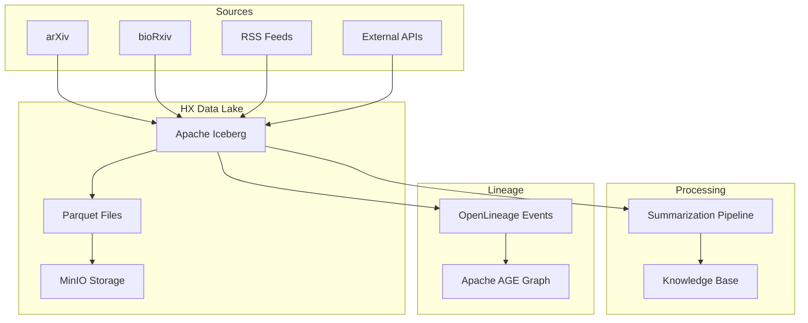
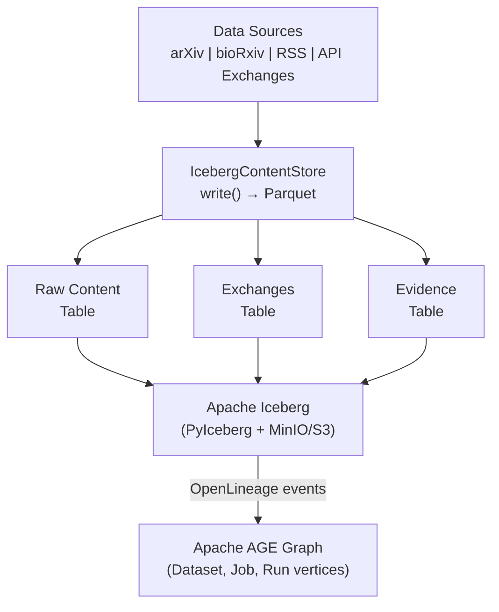

# Gaius HX

Raw content data lake using Apache Iceberg (Iceberg, 2024) for high-volume fetched content, separate from curated KB summaries. HX (history) prevents content acquisition from overwhelming the knowledge base with raw data.

## Architecture



## Module Structure

```
hx/
├── __init__.py           # Module exports
├── config.py             # HxConfig, get_hx_config()
├── catalog.py            # PyIceberg catalog setup
├── storage.py            # MinIO/filesystem storage
├── tables.py             # Iceberg table schemas
├── writer.py             # IcebergContentStore
├── reader.py             # IcebergContentReader
├── exchange.py           # ExchangeCapture (API pairs)
├── exchange_tables.py    # Exchange Iceberg schema
├── evidence.py           # EvidenceCapture (RASE)
├── evidence_tables.py    # Evidence Iceberg schema
└── lineage/
    ├── events.py         # OpenLineage event types
    └── emitter.py        # AGE graph integration
```

## Content Storage

### Writing Raw Content

```python
from gaius.hx import IcebergContentStore

store = IcebergContentStore()

await store.write(
    source="arxiv",
    source_id="2312.12345",
    content_type="application/pdf",
    content=pdf_bytes,
    metadata={
        "title": "Attention Is All You Need",
        "authors": ["Vaswani et al."],
    },
)
```

### Reading Content

```python
from gaius.hx import IcebergContentReader

reader = IcebergContentReader()

# Query by source
records = await reader.query(
    source="arxiv",
    start_date=datetime(2024, 1, 1),
    limit=100,
)

# Get specific record
record = await reader.get("arxiv", "2312.12345")
```

## Iceberg Tables

### Raw Content Schema

```python
RAW_CONTENT_SCHEMA = Schema(
    NestedField(1, "id", StringType(), required=True),
    NestedField(2, "source", StringType(), required=True),
    NestedField(3, "source_id", StringType(), required=True),
    NestedField(4, "content_type", StringType(), required=True),
    NestedField(5, "content", BinaryType(), required=True),
    NestedField(6, "metadata", MapType(StringType(), StringType())),
    NestedField(7, "fetched_at", TimestampType(), required=True),
    NestedField(8, "content_hash", StringType(), required=True),
)
```

Partitioned by:
- `source` (identity)
- `fetched_at` (day)

### Exchange Schema

API request-response pairs for external service calls:

```python
EXCHANGE_SCHEMA = Schema(
    NestedField(1, "exchange_id", StringType(), required=True),
    NestedField(2, "service", StringType(), required=True),
    NestedField(3, "endpoint", StringType(), required=True),
    NestedField(4, "request_body", StringType()),
    NestedField(5, "response_body", StringType()),
    NestedField(6, "status_code", IntegerType()),
    NestedField(7, "latency_ms", IntegerType()),
    NestedField(8, "timestamp", TimestampType(), required=True),
)
```

### Evidence Schema

RASE verification evidence for training data:

```python
EVIDENCE_SCHEMA = Schema(
    NestedField(1, "evidence_id", StringType(), required=True),
    NestedField(2, "scenario_id", StringType(), required=True),
    NestedField(3, "step_index", IntegerType(), required=True),
    NestedField(4, "screenshot", BinaryType()),
    NestedField(5, "som_marks", StringType()),  # JSON
    NestedField(6, "api_state", StringType()),  # JSON
    NestedField(7, "verdict", StringType()),
    NestedField(8, "timestamp", TimestampType(), required=True),
)
```

## Exchange Capture

Capture API request-response pairs:

```python
from gaius.hx import get_exchange_capture

capture = get_exchange_capture()

async with capture.record("nifi", "/flow/process-groups") as exchange:
    response = await client.get("/flow/process-groups")
    exchange.response = response

# Later: replay for testing
exchanges = await capture.query(service="nifi", limit=100)
```

## Evidence Capture

Capture RASE verification evidence:

```python
from gaius.hx import get_evidence_capture

capture = get_evidence_capture()

await capture.record(
    scenario_id="create_processor",
    step_index=3,
    screenshot=screenshot_bytes,
    som_marks=marks.to_json(),
    api_state=state.to_json(),
    verdict="PASS",
)
```

## Catalog Configuration

PyIceberg catalog with PostgreSQL backend:

```python
from gaius.hx import get_catalog, CatalogType

# SQL catalog (production)
catalog = get_catalog(CatalogType.SQL)

# In-memory catalog (testing)
catalog = get_catalog(CatalogType.IN_MEMORY)
```

Environment variables:
- `ICEBERG_CATALOG_URI`: PostgreSQL connection string
- `ICEBERG_WAREHOUSE`: MinIO warehouse path

## Storage Backends

```python
from gaius.hx import get_storage_config, StorageBackend

# MinIO (production)
config = get_storage_config(StorageBackend.MINIO)

# Filesystem (development)
config = get_storage_config(StorageBackend.FILESYSTEM)
```

## Lineage Integration

OpenLineage events emitted to Apache AGE:

```python
from gaius.hx.lineage.emitter import get_emitter
from gaius.hx.lineage.events import Dataset, Job, Run, RunEvent

emitter = get_emitter()

# Record data lineage
event = RunEvent.complete(
    run=Run(),
    job=Job("gaius.flows", "arxiv_fetch"),
    inputs=[Dataset("arxiv", "2312.12345")],
    outputs=[Dataset("gaius.hx", "raw_content/arxiv/2312.12345")],
)

await emitter.emit(event)
```

### Lineage Graph Queries

```sql
-- Trace provenance of a KB file
SELECT * FROM ag_catalog.cypher('openlineage', $$
    MATCH path = (src:Dataset)-[:INPUT_TO|OUTPUTS*]->(kb:Dataset)
    WHERE kb.namespace = 'gaius.kb'
    RETURN src.namespace, src.name, length(path)
$$) as (namespace agtype, name agtype, hops agtype);
```

## Configuration

```python
@dataclass
class HxConfig:
    catalog_type: CatalogType = CatalogType.SQL
    storage_backend: StorageBackend = StorageBackend.MINIO
    warehouse_path: str = "s3://gaius-hx/"
    retention_days: int = 365
```

## References

- Apache Iceberg. (2024). *Apache Iceberg Table Format*. https://iceberg.apache.org/

## Call Graph

```
# Content Write Path
flows.docling.ArxivDoclingFlow.process_step()
  └─→ hx.writer.IcebergContentStore.write()
      ├─→ content_hash = sha256(content)
      ├─→ pyiceberg.table.append(record)
      └─→ lineage.emitter.emit(RunEvent.complete())

# Content Read Path
mcp_server.py:query_lineage(kb_path)
  └─→ hx.reader.IcebergContentReader.get()
      └─→ pyiceberg.table.scan().filter().to_pandas()

# Exchange Capture Path
inference.client.InferenceClient.complete()
  └─→ hx.exchange.ExchangeCapture.record()
      └─→ pyiceberg.exchange_table.append(exchange_record)

# Evidence Capture Path
rase.vm.oracle.verify()
  └─→ hx.evidence.EvidenceCapture.record()
      └─→ pyiceberg.evidence_table.append(evidence_record)

# Lineage Query Path
mcp_server.py:lineage_cypher(query)
  └─→ hx.lineage.emitter.query()
      └─→ ag_catalog.cypher('openlineage', query)
```

## Data Flow



## Integration Points

| Component | Uses | Used By | Integration |
|-----------|------|---------|-------------|
| `IcebergContentStore` | pyiceberg, minio | flows, workers | `write()`, `read()` |
| `ExchangeCapture` | pyiceberg | inference.client | `record()` context manager |
| `EvidenceCapture` | pyiceberg | rase.vm | `record()` |
| `LineageEmitter` | apache-age, asyncpg | flows, mcp_server | `emit()`, `query()` |
| `get_catalog()` | pyiceberg | all hx modules | Factory function |

## See Also

- [Parent README](../README.md) — Module overview
- [Flows README](../flows/README.md) — Pipeline integration
- [RASE README](../rase/README.md) — Evidence capture
- [Storage README](../storage/README.md) — KB vs HX distinction
- [Workers README](../workers/README.md) — Content fetching

---

<!-- GAI:META
module: gaius.hx
layer: L2-transport
key_types: [IcebergContentStore, IcebergContentReader, ExchangeCapture, EvidenceCapture, LineageEmitter, HxConfig, CatalogType]
key_funcs: [get_catalog, get_exchange_capture, get_evidence_capture, get_emitter]
submodules: [lineage]
depends: [core.config, pyiceberg, minio, asyncpg, apache-age]
dependents: [flows, workers, rase.vm, mcp_server]
config_keys: [hx.catalog_type, hx.storage_backend, hx.warehouse_path, hx.retention_days]
env_vars: [ICEBERG_CATALOG_URI, ICEBERG_WAREHOUSE]
grpc_services: []
postgres_tables: []
iceberg_tables: [raw_content, exchanges, evidence]
external_deps: [pyiceberg, minio, apache-age-python]
call_paths:
  write: flows.process→IcebergContentStore.write→pyiceberg.append→lineage.emit
  read: mcp.query→IcebergContentReader.get→pyiceberg.scan
  exchange: inference.client→ExchangeCapture.record→pyiceberg.append
  evidence: rase.oracle.verify→EvidenceCapture.record→pyiceberg.append
  lineage: mcp.lineage_cypher→LineageEmitter.query→ag_catalog.cypher
test_cmds:
  lineage: 'uv run gaius-cli --cmd "/lineage query scratch/2024-12-25/paper.md"'
guru_codes: [HX.00001.ICEBERG_CONN, HX.00002.AGE_UNAVAIL, HX.00003.MINIO_DOWN]
fail_fast: true
-->
