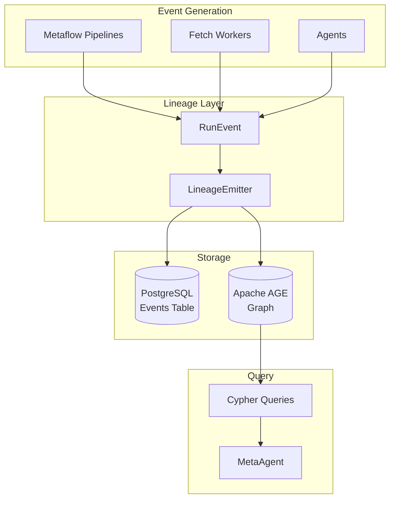
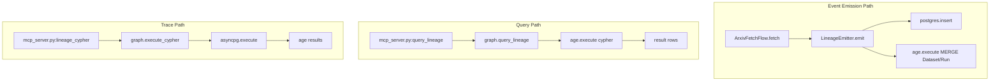
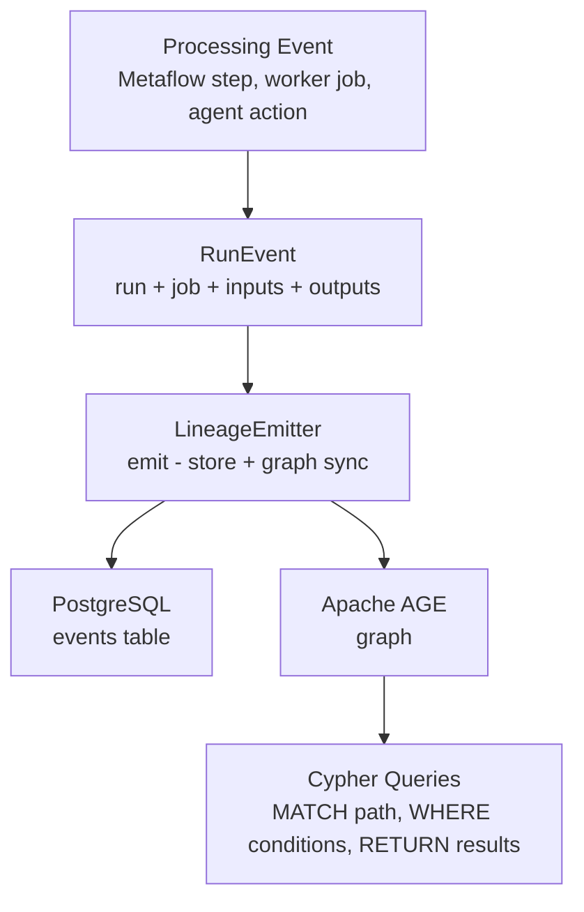

# Gaius HX Lineage

OpenLineage standard implementation for data provenance tracking with Apache AGE graph materialization. Provides the traceability spine connecting raw sources to KB artifacts.

## Architecture



## Module Structure

```
lineage/
├── __init__.py    # Module exports
├── events.py      # Dataset, Job, Run, RunEvent (OpenLineage types)
├── emitter.py     # LineageEmitter (store + graph sync)
└── graph.py       # AGE Cypher helpers
```

## OpenLineage Types

### Dataset

Represents a data source or sink:

```python
from gaius.hx.lineage import Dataset, DatasetFacets

dataset = Dataset(
    namespace="gaius.source",
    name="arxiv:2312.12345",
    facets=DatasetFacets(
        schema={"title": "string", "abstract": "string"},
        description="ArXiv paper source",
    ),
)
```

### Job

Represents a processing definition:

```python
from gaius.hx.lineage import Job, JobFacets

job = Job(
    namespace="gaius.flows",
    name="ArxivFetchFlow",
    facets=JobFacets(
        owner="gaius",
        description="Fetch and process arxiv papers",
    ),
)
```

### Run

Represents a single execution of a job:

```python
from gaius.hx.lineage import Run, RunState, RunFacets

run = Run(
    run_id=uuid4(),
    job=job,
    state=RunState.RUNNING,
    facets=RunFacets(
        started_at=datetime.now(),
        parameters={"arxiv_id": "2312.12345"},
    ),
)
```

### RunEvent

Complete lineage event:

```python
from gaius.hx.lineage import RunEvent

event = RunEvent(
    event_time=datetime.now(),
    run=run,
    job=job,
    inputs=[arxiv_source],
    outputs=[kb_document, pdf_archive],
)
```

## RunState

```python
class RunState(Enum):
    START = "START"
    RUNNING = "RUNNING"
    COMPLETE = "COMPLETE"
    FAIL = "FAIL"
    ABORT = "ABORT"
```

## LineageEmitter

Stores events and syncs to graph:

```python
from gaius.hx.lineage import LineageEmitter, get_emitter

emitter = get_emitter()

# Emit event
await emitter.emit(event)

# Emit with parent run (hierarchical lineage)
await emitter.emit(child_event, parent_run_id=parent.run_id)
```

### Batch Emission

```python
events = [event1, event2, event3]
await emitter.emit_batch(events)
```

## Graph Queries

Query lineage via Cypher:

```python
from gaius.hx.lineage.graph import query_lineage

# Trace upstream sources for a KB file
result = await query_lineage("""
    MATCH path = (src:Dataset)-[:INPUT_TO|OUTPUTS*1..5]->(target:Dataset)
    WHERE target.namespace = 'gaius.kb'
      AND target.name CONTAINS 'attention_is_all_you_need'
    RETURN src.namespace, src.name
""")

for row in result:
    print(f"Source: {row['src.namespace']}:{row['src.name']}")
```

### Graph Schema

```
Vertex Labels:
- Dataset: {dataset_id, namespace, name}
- Job: {job_id, namespace, name}
- Run: {run_id, state, event_time, job_namespace, job_name}

Edge Labels:
- INPUT_TO: Dataset consumed by Run
- OUTPUTS: Run produced Dataset
- EXECUTES: Job spawned Run
- PARENT: Run is child of another Run
```

## Usage in Flows

### Metaflow Integration

```python
from metaflow import FlowSpec, step
from gaius.hx.lineage import get_emitter, RunEvent, Dataset, Job, Run, RunState

class ArxivFetchFlow(FlowSpec):
    @step
    def start(self):
        emitter = get_emitter()

        # Start event
        self.run = Run(
            run_id=uuid4(),
            job=Job(namespace="gaius.flows", name="ArxivFetchFlow"),
            state=RunState.START,
        )
        await emitter.emit(RunEvent(
            run=self.run,
            job=self.run.job,
            inputs=[Dataset(namespace="gaius.source", name=f"arxiv:{self.arxiv_id}")],
            outputs=[],
        ))

        self.next(self.fetch)

    @step
    def end(self):
        # Complete event
        self.run.state = RunState.COMPLETE
        await emitter.emit(RunEvent(
            run=self.run,
            job=self.run.job,
            inputs=[],
            outputs=[Dataset(namespace="gaius.kb", name=self.kb_path)],
        ))
```

### Worker Integration

```python
from gaius.workers import FetchJob
from gaius.hx.lineage import get_emitter

async def process_job(job: FetchJob):
    emitter = get_emitter()

    # Emit START
    run = await emitter.start_run("FetchWorker", job.source_url)

    try:
        result = await fetch_and_process(job)

        # Emit COMPLETE with outputs
        await emitter.complete_run(run, outputs=[result.kb_path])
    except Exception as e:
        # Emit FAIL
        await emitter.fail_run(run, error=str(e))
        raise
```

## Call Graph



## Data Flow



## Example Queries

### Count vertices by label

```cypher
MATCH (n) RETURN labels(n)[0] as label, count(n) as cnt
```

### Find KB files from arxiv source

```cypher
MATCH (s:Dataset)-[:INPUT_TO]->(:Run)-[:OUTPUTS]->(kb:Dataset)
WHERE s.namespace = 'gaius.source' AND s.name STARTS WITH 'arxiv:'
RETURN s.name as source, kb.name as kb_path
```

### Trace full provenance chain

```cypher
MATCH path = (src:Dataset)-[:INPUT_TO|OUTPUTS*1..5]->(target:Dataset)
WHERE target.namespace = 'gaius.kb'
  AND target.name CONTAINS 'attention_is_all_you_need'
RETURN src.namespace, src.name
```

## Integration Points

| Component | Uses | Used By | Integration |
|-----------|------|---------|-------------|
| `LineageEmitter` | asyncpg, age | flows, workers, agents | `emit()`, `emit_batch()` |
| `RunEvent` | Dataset, Job, Run | LineageEmitter | Event model |
| `get_emitter()` | — | callers | Singleton factory |
| `query_lineage()` | age | mcp_server, metaagent | Cypher queries |

## See Also

- [Parent README](../README.md) — HX module overview
- [Flows README](../../flows/README.md) — Metaflow integration
- [Workers README](../../workers/README.md) — Fetch worker integration
- [MetaAgent](../../agents/metaagent/README.md) — Lineage queries

---

<!-- GAI:META
module: gaius.hx.lineage
layer: L2-transport
key_types: [Dataset, Job, Run, RunEvent, RunState, DatasetFacets, JobFacets, RunFacets, LineageEmitter]
key_funcs: [emit, emit_batch, start_run, complete_run, fail_run, query_lineage, get_emitter]
singleton: get_emitter
submodules: []
depends: [asyncpg, age]
dependents: [flows, workers, agents, mcp_server]
config_keys: [lineage.postgres_url, lineage.age_graph_name]
env_vars: [POSTGRES_URL]
grpc_services: []
openlineage_compat: true
graph_schema:
  vertices: [Dataset, Job, Run]
  edges: [INPUT_TO, OUTPUTS, EXECUTES, PARENT]
call_paths:
  emit: flows.fetch→LineageEmitter.emit→postgres.insert+age.execute
  query: mcp.query_lineage→graph.query_lineage→age.execute
  trace: mcp.lineage_cypher→graph.execute_cypher→asyncpg
test_cmds:
  query: 'uv run gaius-cli --cmd "/lineage query \"MATCH (n) RETURN count(n)\""'
  trace: 'uv run gaius-cli --cmd "/lineage trace scratch/paper.md"'
guru_codes: [LI.00001.AGE_UNAVAIL, LI.00002.EMIT_FAIL]
fail_fast: true
-->
