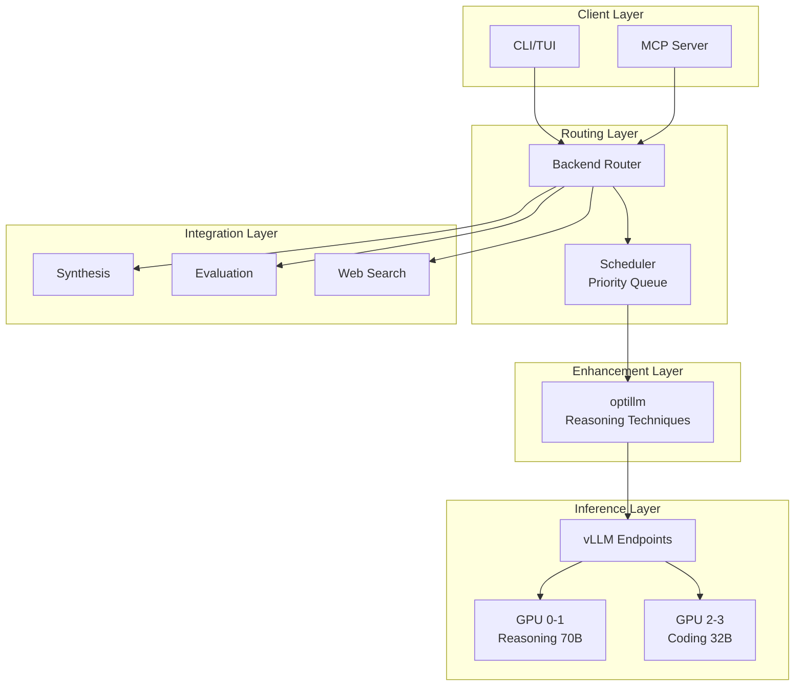
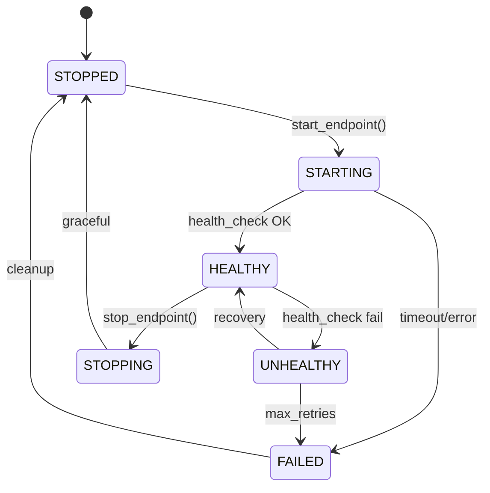
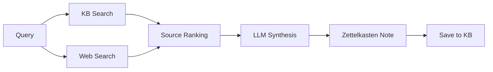

# Gaius Inference

Local-first inference with vLLM orchestration, optillm reasoning enhancement, and priority-based job scheduling.

## Architecture



## Module Structure

```
inference/
├── __init__.py         # Module exports, factory functions
├── config.py           # InferenceConfig, OptillmTechnique
├── client.py           # InferenceClient for completions
├── orchestrator.py     # GPU/vLLM process management
├── scheduler.py        # Priority-based job scheduling
├── router.py           # Capability-based request routing
├── synthesis.py        # Zettelkasten note generation
├── evaluation.py       # Output quality evaluation
├── llm.py              # Low-level LLM interface
├── parallel.py         # Parallel inference utilities
├── recovery.py         # Error recovery strategies
├── health.py           # Inference health monitoring
├── persistence.py      # Job persistence
├── routing_analytics.py # Routing decision tracking
├── manager.py          # Resource management
└── search/
    ├── brave.py        # Brave web search
    └── vector.py       # Vector similarity search
```

## GPU Orchestrator

### Process Lifecycle



### Startup Progress Tracking

vLLM startup is monitored via regex pattern matching on stdout:

| Pattern | Status | Progress |
|---------|--------|----------|
| `Initializing.*engine` | Initializing engine | 5% |
| `Loading model weights` | Loading weights | 10% |
| `Loading checkpoint shards.*(\d+)%` | Loading checkpoint | 15% |
| `loading weights.*safetensors` | Loading safetensors | 20% |
| `Model.*loaded` | Model loaded | 50% |
| `CUDA graphs` | Building CUDA graphs | 60% |
| `Warming up model` | Warming up | 75% |
| `Uvicorn running` | Server running | 95% |
| `Application startup complete` | Ready | 98% |

Error patterns (OOM, CUDA errors) set progress to −1.0.

### Endpoint Configuration

```python
@dataclass
class EndpointConfig:
    name: str                    # "reasoning", "coding"
    url: str                     # "http://localhost:8001/v1"
    models: list[str]            # HuggingFace model IDs
    gpus: list[int]              # Allocated GPUs
    tensor_parallel: int = 1     # GPU parallelism
    context_length: int = 32768  # Maximum context
    max_num_seqs: int = 256      # Maximum concurrent sequences
```

## Job Scheduling

### Priority Levels

```python
class JobPriority(Enum):
    CRITICAL = 0   # User-facing, leader synthesis
    HIGH = 1       # Swarm agents
    NORMAL = 2     # Background tasks
    LOW = 3        # Speculative inference
```

### Scheduling Algorithm

Uses OR-Tools CP-SAT (Google, 2024) for optimal job assignment:

```python
# Objective: minimize weighted completion time
model.Minimize(sum(
    priority_weight[job.priority] * completion_time[job]
    for job in jobs
))

# Constraints:
# - Each job assigned to exactly one endpoint
# - Endpoint capacity not exceeded
# - GPU memory limits respected
# - Tensor parallelism requirements met
```

### Job Submission

```python
from gaius.inference import get_client, Message

client = get_client()

# Synchronous completion
result = await client.complete([
    Message(role="system", content="You are helpful."),
    Message(role="user", content="Explain TDA"),
])

# Async job submission
job_id = await client.submit_async(messages, priority=JobPriority.HIGH)
result = await client.get_result(job_id)
```

## optillm Integration

Reasoning enhancement via optillm (Maheshwari, 2024):

| Technique | Description | Use Case |
|-----------|-------------|----------|
| `cot_reflection` | Chain-of-thought with reflection | Complex reasoning |
| `bon` | Best-of-N sampling | Quality improvement |
| `moa` | Mixture of Agents | Diverse perspectives |
| `rto` | Round-trip optimization | Accuracy refinement |
| `z3` | Z3 solver integration | Logical reasoning |
| `leap` | Learn from examples | Few-shot learning |

### Configuration

```python
class OptillmTechnique(Enum):
    NONE = ""                    # Direct pass-through
    COT_REFLECTION = "cot_reflection"
    BON = "bon"
    MOA = "moa"
    RTO = "rto"
    Z3 = "z3"
    LEAP = "leap"
```

## Synthesis Pipeline

### Zettelkasten Note Generation



### Note Structure

```python
@dataclass
class ZettelkastenNote:
    title: str
    content: str
    citations: list[Citation]
    tags: list[str]
    created_at: datetime

@dataclass
class Citation:
    source: str      # KB path or URL
    title: str
    quote: str       # Relevant excerpt
    relevance: float # 0–1 score
```

## Evaluation System

### Quality Dimensions

| Dimension | Description |
|-----------|-------------|
| `accuracy` | Factual correctness |
| `coherence` | Logical flow |
| `relevance` | Query alignment |
| `completeness` | Coverage of topic |
| `clarity` | Writing quality |

### Tiered Evaluation

| Tier | Model | Use Case |
|------|-------|----------|
| Local | Orchestrator-8B | Quick filtering |
| XAI | Grok | Promotion decisions |

Budget controls limit XAI usage to high-stakes evaluations.

## Web Search

### Brave API Integration

```python
from gaius.inference import get_search

search = get_search()
results = await search.search(
    query="persistent homology tutorial",
    count=10,
)

for result in results:
    print(f"{result.title}: {result.url}")
```

## Error Recovery

### Recovery Strategies

```python
class RecoveryStrategy(Enum):
    RESTART = "restart"           # Restart endpoint
    ROLLBACK = "rollback"         # Previous model version
    REDUCE_BATCH = "reduce_batch" # Smaller batch size
    CLEAR_CACHE = "clear_cache"   # Clear KV cache
    FAILOVER = "failover"         # Use different endpoint
```

## Configuration

```hocon
inference {
    backend = "grpc"  # "grpc" or "http" (dev only)

    vllm {
        host = "localhost"
        reasoning_port = 8001
        coding_port = 8002
        timeout = 120
    }

    optillm {
        host = "localhost"
        port = 8000
        default_technique = "cot_reflection"
    }

    scheduler {
        max_queue_size = 1000
        default_timeout = 120
        preemption_enabled = true
    }

    evaluation {
        local_model = "nvidia/Orchestrator-8B"
        xai_daily_budget = 100
        xai_weekly_budget = 500
    }
}
```

## References

- Google. (2024). *OR-Tools: Operations Research Tools*. https://developers.google.com/optimization
- Maheshwari, P. (2024). *optillm: Inference-time reasoning optimization*. https://github.com/codelion/optillm

## See Also

- [Parent README](../README.md) — Module overview
- [Engine README](../engine/README.md) — gRPC integration
- [Health README](../health/README.md) — Self-healing
