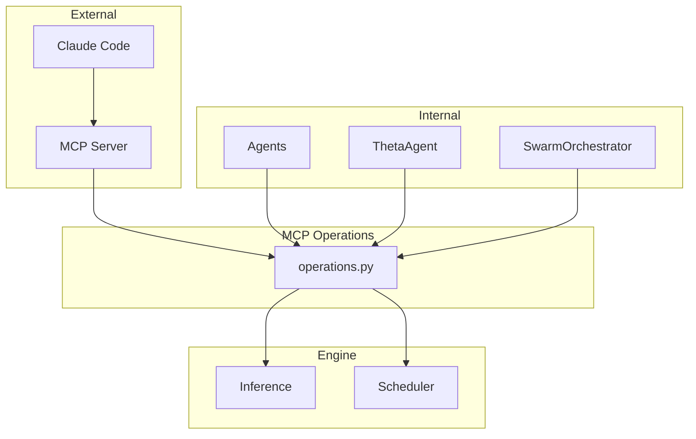

# Gaius MCP

Internal programmatic access to MCP tool operations. Provides a Python API for agents and components to invoke MCP tools without going through the MCP server.

## Architecture



## Module Structure

```
mcp/
├── __init__.py       # Module exports
└── operations.py     # ask_reasoning, run_swarm
```

## Operations

### ask_reasoning

Query the reasoning model for complex analysis:

```python
from gaius.mcp import ask_reasoning

result = await ask_reasoning(
    question="Analyze the trade-offs between TIES and DARE model merging.",
    system_prompt="You are an ML researcher.",
    max_tokens=2048,
)

print(result.content)
print(f"Tokens: {result.tokens_used}")
```

### run_swarm

Execute multi-agent swarm analysis:

```python
from gaius.mcp import run_swarm

result = await run_swarm(
    query="What are the implications of Ollivier-Ricci curvature for KB topology?",
    domain="tda",
    num_agents=7,
)

print(result.synthesis)
for agent in result.agent_outputs:
    print(f"{agent.role}: {agent.summary}")
```

## Use Cases

### Agent Internal Calls

Agents can invoke MCP operations programmatically:

```python
class ThetaAgent:
    async def consolidate(self):
        # Use reasoning for complex analysis
        analysis = await ask_reasoning(
            question=f"Analyze drift between temporal slices: {slices}",
        )

        # Use swarm for multi-perspective synthesis
        synthesis = await run_swarm(
            query="Identify cross-temporal patterns",
            domain=self.domain,
        )
```

### Cognition Cycles

Self-observation uses MCP operations:

```python
class CognitionAgent:
    async def self_observe(self):
        reflection = await ask_reasoning(
            question="Analyze recent thought patterns for themes.",
            system_prompt="You are analyzing your own cognitive patterns.",
        )
```

## Interface

### AskReasoningResult

```python
@dataclass
class AskReasoningResult:
    content: str
    tokens_used: int
    model: str
    latency_ms: int
```

### SwarmResult

```python
@dataclass
class SwarmResult:
    synthesis: str
    agent_outputs: list[AgentOutput]
    total_tokens: int
    latency_ms: int

@dataclass
class AgentOutput:
    role: str
    content: str
    summary: str
```

## Relationship to MCP Server

The `mcp_server.py` exposes tools to Claude Code. The `mcp/operations.py` module provides the same functionality as a Python API for internal use:

| MCP Tool | Internal Function |
|----------|-------------------|
| `ask_reasoning` | `mcp.ask_reasoning()` |
| `run_swarm` | `mcp.run_swarm()` |

This avoids code duplication and ensures consistent behavior.

## See Also

- [Parent README](../README.md) — Module overview
- [Agents README](../agents/README.md) — Agent integration
- [Inference README](../inference/README.md) — Underlying inference
