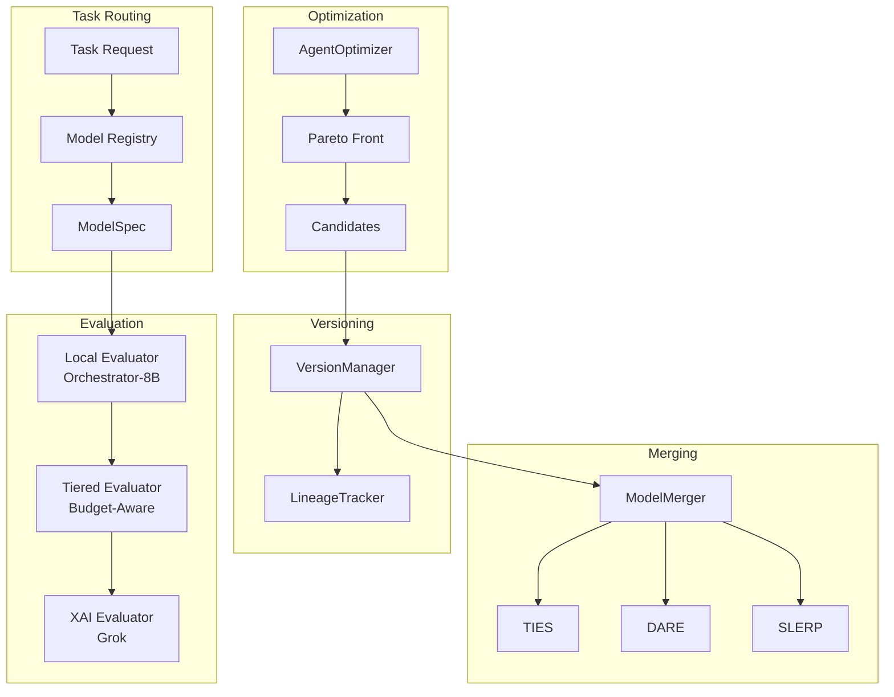

# Gaius Models

Model registry, evaluation, versioning, optimization, and merging for task-specific local inference. This module provides the infrastructure for managing model lifecycles and tracking agent configurations.

## Architecture



## Module Structure

```
models/
├── __init__.py           # Module exports
├── registry.py           # ModelRegistry, ModelSpec, TaskType
├── embeddings.py         # NomicEmbeddings (unified text + vision)
├── evaluation.py         # XAIEvaluator (Grok)
├── tiered_evaluation.py  # Budget-aware local/XAI routing
├── versioning.py         # AgentVersion, VersionManager
├── optimization.py       # AgentOptimizer, Pareto front
├── merging.py            # TIES, DARE, SLERP merge methods
└── lineage.py            # Model lineage tracking
```

## Model Registry

### Task Types

| Task | Description | Default Model |
|------|-------------|---------------|
| `REASONING` | Complex analysis, mathematical reasoning | Qwen/QwQ-32B |
| `CODING` | Code generation and review | nvidia/Llama-3.3-70B-Instruct-FP8 |
| `ORCHESTRATION` | Task routing, planning | nvidia/Orchestrator-8B |
| `SYNTHESIS` | Document synthesis | nvidia/Llama-3.3-70B-Instruct-FP8 |
| `EVALUATION` | Output quality evaluation | xai/grok-2 (via API) |
| `TEXT_EMBEDDING` | Text to vector | nomic-ai/nomic-embed-text-v1 |
| `VISION_EMBEDDING` | Image to vector | nomic-ai/nomic-embed-vision-v1 |

### Model Capabilities

```python
class ModelCapability(Enum):
    CHAT = auto()              # Conversational
    REASONING = auto()         # Chain-of-thought
    CODING = auto()            # Code understanding
    ORCHESTRATION = auto()     # Task routing
    TEXT_EMBEDDING = auto()    # Text vectors
    VISION_EMBEDDING = auto()  # Image vectors
    VISION_LANGUAGE = auto()   # Multimodal
    FUNCTION_CALLING = auto()  # Tool use
    LONG_CONTEXT = auto()      # Extended context
```

### Model Specification

```python
@dataclass
class ModelSpec:
    model_id: str              # HuggingFace model ID
    capabilities: list[ModelCapability]
    context_length: int        # Maximum tokens
    vllm_config: VLLMConfig    # vLLM launch configuration

    # Optional
    quantization: str | None   # "fp8", "awq", "gptq"
    requires_gpus: int = 1     # Minimum GPU count
```

### Usage

```python
from gaius.models import get_model_for_task, TaskType

model = get_model_for_task(TaskType.REASONING)
print(f"Model: {model.model_id}")
print(f"Context: {model.context_length}")

# Get vLLM launch arguments
args = model.vllm_config.to_cli_args()
```

## Embeddings

Nomic unified text and vision embeddings (Nussbaum et al., 2024) provide 768-dimensional vectors in a shared semantic space:

```python
from gaius.models import get_embeddings

embeddings = get_embeddings()

# Text embedding
text_result = await embeddings.embed_text("persistent homology tutorial")
print(f"Vector: {text_result.vector.shape}")  # (768,)

# Vision embedding (same space as text)
image_result = await embeddings.embed_image(image_path)
```

### Unified Semantic Space

Nomic embeddings map text and images to a shared 768-dimensional space, enabling:
- Cross-modal retrieval (text-to-image, image-to-text)
- Multimodal clustering
- Unified similarity computation

## Evaluation

### XAI Evaluator

High-quality evaluation using xAI Grok (xAI, 2024):

```python
from gaius.models import get_evaluator

evaluator = get_evaluator()
result = await evaluator.evaluate(
    output="Agent response here...",
    task_prompt="Original query",
    context="Additional context",
)

print(f"Overall: {result.overall_score:.2f}")
for dim in result.dimensions:
    print(f"  {dim.name}: {dim.score:.2f} - {dim.feedback}")
```

### Evaluation Dimensions

| Dimension | Description |
|-----------|-------------|
| `accuracy` | Factual correctness |
| `coherence` | Logical flow and consistency |
| `relevance` | Alignment with query intent |
| `completeness` | Coverage of topic |
| `clarity` | Writing quality and precision |

### Tiered Evaluation

Budget-aware routing between local and frontier models:

```python
from gaius.models import get_tiered_evaluator

evaluator = get_tiered_evaluator()

# Uses local model by default, XAI only if budget permits
result = await evaluator.evaluate(
    output=response,
    task_prompt=query,
    force_xai=False,  # Reserve XAI for promotion decisions
)

# Check budget status
budget = evaluator.get_budget_status()
print(f"Daily: {budget.daily_used}/{budget.daily_limit}")
```

### Budget Configuration

```python
@dataclass
class EvalBudget:
    daily_limit: int = 100
    weekly_limit: int = 500
    daily_used: int = 0
    weekly_used: int = 0

    def can_use_xai(self) -> bool:
        return self.daily_used < self.daily_limit
```

## Versioning

Track agent configurations and performance over time:

```python
from gaius.models import get_version_manager

manager = get_version_manager()

# Save new version
version = await manager.save_version(
    agent_id="leader",
    system_prompt="You are a strategic leader...",
    model="nvidia/Llama-3.3-70B-Instruct-FP8",
    temperature=0.7,
    change_notes="Improved consensus building",
)

# Get best performing version
best = await manager.get_best_version("leader", metric="avg_overall_score")

# Rollback to previous version
await manager.rollback_agent("leader", version_id="v_abc123")
```

### Version Structure

```python
@dataclass
class AgentVersion:
    version_id: str
    agent_id: str
    system_prompt: str
    model: str
    temperature: float
    created_at: datetime

    # Performance metrics
    avg_overall_score: float | None
    eval_count: int
    is_active: bool
```

## Optimization

Multi-objective agent improvement with Pareto optimality:

```python
from gaius.models import get_optimizer, OptimizationStrategy

optimizer = get_optimizer()

result = await optimizer.optimize(
    agent_id="leader",
    examples=training_examples,
    strategy=OptimizationStrategy.APO,
    num_candidates=5,
    num_iterations=3,
)

print(f"Improvement: {result.improvement_percent:.1f}%")
```

### Optimization Strategies

| Strategy | Description | Reference |
|----------|-------------|-----------|
| APO | Automatic Prompt Optimization | Zhou et al., 2023 |
| GEPA | Genetic Evolution of Prompt Architectures | Guo et al., 2024 |
| Hybrid | APO + GEPA combination | — |

### Pareto Front

Multi-objective optimization identifies the Pareto-optimal trade-off surface across:
- Accuracy
- Coherence
- Latency
- Token efficiency

Solutions on the Pareto front represent configurations where improving one objective requires degrading another.

```python
from gaius.models import compute_pareto_front

candidates = [...]  # Evaluated candidates
pareto_optimal = compute_pareto_front(
    candidates,
    objectives=["accuracy", "coherence"],
)
```

## Model Merging

Combine multiple model versions in parameter space:

### Methods

| Method | Description | Reference |
|--------|-------------|-----------|
| Linear | Weighted average: $\theta = \alpha \theta_1 + (1-\alpha) \theta_2$ | — |
| SLERP | Spherical linear interpolation | Shoemake, 1985 |
| TIES | Task Interference and Expert Selection | Yadav et al., 2023 |
| DARE | Drop and Rescale before merge | Yu et al., 2024 |

### TIES Merge

TIES (Task Interference and Expert Selection) resolves parameter conflicts when merging task-specific fine-tunes (Yadav et al., 2023):

1. **Trim**: Remove small-magnitude changes (below threshold)
2. **Elect sign**: Resolve sign conflicts via majority vote
3. **Disjoint merge**: Average parameters with consistent signs

```python
from gaius.models import ties_merge

merged = ties_merge(
    models=[theta_1, theta_2, theta_3],
    base=theta_base,
    weights=[0.5, 0.3, 0.2],
    density=0.5,  # Keep top 50% of changes
)
```

### DARE Sparsification

DARE (Drop and Rescale) randomly drops parameters before merging, then rescales to maintain expected values (Yu et al., 2024):

$$\delta' = \frac{\delta \odot m}{1 - p}$$

where $m \sim \text{Bernoulli}(1-p)$ is a drop mask and $p$ is the drop rate.

```python
from gaius.models import dare_ties_merge

merged = dare_ties_merge(
    models=[theta_1, theta_2],
    base=theta_base,
    drop_rate=0.9,  # Keep 10% of changes
    weights=[0.5, 0.5],
)
```

## Lineage Tracking

Record model ancestry for reproducibility:

```python
from gaius.models import get_lineage_tracker

tracker = get_lineage_tracker()

# Record merge operation
await record_merge_lineage(
    output_model_id="leader_v5",
    parent_models=["leader_v3", "leader_v4"],
    method="dare_ties",
    weights=[0.6, 0.4],
)

# Get model ancestry
lineage = await tracker.get_lineage("leader_v5")
for entry in lineage:
    print(f"{entry.model_id} <- {entry.parents}")
```

### Lineage Entry

```python
@dataclass
class ModelLineageEntry:
    model_id: str
    parent_models: list[str]
    merge_method: str
    merge_weights: list[float]
    created_at: datetime
    performance_delta: float | None
```

## Configuration

```hocon
models {
    registry {
        default_reasoning = "Qwen/QwQ-32B"
        default_coding = "nvidia/Llama-3.3-70B-Instruct-FP8"
        default_orchestration = "nvidia/Orchestrator-8B"
    }

    embeddings {
        text_model = "nomic-ai/nomic-embed-text-v1"
        vision_model = "nomic-ai/nomic-embed-vision-v1"
        batch_size = 32
    }

    evaluation {
        xai_api_key = ${?XAI_API_KEY}
        daily_budget = 100
        weekly_budget = 500
    }

    optimization {
        strategy = "apo"
        num_candidates = 5
        num_iterations = 3
    }
}
```

## References

- Guo, T., Chen, X., Wang, Y., et al. (2024). Large Language Model based Multi-Agents: A Survey of Progress and Challenges. *arXiv:2402.01680*.
- Nussbaum, Z., Morris, J., Duderstadt, B., & Mulyar, A. (2024). Nomic Embed: Training a Reproducible Long Context Text Embedder. *arXiv:2402.01613*.
- Shoemake, K. (1985). Animating rotation with quaternion curves. *SIGGRAPH*, 19(3), 245–254.
- xAI. (2024). *Grok*. https://x.ai/
- Yadav, P., Tam, D., Choshen, L., Raffel, C., & Bansal, M. (2023). TIES-Merging: Resolving Interference When Merging Models. *NeurIPS 2023*.
- Yu, L., Yu, B., Yu, H., Huang, F., & Li, Y. (2024). Language Models are Super Mario: Absorbing Abilities from Homologous Models as a Free Lunch. *ICML 2024*.
- Zhou, Y., Muresanu, A. I., Han, Z., et al. (2023). Large Language Models Are Human-Level Prompt Engineers. *ICLR 2023*.

## Call Graph

```
# Task-to-Model Resolution
agents.swarm.SwarmManager.analyze()
  └─→ models.registry.get_model_for_task(TaskType.REASONING)
      └─→ ModelRegistry.get_best(capabilities=[REASONING])
          └─→ ModelSpec with vllm_config

# Evaluation Path
agents.evolution.evaluate_candidate()
  └─→ models.tiered_evaluation.TieredEvaluator.evaluate()
      ├─→ [Tier 1] inference.client.complete()      # local Orchestrator-8B
      │     └─→ parse_evaluation_response()
      └─→ [Tier 2] models.evaluation.XAIEvaluator.evaluate()
            └─→ httpx.post(XAI_API_URL)             # if budget permits

# Version Promotion Path
evolution.engine.promote_candidate()
  └─→ models.versioning.VersionManager.save_version()
      └─→ database.insert(agent_versions)
          └─→ models.lineage.record_lineage(parent, child)

# Model Merge Path
mcp_server.py:trigger_model_merge()
  └─→ models.merging.ModelMerger.merge()
      ├─→ ties_merge(models, base, weights)     # TIES method
      ├─→ dare_ties_merge(models, drop_rate)    # DARE method
      └─→ models.lineage.record_merge_lineage()
```

## Data Flow

```
┌───────────────────────────────────────────────────────────────────────┐
│                        Task Request                                    │
│                  (inference, evaluation, merge)                        │
└───────────────────────────────┬───────────────────────────────────────┘
                                │
                ┌───────────────┴───────────────┐
                ▼                               ▼
       ┌──────────────┐                ┌──────────────┐
       │   Registry   │                │  Versioning  │
       │  get_model() │                │   Manager    │
       └──────┬───────┘                └──────┬───────┘
              │                               │
              ▼                               ▼
       ┌──────────────┐                ┌──────────────┐
       │  ModelSpec   │                │AgentVersion  │
       │  vllm_config │                │ system_prompt│
       └──────┬───────┘                └──────┬───────┘
              │                               │
              └───────────────┬───────────────┘
                              ▼
              ┌───────────────────────────────┐
              │         Evaluation            │
              │   TieredEvaluator.evaluate()  │
              └───────────────┬───────────────┘
                              │
              ┌───────────────┴───────────────┐
              ▼                               ▼
       ┌──────────────┐                ┌──────────────┐
       │Local (Tier 1)│                │ XAI (Tier 2) │
       │Orchestrator-8B│               │    Grok      │
       └──────────────┘                └──────────────┘
```

## Integration Points

| Component | Uses | Used By | Integration |
|-----------|------|---------|-------------|
| `get_model_for_task()` | registry.py | agents.swarm, inference | Factory function |
| `TieredEvaluator` | inference.client, providers.xai | evolution, mcp_server | `evaluate()` |
| `VersionManager` | storage.database | evolution, mcp_server | `save_version()`, `get_best_version()` |
| `ModelMerger` | torch, mergekit | evolution, mcp_server | `ties_merge()`, `dare_ties_merge()` |
| `NomicEmbeddings` | nomic-embed | storage.sync, core.projection | `embed_text()`, `embed_image()` |

## See Also

- [Parent README](../README.md) — Module overview
- [Agents README](../agents/README.md) — Evolution integration
- [Engine README](../engine/README.md) — vLLM orchestration
- [Inference README](../inference/README.md) — Model execution
- [Providers README](../providers/README.md) — External model access

---

<!-- GAI:META
module: gaius.models
layer: L4-inference
singleton: get_model_registry
key_types: [ModelRegistry, ModelSpec, TaskType, ModelCapability, AgentVersion, TieredEvaluator, XAIEvaluator, NomicEmbeddings]
key_funcs: [get_model_for_task, get_embeddings, get_evaluator, get_tiered_evaluator, ties_merge, dare_ties_merge, compute_pareto_front]
submodules: []
depends: [core.config, storage.database, inference.client, providers.xai]
dependents: [agents.evolution, agents.swarm, mcp_server, engine.services]
config_keys: [models.registry.default_reasoning, models.embeddings.text_model, models.evaluation.xai_api_key, models.evaluation.daily_budget]
env_vars: [XAI_API_KEY, NOMIC_API_KEY]
grpc_services: []
postgres_tables: [agent_versions, model_lineage, evaluation_results]
external_deps: [torch, mergekit, nomic, httpx]
call_paths:
  resolve: agents.swarm→registry.get_model_for_task→ModelSpec
  evaluate: evolution→TieredEvaluator.evaluate→local|xai
  version: evolution.promote→VersionManager.save_version→database
  merge: mcp.trigger_merge→ModelMerger.merge→ties|dare→lineage
test_cmds:
  list: 'uv run gaius-cli --cmd "/model list"'
  eval: 'uv run gaius-cli --cmd "/eval status"'
guru_codes: [MD.00001.XAI_BUDGET, MD.00002.MERGE_OOM, MD.00003.NOMIC_UNAVAIL]
fail_fast: true
-->
