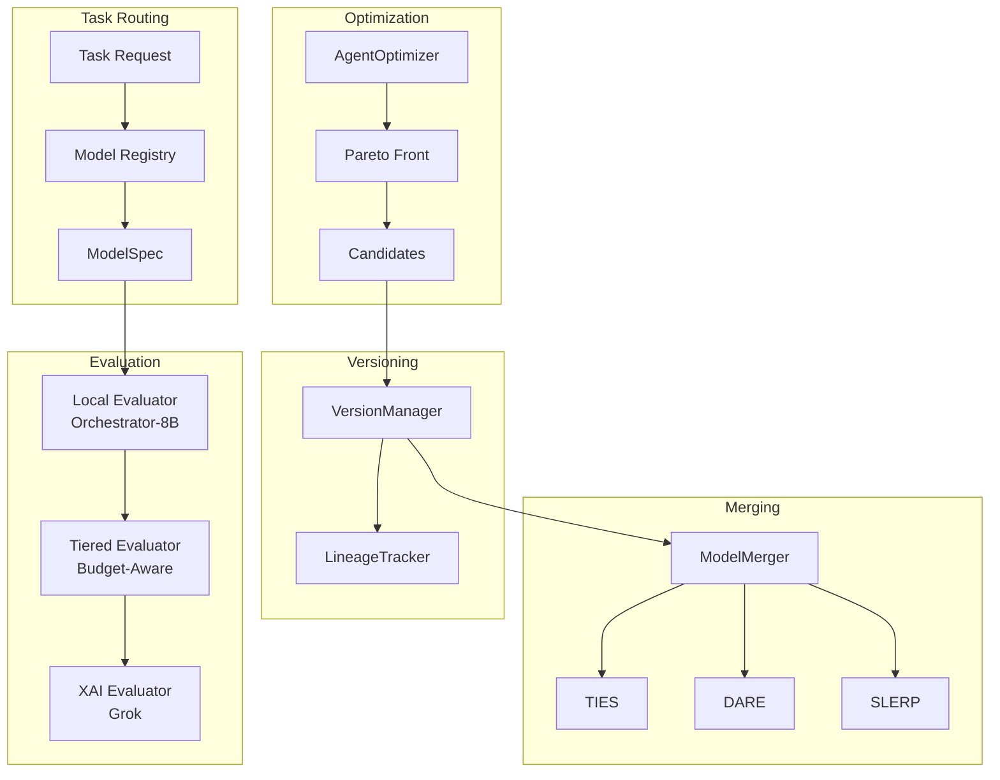

# Gaius Models

Model registry, evaluation, versioning, optimization, and merging for task-specific local inference.

## Architecture



## Module Structure

```
models/
├── __init__.py           # Module exports
├── registry.py           # ModelRegistry, ModelSpec, TaskType
├── embeddings.py         # NomicEmbeddings (text + vision)
├── evaluation.py         # XAIEvaluator (Grok)
├── tiered_evaluation.py  # Budget-aware local/XAI routing
├── versioning.py         # AgentVersion, VersionManager
├── optimization.py       # AgentOptimizer, Pareto front
├── merging.py            # TIES, DARE, SLERP merge methods
└── lineage.py            # Model lineage tracking
```

## Model Registry

### Task Types

| Task | Description | Default Model |
|------|-------------|---------------|
| `REASONING` | Complex analysis, math, logic | Qwen/QwQ-32B |
| `CODING` | Code generation/review | nvidia/Llama-3.3-70B-Instruct-FP8 |
| `ORCHESTRATION` | Agent routing, planning | nvidia/Orchestrator-8B |
| `SYNTHESIS` | Document synthesis | nvidia/Llama-3.3-70B-Instruct-FP8 |
| `EVALUATION` | Output evaluation | xai/grok-2 (via API) |
| `TEXT_EMBEDDING` | Text to vector | nomic-ai/nomic-embed-text-v1 |
| `VISION_EMBEDDING` | Image to vector | nomic-ai/nomic-embed-vision-v1 |

### Model Capabilities

```python
class ModelCapability(Enum):
    CHAT = auto()              # Conversational
    REASONING = auto()         # Chain-of-thought
    CODING = auto()            # Code understanding
    ORCHESTRATION = auto()     # Task routing
    TEXT_EMBEDDING = auto()    # Text vectors
    VISION_EMBEDDING = auto()  # Image vectors
    VISION_LANGUAGE = auto()   # Multimodal
    FUNCTION_CALLING = auto()  # Tool use
    LONG_CONTEXT = auto()      # Extended context
```

### Model Specification

```python
@dataclass
class ModelSpec:
    model_id: str              # HuggingFace ID
    capabilities: list[ModelCapability]
    context_length: int        # Max tokens
    vllm_config: VLLMConfig    # vLLM launch config

    # Optional
    quantization: str | None   # "fp8", "awq", "gptq"
    requires_gpus: int = 1     # Minimum GPUs
```

### Usage

```python
from gaius.models import get_model_for_task, TaskType

# Get best model for task
model = get_model_for_task(TaskType.REASONING)
print(f"Model: {model.model_id}")
print(f"Context: {model.context_length}")

# Get vLLM launch args
args = model.vllm_config.to_cli_args()
```

## Embeddings

Nomic unified text + vision embeddings (768-dimensional):

```python
from gaius.models import get_embeddings, EmbeddingResult

embeddings = get_embeddings()

# Text embedding
text_result = await embeddings.embed_text("persistent homology tutorial")
print(f"Vector: {text_result.vector.shape}")  # (768,)

# Batch text embedding
texts = ["doc1", "doc2", "doc3"]
results = await embeddings.embed_texts(texts)

# Vision embedding (same space as text)
image_result = await embeddings.embed_image(image_path)
```

### Unified Space

Nomic text and vision embeddings share the same 768-dimensional space, enabling:
- Text-to-image search
- Image-to-text search
- Multimodal clustering

## Evaluation

### XAI Evaluator (Grok)

High-quality evaluation via xAI API:

```python
from gaius.models import get_evaluator, evaluate_output

evaluator = get_evaluator()
result = await evaluator.evaluate(
    output="Agent response here...",
    task_prompt="Original query",
    context="Additional context",
)

print(f"Overall: {result.overall_score:.2f}")
for dim in result.dimensions:
    print(f"  {dim.name}: {dim.score:.2f} - {dim.feedback}")
```

### Evaluation Dimensions

| Dimension | Description |
|-----------|-------------|
| `accuracy` | Factual correctness |
| `coherence` | Logical flow |
| `relevance` | Query alignment |
| `completeness` | Topic coverage |
| `clarity` | Writing quality |

### Tiered Evaluation

Budget-aware routing between local and XAI:

```python
from gaius.models import get_tiered_evaluator, evaluate_with_budget

evaluator = get_tiered_evaluator()

# Uses local model by default, XAI only if budget allows
result = await evaluator.evaluate(
    output=response,
    task_prompt=query,
    force_xai=False,  # Only use XAI for promotion decisions
)

# Check budget status
budget = evaluator.get_budget_status()
print(f"Daily: {budget.daily_used}/{budget.daily_limit}")
```

### Budget Configuration

```python
@dataclass
class EvalBudget:
    daily_limit: int = 100
    weekly_limit: int = 500
    daily_used: int = 0
    weekly_used: int = 0

    def can_use_xai(self) -> bool:
        return self.daily_used < self.daily_limit
```

## Versioning

Track agent configurations and performance:

```python
from gaius.models import get_version_manager, AgentVersion

manager = get_version_manager()

# Save new version
version = await manager.save_version(
    agent_id="leader",
    system_prompt="You are a strategic leader...",
    model="nvidia/Llama-3.3-70B-Instruct-FP8",
    temperature=0.7,
    change_notes="Improved consensus building",
)
print(f"Version: {version.version_id}")

# Get best performing version
best = await manager.get_best_version("leader", metric="avg_overall_score")

# Rollback to previous version
await manager.rollback_agent("leader", version_id="v_abc123")
```

### Version Structure

```python
@dataclass
class AgentVersion:
    version_id: str
    agent_id: str
    system_prompt: str
    model: str
    temperature: float
    created_at: datetime

    # Performance metrics
    avg_overall_score: float | None
    eval_count: int
    is_active: bool
```

## Optimization

Pareto-optimal agent improvement:

```python
from gaius.models import get_optimizer, OptimizationStrategy

optimizer = get_optimizer()

result = await optimizer.optimize(
    agent_id="leader",
    examples=training_examples,
    strategy=OptimizationStrategy.APO,  # Automatic Prompt Optimization
    num_candidates=5,
    num_iterations=3,
)

print(f"Improvement: {result.improvement_percent:.1f}%")
print(f"New prompt: {result.best_config.system_prompt[:100]}...")
```

### Optimization Strategies

| Strategy | Description |
|----------|-------------|
| `APO` | Automatic Prompt Optimization |
| `GEPA` | Genetic Evolution of Prompt Architectures |
| `HYBRID` | APO + GEPA combination |

### Pareto Front

Multi-objective optimization balancing:
- Accuracy
- Coherence
- Latency
- Token efficiency

```python
from gaius.models import compute_pareto_front

candidates = [...]  # Evaluated candidates
pareto_optimal = compute_pareto_front(
    candidates,
    objectives=["accuracy", "coherence"],
)
```

## Model Merging

Combine multiple model versions:

### Methods

| Method | Description | Formula |
|--------|-------------|---------|
| **Linear** | Weighted average | $\theta = \alpha \theta_1 + (1-\alpha) \theta_2$ |
| **SLERP** | Spherical interpolation | $\text{slerp}(\theta_1, \theta_2, t)$ |
| **TIES** | Task-specific interference | Resolves sign conflicts |
| **DARE** | Drop and rescale | Sparsifies before merge |

### Usage

```python
from gaius.models import get_merger, MergeMethod

merger = get_merger()

result = await merger.merge(
    sources=[model_a, model_b],
    method=MergeMethod.DARE_TIES,
    weights=[0.6, 0.4],
)

print(f"Merged: {result.output_path}")
```

### TIES Merge

Resolves parameter conflicts:

```python
from gaius.models import ties_merge

merged = ties_merge(
    models=[theta_1, theta_2, theta_3],
    base=theta_base,
    weights=[0.5, 0.3, 0.2],
    density=0.5,  # Keep top 50% of changes
)
```

### DARE Sparsification

Drops parameters before merging:

```python
from gaius.models import dare_sparsify, dare_ties_merge

# Sparsify single model
sparse = dare_sparsify(
    model=theta,
    base=theta_base,
    drop_rate=0.9,  # Keep 10% of changes
)

# DARE + TIES combined
merged = dare_ties_merge(
    models=[theta_1, theta_2],
    base=theta_base,
    drop_rate=0.9,
    weights=[0.5, 0.5],
)
```

## Lineage Tracking

Record model ancestry:

```python
from gaius.models import get_lineage_tracker, record_merge_lineage

tracker = get_lineage_tracker()

# Record merge operation
await record_merge_lineage(
    output_model_id="leader_v5",
    parent_models=["leader_v3", "leader_v4"],
    method="dare_ties",
    weights=[0.6, 0.4],
)

# Get model ancestry
lineage = await tracker.get_lineage("leader_v5")
for entry in lineage:
    print(f"{entry.model_id} <- {entry.parents}")
```

### Lineage Entry

```python
@dataclass
class ModelLineageEntry:
    model_id: str
    parent_models: list[str]
    merge_method: str
    merge_weights: list[float]
    created_at: datetime
    performance_delta: float | None
```

## Configuration

```hocon
models {
    registry {
        default_reasoning = "Qwen/QwQ-32B"
        default_coding = "nvidia/Llama-3.3-70B-Instruct-FP8"
        default_orchestration = "nvidia/Orchestrator-8B"
    }

    embeddings {
        text_model = "nomic-ai/nomic-embed-text-v1"
        vision_model = "nomic-ai/nomic-embed-vision-v1"
        batch_size = 32
    }

    evaluation {
        xai_api_key = ${?XAI_API_KEY}
        daily_budget = 100
        weekly_budget = 500
    }

    optimization {
        strategy = "apo"
        num_candidates = 5
        num_iterations = 3
    }
}
```

## See Also

- [Parent README](../README.md) - Module overview
- [Agents README](../agents/README.md) - Evolution integration
- [Engine README](../engine/README.md) - vLLM orchestration
