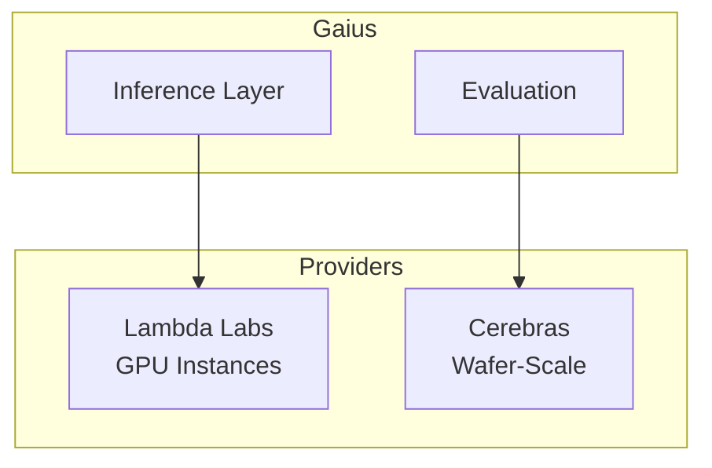

# Gaius Providers

Cloud GPU provider clients for external compute resources. Used when models exceed local hardware capacity or for frontier model access.

## Architecture



## Module Structure

```
providers/
├── __init__.py       # Module exports
├── lambdalabs.py     # LambdaLabsClient
└── cerebras.py       # CerebrasClient
```

## Lambda Labs

On-demand GPU instances for large model inference:

```python
from gaius.providers import LambdaLabsClient, InstanceType

client = LambdaLabsClient(api_key=os.environ["LAMBDA_API_KEY"])

# Check availability
availability = await client.get_availability()
for instance in availability:
    if instance.available:
        print(f"{instance.type}: {instance.regions}")

# Launch instance
instance = await client.launch_instance(
    instance_type=InstanceType.GPU_8X_A100_80GB,
    region="us-west-1",
    ssh_key_name="gaius-key",
)

print(f"Instance ID: {instance.id}")
print(f"IP: {instance.ip}")

# Terminate when done
await client.terminate_instance(instance.id)
```

### Instance Types

| Type | GPUs | VRAM | Use Case |
|------|------|------|----------|
| `GPU_1X_A100_80GB` | 1× A100 | 80 GB | Small models |
| `GPU_8X_A100_80GB` | 8× A100 | 640 GB | 70B+ models |
| `GPU_1X_H100_80GB` | 1× H100 | 80 GB | Fast inference |
| `GPU_8X_H100_80GB` | 8× H100 | 640 GB | Training, large inference |

### InstanceAvailability

```python
@dataclass
class InstanceAvailability:
    type: InstanceType
    available: bool
    regions: list[str]
    price_per_hour: float
```

## Cerebras

Wafer-scale inference for frontier model evaluation:

```python
from gaius.providers import CerebrasClient, CerebrasModel

client = CerebrasClient(api_key=os.environ["CEREBRAS_API_KEY"])

# Chat completion
response = await client.chat(
    model=CerebrasModel.LLAMA_3_1_70B,
    messages=[
        {"role": "system", "content": "You are an evaluator."},
        {"role": "user", "content": "Evaluate this response..."},
    ],
    max_tokens=1024,
)

print(response.content)
print(f"Tokens: {response.usage.total_tokens}")
```

### Cerebras Models

| Model | Description |
|-------|-------------|
| `LLAMA_3_1_8B` | Llama 3.1 8B |
| `LLAMA_3_1_70B` | Llama 3.1 70B |
| `LLAMA_3_3_70B` | Llama 3.3 70B |

### Response Format

```python
@dataclass
class CerebrasResponse:
    content: str
    model: str
    usage: Usage
    finish_reason: str

@dataclass
class Usage:
    prompt_tokens: int
    completion_tokens: int
    total_tokens: int
```

## Configuration

Environment variables:

| Variable | Description |
|----------|-------------|
| `LAMBDA_API_KEY` | Lambda Labs API key |
| `CEREBRAS_API_KEY` | Cerebras API key |

## Use Cases

### Large Model Inference

When local GPUs are insufficient:

```python
from gaius.providers import LambdaLabsClient

client = LambdaLabsClient()

# Check if we need external compute
if model_size > local_vram:
    instance = await client.launch_instance(
        instance_type=InstanceType.GPU_8X_A100_80GB,
    )
    # Deploy model to instance...
```

### Frontier Model Evaluation

XAI budget exhausted, use Cerebras:

```python
from gaius.providers import CerebrasClient

client = CerebrasClient()

# Evaluate with frontier model
result = await client.chat(
    model=CerebrasModel.LLAMA_3_3_70B,
    messages=[...],
)
```

## Error Handling

```python
from gaius.providers import LambdaLabsClient

try:
    instance = await client.launch_instance(...)
except InstanceUnavailableError:
    # No capacity in requested region
    pass
except QuotaExceededError:
    # Account quota reached
    pass
except AuthenticationError:
    # Invalid API key
    pass
```

## Call Graph

```
# Lambda Labs Instance Path
models.registry.ModelRegistry.resolve_backend()
  └─→ [if model_size > local_vram]
      └─→ providers.lambdalabs.LambdaLabsClient.launch_instance()
          └─→ httpx.post("api.lambdalabs.com/instance-operations/launch")
              └─→ InstanceInfo (id, ip, ssh_key)

# Cerebras Inference Path
models.tiered_evaluation.TieredEvaluator.evaluate()
  └─→ [if xai_budget_exhausted and cerebras_available]
      └─→ providers.cerebras.CerebrasClient.chat()
          └─→ httpx.post("api.cerebras.ai/v1/chat/completions")
              └─→ CerebrasResponse

# Instance Termination Path
inference.manager.ResourceManager.cleanup()
  └─→ providers.lambdalabs.LambdaLabsClient.terminate_instance()
      └─→ httpx.post("api.lambdalabs.com/instance-operations/terminate")
```

## Data Flow

```
┌─────────────────────────────────────────────────────────────────────┐
│                    Local GPU Check                                   │
│             model_size > local_vram → need external                  │
└─────────────────────────────────┬───────────────────────────────────┘
                                  │
              ┌───────────────────┴───────────────────┐
              ▼                                       ▼
     ┌──────────────┐                        ┌──────────────┐
     │ Lambda Labs  │                        │   Cerebras   │
     │   (GPUs)     │                        │  (Inference) │
     └──────┬───────┘                        └──────┬───────┘
            │                                       │
            ▼                                       ▼
     ┌──────────────┐                        ┌──────────────┐
     │check_availability                     │    chat()    │
     │launch_instance                        │   (API)      │
     │terminate_instance                     │              │
     └──────┬───────┘                        └──────┬───────┘
            │                                       │
            ▼                                       ▼
     ┌──────────────┐                        ┌──────────────┐
     │  SSH Deploy  │                        │ Evaluation   │
     │    vLLM      │                        │   Result     │
     └──────────────┘                        └──────────────┘
```

## Integration Points

| Component | Uses | Used By | Integration |
|-----------|------|---------|-------------|
| `LambdaLabsClient` | httpx | models.registry, inference | `launch_instance()`, `terminate_instance()` |
| `CerebrasClient` | httpx | models.tiered_evaluation | `chat()` |
| `InstanceAvailability` | — | LambdaLabsClient | Return type |
| `CerebrasResponse` | — | CerebrasClient | Return type |

## See Also

- [Parent README](../README.md) — Module overview
- [Inference README](../inference/README.md) — Inference routing
- [Models README](../models/README.md) — Evaluation integration

---

<!-- GAI:META
module: gaius.providers
layer: L4-inference
key_types: [LambdaLabsClient, CerebrasClient, InstanceType, InstanceAvailability, CerebrasModel, CerebrasResponse, Usage]
key_funcs: [launch_instance, terminate_instance, get_availability, chat]
submodules: []
depends: [httpx]
dependents: [models.registry, models.tiered_evaluation, inference.manager]
config_keys: []
env_vars: [LAMBDA_API_KEY, CEREBRAS_API_KEY]
grpc_services: []
external_deps: [httpx]
call_paths:
  lambda_launch: models.registry→LambdaLabsClient.launch_instance→httpx.post
  cerebras_chat: tiered_eval→CerebrasClient.chat→httpx.post
  lambda_terminate: inference.manager→LambdaLabsClient.terminate_instance
test_cmds:
  availability: 'uv run python -c "from gaius.providers import LambdaLabsClient; ..."'
guru_codes: [PR.00001.LAMBDA_QUOTA, PR.00002.CEREBRAS_AUTH, PR.00003.INSTANCE_UNAVAIL]
fail_fast: true
-->
