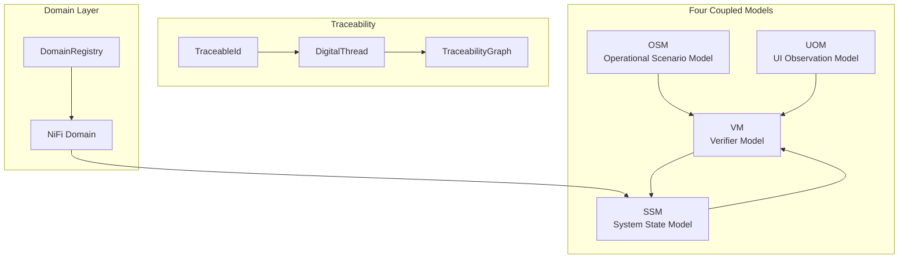

# Gaius RASE

Rapid Agentic Systems Engineering—a Python-native metamodel for MBSE with verifiable closed-loop learning. Implements SysML v2-like semantics (Friedenthal et al., 2014) in Pydantic with RLVR (Reinforcement Learning with Verifiable Reward) as the core training principle.

## Core Principle

The verifier is a first-class artifact. Reward signals come from verifiable computation, not human feedback or learned approximations. The oracle uses API ground truth—UI observations are the training target, not the verification source.

## Architecture



## Module Structure

```
rase/
├── __init__.py           # Module exports, backward compat
├── traceability.py       # TraceableId, DigitalThread
├── core/                 # Domain-agnostic abstractions
│   ├── state.py          # SystemState protocol, S TypeVar
│   ├── constraints.py    # Generic Constraint[S], composites
│   └── vm.py             # Generic Oracle[S], VerdictKind
├── domains/              # Domain-specific implementations
│   ├── base.py           # DomainSpec, DomainRegistry
│   └── nifi/             # NiFi domain
│       ├── state.py      # NiFiInstance, Processor
│       ├── constraints.py # NiFi constraints
│       └── oracle.py     # NiFiOracle
├── osm/                  # Operational Scenario Model
│   ├── scenario.py       # Scenario, Feature, Background
│   └── steps.py          # StepDef, step decorators
├── uom/                  # UI Observation Model
│   ├── som.py            # Set-of-Mark (SoM)
│   └── tom.py            # Trace-of-Mark (ToM)
└── vm/                   # Verifier Model
    ├── requirements.py   # Requirement hierarchy
    ├── verification.py   # VerificationCase, VerificationRun
    └── oracle.py         # Oracle, compute_reward
```

## Four Coupled Models

### OSM (Operational Scenario Model)

BDD scenarios as executable specifications:

```python
from gaius.rase import Scenario, StepType, given, when, then

scenario = Scenario(
    name="Create Processor",
    steps=[
        Step(StepType.GIVEN, "a NiFi canvas is open"),
        Step(StepType.WHEN, "user drags GenerateFlowFile to canvas"),
        Step(StepType.THEN, "a processor appears on canvas"),
    ],
)

@given("a NiFi canvas is open")
def given_canvas_open(context):
    assert context.nifi.is_connected()

@when("user drags {processor_type} to canvas")
def when_drag_processor(context, processor_type: str):
    context.nifi.create_processor(processor_type)

@then("a processor appears on canvas")
def then_processor_appears(context):
    assert len(context.nifi.processors) > 0
```

### SSM (System State Model)

System as typed graph (API truth):

```python
from gaius.rase import NiFiInstance, Processor, ProcessorGroup

state = NiFiInstance(
    id="root",
    processors=[
        Processor(
            id="abc123",
            type="org.apache.nifi.GenerateFlowFile",
            name="Generate Data",
            state=ProcessorRunState.RUNNING,
        ),
    ],
    connections=[...],
)
```

### UOM (UI Observation Model)

Screenshots with SoM/ToM grounding:

```python
from gaius.rase import ScreenshotWithSoM, Mark, BoundingBox, UIRole

screenshot = ScreenshotWithSoM(
    image=image_bytes,
    marks=[
        Mark(
            id=1,
            bbox=BoundingBox(x=100, y=200, width=50, height=30),
            role=UIRole.BUTTON,
            label="Add Processor",
        ),
    ],
)

# Trace of marks (action sequence)
from gaius.rase import TraceOfMarks, UIAction, UIActionType

trace = TraceOfMarks(
    frames=[
        ActionFrame(
            screenshot=screenshot,
            action=UIAction(
                type=UIActionType.CLICK,
                target_mark_id=1,
            ),
        ),
    ],
)
```

### VM (Verifier Model)

Requirements + verification (RLVR oracle):

```python
from gaius.rase import (
    ScenarioRequirement,
    NiFiOracle,
    VerdictKind,
    compute_reward,
)

requirement = ScenarioRequirement.from_scenario(scenario)

oracle = NiFiOracle()
result = await oracle.verify(requirement, state)

print(f"Verdict: {result.verdict}")  # PASS, FAIL, INCONCLUSIVE, ERROR
print(f"Accuracy: {result.accuracy}")  # 0.0–1.0

reward = compute_reward(result)
```

## Traceability Spine

`TraceableId` links all artifacts:

```python
from gaius.rase import TraceableId

# BDD scenario
tid = TraceableId.from_bdd("basic_flows", scenario="CreateFlow")
# → bdd://features/basic_flows#Scenario:CreateFlow

# NiFi element
tid = TraceableId.from_nifi("root", processor_id="abc123")
# → nifi://root/processors/abc123

# Generated artifact
tid = TraceableId.generate(scheme="rase", prefix="verify")
# → rase://verify_<uuid>
```

### Digital Thread

Capture provenance relationships:

```python
from gaius.rase import DigitalThread

thread = DigitalThread()
thread.add_derivation(source_id, derived_id, relationship="derives")
thread.add_verification(requirement_id, verification_id)
```

## Constraints

Declarative, composable constraint system:

```python
from gaius.rase import (
    ProcessorExists,
    ProcessorHasType,
    AllOf,
    AnyOf,
    Not,
)

# Simple constraint
constraint = ProcessorExists(name="Generate Data")

# Composite constraint
constraint = AllOf([
    ProcessorExists(name="Generate Data"),
    ProcessorHasType(name="Generate Data", type_pattern="GenerateFlowFile"),
    Not(ProcessorExists(name="Obsolete Processor")),
])

# Evaluate
result = constraint.evaluate(state)
if result.satisfied:
    print("All constraints met")
else:
    print(f"Failed: {result.message}")
```

## Reward Strategies

```python
from gaius.rase import BinaryReward, GradedReward

# Sparse signal (0 or 1)
binary = BinaryReward()
reward = binary.compute(result)  # 0.0 or 1.0

# Dense signal with partial credit
graded = GradedReward(
    pass_reward=1.0,
    fail_penalty=-0.5,
    partial_credit=True,
)
reward = graded.compute(result)  # Uses accuracy for partial credit
```

## SysML v2 Semantic Alignment

| SysML v2 Concept | RASE Implementation |
|------------------|---------------------|
| `requirement def` | `Requirement`, `ScenarioRequirement` |
| `verification def` | `VerificationCase`, `APIVerificationCase` |
| `constraint def` | `Constraint` subclasses |
| `action def` | `StepDef` with `@given`, `@when`, `@then` |
| `part def` | `Processor`, `ProcessorGroup`, `NiFiInstance` |
| Human ID `<'scheme:path'>` | `TraceableId.uri` |

## Domain Registration

```python
from gaius.rase import DomainSpec, DomainRegistry

spec = DomainSpec(
    name="nifi",
    state_type=NiFiInstance,
    constraint_types=[ProcessorExists, ConnectionExists, ...],
    oracle_type=NiFiOracle,
)

registry = DomainRegistry()
registry.register(spec)

# Get domain
nifi = registry.get("nifi")
```

## Usage Example

```python
from gaius.rase import (
    Scenario,
    StepType,
    NiFiInstance,
    ScenarioRequirement,
    NiFiOracle,
    compute_reward,
)

# Define scenario
scenario = Scenario(
    name="Create and Start Processor",
    steps=[
        Step(StepType.GIVEN, "empty NiFi canvas"),
        Step(StepType.WHEN, "create GenerateFlowFile processor"),
        Step(StepType.WHEN, "start the processor"),
        Step(StepType.THEN, "processor is running"),
    ],
)

# Capture current state (from API)
state = await nifi_client.get_state()

# Derive requirement
requirement = ScenarioRequirement.from_scenario(scenario)

# Verify
oracle = NiFiOracle()
result = await oracle.verify(requirement, state)

# Compute reward for RL
reward = compute_reward(result)
print(f"Reward: {reward}")
```

## References

- Friedenthal, S., Moore, A., & Steiner, R. (2014). *A Practical Guide to SysML: The Systems Modeling Language* (3rd ed.). Morgan Kaufmann.

## Call Graph

```
# Verification Pipeline
datasets.nifi_som.generate()
  └─→ rase.osm.scenario.Scenario.execute()
      └─→ [for each step]
          ├─→ @given/@when/@then step definitions
          └─→ rase.uom.som.capture_screenshot_with_marks()
              └─→ hx.evidence.EvidenceCapture.record()

# Oracle Verification Path
mcp_server.py:verify_objective()
  └─→ rase.vm.oracle.NiFiOracle.verify()
      ├─→ nifi_client.get_state()           # fetch API ground truth
      ├─→ [for each constraint]
      │     └─→ constraint.evaluate(state)
      └─→ VerdictKind + accuracy computation

# Reward Computation Path
rase.vm.oracle.NiFiOracle.verify()
  └─→ rase.vm.oracle.compute_reward(result)
      ├─→ BinaryReward.compute()             # 0.0 or 1.0
      └─→ GradedReward.compute()             # partial credit

# Traceability Path
rase.traceability.DigitalThread.add_derivation()
  └─→ TraceabilityGraph.add_edge(source_id, derived_id)
      └─→ storage.database.insert(traceability_edges)
```

## Data Flow

```
┌─────────────────────────────────────────────────────────────────────┐
│                      BDD Scenarios (OSM)                             │
│           Feature → Scenario → Steps → @given/@when/@then            │
└─────────────────────────────────┬───────────────────────────────────┘
                                  │
                                  ▼
┌─────────────────────────────────────────────────────────────────────┐
│                     System State (SSM)                               │
│         NiFiInstance → ProcessorGroup → Processor → Connection       │
└─────────────────────────────────┬───────────────────────────────────┘
                                  │
              ┌───────────────────┼───────────────────┐
              ▼                   ▼                   ▼
     ┌──────────────┐    ┌──────────────┐    ┌──────────────┐
     │ Constraints  │    │    UOM       │    │   Verifier   │
     │  (SSM)       │    │ Screenshots  │    │   (VM)       │
     │ ProcessorExist│   │ SoM + ToM    │    │   Oracle     │
     └──────┬───────┘    └──────┬───────┘    └──────┬───────┘
            │                   │                   │
            └───────────────────┼───────────────────┘
                                ▼
┌─────────────────────────────────────────────────────────────────────┐
│                      VerificationResult                              │
│              VerdictKind + Accuracy + Reward Signal                  │
└─────────────────────────────────┬───────────────────────────────────┘
                                  │
                                  ▼
┌─────────────────────────────────────────────────────────────────────┐
│                   RLVR Training Loop                                 │
│               Reward → Policy Update → Agent                         │
└─────────────────────────────────────────────────────────────────────┘
```

## Integration Points

| Component | Uses | Used By | Integration |
|-----------|------|---------|-------------|
| `TraceableId` | — | all rase modules | URI-based identification |
| `DigitalThread` | TraceableId | datasets, verification | Provenance tracking |
| `NiFiOracle` | NiFiInstance, Constraints | mcp_server, datasets | `verify()` |
| `Scenario` | StepDefs | datasets, tests | `execute()` |
| `ScreenshotWithSoM` | — | datasets.nifi_som, hx.evidence | Mark capture |
| `compute_reward()` | VerificationResult | training loops | RLVR signal |

## See Also

- [Parent README](../README.md) — Module overview
- [HX README](../hx/README.md) — Evidence capture
- [Datasets README](../datasets/README.md) — Training data generation
- [Agents README](../agents/README.md) — ThetaAgent uses RASE verification

---

<!-- GAI:META
module: gaius.rase
layer: L6-verification
key_types: [TraceableId, DigitalThread, Scenario, Step, StepType, NiFiInstance, Processor, ProcessorGroup, Connection, Constraint, ConstraintResult, ScreenshotWithSoM, Mark, TraceOfMarks, ScenarioRequirement, VerificationCase, VerdictKind, BinaryReward, GradedReward]
key_funcs: [given, when, then, compute_reward]
submodules: [core, domains, osm, uom, vm]
depends: [storage.database, hx.evidence, httpx]
dependents: [datasets, mcp_server, training]
config_keys: []
env_vars: []
grpc_services: []
postgres_tables: [traceability_edges, verification_runs]
external_deps: [pydantic, selenium]
sysml_v2_mapping:
  requirement_def: [Requirement, ScenarioRequirement]
  verification_def: [VerificationCase, APIVerificationCase]
  constraint_def: [Constraint subclasses]
  action_def: [StepDef, given/when/then]
  part_def: [Processor, ProcessorGroup, NiFiInstance]
call_paths:
  verify: mcp.verify_objective→NiFiOracle.verify→constraints→VerdictKind+accuracy
  execute: datasets.generate→Scenario.execute→steps→capture→evidence
  reward: NiFiOracle.verify→compute_reward→BinaryReward|GradedReward
test_cmds:
  verify: 'uv run gaius-cli --cmd "/verify rsv"'
guru_codes: [RS.00001.NIFI_API_FAIL, RS.00002.CONSTRAINT_ERROR, RS.00003.JVM_UNAVAIL]
fail_fast: true
-->
