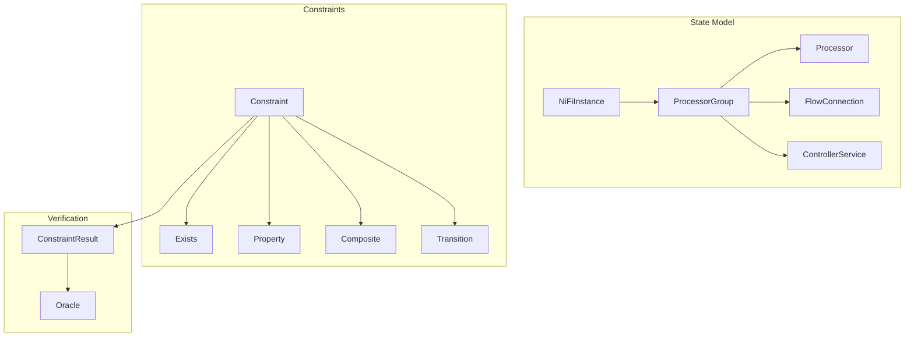

# Gaius RASE SSM (System State Model)

System State Model representing the ground truth state of NiFi as a typed graph. This is the authoritative model that verification cases check against via API.

## Architecture



## Module Structure

```
ssm/
├── __init__.py      # Module exports
├── nifi.py          # NiFiInstance, ProcessorGroup, Processor, FlowConnection
└── constraints.py   # Constraint classes
```

## State Model

### NiFiInstance

Top-level container:

```python
from gaius.rase.ssm import NiFiInstance, ProcessorGroup

instance = NiFiInstance(
    id="root",
    version="2.0.0",
    root_group=ProcessorGroup(
        id="root-pg",
        name="NiFi Flow",
        processors=[...],
        connections=[...],
    ),
)
```

### ProcessorGroup

Container for processors and connections:

```python
from gaius.rase.ssm import ProcessorGroup, Processor, FlowConnection

group = ProcessorGroup(
    id="pg-123",
    name="ETL Pipeline",
    processors=[
        Processor(id="p1", type="GetFile", name="Source"),
        Processor(id="p2", type="PutFile", name="Sink"),
    ],
    connections=[
        FlowConnection(
            id="c1",
            source_id="p1",
            destination_id="p2",
            relationships=["success"],
        ),
    ],
    controller_services=[...],
    child_groups=[...],  # Nested groups
)
```

### Processor

Data processing node:

```python
from gaius.rase.ssm import Processor, ProcessorRunState

processor = Processor(
    id="abc123",
    type="org.apache.nifi.processors.standard.GetFile",
    name="Read Input Files",
    state=ProcessorRunState.RUNNING,
    properties={
        "Input Directory": "/data/input",
        "File Filter": "*.csv",
    },
    relationships=["success", "failure"],
    position=(100, 200),
)
```

### ProcessorRunState

```python
class ProcessorRunState(Enum):
    STOPPED = "STOPPED"
    RUNNING = "RUNNING"
    DISABLED = "DISABLED"
    INVALID = "INVALID"
```

### FlowConnection

Edge between processors:

```python
from gaius.rase.ssm import FlowConnection

connection = FlowConnection(
    id="conn-456",
    source_id="processor-1",
    destination_id="processor-2",
    relationships=["success"],
    name="Success Route",
    back_pressure_object_threshold=10000,
    back_pressure_data_size_threshold="1 GB",
    flow_file_expiration="0 sec",
    prioritizers=[],
)
```

### ControllerService

Shared service:

```python
from gaius.rase.ssm import ControllerService

service = ControllerService(
    id="cs-789",
    type="org.apache.nifi.dbcp.DBCPConnectionPool",
    name="Database Connection Pool",
    state="ENABLED",
    properties={
        "Database Connection URL": "jdbc:postgresql://...",
    },
)
```

## Constraints

Declarative predicates over system state.

### Design Principles

1. **Declarative**: Describe *what* to check, not *how*
2. **Composable**: Support `AllOf`, `AnyOf`, `Not`
3. **Debuggable**: Return rich `ConstraintResult`
4. **Immutable**: Use `frozen=True` for concurrent safety

### Existence Constraints

```python
from gaius.rase.ssm import ProcessorExists, GroupExists, ConnectionExists

# Check processor exists
constraint = ProcessorExists(processor_type="GetFile")
result = constraint.evaluate(state)

# Check group exists
constraint = GroupExists(group_name="ETL Pipeline")

# Check connection exists
constraint = ConnectionExists(
    source_type="GetFile",
    destination_type="PutFile",
)
```

### Property Constraints

```python
from gaius.rase.ssm import ProcessorHasType, ProcessorHasProperty

# Check processor type
constraint = ProcessorHasType(
    processor_id="abc123",
    expected_type="GetFile",
)

# Check processor property
constraint = ProcessorHasProperty(
    processor_id="abc123",
    property_name="Input Directory",
    expected_value="/data/input",
)
```

### State Constraints

```python
from gaius.rase.ssm import AllProcessorsRunning, NoBackpressure

# All processors running
constraint = AllProcessorsRunning()

# No backpressure
constraint = NoBackpressure()
```

### Composite Constraints

```python
from gaius.rase.ssm import AllOf, AnyOf, Not

# All of these must pass
constraint = AllOf([
    ProcessorExists("GetFile"),
    ProcessorExists("PutFile"),
    ConnectionExists("GetFile", "PutFile"),
])

# Any of these must pass
constraint = AnyOf([
    ProcessorHasProperty("p1", "Retry Count", "3"),
    ProcessorHasProperty("p1", "Retry Count", "5"),
])

# Negation
constraint = Not(NoBackpressure())  # Expect backpressure
```

### Transition Constraints

For before/after state comparisons:

```python
from gaius.rase.ssm import ProcessorCreated, ConnectionCreated

# Processor was created
constraint = ProcessorCreated(
    processor_type="GetFile",
    before_state=state_before,
)
result = constraint.evaluate(state_after)

# Connection was created
constraint = ConnectionCreated(
    source_type="GetFile",
    destination_type="PutFile",
    before_state=state_before,
)
```

### FlowIsEquivalent

Semantic flow comparison:

```python
from gaius.rase.ssm import FlowIsEquivalent

constraint = FlowIsEquivalent(
    expected_flow=expected_state,
    ignore_positions=True,
    ignore_ids=True,
)
result = constraint.evaluate(actual_state)
```

## ConstraintResult

Rich result with debugging info:

```python
from gaius.rase.ssm import ConstraintResult

# Success
result = ConstraintResult.success("ProcessorExists(GetFile)")

# Failure with details
result = ConstraintResult.failure(
    constraint_name="ProcessorExists(PutFile)",
    message="Processor 'PutFile' not found in group",
    details={
        "searched_groups": ["root", "ETL Pipeline"],
        "found_processors": ["GetFile", "LogAttribute"],
    },
)

# Check result
if result.satisfied:
    print("Constraint passed")
else:
    print(f"Failed: {result.message}")
    print(f"Details: {result.details}")
```

## Call Graph

```
# Constraint Evaluation Path
rase.vm.NiFiOracle.verify()
  └─→ [for each constraint in case.verify]
      └─→ ssm.Constraint.evaluate(state)
          ├─→ [if ProcessorExists]
          │   └─→ search_processors(state, type)
          │       └─→ ConstraintResult.success() or .failure()
          ├─→ [if AllOf]
          │   └─→ [for each child]
          │       └─→ child.evaluate(state)
          │           └─→ aggregate_results()
          └─→ ConstraintResult

# State Loading Path
rase.ssm.NiFiInstance.from_api()
  └─→ nifi_client.get_process_group("root")
      └─→ recursive_load_groups()
          └─→ NiFiInstance

# Transition Constraint Path
rase.ssm.ProcessorCreated.evaluate()
  └─→ find_processor_in_state(before_state, type)
      └─→ [if not found in before]
          └─→ find_processor_in_state(after_state, type)
              └─→ [if found in after]
                  └─→ ConstraintResult.success()
```

## Data Flow

```
┌─────────────────────────────────────────────────────────────────────┐
│                    NiFi API                                          │
│              GET /process-groups/{id}                                │
└─────────────────────────────────┬───────────────────────────────────┘
                                  │
                                  ▼
┌─────────────────────────────────────────────────────────────────────┐
│                    NiFiInstance                                      │
│         root_group → processors, connections, services               │
└─────────────────────────────────┬───────────────────────────────────┘
                                  │
                                  ▼
┌─────────────────────────────────────────────────────────────────────┐
│                    Constraint.evaluate(state)                        │
│         check condition → ConstraintResult                           │
└─────────────────────────────────┬───────────────────────────────────┘
                                  │
              ┌───────────────────┴───────────────────┐
              ▼                                       ▼
     ┌──────────────┐                        ┌──────────────┐
     │ success()    │                        │ failure()    │
     │ satisfied=T  │                        │ satisfied=F  │
     │              │                        │ message=...  │
     └──────────────┘                        └──────────────┘
```

## SysML v2 Alignment

| SysML v2 Concept | RASE SSM Implementation |
|------------------|-------------------------|
| `part def` | `Processor`, `ProcessorGroup`, `NiFiInstance` |
| `connection def` | `FlowConnection` |
| `constraint def` | `Constraint` subclasses |
| `port def` | `relationships` in Processor |

## Integration Points

| Component | Uses | Used By | Integration |
|-----------|------|---------|-------------|
| `NiFiInstance` | ProcessorGroup | vm.Oracle | State container |
| `Processor` | — | NiFiInstance, constraints | Processor model |
| `FlowConnection` | — | ProcessorGroup | Connection model |
| `Constraint` | ConstraintResult | vm.VerificationCase | Base class |
| `AllOf`, `AnyOf`, `Not` | Constraint | callers | Composition |
| `ConstraintResult` | — | Constraint | Evaluation result |

## See Also

- [Parent README](../README.md) — RASE overview
- [VM README](../vm/README.md) — Verification integration
- [OSM README](../osm/README.md) — Scenario definitions
- [Datasets README](../../datasets/README.md) — SoM generation

---

<!-- GAI:META
module: gaius.rase.ssm
layer: L6-verification
key_types: [NiFiInstance, ProcessorGroup, Processor, ControllerService, FlowConnection, ProcessorRunState, SystemState, Constraint, ConstraintResult, GroupExists, ProcessorExists, ConnectionExists, ProcessorHasType, ProcessorHasProperty, FlowIsEquivalent, AllProcessorsRunning, NoBackpressure, CompositeConstraint, AllOf, AnyOf, Not, TransitionConstraint, ProcessorCreated, ConnectionCreated]
key_funcs: [evaluate, from_api]
submodules: []
depends: [nifi_client]
dependents: [vm, datasets]
config_keys: []
env_vars: []
grpc_services: []
sysml_v2_mapping:
  part_def: [Processor, ProcessorGroup, NiFiInstance]
  connection_def: FlowConnection
  constraint_def: Constraint
  port_def: relationships
constraint_types:
  existence: [GroupExists, ProcessorExists, ConnectionExists]
  property: [ProcessorHasType, ProcessorHasProperty]
  state: [AllProcessorsRunning, NoBackpressure]
  composite: [AllOf, AnyOf, Not]
  transition: [ProcessorCreated, ConnectionCreated]
  semantic: [FlowIsEquivalent]
call_paths:
  evaluate: vm.Oracle.verify→Constraint.evaluate→ConstraintResult
  load: NiFiInstance.from_api→nifi_client.get_process_group→recursive_load
  transition: TransitionConstraint.evaluate→compare_states→ConstraintResult
test_cmds:
  constraint: 'uv run python -c "from gaius.rase.ssm import ProcessorExists; ..."'
guru_codes: [SS.00001.STATE_LOAD_FAIL, SS.00002.CONSTRAINT_ERROR]
fail_fast: true
-->
